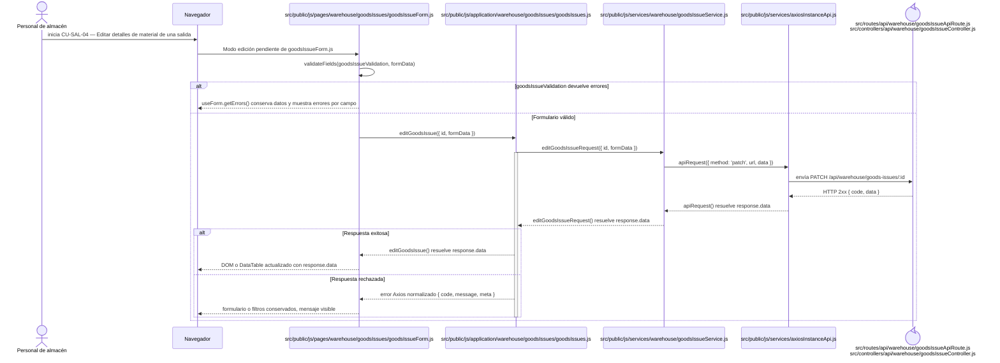

# `CU-SAL-04` — Editar detalles de material de una salida

**Patrones:** `FE-P05`.

```mermaid
sequenceDiagram
    actor Initiator as Personal de almacén
    participant Browser as Navegador
    participant View as src/public/js/pages/warehouse/goodsIssues/goodsIssueForm.js
    participant Application as src/public/js/application/warehouse/goodsIssues/goodsIssues.js
    participant Request as src/public/js/services/warehouse/goodsIssueService.js
    participant HTTP as src/public/js/services/axiosInstanceApi.js
    participant Transport@{ "type": "control" } as src/routes/api/warehouse/goodsIssueApiRoute.js<br/>src/controllers/api/warehouse/goodsIssueController.js

    Initiator->>Browser: inicia CU-SAL-04 — Editar detalles de material de una salida
    Browser->>View: Modo edición pendiente de goodsIssueForm.js
    View->>View: validateFields(goodsIssueValidation, formData)
    alt goodsIssueValidation devuelve errores
        View-->>Browser: useForm.getErrors() conserva datos y muestra errores por campo
    else Formulario válido
        View->>Application: editGoodsIssue({ id, formData })
        Application->>Request: editGoodsIssueRequest({ id, formData })
        activate Application
        Request->>HTTP: apiRequest({ method: 'patch', url, data })
        HTTP->>Transport: envía PATCH /api/warehouse/goods-issues/:id
        Transport-->>HTTP: HTTP 2xx { code, data }
        HTTP-->>Request: apiRequest() resuelve response.data
        Request-->>Application: editGoodsIssueRequest() resuelve response.data
        alt Respuesta exitosa
            Application-->>View: editGoodsIssue() resuelve response.data
            View-->>Browser: DOM o DataTable actualizado con response.data
        else Respuesta rechazada
            Application-->>View: error Axios normalizado { code, message, meta }
            View-->>Browser: formulario o filtros conservados, mensaje visible
        end
        deactivate Application
    end
```

