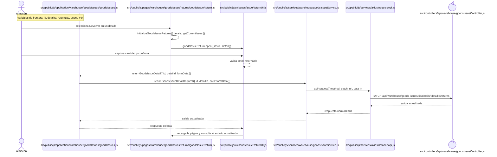

# `CU-SAL-06` — Devolver material surtido

**Patrones:** `FE-P05`, `FE-P06`.

```mermaid
sequenceDiagram
    Note over Warehouse,App: Variables de frontera: id, detailId, returnDto, userId y tx
    actor Warehouse as Almacén
    participant Issue as src/public/js/pages/warehouse/goodsIssues/returns/goodsIssueReturn.js
    participant Return as src/public/js/ui/issues/issueReturnUI.js
    participant App as src/public/js/application/warehouse/goodsIssues/goodsIssues.js
    participant Request as src/public/js/services/warehouse/goodsIssueService.js
    participant HTTP as src/public/js/services/axiosInstanceApi.js
    participant API@{ "type": "control" } as src/controllers/api/warehouse/goodsIssueController.js

    Warehouse->>Issue: selecciona Devolver en un detalle
    Issue->>Issue: initializeGoodsIssueReturns({ details, getCurrentIssue })
    Issue->>Return: goodsIssueReturn.open({ issue, detail })
    Warehouse->>Return: captura cantidad y confirma
    Return->>Return: valida límite retornable
    Return->>App: returnGoodsIssueDetail({ id, detailId, formData })
    App->>Request: returnGoodsIssueDetailRequest({ id, detailId, data: formData })
    Request->>HTTP: apiRequest({ method: patch, url, data })
    HTTP->>API: PATCH /api/warehouse/goods-issues/:id/details/:detailId/returns
    API-->>HTTP: salida actualizada
    HTTP-->>Request: respuesta normalizada
    Request-->>App: salida actualizada
    App-->>Return: respuesta exitosa
    Return->>Issue: recarga la página y consulta el estado actualizado
```

