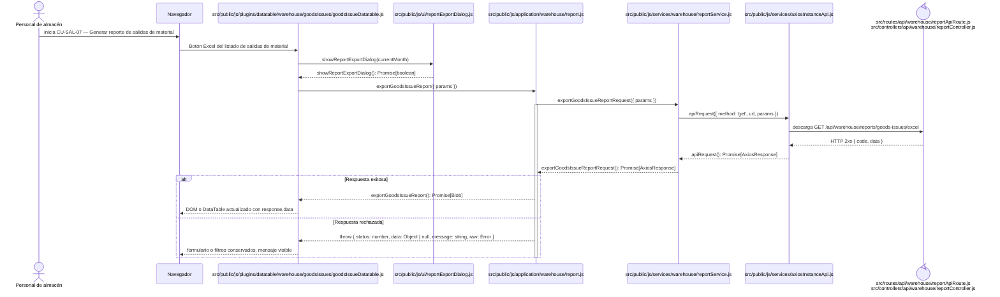

# `CU-SAL-07` — Generar reporte de salidas de material

**Patrones:** `FE-P08`.

```mermaid
sequenceDiagram
    actor Initiator as Personal de almacén
    participant Browser as Navegador
    participant View as src/public/js/plugins/datatable/warehouse/goodsIssues/goodsIssueDatatable.js
    participant Dialog as src/public/js/ui/reportExportDialog.js
    participant Application as src/public/js/application/warehouse/report.js
    participant Request as src/public/js/services/warehouse/reportService.js
    participant HTTP as src/public/js/services/axiosInstanceApi.js
    participant Transport@{ "type": "control" } as src/routes/api/warehouse/reportApiRoute.js<br/>src/controllers/api/warehouse/reportController.js

    Initiator->>Browser: inicia CU-SAL-07 — Generar reporte de salidas de material
    Browser->>View: Botón Excel del listado de salidas de material
    View->>Dialog: showReportExportDialog(currentMonth)
    Dialog-->>View: showReportExportDialog(): Promise[boolean]
    View->>Application: exportGoodsIssueReport({ params })
    Application->>Request: exportGoodsIssueReportRequest({ params })
    activate Application
    Request->>HTTP: apiRequest({ method: 'get', url, params })
    HTTP->>Transport: descarga GET /api/warehouse/reports/goods-issues/excel
    Transport-->>HTTP: HTTP 2xx { code, data }
    HTTP-->>Request: apiRequest(): Promise[AxiosResponse]
    Request-->>Application: exportGoodsIssueReportRequest(): Promise[AxiosResponse]
    alt Respuesta exitosa
        Application-->>View: exportGoodsIssueReport(): Promise[Blob]
        View-->>Browser: DOM o DataTable actualizado con response.data
    else Respuesta rechazada
        Application-->>View: throw { status: number, data: Object | null, message: string, raw: Error }
        View-->>Browser: formulario o filtros conservados, mensaje visible
    end
    deactivate Application
```

