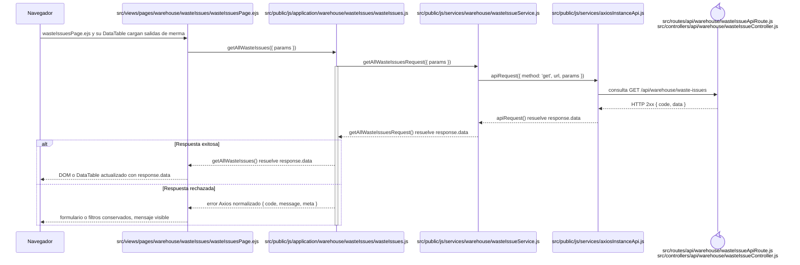

# `CU-SAL-08` — Consultar salidas de merma

**Patrones:** `FE-P05`.

```mermaid
sequenceDiagram
    participant Browser as Navegador
    participant View as src/views/pages/warehouse/wasteIssues/wasteIssuesPage.ejs
    participant Application as src/public/js/application/warehouse/wasteIssues/wasteIssues.js
    participant Request as src/public/js/services/warehouse/wasteIssueService.js
    participant HTTP as src/public/js/services/axiosInstanceApi.js
    participant Transport@{ "type": "control" } as src/routes/api/warehouse/wasteIssueApiRoute.js<br/>src/controllers/api/warehouse/wasteIssueController.js

    Browser->>View: wasteIssuesPage.ejs y su DataTable cargan salidas de merma
    View->>Application: getAllWasteIssues({ params })
    Application->>Request: getAllWasteIssuesRequest({ params })
    activate Application
    Request->>HTTP: apiRequest({ method: 'get', url, params })
    HTTP->>Transport: consulta GET /api/warehouse/waste-issues
    Transport-->>HTTP: HTTP 2xx { code, data }
    HTTP-->>Request: apiRequest() resuelve response.data
    Request-->>Application: getAllWasteIssuesRequest() resuelve response.data
    alt Respuesta exitosa
        Application-->>View: getAllWasteIssues() resuelve response.data
        View-->>Browser: DOM o DataTable actualizado con response.data
    else Respuesta rechazada
        Application-->>View: error Axios normalizado { code, message, meta }
        View-->>Browser: formulario o filtros conservados, mensaje visible
    end
    deactivate Application
```

