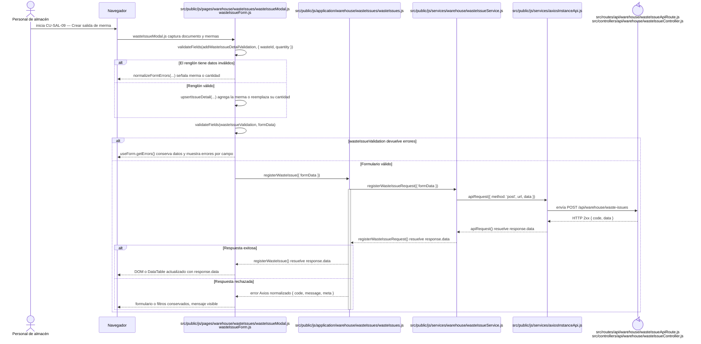

# `CU-SAL-09` — Crear salida de merma

**Patrones:** `FE-P05`.

```mermaid
sequenceDiagram
    actor Initiator as Personal de almacén
    participant Browser as Navegador
    participant View as src/public/js/pages/warehouse/wasteIssues/wasteIssueModal.js<br/>wasteIssueForm.js
    participant Application as src/public/js/application/warehouse/wasteIssues/wasteIssues.js
    participant Request as src/public/js/services/warehouse/wasteIssueService.js
    participant HTTP as src/public/js/services/axiosInstanceApi.js
    participant Transport@{ "type": "control" } as src/routes/api/warehouse/wasteIssueApiRoute.js<br/>src/controllers/api/warehouse/wasteIssueController.js

    Initiator->>Browser: inicia CU-SAL-09 — Crear salida de merma
    Browser->>View: wasteIssueModal.js captura documento y mermas
    View->>View: validateFields(addWasteIssueDetailValidation, { wasteId, quantity })
    alt El renglón tiene datos inválidos
        View-->>Browser: normalizeFormErrors(...) señala merma o cantidad
    else Renglón válido
        View->>View: upsertIssueDetail(...) agrega la merma o reemplaza su cantidad
    end
    View->>View: validateFields(wasteIssueValidation, formData)
    alt wasteIssueValidation devuelve errores
        View-->>Browser: useForm.getErrors() conserva datos y muestra errores por campo
    else Formulario válido
        View->>Application: registerWasteIssue({ formData })
        Application->>Request: registerWasteIssueRequest({ formData })
        activate Application
        Request->>HTTP: apiRequest({ method: 'post', url, data })
        HTTP->>Transport: envía POST /api/warehouse/waste-issues
        Transport-->>HTTP: HTTP 2xx { code, data }
        HTTP-->>Request: apiRequest() resuelve response.data
        Request-->>Application: registerWasteIssueRequest() resuelve response.data
        alt Respuesta exitosa
            Application-->>View: registerWasteIssue() resuelve response.data
            View-->>Browser: DOM o DataTable actualizado con response.data
        else Respuesta rechazada
            Application-->>View: error Axios normalizado { code, message, meta }
            View-->>Browser: formulario o filtros conservados, mensaje visible
        end
        deactivate Application
    end
```
