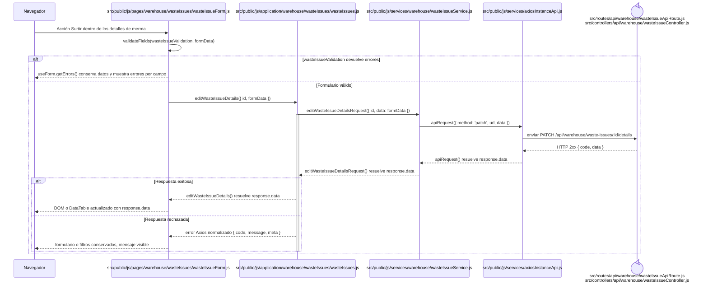

# `CU-SAL-12` — Surtir merma

**Patrones:** `FE-P05`.

```mermaid
sequenceDiagram
    participant Browser as Navegador
    participant View as src/public/js/pages/warehouse/wasteIssues/wasteIssueForm.js
    participant Application as src/public/js/application/warehouse/wasteIssues/wasteIssues.js
    participant Request as src/public/js/services/warehouse/wasteIssueService.js
    participant HTTP as src/public/js/services/axiosInstanceApi.js
    participant Transport@{ "type": "control" } as src/routes/api/warehouse/wasteIssueApiRoute.js<br/>src/controllers/api/warehouse/wasteIssueController.js

    Browser->>View: Acción Surtir dentro de los detalles de merma
    View->>View: validateFields(wasteIssueValidation, formData)
    alt wasteIssueValidation devuelve errores
        View-->>Browser: useForm.getErrors() conserva datos y muestra errores por campo
    else Formulario válido
        View->>Application: editWasteIssueDetails({ id, formData })
        Application->>Request: editWasteIssueDetailsRequest({ id, data: formData })
        activate Application
        Request->>HTTP: apiRequest({ method: 'patch', url, data })
        HTTP->>Transport: enviar PATCH /api/warehouse/waste-issues/:id/details
        Transport-->>HTTP: HTTP 2xx { code, data }
        HTTP-->>Request: apiRequest() resuelve response.data
        Request-->>Application: editWasteIssueDetailsRequest() resuelve response.data
        alt Respuesta exitosa
            Application-->>View: editWasteIssueDetails() resuelve response.data
            View-->>Browser: DOM o DataTable actualizado con response.data
        else Respuesta rechazada
            Application-->>View: error Axios normalizado { code, message, meta }
            View-->>Browser: formulario o filtros conservados, mensaje visible
        end
        deactivate Application
    end
```

