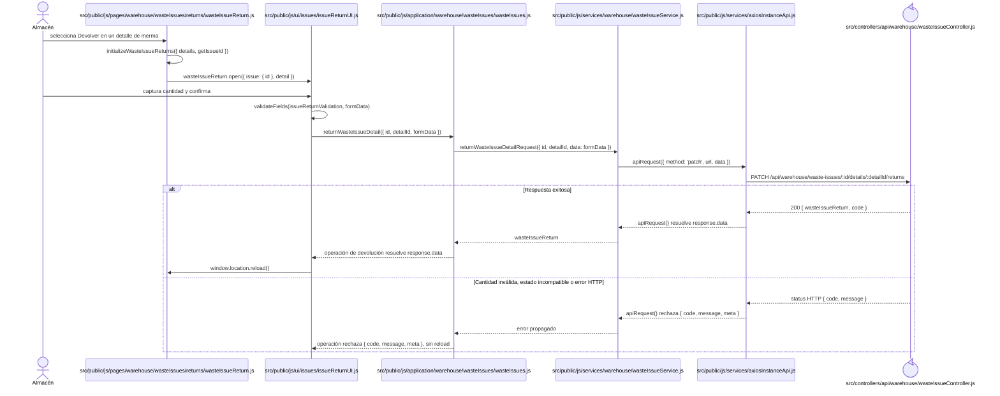

# `CU-SAL-13` — Devolver merma surtida

**Patrones:** `FE-P05`, `FE-P06`.

```mermaid
sequenceDiagram
    actor Warehouse as Almacén
    participant Issue as src/public/js/pages/warehouse/wasteIssues/returns/wasteIssueReturn.js
    participant Return as src/public/js/ui/issues/issueReturnUI.js
    participant App as src/public/js/application/warehouse/wasteIssues/wasteIssues.js
    participant Request as src/public/js/services/warehouse/wasteIssueService.js
    participant HTTP as src/public/js/services/axiosInstanceApi.js
    participant API@{ "type": "control" } as src/controllers/api/warehouse/wasteIssueController.js

    Warehouse->>Issue: selecciona Devolver en un detalle de merma
    Issue->>Issue: initializeWasteIssueReturns({ details, getIssueId })
    Issue->>Return: wasteIssueReturn.open({ issue: { id }, detail })
    Warehouse->>Return: captura cantidad y confirma
    Return->>Return: validateFields(issueReturnValidation, formData)
    Return->>App: returnWasteIssueDetail({ id, detailId, formData })
    App->>Request: returnWasteIssueDetailRequest({ id, detailId, data: formData })
    Request->>HTTP: apiRequest({ method: 'patch', url, data })
    HTTP->>API: PATCH /api/warehouse/waste-issues/:id/details/:detailId/returns
    alt Respuesta exitosa
        API-->>HTTP: 200 { wasteIssueReturn, code }
        HTTP-->>Request: apiRequest() resuelve response.data
        Request-->>App: wasteIssueReturn
        App-->>Return: operación de devolución resuelve response.data
        Return->>Issue: window.location.reload()
    else Cantidad inválida, estado incompatible o error HTTP
        API-->>HTTP: status HTTP { code, message }
        HTTP-->>Request: apiRequest() rechaza { code, message, meta }
        Request-->>App: error propagado
        App-->>Return: operación rechaza { code, message, meta }, sin reload
    end
```
