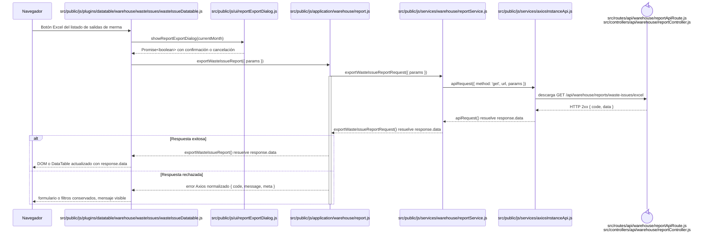

# `CU-SAL-14` — Generar reporte de salidas de merma

**Patrones:** `FE-P08`.

```mermaid
sequenceDiagram
    participant Browser as Navegador
    participant View as src/public/js/plugins/datatable/warehouse/wasteIssues/wasteIssueDatatable.js
    participant Dialog as src/public/js/ui/reportExportDialog.js
    participant Application as src/public/js/application/warehouse/report.js
    participant Request as src/public/js/services/warehouse/reportService.js
    participant HTTP as src/public/js/services/axiosInstanceApi.js
    participant Transport@{ "type": "control" } as src/routes/api/warehouse/reportApiRoute.js<br/>src/controllers/api/warehouse/reportController.js

    Browser->>View: Botón Excel del listado de salidas de merma
    View->>Dialog: showReportExportDialog(currentMonth)
    Dialog-->>View: Promise<boolean> con confirmación o cancelación
    View->>Application: exportWasteIssueReport({ params })
    Application->>Request: exportWasteIssueReportRequest({ params })
    activate Application
    Request->>HTTP: apiRequest({ method: 'get', url, params })
    HTTP->>Transport: descarga GET /api/warehouse/reports/waste-issues/excel
    Transport-->>HTTP: HTTP 2xx { code, data }
    HTTP-->>Request: apiRequest() resuelve response.data
    Request-->>Application: exportWasteIssueReportRequest() resuelve response.data
    alt Respuesta exitosa
        Application-->>View: exportWasteIssueReport() resuelve response.data
        View-->>Browser: DOM o DataTable actualizado con response.data
    else Respuesta rechazada
        Application-->>View: error Axios normalizado { code, message, meta }
        View-->>Browser: formulario o filtros conservados, mensaje visible
    end
    deactivate Application
```

