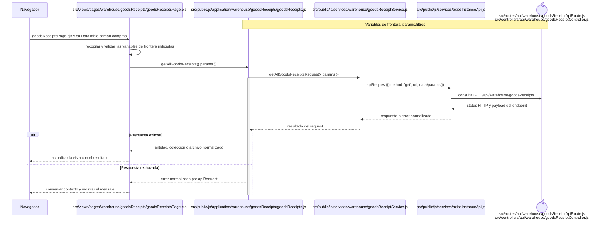

# `CU-ENT-01` — Consultar compras de material

**Patrones:** `FE-P02`, `FE-P04`.

```mermaid
sequenceDiagram
    participant Browser as Navegador
    participant View as src/views/pages/warehouse/goodsReceipts/goodsReceiptsPage.ejs
    participant Application as src/public/js/application/warehouse/goodsReceipts/goodsReceipts.js
    participant Request as src/public/js/services/warehouse/goodsReceiptService.js
    participant HTTP as src/public/js/services/axiosInstanceApi.js
    participant Transport@{ "type": "control" } as src/routes/api/warehouse/goodsReceiptApiRoute.js<br/>src/controllers/api/warehouse/goodsReceiptController.js
    Note over Application,Transport: Variables de frontera: params/filtros

    Browser->>View: goodsReceiptsPage.ejs y su DataTable cargan compras
    View->>View: recopilar y validar las variables de frontera indicadas
    View->>Application: getAllGoodsReceipts({ params })
    Application->>Request: getAllGoodsReceiptsRequest({ params })
    activate Application
    Request->>HTTP: apiRequest({ method: 'get', url, data/params })
    HTTP->>Transport: consulta GET /api/warehouse/goods-receipts
    Transport-->>HTTP: status HTTP y payload del endpoint
    HTTP-->>Request: respuesta o error normalizado
    Request-->>Application: resultado del request
    alt Respuesta exitosa
        Application-->>View: entidad, colección o archivo normalizado
        View-->>Browser: actualizar la vista con el resultado
    else Respuesta rechazada
        Application-->>View: error normalizado por apiRequest
        View-->>Browser: conservar contexto y mostrar el mensaje
    end
    deactivate Application
```

