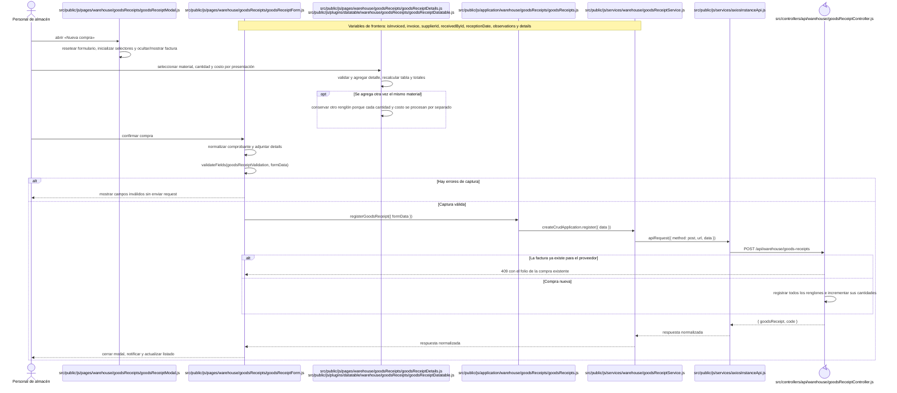

# `CU-ENT-02` — Crear compra de material

**Patrones:** `FE-P02`, `FE-P04`.

```mermaid
sequenceDiagram
    actor Warehouse as Personal de almacén
    participant Modal as src/public/js/pages/warehouse/goodsReceipts/goodsReceiptModal.js
    participant Form as src/public/js/pages/warehouse/goodsReceipts/goodsReceiptForm.js
    participant DetailUI as src/public/js/pages/warehouse/goodsReceipts/goodsReceiptDetails.js<br/>src/public/js/plugins/datatable/warehouse/goodsReceipts/goodsReceiptDatatable.js
    participant App as src/public/js/application/warehouse/goodsReceipts/goodsReceipts.js
    participant Request as src/public/js/services/warehouse/goodsReceiptService.js
    participant HTTP as src/public/js/services/axiosInstanceApi.js
    participant API@{ "type": "control" } as src/controllers/api/warehouse/goodsReceiptController.js
    Note over Form,Request: Variables de frontera: isInvoiced, invoice, supplierId, receivedById, receptionDate, observations y details

    Warehouse->>Modal: abrir «Nueva compra»
    Modal->>Modal: resetear formulario, inicializar selectores y ocultar/mostrar factura
    Warehouse->>DetailUI: seleccionar material, cantidad y costo por presentación
    DetailUI->>DetailUI: validar y agregar detalle, recalcular tabla y totales
    opt Se agrega otra vez el mismo material
        DetailUI->>DetailUI: conservar otro renglón porque cada cantidad y costo se procesan por separado
    end
    Warehouse->>Form: confirmar compra
    Form->>Form: normalizar comprobante y adjuntar details
    Form->>Form: validateFields(goodsReceiptValidation, formData)
    alt Hay errores de captura
        Form-->>Warehouse: mostrar campos inválidos sin enviar request
    else Captura válida
        Form->>App: registerGoodsReceipt({ formData })
        App->>Request: createCrudApplication.register({ data })
        Request->>HTTP: apiRequest({ method: post, url, data })
        HTTP->>API: POST /api/warehouse/goods-receipts
        alt La factura ya existe para el proveedor
            API-->>Form: 409 con el folio de la compra existente
        else Compra nueva
            API->>API: registrar todos los renglones e incrementar sus cantidades
        end
        API-->>HTTP: { goodsReceipt, code }
        HTTP-->>Request: respuesta normalizada
        Request-->>Form: respuesta normalizada
        Form-->>Warehouse: cerrar modal, notificar y actualizar listado
    end
```

