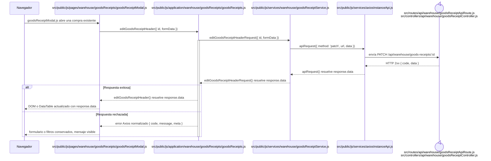

# `CU-ENT-03` — Editar compra de material

**Patrones:** `FE-P02`, `FE-P04`.

```mermaid
sequenceDiagram
    participant Browser as Navegador
    participant View as src/public/js/pages/warehouse/goodsReceipts/goodsReceiptModal.js
    participant Application as src/public/js/application/warehouse/goodsReceipts/goodsReceipts.js
    participant Request as src/public/js/services/warehouse/goodsReceiptService.js
    participant HTTP as src/public/js/services/axiosInstanceApi.js
    participant Transport@{ "type": "control" } as src/routes/api/warehouse/goodsReceiptApiRoute.js<br/>src/controllers/api/warehouse/goodsReceiptController.js

    Browser->>View: goodsReceiptModal.js abre una compra existente
    View->>Application: editGoodsReceiptHeader({ id, formData })
    Application->>Request: editGoodsReceiptHeaderRequest({ id, formData })
    activate Application
    Request->>HTTP: apiRequest({ method: 'patch', url, data })
    HTTP->>Transport: envía PATCH /api/warehouse/goods-receipts/:id
    Transport-->>HTTP: HTTP 2xx { code, data }
    HTTP-->>Request: apiRequest() resuelve response.data
    Request-->>Application: editGoodsReceiptHeaderRequest() resuelve response.data
    alt Respuesta exitosa
        Application-->>View: editGoodsReceiptHeader() resuelve response.data
        View-->>Browser: DOM o DataTable actualizado con response.data
    else Respuesta rechazada
        Application-->>View: error Axios normalizado { code, message, meta }
        View-->>Browser: formulario o filtros conservados, mensaje visible
    end
    deactivate Application
```

