# Secuencias del código frontend: Consultas y reportes

Este capítulo forma parte del [catálogo de secuencias del código frontend](index.md) y conserva los recorridos aplicados del grupo `REP`. Las reglas comunes de lectura, trazabilidad y mantenimiento se declaran en el índice de la colección.

## `CU-REP-01`

**Patrones:** `FE-P07`.

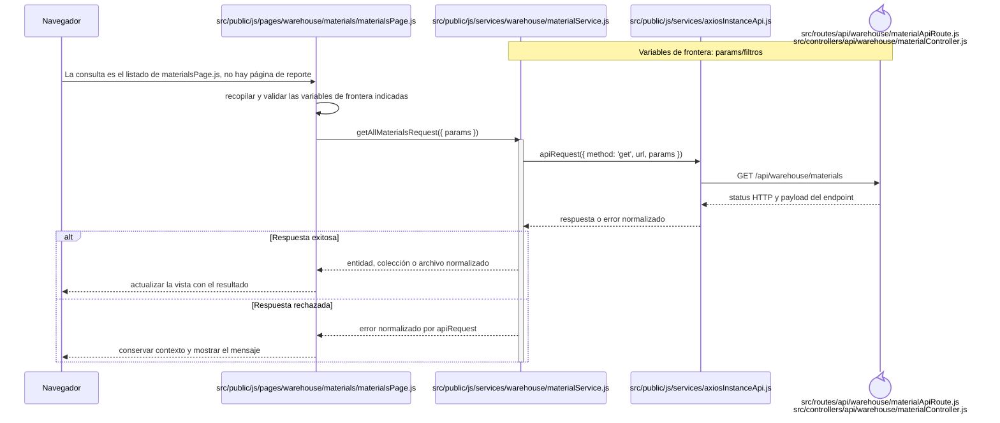

## `CU-REP-02`

**Patrones:** `FE-P07`.

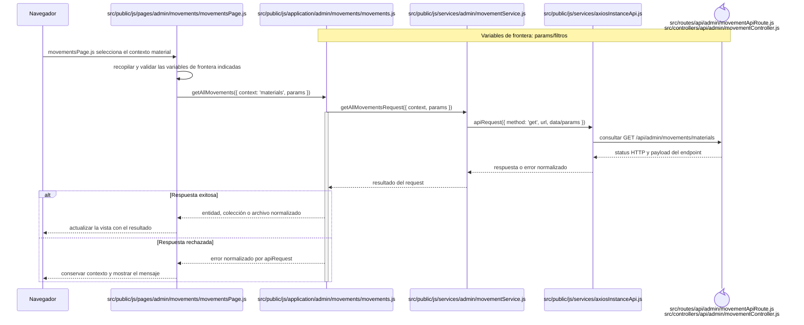

## `CU-REP-03`

**Patrones:** `FE-P08`.

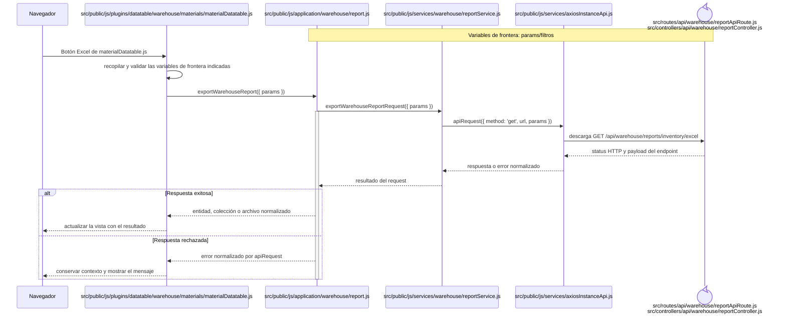

## `CU-REP-04`

**Patrones:** `FE-P08`.

## `CU-REP-05`

**Patrones:** `FE-P08`.

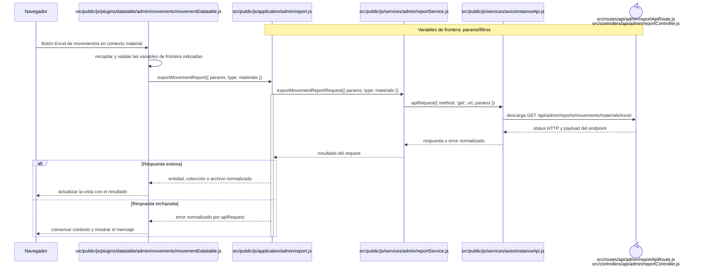

## `CU-REP-06`

**Patrones:** `FE-P07`.

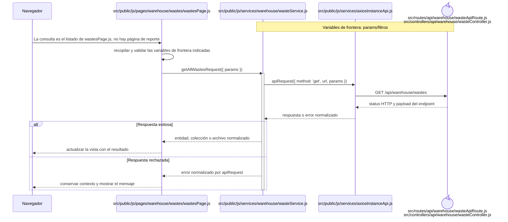

## `CU-REP-07`

**Patrones:** `FE-P07`.

## `CU-REP-08`

**Patrones:** `FE-P08`.

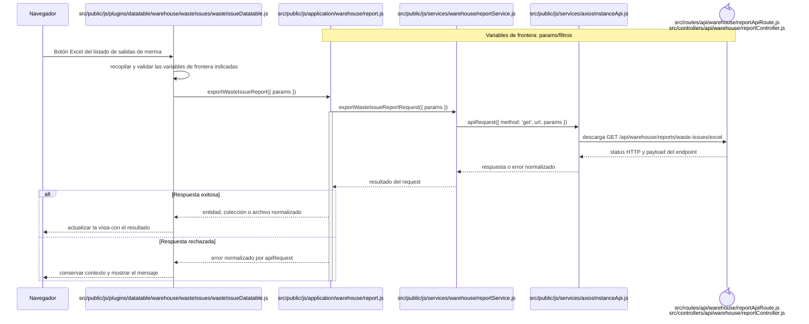

## `CU-REP-09`

**Patrones:** `FE-P08`.

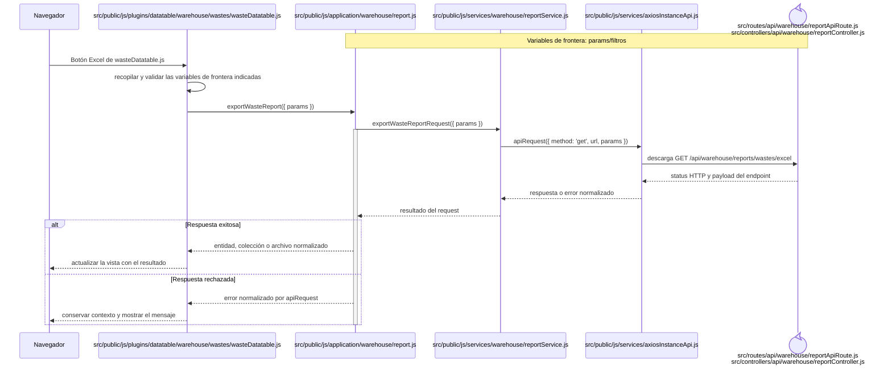

## `CU-REP-10`

**Patrones:** `FE-P08`.

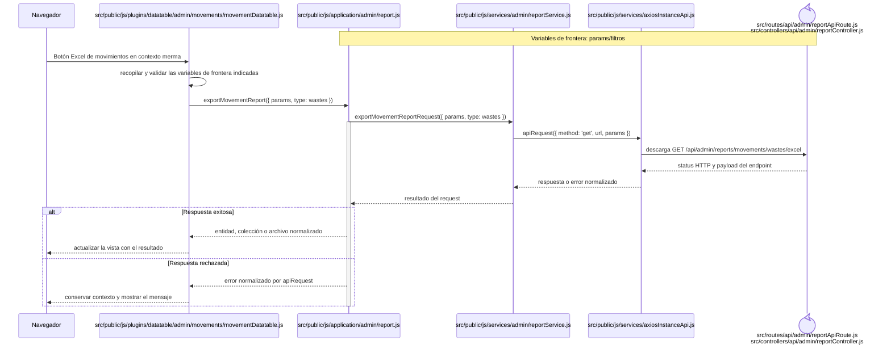

## `CU-REP-11`

**Patrones:** `FE-P08`.

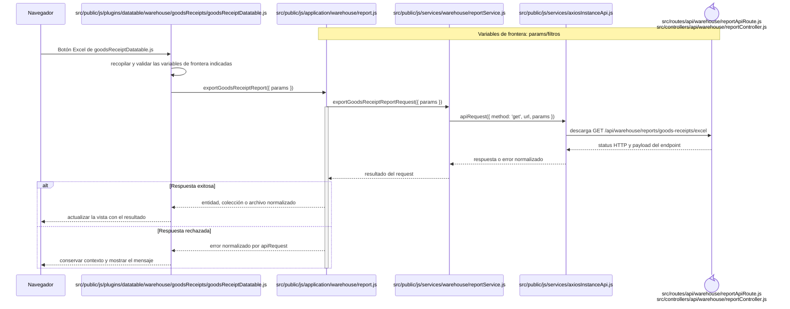

## `CU-REP-12`

**Patrones:** `FE-P08`.

## `CU-REP-13`

**Patrones:** `FE-P08`.

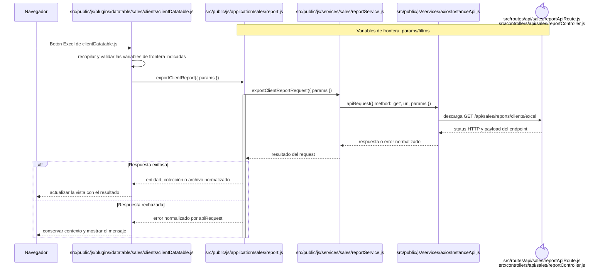

## `CU-REP-14`

**Patrones:** `FE-P08`.

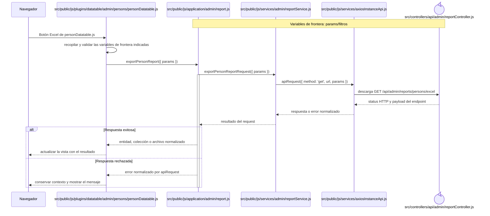

## `CU-REP-15`

**Patrones:** `FE-P08`.

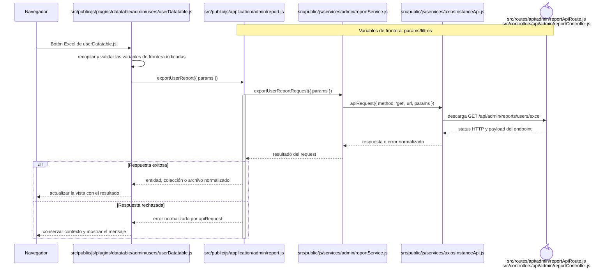
