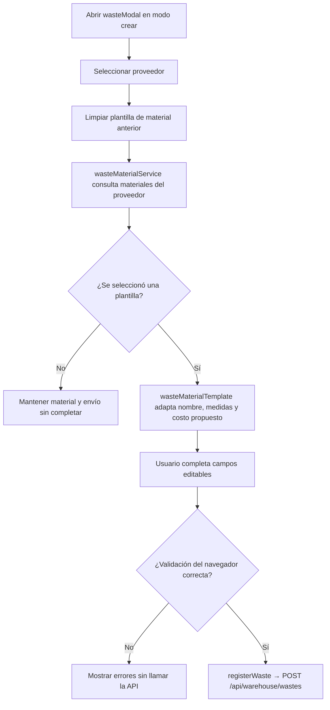
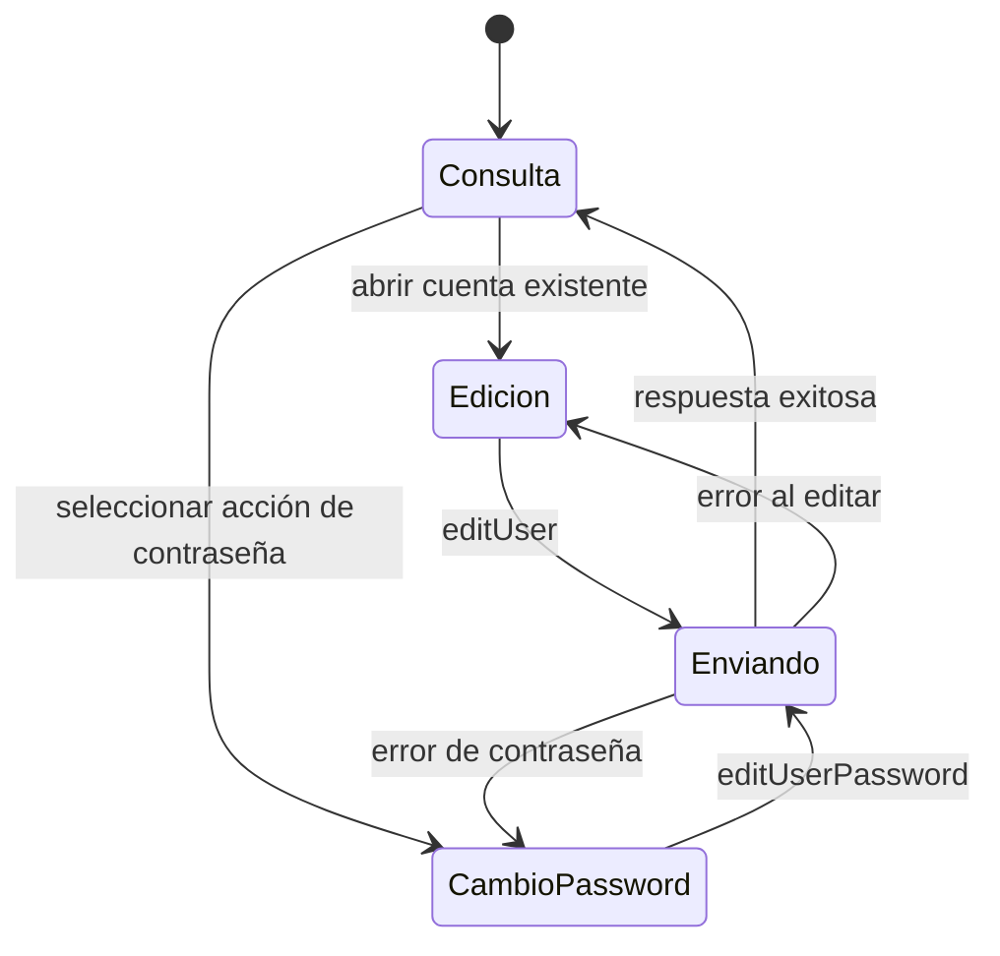
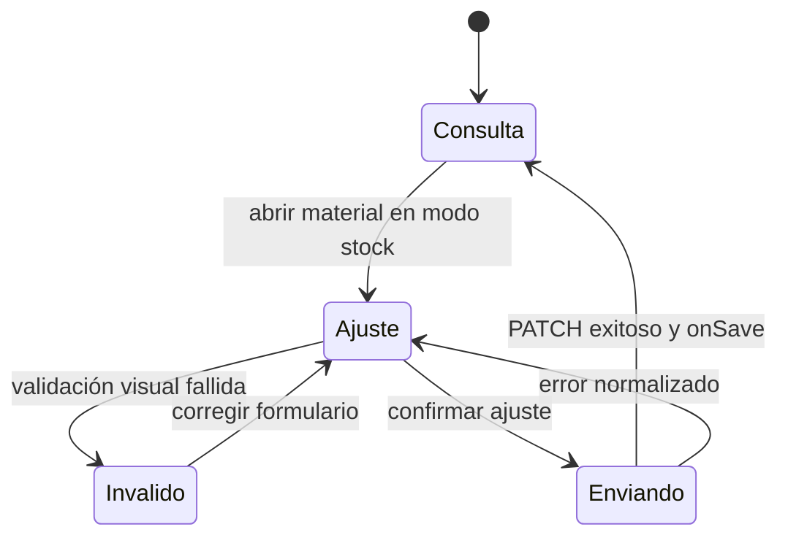

# Documentación técnica del frontend

## Propósito y alcance

Este documento aplica la [guía técnica común](technical-code-documentation.md) al código
que se ejecuta en el navegador y a su composición EJS: `src/public/js`,
`src/views/pages` y `src/views/shared`. El [documento de backend](backend-technical-documentation.md)
conserva rutas, controladores, servicios de dominio y persistencia. Una explicación de
frontend enlaza el [contrato API](api-contract.md), pero no vuelve a declarar
permisos ni reglas de negocio que el servidor debe hacer cumplir.

## Capas documentales del navegador

La ubicación del módulo determina la responsabilidad que debe describirse. Antes de
crear una ficha se revisa una implementación equivalente en la misma fila.

| Ubicación | Responsabilidad documentada | Ejemplos existentes |
| --- | --- | --- |
| `public/js/services` | Método, URL, parámetros y cuerpo enviados mediante el cliente HTTP común. | `materialService.js`, `goodsIssueService.js`, `authService.js`. |
| `public/js/application` | Adaptación de respuestas y coordinación del caso de uso sin acceso directo al DOM. | `createCrudApplication.js`, `createIssueApplication.js`, `materials.js`. |
| `public/js/pages` | Composición e inicialización de una pantalla, formulario o modal propietario del recurso. | `materialsPage.js`, `materialForm.js`, `materialModal.js`. |
| `public/js/ui` | Comportamiento visual reutilizable que recibe el contexto por parámetros. | `formUI.js`, `modalUI.js`, `inventorySelectUI.js`. |
| `public/js/plugins` | Adaptadores y configuración común de DataTable, Select2, MDB, Flatpickr o SweetAlert. | `createDataTable.js`, `baseSelect.js`, `baseInstance.js`. |
| `public/js/utils` | Transformaciones sin propiedad visual o de dominio específico. | `formUtils.js`, `formatUtils.js`, `detailCollectionUtils.js`. |
| `views/pages` | Estructura EJS y scripts de entrada pertenecientes a una página. | `materialsPage.ejs`, `goodsIssuesPage.ejs`. |
| `views/shared` | Marcado reutilizado por más de un recurso y configurado por sus consumidores. | Formularios, tablas y modales compartidos. |

## Fichas por tipo de módulo

### Servicio HTTP del navegador

Se registra nombre exportado, constante de ruta, método HTTP, parámetros, cuerpo y forma
de respuesta entregada por `apiRequest`. La ficha enlaza la ruta propietaria del
contrato API. No describe transacciones ni errores internos del servidor.

### Aplicación

Se registra la fábrica o flujo reutilizado, configuración inyectada, claves extraídas de
la respuesta y nombres de dominio que exporta el módulo. Si existe una excepción —por
ejemplo omitir un campo en un contexto— se explica la condición y por qué no pertenece a
la fábrica común.

### Página, formulario y modal

Se documentan por separado:

- **página:** módulos que inicializa y contexto global que entrega;
- **formulario:** campos seleccionados, validación del navegador, normalización, modo y
  mutación que invoca;
- **modal:** preparación visual, carga de datos y contrato que entrega al formulario;
- **EJS:** parciales incluidos, elementos usados como puntos de montaje y scripts
  `type="module"`, conservando los cierres `contentFor`.

Sólo se enumeran selectores DOM cuando forman parte de la integración entre módulos. Una
lista de cada elemento o listener repetiría el código sin explicar el diseño.

### UI, plugin y utilidad compartida

La ficha declara consumidores, parámetros de configuración, eventos emitidos o
escuchados, estado interno y dependencia externa encapsulada. También indica qué
conocimiento **no** puede incorporar: un módulo compartido no importa la aplicación de
un recurso concreto ni decide permisos del servidor.

## Catálogo completo de fichas frontend

La unidad de documentación es el **flujo funcional**, no un archivo aislado. Cada fila
cubre todos sus módulos propietarios de servicio, aplicación, página y EJS; los símbolos
compartidos aparecen después en una ficha transversal. De este modo no se presenta
materiales como si fuera el único flujo documentado ni se repite una ficha idéntica por
cada operación CRUD. Las rutas concretas se verifican en el [contrato API](api-contract.md)
y las páginas publicadas en el [mapa generado](../generated/code-map.md#rutas-web-19).

### Fichas de flujos funcionales

| Flujo | Vista y composición | Aplicación y transporte | Contrato y comportamiento propio | Diagrama aplicable |
| --- | --- | --- | --- | --- |
| Inicio de sesión | `loginPage.ejs` y `loginForm.js` recopilan credenciales; `indexPage.js` prepara la portada autenticada. | `application/auth/login.js` coordina `services/authService.js`; sus exports `registerRequest` y `resetPasswordRequest` no tienen consumidor ni ruta vigente y se registran como brecha, no como funcionalidad publicada. | `POST /api/auth/login`; normaliza la respuesta de éxito y deja cookies, tokens y permisos efectivos al servidor. | **Secuencia**, porque cruza formulario, API y establecimiento de sesión; reutilizar el recorrido HTTP de `code-diagrams.md` para las capas servidoras. |
| Personas | `personsPage.ejs`, `personsPage.js`, `personModal.js` y `personForm.js` componen listado, alta y edición. | `application/admin/persons/persons.js` usa `services/admin/personService.js`; consulta departamentos mediante su catálogo. | `GET`, `POST` y `PUT /api/admin/persons`; adapta la persona devuelta y refresca el listado. | **Ciclo CRUD compartido**; no requiere secuencia propia mientras no cambie la coordinación. |
| Usuarios | `usersPage.ejs`, `usersPage.js`, `userModal.js` y `userForm.js` separan alta, edición y cambio de contraseña. | `application/admin/users/users.js` usa `userService.js` y consume los catálogos de roles y departamentos. | `GET`, `POST`, `PATCH /api/admin/users/:id` y `PATCH .../:id/password`; el modo decide campos y mutación. | **Actividad o secuencia específica** sólo para cambio de contraseña si se agregan pasos asíncronos; el CRUD usa la vista común. |
| Clientes | `clientsPage.ejs`, `clientModal.ejs`, `clientsPage.js`, `clientModal.js` y `clientForm.js`. | `application/sales/clients/clients.js` usa `services/sales/clientService.js`; `application/sales/report.js` usa el servicio de reporte. | CRUD de `/api/sales/clients` y exportación `/api/sales/reports/clients/excel`. | **Ciclo CRUD** para mantenimiento y **secuencia corta de descarga** sólo si se necesita explicar la exportación. |
| Proveedores | `suppliersPage.ejs`, `supplierModal.ejs`, `suppliersPage.js`, `supplierModal.js` y `supplierForm.js`. | `application/warehouse/suppliers/suppliers.js` usa `supplierService.js`; el reporte usa la fábrica común. | CRUD de `/api/warehouse/suppliers` y reporte de proveedores. | **Ciclo CRUD compartido**; cada operación conserva su vista aplicada `DIA-FE-CU-*`, sin añadir una secuencia dinámica repetida. |
| Materiales | `materialsPage.ejs`, `materialModal.ejs`, `materialsPage.js`, `materialModal.js`, `materialForm.js` y `materialFields.js`. | `application/warehouse/materials/materials.js` configura `createCrudApplication` sobre `materialService.js`. | CRUD de `/api/warehouse/materials`; `goodsReceipt` omite `maxUnitCost` al crear y el ajuste usa `PATCH /:id/stock`. | **Secuencia** para ajuste de existencias por su mutación adicional y **ciclo CRUD** para el resto. |
| Mermas | `wastesPage.ejs`, `wastesPage.js`, `wasteModal.js`, `wasteForm.js` y `wasteFields.js`. | `application/warehouse/wastes/wastes.js` configura la fábrica CRUD sobre `wasteService.js`. | CRUD de `/api/warehouse/wastes`, plantillas de material y ajuste `PATCH /:id/stock`. | **Secuencia** sólo para creación desde plantilla o ajuste si se documenta esa bifurcación; CRUD común para las demás operaciones. |
| Entradas de almacén | `goodsReceiptsPage.ejs`, `goodsReceiptsPage.js`, formulario, modal y detalles componen el documento; `correctionForm.js` y `correctionModal.js` aíslan corrección/cancelación. | `application/warehouse/goodsReceipts/goodsReceipts.js` usa `goodsReceiptService.js` y catálogos; el reporte usa `createReportApplication`. | Lista, alta, edición de encabezado, corrección y cancelación bajo `/api/warehouse/goods-receipts`. | **Secuencia** para alta y **actividad/secuencia** para corrección y cancelación, pues tienen decisiones y efectos de inventario distintos. |
| Salidas de materiales | `goodsIssuesPage.ejs`, página, modal y formulario coordinan encabezado y detalles; `returns/goodsIssueReturn.js` gestiona devoluciones. | `application/warehouse/goodsIssues/goodsIssues.js` adapta `createIssueApplication` sobre `goodsIssueService.js`. | Lista, alta, edición, encabezado, surtimiento y devolución bajo `/api/warehouse/goods-issues`. | **Secuencia** para surtimiento y devolución; **máquina de estados** se referencia desde requisitos, no se redibuja en frontend. |
| Salidas de mermas | `wasteIssuesPage.ejs`, página, modal, formulario y `returns/wasteIssueReturn.js`. | `application/warehouse/wasteIssues/wasteIssues.js` reutiliza `createIssueApplication` sobre `wasteIssueService.js`. | Mismas clases de operación bajo `/api/warehouse/waste-issues`, con selección y cantidades propias de merma. | **Secuencia** para surtimiento y devolución; compartir la vista de estados normativa. |
| Movimientos | `movementsPage.ejs` y `movementsPage.js` eligen inventario de materiales o mermas según contexto de la vista. | `application/admin/movements/movements.js` usa `movementService.js`; `application/admin/report.js` coordina exportaciones. | Lecturas `/api/admin/movements/{materials,wastes}` y reportes correspondientes. | **Flujo de datos/listado**; no secuencia propia mientras sólo consulte y descargue. |
| Catálogos auxiliares | `catalogsPage.ejs` compone `mainTable` y el modal compartido; cada URL representa un único recurso registrado. | `catalogsPage.js`, `catalogForm.js`, `catalogModal.js` y `catalogDatatable.js` coordinan `application/admin/catalogs/catalogs.js`; los adaptadores operativos de Select2 permanecen separados. | GET, POST y PUT bajo `/api/admin/catalogs/:catalog`, protegidos con `catalogs:manage`; las lecturas operativas conservan sus endpoints y permisos. | **Ciclo CRUD compartido** configurado por lista blanca para `CU-CAT-31` a `CU-CAT-48`; no sustituye las lecturas `CU-IDA-10`, `CU-IDA-11` y `CU-CAT-27` a `CU-CAT-30`. |
| Exportaciones dentro de cada módulo | Los botones pertenecen a las páginas de clientes, proveedores, inventarios, compras, salidas, personas, usuarios y movimientos; no existe una página general de reportes. | `createReportApplication.js` centraliza la descarga; `application/{admin,sales,warehouse}/report.js` configura cada `reportService.js` desde la página propietaria. | Cada solicitud `GET .../reports/.../excel` continúa la consulta y los filtros del módulo visible; no decide permisos del servidor. | Se documenta dentro del caso y recorrido del módulo propietario. La factory sólo requiere una vista estructural compartida, no una secuencia transversal de reportes. |

### Fichas de infraestructura compartida

| Pieza | Contrato documentado | Consumidores y límite | Diagrama aplicable |
| --- | --- | --- | --- |
| `createCrudApplication.js` | Configura lecturas y mutaciones, extrae claves de respuesta y permite mutaciones adicionales. | Personas, usuarios, clientes, proveedores, materiales y mermas; no conoce DOM ni reglas de dominio. | Diagrama canónico de **fábrica CRUD** en `code-diagrams.md`. |
| `createIssueApplication.js` e `issueHeaderRules.js` | Especializan el ciclo de documentos con encabezado, detalles y reglas de edición visibles. | Salidas de materiales y mermas; las transiciones definitivas siguen en backend. | **Actividad** para bifurcaciones del encabezado y **secuencia** para coordinación asíncrona. |
| `createReportApplication.js` | Convierte una petición configurada en descarga y nombre de archivo. | Reportes de admin, ventas y almacén. | Normalmente ninguno; secuencia sólo al investigar descarga o error. |
| `axiosInstanceApi.js` / `apiRequest` | Cliente HTTP común, tratamiento de sesión y propagación normalizada de errores. | Todos los servicios del navegador. | Participante único en secuencias; nunca un diagrama por llamada. |
| `ui/forms`, `ui/inventory`, `ui/issues` | Reciben elementos y callbacks; controlan interacción visual y emiten resultados al propietario. | Formularios CRUD, selectores de inventario y documentos de salida. | **Componentes** si cambia la reutilización; **secuencia** si coordina eventos asíncronos. |
| `plugins/datatable`, `plugins/select2`, `plugins/mdb`, `plugins/flatpickr`, `plugins/swal` | Encapsulan bibliotecas externas y su configuración común. | Páginas, modales, fechas, confirmaciones y catálogos. | Sin vista por adaptador; aparecen en el diagrama de componentes compartidos. |
| `utils` y `constants` | Transformaciones, validaciones auxiliares, formatos y valores sin estado visual. | Todas las capas del navegador que los importan. | Sin diagrama salvo que una transformación tenga decisiones de negocio, caso en que debe moverse o documentarse en su flujo propietario. |
| `views/shared` | Parciales configurables para formularios, tablas, modales y estructura común. | Vistas EJS propietarias. | Diagrama de **componentes/composición**, no secuencia por inclusión. |

### Contrato técnico de los modos de formulario de almacén

Los modos provienen de `FORM_MODES`; no son estados persistidos. La habilitación se
centraliza en los arreglos `materialFields` y `wasteFields`, en
`ISSUE_HEADER_ENABLED_MODES` y `issueFormUI`, y en la configuración del modal de
compras. La siguiente matriz es el inventario técnico de esa frontera: usa nombres de
propiedad y reúne todos los modos para facilitar la revisión del código. El manual no
la reproduce; allí cada procedimiento nombra sólo los controles que el operador usa y
advierte los bloqueos que afectan ese recorrido.

El atributo visual `disabled` no constituye una regla de autorización. Impide la
captura accidental y comunica el modo vigente, pero los DTO, validadores y servicios
del servidor siguen limitando los datos aceptados y aplicando las precondiciones de la
operación. Un valor visible en un control bloqueado es contexto para el operador, no
parte editable de la solicitud.

La casilla `isActive` de materiales y mermas viaja en `create` o `edit`: no provoca un
cambio de modo y no debe confundirse con la identidad ni con una transición documental.
En salidas, `resolveIssueEditMode` sólo traduce el estado persistido a la presentación
adecuada; los servicios derivan `fulfillmentStatus` después de surtir o devolver. Por
ello el frontend no ofrece esos estados como campos editables.

| Flujo | Modo | Controles habilitados por la vista | Controles bloqueados o de consulta |
| --- | --- | --- | --- |
| Material | `create` | Identidad y relación (`name`, `supplierId`, `presentationId`, `unitMeasureId`, `base`, `height`), `minStock`, `maxUnitCost`, `isActive`, `newStock` y `observations` | `reasonId` muestra el motivo fijo de stock inicial. En el contexto de compra se ocultan stock inicial y costo máximo. |
| Material | `edit` | `name`, `minStock`, `maxUnitCost`, `isActive` | Proveedor, presentación, unidad, dimensiones y sección de stock. |
| Material | `edit-stock` | `newStock`, `reasonId`, `observations` | Identidad, relación, mínimos, costo y estado. |
| Merma | `create` | Plantilla (`supplierId`, `materialId`), `name`, `base`, `height`, `minStock`, `maxUnitCost`, `isActive`, `newStock` y `observations` | `reasonId` muestra el motivo fijo de stock inicial; presentación y unidad son datos derivados de la plantilla. |
| Merma | `edit` | `name`, `minStock`, `maxUnitCost`, `isActive` | Plantilla, proveedor, presentación, unidad, dimensiones y sección de stock. |
| Merma | `edit-stock` | `newStock`, `reasonId`, `observations` | Identidad, plantilla, dimensiones, mínimos, costo y estado. |
| Compra | `create` | Tipo de comprobante, factura condicional, proveedor, receptor, fecha, observaciones y captura de detalles. | Ninguno de los datos nuevos; la captura de materiales se habilita después de elegir proveedor. |
| Compra | `edit` | Tipo de comprobante, factura condicional, receptor, fecha, observaciones y detalles nuevos. | Proveedor y detalles persistidos; éstos se cambian sólo mediante corrección o cancelación. |
| Compra | `view` | Ninguno. | Encabezado, detalles y acciones de una compra cancelada. |
| Salida de material o merma | `create` | Encabezado completo y captura de detalles. | Cantidades surtidas y devueltas, todavía inexistentes. |
| Salida de material o merma | `edit` | Encabezado completo y detalles de una salida pendiente. | Cantidades surtidas o devueltas. |
| Salida de material o merma | `edit-header` | Encabezado completo. | Todos los detalles. |
| Salida de material o merma | `edit-detail` | Selección del renglón y cantidad de proyecto que se surtirá. | Encabezado y detalles ya surtidos. |
| Salida de material o merma | `return` | Cantidad y observaciones de la devolución en su diálogo específico. | Encabezado y detalle original. |
| Salida de material o merma | `view` | Ninguno. | Encabezado y detalles de una salida cancelada. |

La regla funcional equivalente y los estados requeridos se mantienen en la
[matriz de operaciones](../requirements/requirements-operations-matrix.md#modos-precondiciones-y-datos-modificados);
las secuencias muestran únicamente la coordinación que cruza componentes o transporte,
no vuelven a enumerar cada control.

## Aplicación de todos los casos al código frontend

Esta matriz documenta cada `CU-*` desde el código que se ejecuta en el navegador. Una
fila puede señalar que no existe pantalla independiente: en ese caso identifica el
componente consumidor real en vez de inventar un flujo frontend. Las factories se
reutilizan, pero cada fila conserva la página, aplicación o request de su contexto.
La misma cobertura se representa visualmente, caso por caso, en los
[diagramas frontend aplicados al código](frontend-code-sequences/index.md). Cada vista por
caso conserva directamente su interacción y endpoint concreto, e identifica los
patrones aplicados mediante los códigos de su índice rápido.
La última columna enlaza la vista `DIA-FE-CU-*` que aplica a cada fila. Para leer cómo
se especializa, la flecha del diagrama toma como origen la página o interacción de la
segunda columna y como destino la aplicación, request, endpoint y resultado de la
tercera; por ello el patrón compartido no elimina el contexto particular del caso.

| Caso | Página o interacción concreta | Aplicación, servicio y resultado observable | Diagrama aplicado |
| --- | --- | --- | --- |
| `CU-AUT-01` | `loginPage.ejs` → `loginForm.js`. | `login` → `loginRequest`; envía `POST /api/auth/login` y navega al inicio. | [`DIA-FE-CU-AUT-01`](frontend-code-sequences/authentication/cu-aut-01.md#cu-aut-01) |
| `CU-AUT-02` | Opción Cerrar sesión de la navegación compartida. | Navega a `/cerrar-sesion`; el cierre es web y no usa una mutación de `authService.js`. | [`DIA-FE-CU-AUT-02`](frontend-code-sequences/authentication/cu-aut-02.md#cu-aut-02) |
| `CU-IDA-01` | `personsPage.ejs` y `personsPage.js` cargan la tabla. | `getAllPersons` → `getAllPersonsRequest`; consulta `GET /api/admin/persons`. | [`DIA-FE-CU-IDA-01`](frontend-code-sequences/identity-access/cu-ida-01.md#cu-ida-01) |
| `CU-IDA-02` | `personModal.js` abre `personForm.js` en modo alta. | `registerPerson` → `registerPersonRequest`; envía `POST /api/admin/persons`. | [`DIA-FE-CU-IDA-02`](frontend-code-sequences/identity-access/cu-ida-02.md#cu-ida-02) |
| `CU-IDA-03` | `personModal.js` precarga la persona seleccionada. | `updatePerson` → `updatePersonRequest`; envía `PUT /api/admin/persons/:id`. | [`DIA-FE-CU-IDA-03`](frontend-code-sequences/identity-access/cu-ida-03.md#cu-ida-03) |
| `CU-IDA-04` | El botón excel de `personDatatable.js` abre `showFilteredExportDialog` antes de descargar. | `exportPersonReport` → request homólogo; descarga `/api/admin/reports/persons/excel`. | [`DIA-FE-CU-IDA-04`](frontend-code-sequences/identity-access/cu-ida-04.md#cu-ida-04) |
| `CU-IDA-05` | `usersPage.ejs` y `usersPage.js` cargan la tabla. | `getAllUsers` → `getAllUsersRequest`; consulta `GET /api/admin/users`. | [`DIA-FE-CU-IDA-05`](frontend-code-sequences/identity-access/cu-ida-05.md#cu-ida-05) |
| `CU-IDA-06` | `userModal.js` abre `userForm.js` para una cuenta nueva. | `registerUser` → `registerUserRequest`; envía `POST /api/admin/users`. | [`DIA-FE-CU-IDA-06`](frontend-code-sequences/identity-access/cu-ida-06.md#cu-ida-06) |
| `CU-IDA-07` | `userModal.js` abre la cuenta y acceso existentes. | `editUser` → `editUserRequest`; envía `PATCH /api/admin/users/:id`. | [`DIA-FE-CU-IDA-07`](frontend-code-sequences/identity-access/cu-ida-07.md#cu-ida-07) |
| `CU-IDA-08` | `userForm.js` selecciona el modo de contraseña. | `editUserPassword` → `editUserPasswordRequest`; envía `PATCH /api/admin/users/:id/password`. | [`DIA-FE-CU-IDA-08`](frontend-code-sequences/identity-access/cu-ida-08.md#cu-ida-08) |
| `CU-IDA-09` | El botón excel de `userDatatable.js` abre `showFilteredExportDialog` antes de descargar. | `exportUserReport` → request homólogo; descarga `/api/admin/reports/users/excel`. | [`DIA-FE-CU-IDA-09`](frontend-code-sequences/identity-access/cu-ida-09.md#cu-ida-09) |
| `CU-IDA-10` | Select de rol dentro de formularios de personas y usuarios. | `getAllRoles` → `getAllRolesRequest`; consume `GET /api/admin/roles`. | [`DIA-FE-CU-IDA-10`](frontend-code-sequences/identity-access/cu-ida-10.md#cu-ida-10) |
| `CU-IDA-11` | Select de departamento dentro de formularios de personas y usuarios. | `getAllDepartments` → `getAllDepartmentsRequest`; consume `GET /api/admin/departments`. | [`DIA-FE-CU-IDA-11`](frontend-code-sequences/identity-access/cu-ida-11.md#cu-ida-11) |
| `CU-CAT-01` | `materialsPage.ejs` y `materialsPage.js` cargan inventario. | `getAllMaterials` → `getAllMaterialsRequest`; consulta `GET /api/warehouse/materials`. | [`DIA-FE-CU-CAT-01`](frontend-code-sequences/catalogs/cu-cat-01.md#cu-cat-01) |
| `CU-CAT-02` | `materialModal.js` abre `materialForm.js` en modo alta. | `registerMaterial` → `registerMaterialRequest`; envía `POST /api/warehouse/materials`. | [`DIA-FE-CU-CAT-02`](frontend-code-sequences/catalogs/cu-cat-02.md#cu-cat-02) |
| `CU-CAT-03` | `materialModal.js` precarga material y relación con proveedor. | `editMaterial` → `editMaterialRequest`; envía `PATCH /api/warehouse/materials/:id`. | [`DIA-FE-CU-CAT-03`](frontend-code-sequences/catalogs/cu-cat-03.md#cu-cat-03) |
| `CU-CAT-04` | Acción de retiro en `materialDatatable.js`. | `deleteMaterial` → `deleteMaterialRequest`; envía `DELETE /api/warehouse/materials/:id`. | [`DIA-FE-CU-CAT-04`](frontend-code-sequences/catalogs/cu-cat-04.md#cu-cat-04) |
| `CU-CAT-05` | `materialForm.js` usa el modo de ajuste de existencia. | `editMaterialStock` → `editMaterialStockRequest`; envía `PATCH /api/warehouse/materials/:id/stock`. | [`DIA-FE-CU-CAT-05`](frontend-code-sequences/catalogs/cu-cat-05.md#cu-cat-05) |
| `CU-CAT-06` | La consulta es el listado de `materialsPage.js`; no hay página de reporte. | Reutiliza `getAllMaterialsRequest` y sus filtros, sin mutación. | [`DIA-FE-CU-CAT-06`](frontend-code-sequences/catalogs/cu-cat-06.md#cu-cat-06) |
| `CU-CAT-07` | El botón excel de `materialDatatable.js` abre `showInventoryExportDialog`. | `buildExcelButton` propaga `inventoryScope`; `exportWarehouseReport` → `exportWarehouseReportRequest` descarga `/api/warehouse/reports/inventory/excel`. | [`DIA-FE-CU-CAT-07`](frontend-code-sequences/catalogs/cu-cat-07.md#cu-cat-07) |
| `CU-CAT-08` | `movementsPage.js` selecciona el contexto material. | `getAllMovements({ context: 'materials' })` consulta `/api/admin/movements/materials`. | [`DIA-FE-CU-CAT-08`](frontend-code-sequences/catalogs/cu-cat-08.md#cu-cat-08) |
| `CU-CAT-09` | El botón excel de movimientos en contexto material abre `showReportExportDialog` antes de descargar. | `exportMovementReport` → request con `materials`; descarga `/api/admin/reports/movements/materials/excel`. | [`DIA-FE-CU-CAT-09`](frontend-code-sequences/catalogs/cu-cat-09.md#cu-cat-09) |
| `CU-CAT-10` | `suppliersPage.ejs` y `suppliersPage.js` cargan proveedores. | `getAllSuppliers` → `getAllSuppliersRequest`; consulta `GET /api/warehouse/suppliers`. | [`DIA-FE-CU-CAT-10`](frontend-code-sequences/catalogs/cu-cat-10.md#cu-cat-10) |
| `CU-CAT-11` | `supplierModal.js` abre `supplierForm.js` en alta. | `registerSupplier` → `registerSupplierRequest`; envía `POST /api/warehouse/suppliers`. | [`DIA-FE-CU-CAT-11`](frontend-code-sequences/catalogs/cu-cat-11.md#cu-cat-11) |
| `CU-CAT-12` | `supplierModal.js` precarga el proveedor. | `editSupplier` → `editSupplierRequest`; envía `PUT /api/warehouse/suppliers/:id`. | [`DIA-FE-CU-CAT-12`](frontend-code-sequences/catalogs/cu-cat-12.md#cu-cat-12) |
| `CU-CAT-13` | El estado se edita en `supplierForm.js`; no hay pantalla separada. | `editSupplier` conserva el contexto y usa `PUT /api/warehouse/suppliers/:id`. | [`DIA-FE-CU-CAT-13`](frontend-code-sequences/catalogs/cu-cat-13.md#cu-cat-13) |
| `CU-CAT-14` | El botón excel de `supplierDatatable.js` abre `showFilteredExportDialog` antes de descargar. | `exportSupplierReport` → request homólogo; descarga `/api/warehouse/reports/suppliers/excel`. | [`DIA-FE-CU-CAT-14`](frontend-code-sequences/catalogs/cu-cat-14.md#cu-cat-14) |
| `CU-CAT-15` | `clientsPage.ejs` y `clientsPage.js` cargan clientes. | `getAllClients` → `getAllClientsRequest`; consulta `GET /api/sales/clients`. | [`DIA-FE-CU-CAT-15`](frontend-code-sequences/catalogs/cu-cat-15.md#cu-cat-15) |
| `CU-CAT-16` | `clientModal.js` abre `clientForm.js` en alta. | `registerClient` → `createClientRequest`; envía `POST /api/sales/clients`. | [`DIA-FE-CU-CAT-16`](frontend-code-sequences/catalogs/cu-cat-16.md#cu-cat-16) |
| `CU-CAT-17` | `clientModal.js` precarga el cliente. | `editClient` → `editClientRequest`; envía `PUT /api/sales/clients/:id`. | [`DIA-FE-CU-CAT-17`](frontend-code-sequences/catalogs/cu-cat-17.md#cu-cat-17) |
| `CU-CAT-18` | El botón excel de `clientDatatable.js` abre `showFilteredExportDialog` antes de descargar. | `exportClientReport` → request homólogo; descarga `/api/sales/reports/clients/excel`. | [`DIA-FE-CU-CAT-18`](frontend-code-sequences/catalogs/cu-cat-18.md#cu-cat-18) |
| `CU-CAT-19` | `wastesPage.ejs` y `wastesPage.js` cargan mermas. | `getAllWastes` → `getAllWastesRequest`; consulta `GET /api/warehouse/wastes`. | [`DIA-FE-CU-CAT-19`](frontend-code-sequences/catalogs/cu-cat-19.md#cu-cat-19) |
| `CU-CAT-20` | `wasteModal.js` y `wasteForm.js` seleccionan una plantilla de material. | `getWasteMaterialTemplates` prepara datos y `registerWaste` envía `POST /api/warehouse/wastes`. | [`DIA-FE-CU-CAT-20`](frontend-code-sequences/catalogs/cu-cat-20.md#cu-cat-20) |
| `CU-CAT-21` | `wasteModal.js` precarga la merma. | `editWaste` → `editWasteRequest`; envía `PATCH /api/warehouse/wastes/:id`. | [`DIA-FE-CU-CAT-21`](frontend-code-sequences/catalogs/cu-cat-21.md#cu-cat-21) |
| `CU-CAT-22` | `wasteForm.js` usa el modo de ajuste. | `editWasteStock` → `editWasteStockRequest`; envía `PATCH /api/warehouse/wastes/:id/stock`. | [`DIA-FE-CU-CAT-22`](frontend-code-sequences/catalogs/cu-cat-22.md#cu-cat-22) |
| `CU-CAT-23` | La consulta es el listado de `wastesPage.js`; no hay página de reporte. | Reutiliza `getAllWastesRequest` y sus filtros, sin mutación. | [`DIA-FE-CU-CAT-23`](frontend-code-sequences/catalogs/cu-cat-23.md#cu-cat-23) |
| `CU-CAT-24` | El botón excel de `wasteDatatable.js` abre `showInventoryExportDialog`. | `buildExcelButton` propaga `inventoryScope`; `exportWasteReport` → request homólogo descarga `/api/warehouse/reports/wastes/excel`. | [`DIA-FE-CU-CAT-24`](frontend-code-sequences/catalogs/cu-cat-24.md#cu-cat-24) |
| `CU-CAT-25` | `movementsPage.js` selecciona el contexto merma. | `getAllMovements({ context: 'wastes' })` consulta `/api/admin/movements/wastes`. | [`DIA-FE-CU-CAT-25`](frontend-code-sequences/catalogs/cu-cat-25.md#cu-cat-25) |
| `CU-CAT-26` | El botón excel de movimientos en contexto merma abre `showReportExportDialog` antes de descargar. | `exportMovementReport` → request con `wastes`; descarga `/api/admin/reports/movements/wastes/excel`. | [`DIA-FE-CU-CAT-26`](frontend-code-sequences/catalogs/cu-cat-26.md#cu-cat-26) |
| `CU-CAT-27` | Select de presentación en `materialFields.js` y `wasteFields.js`. | `getAllPresentations` → `getAllPresentationsRequest`; consume `GET /api/warehouse/presentations`. | [`DIA-FE-CU-CAT-27`](frontend-code-sequences/catalogs/cu-cat-27.md#cu-cat-27) |
| `CU-CAT-28` | Select de unidad en formularios de material y merma. | `getAllUnitMeasures` → `getAllUnitMeasuresRequest`; consume `GET /api/warehouse/unit-measures`. | [`DIA-FE-CU-CAT-28`](frontend-code-sequences/catalogs/cu-cat-28.md#cu-cat-28) |
| `CU-CAT-29` | Select de motivo en los modos de ajuste. | `getAllReasons` → `getAllReasonsRequest`; consume `GET /api/warehouse/reasons`. | [`DIA-FE-CU-CAT-29`](frontend-code-sequences/catalogs/cu-cat-29.md#cu-cat-29) |
| `CU-CAT-30` | Estado visible en tablas y formularios de salidas. | `getAllFulfillmentStatuses` → request homólogo; consume `GET /api/warehouse/fulfillment-statuses`. | [`DIA-FE-CU-CAT-30`](frontend-code-sequences/catalogs/cu-cat-30.md#cu-cat-30) |
| `CU-CAT-31` | La pantalla de Áreas carga su tabla. | `getAllCatalogEntries` consume `GET /api/admin/catalogs/departments`. | [`DIA-FE-CU-CAT-31`](frontend-code-sequences/catalogs/cu-cat-31.md#cu-cat-31) |
| `CU-CAT-32` | El modal abre el alta de Áreas. | `registerCatalogEntry` consume `POST /api/admin/catalogs/departments`. | [`DIA-FE-CU-CAT-32`](frontend-code-sequences/catalogs/cu-cat-32.md#cu-cat-32) |
| `CU-CAT-33` | La acción de fila abre la edición de Áreas. | `editCatalogEntry` consume `PUT /api/admin/catalogs/departments/:id`. | [`DIA-FE-CU-CAT-33`](frontend-code-sequences/catalogs/cu-cat-33.md#cu-cat-33) |
| `CU-CAT-34` | La pantalla de Roles carga su tabla. | `getAllCatalogEntries` consume `GET /api/admin/catalogs/roles`. | [`DIA-FE-CU-CAT-34`](frontend-code-sequences/catalogs/cu-cat-34.md#cu-cat-34) |
| `CU-CAT-35` | El modal abre el alta de Roles. | `registerCatalogEntry` consume `POST /api/admin/catalogs/roles`. | [`DIA-FE-CU-CAT-35`](frontend-code-sequences/catalogs/cu-cat-35.md#cu-cat-35) |
| `CU-CAT-36` | La acción de fila abre la edición de Roles. | `editCatalogEntry` consume `PUT /api/admin/catalogs/roles/:id`. | [`DIA-FE-CU-CAT-36`](frontend-code-sequences/catalogs/cu-cat-36.md#cu-cat-36) |
| `CU-CAT-37` | La pantalla de Presentaciones carga su tabla. | `getAllCatalogEntries` consume `GET /api/admin/catalogs/presentations`. | [`DIA-FE-CU-CAT-37`](frontend-code-sequences/catalogs/cu-cat-37.md#cu-cat-37) |
| `CU-CAT-38` | El modal abre el alta de Presentaciones. | `registerCatalogEntry` consume `POST /api/admin/catalogs/presentations`. | [`DIA-FE-CU-CAT-38`](frontend-code-sequences/catalogs/cu-cat-38.md#cu-cat-38) |
| `CU-CAT-39` | La acción de fila abre la edición de Presentaciones. | `editCatalogEntry` consume `PUT /api/admin/catalogs/presentations/:id`. | [`DIA-FE-CU-CAT-39`](frontend-code-sequences/catalogs/cu-cat-39.md#cu-cat-39) |
| `CU-CAT-40` | La pantalla de Unidades de medida carga su tabla. | `getAllCatalogEntries` consume `GET /api/admin/catalogs/unit-measures`. | [`DIA-FE-CU-CAT-40`](frontend-code-sequences/catalogs/cu-cat-40.md#cu-cat-40) |
| `CU-CAT-41` | El modal abre el alta de Unidades de medida. | `registerCatalogEntry` consume `POST /api/admin/catalogs/unit-measures`. | [`DIA-FE-CU-CAT-41`](frontend-code-sequences/catalogs/cu-cat-41.md#cu-cat-41) |
| `CU-CAT-42` | La acción de fila abre la edición de Unidades de medida. | `editCatalogEntry` consume `PUT /api/admin/catalogs/unit-measures/:id`. | [`DIA-FE-CU-CAT-42`](frontend-code-sequences/catalogs/cu-cat-42.md#cu-cat-42) |
| `CU-CAT-43` | La pantalla de Motivos de ajuste carga su tabla. | `getAllCatalogEntries` consume `GET /api/admin/catalogs/reasons`. | [`DIA-FE-CU-CAT-43`](frontend-code-sequences/catalogs/cu-cat-43.md#cu-cat-43) |
| `CU-CAT-44` | El modal abre el alta de Motivos de ajuste. | `registerCatalogEntry` consume `POST /api/admin/catalogs/reasons`. | [`DIA-FE-CU-CAT-44`](frontend-code-sequences/catalogs/cu-cat-44.md#cu-cat-44) |
| `CU-CAT-45` | La acción de fila abre la edición de Motivos de ajuste. | `editCatalogEntry` consume `PUT /api/admin/catalogs/reasons/:id`. | [`DIA-FE-CU-CAT-45`](frontend-code-sequences/catalogs/cu-cat-45.md#cu-cat-45) |
| `CU-CAT-46` | La pantalla de Estados de cumplimiento carga su tabla. | `getAllCatalogEntries` consume `GET /api/admin/catalogs/fulfillment-statuses`. | [`DIA-FE-CU-CAT-46`](frontend-code-sequences/catalogs/cu-cat-46.md#cu-cat-46) |
| `CU-CAT-47` | El modal abre el alta de Estados de cumplimiento. | `registerCatalogEntry` consume `POST /api/admin/catalogs/fulfillment-statuses`. | [`DIA-FE-CU-CAT-47`](frontend-code-sequences/catalogs/cu-cat-47.md#cu-cat-47) |
| `CU-CAT-48` | La acción de fila abre la edición de Estados de cumplimiento. | `editCatalogEntry` consume `PUT /api/admin/catalogs/fulfillment-statuses/:id`. | [`DIA-FE-CU-CAT-48`](frontend-code-sequences/catalogs/cu-cat-48.md#cu-cat-48) |
| `CU-ENT-01` | `goodsReceiptsPage.ejs` y su DataTable cargan compras. | `getAllGoodsReceipts` → request homólogo; consulta `GET /api/warehouse/goods-receipts`. | [`DIA-FE-CU-ENT-01`](frontend-code-sequences/purchases/cu-ent-01.md#cu-ent-01) |
| `CU-ENT-02` | `goodsReceiptModal.js` captura encabezado y detalles. | `registerGoodsReceipt` → `registerGoodsReceiptRequest`; envía `POST /api/warehouse/goods-receipts`. | [`DIA-FE-CU-ENT-02`](frontend-code-sequences/purchases/cu-ent-02.md#cu-ent-02) |
| `CU-ENT-03` | `goodsReceiptModal.js` abre una compra existente. | `editGoodsReceiptHeader` → request homólogo; envía `PATCH /api/warehouse/goods-receipts/:id`. | [`DIA-FE-CU-ENT-03`](frontend-code-sequences/purchases/cu-ent-03.md#cu-ent-03) |
| `CU-ENT-04` | `correctionModal.js` y `correctionForm.js` aíslan la corrección. | `correctGoodsReceiptDetail` → request homólogo; envía `PATCH /api/warehouse/goods-receipts/:id/details/:detailId/corrections`. | [`DIA-FE-CU-ENT-04`](frontend-code-sequences/purchases/cu-ent-04.md#cu-ent-04) |
| `CU-ENT-05` | Acción Cancelar del detalle en el modal de compra. | `cancelGoodsReceiptDetail` → request homólogo; envía `PATCH /api/warehouse/goods-receipts/:id/details/:detailId/cancel`. | [`DIA-FE-CU-ENT-05`](frontend-code-sequences/purchases/cu-ent-05.md#cu-ent-05) |
| `CU-ENT-06` | El botón excel de `goodsReceiptDatatable.js` abre `showReportExportDialog` antes de descargar. | `exportGoodsReceiptReport` → request homólogo; descarga `/api/warehouse/reports/goods-receipts/excel`. | [`DIA-FE-CU-ENT-06`](frontend-code-sequences/purchases/cu-ent-06.md#cu-ent-06) |
| `CU-SAL-01` | `goodsIssuesPage.ejs` y su DataTable cargan salidas. | `getAllGoodsIssues` → request homólogo; consulta `GET /api/warehouse/goods-issues`. | [`DIA-FE-CU-SAL-01`](frontend-code-sequences/issues/cu-sal-01.md#cu-sal-01) |
| `CU-SAL-02` | `goodsIssueModal.js` captura documento y materiales. | `registerGoodsIssue` → request homólogo; envía `POST /api/warehouse/goods-issues`. | [`DIA-FE-CU-SAL-02`](frontend-code-sequences/issues/cu-sal-02.md#cu-sal-02) |
| `CU-SAL-03` | Modo encabezado de `goodsIssueModal.js`. | `editGoodsIssueHeader` → request homólogo; envía `PATCH /api/warehouse/goods-issues/:id/header`. | [`DIA-FE-CU-SAL-03`](frontend-code-sequences/issues/cu-sal-03.md#cu-sal-03) |
| `CU-SAL-04` | Modo detalles de `goodsIssueModal.js`. | `editGoodsIssueDetails` → request homólogo; envía `PATCH /api/warehouse/goods-issues/:id/details`. | [`DIA-FE-CU-SAL-04`](frontend-code-sequences/issues/cu-sal-04.md#cu-sal-04) |
| `CU-SAL-05` | Acción Surtir dentro de los detalles de salida. | `editGoodsIssueDetails` envía cantidades a `PATCH /api/warehouse/goods-issues/:id/details` y refresca el documento. | [`DIA-FE-CU-SAL-05`](frontend-code-sequences/issues/cu-sal-05.md#cu-sal-05) |
| `CU-SAL-06` | `returns/goodsIssueReturn.js` configura `issueReturnUI`. | `returnGoodsIssueDetail` → request homólogo; envía `PATCH /api/warehouse/goods-issues/:id/details/:detailId/returns`. | [`DIA-FE-CU-SAL-06`](frontend-code-sequences/issues/cu-sal-06.md#cu-sal-06) |
| `CU-SAL-07` | El botón excel del listado de salidas de material abre `showReportExportDialog` antes de descargar. | `exportGoodsIssueReport` → request homólogo; descarga `/api/warehouse/reports/goods-issues/excel`. | [`DIA-FE-CU-SAL-07`](frontend-code-sequences/issues/cu-sal-07.md#cu-sal-07) |
| `CU-SAL-08` | `wasteIssuesPage.ejs` y su DataTable cargan salidas de merma. | `getAllWasteIssues` → request homólogo; consulta `GET /api/warehouse/waste-issues`. | [`DIA-FE-CU-SAL-08`](frontend-code-sequences/issues/cu-sal-08.md#cu-sal-08) |
| `CU-SAL-09` | `wasteIssueModal.js` captura documento y mermas. | `registerWasteIssue` → request homólogo; envía `POST /api/warehouse/waste-issues`. | [`DIA-FE-CU-SAL-09`](frontend-code-sequences/issues/cu-sal-09.md#cu-sal-09) |
| `CU-SAL-10` | Modo encabezado de `wasteIssueModal.js`. | `editWasteIssueHeader` → request homólogo; envía `PATCH /api/warehouse/waste-issues/:id/header`. | [`DIA-FE-CU-SAL-10`](frontend-code-sequences/issues/cu-sal-10.md#cu-sal-10) |
| `CU-SAL-11` | Modo detalles de `wasteIssueModal.js`. | `editWasteIssueDetails` → request homólogo; envía `PATCH /api/warehouse/waste-issues/:id/details`. | [`DIA-FE-CU-SAL-11`](frontend-code-sequences/issues/cu-sal-11.md#cu-sal-11) |
| `CU-SAL-12` | Acción Surtir dentro de los detalles de merma. | `editWasteIssueDetails` envía cantidades a `PATCH /api/warehouse/waste-issues/:id/details` y refresca el documento. | [`DIA-FE-CU-SAL-12`](frontend-code-sequences/issues/cu-sal-12.md#cu-sal-12) |
| `CU-SAL-13` | `returns/wasteIssueReturn.js` configura `issueReturnUI`. | `returnWasteIssueDetail` → request homólogo; envía `PATCH /api/warehouse/waste-issues/:id/details/:detailId/returns`. | [`DIA-FE-CU-SAL-13`](frontend-code-sequences/issues/cu-sal-13.md#cu-sal-13) |
| `CU-SAL-14` | El botón excel del listado de salidas de merma abre `showReportExportDialog` antes de descargar. | `exportWasteIssueReport` → request homólogo; descarga `/api/warehouse/reports/waste-issues/excel`. | [`DIA-FE-CU-SAL-14`](frontend-code-sequences/issues/cu-sal-14.md#cu-sal-14) |

## Matriz de decisión de diagramas frontend

La columna de cada ficha anterior es una decisión explícita, no una invitación a crear
todos los diagramas posibles. Se aplica esta matriz al cambiar el flujo:

| Caso observable | Vista que aplica | Vista que no aporta | Fuente que debe enlazarse |
| --- | --- | --- | --- |
| Alta, consulta, edición o baja sin coordinación adicional | Ciclo CRUD compartido. | Una secuencia repetida por recurso. | Contrato API y patrón de fábrica. |
| Formulario/modal con llamadas encadenadas o evento posterior | Secuencia. | Entidad-relación. | Módulos de página, aplicación y servicio HTTP. |
| Validación visual con alternativas que cambian el recorrido | Actividad. | Máquina de estados si no existen estados persistentes. | Reglas de formulario y caso de uso. |
| Documento con estados persistentes | Referencia a máquina de estados de requisitos. | Copia frontend de las transiciones. | `requirements/diagrams/cross-cutting/`. |
| Reutilización de parciales, UI, plugins o fábricas | Componentes o dependencias. | Secuencia por cada consumidor. | `code-diagrams.md` y patrón aplicado. |
| Una petición HTTP directa o un catálogo de lectura | Vista aplicada `DIA-FE-CU-*`, sin secuencia dinámica adicional. | Secuencia de una sola llamada. | Ficha funcional, contrato API e interacción consumidora. |
| Exportación Excel iniciada desde un listado | Continuación del caso específico del módulo. | Grupo o secuencia independiente de “Reportes”. | Página propietaria, request concreto y caso `CU-IDA-*`, `CU-CAT-*`, `CU-ENT-*` o `CU-SAL-*` correspondiente. |

Cada diagrama declara el límite del navegador. Si atraviesa la API, termina en el método
y URL y enlaza backend; no dibuja Prisma ni atribuye seguridad a la validación visual.

## Vistas técnicas aplicadas por flujo frontend

### Relación entre la colección canónica y las vistas adicionales

La columna **Diagrama aplicado** de la matriz anterior enlaza los 81 recorridos
`DIA-FE-CU-*` de `frontend-code-sequences/index.md`. Esa colección es propietaria del
orden interacción → UI → aplicación → request → endpoint → resultado visible. Este
documento es propietario de las fichas por tipo de módulo, los límites del navegador y
las vistas que responden una pregunta adicional. Ninguna vista adicional extiende la
seguridad del frontend hacia el servidor ni sustituye la secuencia enlazada.

La revisión de las vistas existentes produjo esta decisión:

| Vista conservada aquí | Pregunta adicional y razón | Conexión e impacto |
| --- | --- | --- |
| `DIA-FE-ACT-001` · `CU-CAT-20` | ¿Cómo condicionan proveedor y plantilla la habilitación, el mapeo de *snapshots* y el envío? La actividad hace visibles decisiones de UI, no la persistencia. | Complementa `DIA-FE-CU-CAT-20` y termina en su mismo `POST`. Cambios en decisiones visuales actualizan la actividad; cambios en módulos, payload o endpoint actualizan la secuencia canónica; las reglas definitivas permanecen en backend. |
| `DIA-FE-TEC-EST-CU-IDA-08` | ¿Qué modos del formulario separan consulta, edición y cambio de contraseña, y a cuál vuelve tras éxito o error? | Complementa `DIA-FE-CU-IDA-08` y se conecta con los recorridos de consulta/edición relacionados. No crea otro caso ni otra API; si cambia el modo se revisan sus controles y la secuencia cuya mutación activa. |
| `DIA-FE-TEC-EST-CU-CAT-05` | ¿Cómo evoluciona el modo de ajuste entre consulta, validación visual, envío y error? | Complementa `DIA-FE-CU-CAT-05` y termina en el mismo `PATCH`. No representa estados persistidos ni validación definitiva; un cambio de endpoint afecta la secuencia, mientras un cambio de modo afecta esta vista. |

Las antiguas secuencias selectivas de login, ajuste, corrección y devoluciones no se
mantienen aquí: repetían la pregunta ya contestada por sus `DIA-FE-CU-*`. Su detalle se
consolidó en la colección canónica. La reutilización de factories o UI compartida se
conecta mediante el código de patrón y las vistas estructurales; no exige duplicar la
secuencia de cada consumidor.

### Alta de merma desde una plantilla de material

**Identificador:** `DIA-FE-ACT-001`. **Caso:** `CU-CAT-20`. Esta actividad hace visible
la dependencia proveedor → material y la preparación de snapshots; no representa las
decisiones de persistencia del servicio.

### Estados técnicos complementarios

Estas vistas permanecen aquí porque añaden ciclos técnicos que no repite la colección
de secuencias por caso.

**Estado técnico complementario:** `DIA-FE-TEC-EST-CU-IDA-08`. Expone los modos
que gobiernan los campos y la mutación del formulario de usuario.

**Estado técnico complementario:** `DIA-FE-TEC-EST-CU-CAT-05`. Representa el ciclo
del modo de ajuste sin atribuir al navegador la validación definitiva del stock.

## Lista de revisión frontend

1. Confirmar que toda carpeta nueva de `services`, `application` o `pages` queda incluida
   en una ficha funcional o transversal del catálogo.
2. Confirmar que la vista EJS carga los scripts propietarios y conserva su última línea
   y llamadas `contentFor`.
3. Revisar imports, exports, selectores, eventos y consumidores del símbolo documentado.
4. Comprobar que `pages` compone, `application` coordina, `services` transporta y `ui`
   permanece independiente del recurso.
5. Enlazar el contrato API y no presentar la validación del navegador como control de
   seguridad.
6. Aplicar la matriz y actualizar la secuencia canónica enlazada en
   `frontend-code-sequences/index.md`; mantener aquí sólo estados u otras vistas cuya
   semántica aporte información adicional.
7. Localizar las pruebas bajo `tests/unit/public` o registrar la brecha existente sin
   afirmar cobertura.
8. Ejecutar `npm run docs:check` y validar el paquete de arquitectura.
