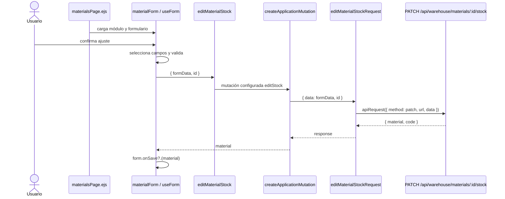

# Documentación técnica del frontend

## Propósito y alcance

Este documento aplica la [guía técnica común](technical-code-documentation.md) al código
que se ejecuta en el navegador y a su composición EJS: `src/public/js`,
`src/views/pages` y `src/views/shared`. El [documento de backend](backend-technical-documentation.md)
conserva rutas, controladores, servicios de dominio y persistencia. Una explicación de
frontend enlaza el [contrato API](../data/api-contract.md), pero no vuelve a declarar
permisos ni reglas de negocio que el servidor debe hacer cumplir.

## Capas documentales del navegador

La ubicación del módulo determina la responsabilidad que debe describirse. Antes de
crear una ficha se revisa una implementación equivalente en la misma fila.

| Ubicación | Responsabilidad documentada | Ejemplos existentes |
| --- | --- | --- |
| `public/js/services` | Método, URL, parámetros y cuerpo enviados mediante el cliente HTTP común. | `materialService.js`, `goodsIssueService.js`, `authService.js`. |
| `public/js/application` | Adaptación de respuestas y coordinación del caso de uso sin acceso directo al DOM. | `createCrudApplication.js`, `createIssueApplication.js`, `materials.js`. |
| `public/js/pages` | Composición e inicialización de una pantalla, formulario o modal propietario del recurso. | `materialsPage.js`, `materialForm.js`, `materialModal.js`. |
| `public/js/ui` | Comportamiento visual reutilizable que recibe el contexto por parámetros. | `formUI.js`, `modalUI.js`, `inventorySelectUI.js`. |
| `public/js/plugins` | Adaptadores y configuración común de DataTable, Select2, MDB, Flatpickr o SweetAlert. | `createDataTable.js`, `baseSelect.js`, `baseInstance.js`. |
| `public/js/utils` | Transformaciones sin propiedad visual o de dominio específico. | `formUtils.js`, `formatUtils.js`, `detailCollectionUtils.js`. |
| `views/pages` | Estructura EJS y scripts de entrada pertenecientes a una página. | `materialsPage.ejs`, `goodsIssuesPage.ejs`. |
| `views/shared` | Marcado reutilizado por más de un recurso y configurado por sus consumidores. | Formularios, tablas y modales compartidos. |

## Fichas por tipo de módulo

### Servicio HTTP del navegador

Se registra nombre exportado, constante de ruta, método HTTP, parámetros, cuerpo y forma
de respuesta entregada por `apiRequest`. La ficha enlaza la ruta propietaria del
contrato API. No describe transacciones ni errores internos del servidor.

### Aplicación

Se registra la fábrica o flujo reutilizado, configuración inyectada, claves extraídas de
la respuesta y nombres de dominio que exporta el módulo. Si existe una excepción —por
ejemplo omitir un campo en un contexto— se explica la condición y por qué no pertenece a
la fábrica común.

### Página, formulario y modal

Se documentan por separado:

- **página:** módulos que inicializa y contexto global que entrega;
- **formulario:** campos seleccionados, validación del navegador, normalización, modo y
  mutación que invoca;
- **modal:** preparación visual, carga de datos y contrato que entrega al formulario;
- **EJS:** parciales incluidos, elementos usados como puntos de montaje y scripts
  `type="module"`, conservando los cierres `contentFor`.

Sólo se enumeran selectores DOM cuando forman parte de la integración entre módulos. Una
lista de cada elemento o listener repetiría el código sin explicar el diseño.

### UI, plugin y utilidad compartida

La ficha declara consumidores, parámetros de configuración, eventos emitidos o
escuchados, estado interno y dependencia externa encapsulada. También indica qué
conocimiento **no** puede incorporar: un módulo compartido no importa la aplicación de
un recurso concreto ni decide permisos del servidor.

## Referencia implementada: materiales

El flujo de materiales muestra la separación desde EJS hasta la API sin duplicar la
regla de existencias del backend.

| Archivo y símbolo | Tipo | Responsabilidad observable |
| --- | --- | --- |
| [`materialsPage.ejs`](../../src/views/pages/warehouse/materials/materialsPage.ejs) | Vista | Incluye tabla, modales y los módulos de página, modal y formulario. |
| [`materialsPage.js`](../../src/public/js/pages/warehouse/materials/materialsPage.js) | Entrada de página | Lee `window.meta` e inicializa `createMaterialDatatable(context)`. |
| [`materialForm.js`](../../src/public/js/pages/warehouse/materials/materialForm.js), `useForm(...)` | Formulario | Selecciona campos y validación según alta, edición o ajuste; delega la mutación elegida. |
| [`materials.js`](../../src/public/js/application/warehouse/materials/materials.js), `materialApplication` | Aplicación privada | Configura `createCrudApplication` con requests, clave de respuesta y mutaciones adicionales. |
| [`materials.js`](../../src/public/js/application/warehouse/materials/materials.js), exports de dominio | API del módulo | Expone `getAllMaterials`, `registerMaterial`, `editMaterial`, `editMaterialStock` y `deleteMaterial`. |
| [`materialService.js`](../../src/public/js/services/warehouse/materialService.js), `MATERIALS_API_ROUTE` | Transporte | Conserva el prefijo `/api/warehouse/materials` usado por las cinco peticiones. |
| [`axiosInstanceApi.js`](../../src/public/js/services/axiosInstanceApi.js), `apiRequest` | Cliente común | Ejecuta la petición y centraliza el tratamiento de la sesión y errores HTTP. |

La aplicación configura la fábrica existente en lugar de volver a implementar cada
mutación:

```js
const materialApplication = createCrudApplication({
    requests: {
        getAll: getAllMaterialsRequest,
        register: ({ data, creationContext = null }) => registerMaterialRequest({
            data: creationContext === GOODS_RECEIPT_CREATION_CONTEXT
                ? omitMaxUnitCost(data)
                : data
        }),
        edit: editMaterialRequest,
        editStock: editMaterialStockRequest,
        remove: deleteMaterialRequest
    },
    dataKeys: { register: 'material' },
    additionalMutations: ['editStock', 'remove']
});
```

El fragmento procede de
[`application/warehouse/materials/materials.js`](../../src/public/js/application/warehouse/materials/materials.js).
La excepción `goodsReceipt` sólo omite `maxUnitCost` antes del alta iniciada desde una
entrada; las demás adaptaciones continúan en `createCrudApplication`.

## Secuencia frontend de un ajuste de existencias



La secuencia termina en el límite HTTP. La autorización, validación definitiva,
transacción, auditoría y emisión de inventario pertenecen al backend y se consultan en
la [ficha de la ruta](../data/api-contract.md#ejemplo-aplicado-ajuste-de-existencias-de-material).

## Cuándo agregar un diagrama frontend

Se agrega una vista específica si hay coordinación entre página, formulario, modal y
aplicación; si una fábrica cambia la forma del flujo; si intervienen eventos asíncronos;
o si varios componentes comparten estado. Un servicio HTTP de una sola llamada no
necesita su propio diagrama: basta la ficha de la ruta y el nombre exportado.

Cada diagrama declara su límite en el navegador. Si atraviesa la API, enlaza la ficha de
backend o contrato en vez de redibujar Prisma y reglas de dominio como si fueran parte
del frontend.

## Lista de revisión frontend

1. Confirmar que la vista EJS carga los scripts propietarios y conserva su última línea
   y llamadas `contentFor`.
2. Revisar imports, exports, selectores, eventos y consumidores del símbolo documentado.
3. Comprobar que `pages` compone, `application` coordina, `services` transporta y `ui`
   permanece independiente del recurso.
4. Enlazar el contrato API y no presentar la validación del navegador como control de
   seguridad.
5. Localizar las pruebas bajo `tests/unit/public` o registrar la brecha existente sin
   afirmar cobertura.
6. Ejecutar `npm run docs:check` y validar el paquete de arquitectura.
