# Documentación técnica del frontend

## Propósito y alcance

Este documento aplica la [guía técnica común](technical-code-documentation.md) al código
que se ejecuta en el navegador y a su composición EJS: `src/public/js`,
`src/views/pages` y `src/views/shared`. El [documento de backend](backend-technical-documentation.md)
conserva rutas, controladores, servicios de dominio y persistencia. Una explicación de
frontend enlaza el [contrato API](../data/api-contract.md), pero no vuelve a declarar
permisos ni reglas de negocio que el servidor debe hacer cumplir.

## Capas documentales del navegador

La ubicación del módulo determina la responsabilidad que debe describirse. Antes de
crear una ficha se revisa una implementación equivalente en la misma fila.

| Ubicación | Responsabilidad documentada | Ejemplos existentes |
| --- | --- | --- |
| `public/js/services` | Método, URL, parámetros y cuerpo enviados mediante el cliente HTTP común. | `materialService.js`, `goodsIssueService.js`, `authService.js`. |
| `public/js/application` | Adaptación de respuestas y coordinación del caso de uso sin acceso directo al DOM. | `createCrudApplication.js`, `createIssueApplication.js`, `materials.js`. |
| `public/js/pages` | Composición e inicialización de una pantalla, formulario o modal propietario del recurso. | `materialsPage.js`, `materialForm.js`, `materialModal.js`. |
| `public/js/ui` | Comportamiento visual reutilizable que recibe el contexto por parámetros. | `formUI.js`, `modalUI.js`, `inventorySelectUI.js`. |
| `public/js/plugins` | Adaptadores y configuración común de DataTable, Select2, MDB, Flatpickr o SweetAlert. | `createDataTable.js`, `baseSelect.js`, `baseInstance.js`. |
| `public/js/utils` | Transformaciones sin propiedad visual o de dominio específico. | `formUtils.js`, `formatUtils.js`, `detailCollectionUtils.js`. |
| `views/pages` | Estructura EJS y scripts de entrada pertenecientes a una página. | `materialsPage.ejs`, `goodsIssuesPage.ejs`. |
| `views/shared` | Marcado reutilizado por más de un recurso y configurado por sus consumidores. | Formularios, tablas y modales compartidos. |

## Fichas por tipo de módulo

### Servicio HTTP del navegador

Se registra nombre exportado, constante de ruta, método HTTP, parámetros, cuerpo y forma
de respuesta entregada por `apiRequest`. La ficha enlaza la ruta propietaria del
contrato API. No describe transacciones ni errores internos del servidor.

### Aplicación

Se registra la fábrica o flujo reutilizado, configuración inyectada, claves extraídas de
la respuesta y nombres de dominio que exporta el módulo. Si existe una excepción —por
ejemplo omitir un campo en un contexto— se explica la condición y por qué no pertenece a
la fábrica común.

### Página, formulario y modal

Se documentan por separado:

- **página:** módulos que inicializa y contexto global que entrega;
- **formulario:** campos seleccionados, validación del navegador, normalización, modo y
  mutación que invoca;
- **modal:** preparación visual, carga de datos y contrato que entrega al formulario;
- **EJS:** parciales incluidos, elementos usados como puntos de montaje y scripts
  `type="module"`, conservando los cierres `contentFor`.

Sólo se enumeran selectores DOM cuando forman parte de la integración entre módulos. Una
lista de cada elemento o listener repetiría el código sin explicar el diseño.

### UI, plugin y utilidad compartida

La ficha declara consumidores, parámetros de configuración, eventos emitidos o
escuchados, estado interno y dependencia externa encapsulada. También indica qué
conocimiento **no** puede incorporar: un módulo compartido no importa la aplicación de
un recurso concreto ni decide permisos del servidor.

## Catálogo completo de fichas frontend

La unidad de documentación es el **flujo funcional**, no un archivo aislado. Cada fila
cubre todos sus módulos propietarios de servicio, aplicación, página y EJS; los símbolos
compartidos aparecen después en una ficha transversal. De este modo no se presenta
materiales como si fuera el único flujo documentado ni se repite una ficha idéntica por
cada operación CRUD. Las rutas concretas se verifican en el [contrato API](../data/api-contract.md)
y las páginas publicadas en el [mapa generado](../generated/code-map.md#rutas-web-16).

### Fichas de flujos funcionales

| Flujo | Vista y composición | Aplicación y transporte | Contrato y comportamiento propio | Diagrama aplicable |
| --- | --- | --- | --- | --- |
| Inicio de sesión | `loginPage.ejs` y `loginForm.js` recopilan credenciales; `indexPage.js` prepara la portada autenticada. | `application/auth/login.js` coordina `services/authService.js`; sus exports `registerRequest` y `resetPasswordRequest` no tienen consumidor ni ruta vigente y se registran como brecha, no como funcionalidad publicada. | `POST /api/auth/login`; normaliza la respuesta de éxito y deja cookies, tokens y permisos efectivos al servidor. | **Secuencia**, porque cruza formulario, API y establecimiento de sesión; reutilizar el recorrido HTTP de `code-diagrams.md` para las capas servidoras. |
| Personas | `personsPage.ejs`, `personsPage.js`, `personModal.js` y `personForm.js` componen listado, alta y edición. | `application/admin/persons/persons.js` usa `services/admin/personService.js`; consulta departamentos mediante su catálogo. | `GET`, `POST` y `PUT /api/admin/persons`; adapta la persona devuelta y refresca el listado. | **Ciclo CRUD compartido**; no requiere secuencia propia mientras no cambie la coordinación. |
| Usuarios | `usersPage.ejs`, `usersPage.js`, `userModal.js` y `userForm.js` separan alta, edición y cambio de contraseña. | `application/admin/users/users.js` usa `userService.js` y consume los catálogos de roles y departamentos. | `GET`, `POST`, `PATCH /api/admin/users/:id` y `PATCH .../:id/password`; el modo decide campos y mutación. | **Actividad o secuencia específica** sólo para cambio de contraseña si se agregan pasos asíncronos; el CRUD usa la vista común. |
| Clientes | `clientsPage.ejs`, `clientModal.ejs`, `clientsPage.js`, `clientModal.js` y `clientForm.js`. | `application/sales/clients/clients.js` usa `services/sales/clientService.js`; `application/sales/report.js` usa el servicio de reporte. | CRUD de `/api/sales/clients` y exportación `/api/sales/reports/clients/excel`. | **Ciclo CRUD** para mantenimiento y **secuencia corta de descarga** sólo si se necesita explicar la exportación. |
| Proveedores | `suppliersPage.ejs`, `supplierModal.ejs`, `suppliersPage.js`, `supplierModal.js` y `supplierForm.js`. | `application/warehouse/suppliers/suppliers.js` usa `supplierService.js`; el reporte usa la fábrica común. | CRUD de `/api/warehouse/suppliers` y reporte de proveedores. | **Ciclo CRUD compartido**; cada operación conserva su vista aplicada `DIA-FE-CU-*`, sin añadir una secuencia dinámica repetida. |
| Materiales | `materialsPage.ejs`, `materialModal.ejs`, `materialsPage.js`, `materialModal.js`, `materialForm.js` y `materialFields.js`. | `application/warehouse/materials/materials.js` configura `createCrudApplication` sobre `materialService.js`. | CRUD de `/api/warehouse/materials`; `goodsReceipt` omite `maxUnitCost` al crear y el ajuste usa `PATCH /:id/stock`. | **Secuencia** para ajuste de existencias por su mutación adicional y **ciclo CRUD** para el resto. |
| Mermas | `wastesPage.ejs`, `wastesPage.js`, `wasteModal.js`, `wasteForm.js` y `wasteFields.js`. | `application/warehouse/wastes/wastes.js` configura la fábrica CRUD sobre `wasteService.js`. | CRUD de `/api/warehouse/wastes`, plantillas de material y ajuste `PATCH /:id/stock`. | **Secuencia** sólo para creación desde plantilla o ajuste si se documenta esa bifurcación; CRUD común para las demás operaciones. |
| Entradas de almacén | `goodsReceiptsPage.ejs`, `goodsReceiptsPage.js`, formulario, modal y detalles componen el documento; `correctionForm.js` y `correctionModal.js` aíslan corrección/cancelación. | `application/warehouse/goodsReceipts/goodsReceipts.js` usa `goodsReceiptService.js` y catálogos; el reporte usa `createReportApplication`. | Lista, alta, edición de encabezado, corrección y cancelación bajo `/api/warehouse/goods-receipts`. | **Secuencia** para alta y **actividad/secuencia** para corrección y cancelación, pues tienen decisiones y efectos de inventario distintos. |
| Salidas de materiales | `goodsIssuesPage.ejs`, página, modal y formulario coordinan encabezado y detalles; `returns/goodsIssueReturn.js` gestiona devoluciones. | `application/warehouse/goodsIssues/goodsIssues.js` adapta `createIssueApplication` sobre `goodsIssueService.js`. | Lista, alta, edición, encabezado, surtimiento y devolución bajo `/api/warehouse/goods-issues`. | **Secuencia** para surtimiento y devolución; **máquina de estados** se referencia desde requisitos, no se redibuja en frontend. |
| Salidas de mermas | `wasteIssuesPage.ejs`, página, modal, formulario y `returns/wasteIssueReturn.js`. | `application/warehouse/wasteIssues/wasteIssues.js` reutiliza `createIssueApplication` sobre `wasteIssueService.js`. | Mismas clases de operación bajo `/api/warehouse/waste-issues`, con selección y cantidades propias de merma. | **Secuencia** para surtimiento y devolución; compartir la vista de estados normativa. |
| Movimientos | `movementsPage.ejs` y `movementsPage.js` eligen inventario de materiales o mermas según contexto de la vista. | `application/admin/movements/movements.js` usa `movementService.js`; `application/admin/report.js` coordina exportaciones. | Lecturas `/api/admin/movements/{materials,wastes}` y reportes correspondientes. | **Flujo de datos/listado**; no secuencia propia mientras sólo consulte y descargue. |
| Catálogos | No poseen página: alimentan Select2 y formularios consumidores. | `catalogs/{departments,roles,fulfillmentStatuses,presentations,reasons,unitMeasures}.js` adaptan sus servicios homólogos. | Operaciones `GET` de sólo lectura; entregan colecciones normalizadas a personas, usuarios, materiales y documentos. | Cada lectura conserva su vista aplicada `DIA-FE-CU-*`; no se añade una secuencia dinámica porque su contexto se concreta en el formulario consumidor. |
| Exportaciones dentro de cada módulo | Los botones pertenecen a las páginas de clientes, proveedores, inventarios, compras, salidas, personas, usuarios y movimientos; no existe una página general de reportes. | `createReportApplication.js` centraliza la descarga; `application/{admin,sales,warehouse}/report.js` configura cada `reportService.js` desde la página propietaria. | Cada solicitud `GET .../reports/.../excel` continúa la consulta y los filtros del módulo visible; no decide permisos del servidor. | Se documenta dentro del caso y recorrido del módulo propietario. La factory sólo requiere una vista estructural compartida, no una secuencia transversal de reportes. |

### Fichas de infraestructura compartida

| Pieza | Contrato documentado | Consumidores y límite | Diagrama aplicable |
| --- | --- | --- | --- |
| `createCrudApplication.js` | Configura lecturas y mutaciones, extrae claves de respuesta y permite mutaciones adicionales. | Personas, usuarios, clientes, proveedores, materiales y mermas; no conoce DOM ni reglas de dominio. | Diagrama canónico de **fábrica CRUD** en `code-diagrams.md`. |
| `createIssueApplication.js` e `issueHeaderRules.js` | Especializan el ciclo de documentos con encabezado, detalles y reglas de edición visibles. | Salidas de materiales y mermas; las transiciones definitivas siguen en backend. | **Actividad** para bifurcaciones del encabezado y **secuencia** para coordinación asíncrona. |
| `createReportApplication.js` | Convierte una petición configurada en descarga y nombre de archivo. | Reportes de admin, ventas y almacén. | Normalmente ninguno; secuencia sólo al investigar descarga o error. |
| `axiosInstanceApi.js` / `apiRequest` | Cliente HTTP común, tratamiento de sesión y propagación normalizada de errores. | Todos los servicios del navegador. | Participante único en secuencias; nunca un diagrama por llamada. |
| `ui/forms`, `ui/inventory`, `ui/issues` | Reciben elementos y callbacks; controlan interacción visual y emiten resultados al propietario. | Formularios CRUD, selectores de inventario y documentos de salida. | **Componentes** si cambia la reutilización; **secuencia** si coordina eventos asíncronos. |
| `plugins/datatable`, `plugins/select2`, `plugins/mdb`, `plugins/flatpickr`, `plugins/swal` | Encapsulan bibliotecas externas y su configuración común. | Páginas, modales, fechas, confirmaciones y catálogos. | Sin vista por adaptador; aparecen en el diagrama de componentes compartidos. |
| `utils` y `constants` | Transformaciones, validaciones auxiliares, formatos y valores sin estado visual. | Todas las capas del navegador que los importan. | Sin diagrama salvo que una transformación tenga decisiones de negocio, caso en que debe moverse o documentarse en su flujo propietario. |
| `views/shared` | Parciales configurables para formularios, tablas, modales y estructura común. | Vistas EJS propietarias. | Diagrama de **componentes/composición**, no secuencia por inclusión. |

## Aplicación de todos los casos al código frontend

Esta matriz documenta cada `CU-*` desde el código que se ejecuta en el navegador. Una
fila puede señalar que no existe pantalla independiente: en ese caso identifica el
componente consumidor real en vez de inventar un flujo frontend. Las factories se
reutilizan, pero cada fila conserva la página, aplicación o request de su contexto.
La misma cobertura se representa visualmente, caso por caso, en los
[diagramas frontend aplicados al código](frontend-use-case-diagrams.md). Cada vista por
caso conserva directamente su interacción y endpoint concreto, e identifica los
patrones aplicados mediante los códigos de su índice rápido.
La última columna enlaza la vista `DIA-FE-CU-*` que aplica a cada fila. Para leer cómo
se especializa, la flecha del diagrama toma como origen la página o interacción de la
segunda columna y como destino la aplicación, request, endpoint y resultado de la
tercera; por ello el patrón compartido no elimina el contexto particular del caso.

| Caso | Página o interacción concreta | Aplicación, servicio y resultado observable | Diagrama aplicado |
| --- | --- | --- | --- |
| `CU-AUT-01` | `loginPage.ejs` → `loginForm.js`. | `login` → `loginRequest`; envía `POST /api/auth/login` y navega al inicio. | [`DIA-FE-CU-AUT-01`](frontend-use-case-diagrams.md#cu-aut-01) |
| `CU-AUT-02` | Opción Cerrar sesión de la navegación compartida. | Navega a `/cerrar-sesion`; el cierre es web y no usa una mutación de `authService.js`. | [`DIA-FE-CU-AUT-02`](frontend-use-case-diagrams.md#cu-aut-02) |
| `CU-IDA-01` | `personsPage.ejs` y `personsPage.js` cargan la tabla. | `getAllPersons` → `getAllPersonsRequest`; consulta `GET /api/admin/persons`. | [`DIA-FE-CU-IDA-01`](frontend-use-case-diagrams.md#cu-ida-01) |
| `CU-IDA-02` | `personModal.js` abre `personForm.js` en modo alta. | `registerPerson` → `registerPersonRequest`; envía `POST /api/admin/persons`. | [`DIA-FE-CU-IDA-02`](frontend-use-case-diagrams.md#cu-ida-02) |
| `CU-IDA-03` | `personModal.js` precarga la persona seleccionada. | `updatePerson` → `updatePersonRequest`; envía `PUT /api/admin/persons/:id`. | [`DIA-FE-CU-IDA-03`](frontend-use-case-diagrams.md#cu-ida-03) |
| `CU-IDA-04` | `usersPage.ejs` y `usersPage.js` cargan la tabla. | `getAllUsers` → `getAllUsersRequest`; consulta `GET /api/admin/users`. | [`DIA-FE-CU-IDA-04`](frontend-use-case-diagrams.md#cu-ida-04) |
| `CU-IDA-05` | `userModal.js` abre `userForm.js` para una cuenta nueva. | `registerUser` → `registerUserRequest`; envía `POST /api/admin/users`. | [`DIA-FE-CU-IDA-05`](frontend-use-case-diagrams.md#cu-ida-05) |
| `CU-IDA-06` | `userModal.js` abre la cuenta y acceso existentes. | `editUser` → `editUserRequest`; envía `PATCH /api/admin/users/:id`. | [`DIA-FE-CU-IDA-06`](frontend-use-case-diagrams.md#cu-ida-06) |
| `CU-IDA-07` | `userForm.js` selecciona el modo de contraseña. | `editUserPassword` → `editUserPasswordRequest`; envía `PATCH /api/admin/users/:id/password`. | [`DIA-FE-CU-IDA-07`](frontend-use-case-diagrams.md#cu-ida-07) |
| `CU-IDA-08` | Select de rol dentro de formularios de personas y usuarios. | `getAllRoles` → `getAllRolesRequest`; consume `GET /api/admin/roles`. | [`DIA-FE-CU-IDA-08`](frontend-use-case-diagrams.md#cu-ida-08) |
| `CU-IDA-09` | Select de departamento dentro de formularios de personas y usuarios. | `getAllDepartments` → `getAllDepartmentsRequest`; consume `GET /api/admin/departments`. | [`DIA-FE-CU-IDA-09`](frontend-use-case-diagrams.md#cu-ida-09) |
| `CU-CAT-01` | `materialsPage.ejs` y `materialsPage.js` cargan inventario. | `getAllMaterials` → `getAllMaterialsRequest`; consulta `GET /api/warehouse/materials`. | [`DIA-FE-CU-CAT-01`](frontend-use-case-diagrams.md#cu-cat-01) |
| `CU-CAT-02` | `materialModal.js` abre `materialForm.js` en modo alta. | `registerMaterial` → `registerMaterialRequest`; envía `POST /api/warehouse/materials`. | [`DIA-FE-CU-CAT-02`](frontend-use-case-diagrams.md#cu-cat-02) |
| `CU-CAT-03` | `materialModal.js` precarga material y relación con proveedor. | `editMaterial` → `editMaterialRequest`; envía `PATCH /api/warehouse/materials/:id`. | [`DIA-FE-CU-CAT-03`](frontend-use-case-diagrams.md#cu-cat-03) |
| `CU-CAT-04` | Acción de retiro en `materialDatatable.js`. | `deleteMaterial` → `deleteMaterialRequest`; envía `DELETE /api/warehouse/materials/:id`. | [`DIA-FE-CU-CAT-04`](frontend-use-case-diagrams.md#cu-cat-04) |
| `CU-CAT-05` | `materialForm.js` usa el modo de ajuste de existencia. | `editMaterialStock` → `editMaterialStockRequest`; envía `PATCH /api/warehouse/materials/:id/stock`. | [`DIA-FE-CU-CAT-05`](frontend-use-case-diagrams.md#cu-cat-05) |
| `CU-CAT-06` | `suppliersPage.ejs` y `suppliersPage.js` cargan proveedores. | `getAllSuppliers` → `getAllSuppliersRequest`; consulta `GET /api/warehouse/suppliers`. | [`DIA-FE-CU-CAT-06`](frontend-use-case-diagrams.md#cu-cat-06) |
| `CU-CAT-07` | `supplierModal.js` abre `supplierForm.js` en alta. | `registerSupplier` → `registerSupplierRequest`; envía `POST /api/warehouse/suppliers`. | [`DIA-FE-CU-CAT-07`](frontend-use-case-diagrams.md#cu-cat-07) |
| `CU-CAT-08` | `supplierModal.js` precarga el proveedor. | `editSupplier` → `editSupplierRequest`; envía `PUT /api/warehouse/suppliers/:id`. | [`DIA-FE-CU-CAT-08`](frontend-use-case-diagrams.md#cu-cat-08) |
| `CU-CAT-09` | El estado se edita en `supplierForm.js`; no hay pantalla separada. | `editSupplier` conserva el contexto y usa `PUT /api/warehouse/suppliers/:id`. | [`DIA-FE-CU-CAT-09`](frontend-use-case-diagrams.md#cu-cat-09) |
| `CU-CAT-10` | `clientsPage.ejs` y `clientsPage.js` cargan clientes. | `getAllClients` → `getAllClientsRequest`; consulta `GET /api/sales/clients`. | [`DIA-FE-CU-CAT-10`](frontend-use-case-diagrams.md#cu-cat-10) |
| `CU-CAT-11` | `clientModal.js` abre `clientForm.js` en alta. | `registerClient` → `createClientRequest`; envía `POST /api/sales/clients`. | [`DIA-FE-CU-CAT-11`](frontend-use-case-diagrams.md#cu-cat-11) |
| `CU-CAT-12` | `clientModal.js` precarga el cliente. | `editClient` → `editClientRequest`; envía `PUT /api/sales/clients/:id`. | [`DIA-FE-CU-CAT-12`](frontend-use-case-diagrams.md#cu-cat-12) |
| `CU-CAT-13` | `wastesPage.ejs` y `wastesPage.js` cargan mermas. | `getAllWastes` → `getAllWastesRequest`; consulta `GET /api/warehouse/wastes`. | [`DIA-FE-CU-CAT-13`](frontend-use-case-diagrams.md#cu-cat-13) |
| `CU-CAT-14` | `wasteModal.js` y `wasteForm.js` seleccionan una plantilla de material. | `getWasteMaterialTemplates` prepara datos y `registerWaste` envía `POST /api/warehouse/wastes`. | [`DIA-FE-CU-CAT-14`](frontend-use-case-diagrams.md#cu-cat-14) |
| `CU-CAT-15` | `wasteModal.js` precarga la merma. | `editWaste` → `editWasteRequest`; envía `PATCH /api/warehouse/wastes/:id`. | [`DIA-FE-CU-CAT-15`](frontend-use-case-diagrams.md#cu-cat-15) |
| `CU-CAT-16` | `wasteForm.js` usa el modo de ajuste. | `editWasteStock` → `editWasteStockRequest`; envía `PATCH /api/warehouse/wastes/:id/stock`. | [`DIA-FE-CU-CAT-16`](frontend-use-case-diagrams.md#cu-cat-16) |
| `CU-CAT-17` | Select de presentación en `materialFields.js` y `wasteFields.js`. | `getAllPresentations` → `getAllPresentationsRequest`; consume `GET /api/warehouse/presentations`. | [`DIA-FE-CU-CAT-17`](frontend-use-case-diagrams.md#cu-cat-17) |
| `CU-CAT-18` | Select de unidad en formularios de material y merma. | `getAllUnitMeasures` → `getAllUnitMeasuresRequest`; consume `GET /api/warehouse/unit-measures`. | [`DIA-FE-CU-CAT-18`](frontend-use-case-diagrams.md#cu-cat-18) |
| `CU-CAT-19` | Select de motivo en los modos de ajuste. | `getAllReasons` → `getAllReasonsRequest`; consume `GET /api/warehouse/reasons`. | [`DIA-FE-CU-CAT-19`](frontend-use-case-diagrams.md#cu-cat-19) |
| `CU-CAT-20` | Estado visible en tablas y formularios de salidas. | `getAllFulfillmentStatuses` → request homólogo; consume `GET /api/warehouse/fulfillment-statuses`. | [`DIA-FE-CU-CAT-20`](frontend-use-case-diagrams.md#cu-cat-20) |
| `CU-ENT-01` | `goodsReceiptsPage.ejs` y su DataTable cargan compras. | `getAllGoodsReceipts` → request homólogo; consulta `GET /api/warehouse/goods-receipts`. | [`DIA-FE-CU-ENT-01`](frontend-use-case-diagrams.md#cu-ent-01) |
| `CU-ENT-02` | `goodsReceiptModal.js` captura encabezado y detalles. | `registerGoodsReceipt` → `registerGoodsReceiptRequest`; envía `POST /api/warehouse/goods-receipts`. | [`DIA-FE-CU-ENT-02`](frontend-use-case-diagrams.md#cu-ent-02) |
| `CU-ENT-03` | `goodsReceiptModal.js` abre una compra existente. | `editGoodsReceiptHeader` → request homólogo; envía `PATCH /api/warehouse/goods-receipts/:id`. | [`DIA-FE-CU-ENT-03`](frontend-use-case-diagrams.md#cu-ent-03) |
| `CU-ENT-04` | `correctionModal.js` y `correctionForm.js` aíslan la corrección. | `correctGoodsReceiptDetail` → request homólogo; envía `PATCH /api/warehouse/goods-receipts/:id/details/:detailId/corrections`. | [`DIA-FE-CU-ENT-04`](frontend-use-case-diagrams.md#cu-ent-04) |
| `CU-ENT-05` | Acción Cancelar del detalle en el modal de compra. | `cancelGoodsReceiptDetail` → request homólogo; envía `PATCH /api/warehouse/goods-receipts/:id/details/:detailId/cancel`. | [`DIA-FE-CU-ENT-05`](frontend-use-case-diagrams.md#cu-ent-05) |
| `CU-SAL-01` | `goodsIssuesPage.ejs` y su DataTable cargan salidas. | `getAllGoodsIssues` → request homólogo; consulta `GET /api/warehouse/goods-issues`. | [`DIA-FE-CU-SAL-01`](frontend-use-case-diagrams.md#cu-sal-01) |
| `CU-SAL-02` | `goodsIssueModal.js` captura documento y materiales. | `registerGoodsIssue` → request homólogo; envía `POST /api/warehouse/goods-issues`. | [`DIA-FE-CU-SAL-02`](frontend-use-case-diagrams.md#cu-sal-02) |
| `CU-SAL-03` | Modo encabezado de `goodsIssueModal.js`. | `editGoodsIssueHeader` → request homólogo; envía `PATCH /api/warehouse/goods-issues/:id/header`. | [`DIA-FE-CU-SAL-03`](frontend-use-case-diagrams.md#cu-sal-03) |
| `CU-SAL-04` | Modo detalles de `goodsIssueModal.js`. | `editGoodsIssueDetails` → request homólogo; envía `PATCH /api/warehouse/goods-issues/:id/details`. | [`DIA-FE-CU-SAL-04`](frontend-use-case-diagrams.md#cu-sal-04) |
| `CU-SAL-05` | Acción Surtir dentro de los detalles de salida. | `editGoodsIssueDetails` envía cantidades a `PATCH /api/warehouse/goods-issues/:id/details` y refresca el documento. | [`DIA-FE-CU-SAL-05`](frontend-use-case-diagrams.md#cu-sal-05) |
| `CU-SAL-06` | `returns/goodsIssueReturn.js` configura `issueReturnUI`. | `returnGoodsIssueDetail` → request homólogo; envía `PATCH /api/warehouse/goods-issues/:id/details/:detailId/returns`. | [`DIA-FE-CU-SAL-06`](frontend-use-case-diagrams.md#cu-sal-06) |
| `CU-SAL-07` | `wasteIssuesPage.ejs` y su DataTable cargan salidas de merma. | `getAllWasteIssues` → request homólogo; consulta `GET /api/warehouse/waste-issues`. | [`DIA-FE-CU-SAL-07`](frontend-use-case-diagrams.md#cu-sal-07) |
| `CU-SAL-08` | `wasteIssueModal.js` captura documento y mermas. | `registerWasteIssue` → request homólogo; envía `POST /api/warehouse/waste-issues`. | [`DIA-FE-CU-SAL-08`](frontend-use-case-diagrams.md#cu-sal-08) |
| `CU-SAL-09` | Modo encabezado de `wasteIssueModal.js`. | `editWasteIssueHeader` → request homólogo; envía `PATCH /api/warehouse/waste-issues/:id/header`. | [`DIA-FE-CU-SAL-09`](frontend-use-case-diagrams.md#cu-sal-09) |
| `CU-SAL-10` | Modo detalles de `wasteIssueModal.js`. | `editWasteIssueDetails` → request homólogo; envía `PATCH /api/warehouse/waste-issues/:id/details`. | [`DIA-FE-CU-SAL-10`](frontend-use-case-diagrams.md#cu-sal-10) |
| `CU-SAL-11` | Acción Surtir dentro de los detalles de merma. | `editWasteIssueDetails` envía cantidades a `PATCH /api/warehouse/waste-issues/:id/details` y refresca el documento. | [`DIA-FE-CU-SAL-11`](frontend-use-case-diagrams.md#cu-sal-11) |
| `CU-SAL-12` | `returns/wasteIssueReturn.js` configura `issueReturnUI`. | `returnWasteIssueDetail` → request homólogo; envía `PATCH /api/warehouse/waste-issues/:id/details/:detailId/returns`. | [`DIA-FE-CU-SAL-12`](frontend-use-case-diagrams.md#cu-sal-12) |
| `CU-REP-01` | La consulta es el listado de `materialsPage.js`; no hay página de reporte. | Reutiliza `getAllMaterialsRequest` y sus filtros, sin mutación. | [`DIA-FE-CU-REP-01`](frontend-use-case-diagrams.md#cu-rep-01) |
| `CU-REP-02` | `movementsPage.js` selecciona el contexto material. | `getAllMovements({ context: 'materials' })` consulta `/api/admin/movements/materials`. | [`DIA-FE-CU-REP-02`](frontend-use-case-diagrams.md#cu-rep-02) |
| `CU-REP-03` | Botón Excel de `materialDatatable.js`. | `exportWarehouseReport` → `exportWarehouseReportRequest`; descarga `/api/warehouse/reports/inventory/excel`. | [`DIA-FE-CU-REP-03`](frontend-use-case-diagrams.md#cu-rep-03) |
| `CU-REP-04` | Botón Excel del listado de salidas de material. | `exportGoodsIssueReport` → request homólogo; descarga `/api/warehouse/reports/goods-issues/excel`. | [`DIA-FE-CU-REP-04`](frontend-use-case-diagrams.md#cu-rep-04) |
| `CU-REP-05` | Botón Excel de movimientos en contexto material. | `exportMovementReport` → request con `materials`; descarga `/api/admin/reports/movements/materials/excel`. | [`DIA-FE-CU-REP-05`](frontend-use-case-diagrams.md#cu-rep-05) |
| `CU-REP-06` | La consulta es el listado de `wastesPage.js`; no hay página de reporte. | Reutiliza `getAllWastesRequest` y sus filtros, sin mutación. | [`DIA-FE-CU-REP-06`](frontend-use-case-diagrams.md#cu-rep-06) |
| `CU-REP-07` | `movementsPage.js` selecciona el contexto merma. | `getAllMovements({ context: 'wastes' })` consulta `/api/admin/movements/wastes`. | [`DIA-FE-CU-REP-07`](frontend-use-case-diagrams.md#cu-rep-07) |
| `CU-REP-08` | Botón Excel del listado de salidas de merma. | `exportWasteIssueReport` → request homólogo; descarga `/api/warehouse/reports/waste-issues/excel`. | [`DIA-FE-CU-REP-08`](frontend-use-case-diagrams.md#cu-rep-08) |
| `CU-REP-09` | Botón Excel de `wasteDatatable.js`. | `exportWasteReport` → request homólogo; descarga `/api/warehouse/reports/wastes/excel`. | [`DIA-FE-CU-REP-09`](frontend-use-case-diagrams.md#cu-rep-09) |
| `CU-REP-10` | Botón Excel de movimientos en contexto merma. | `exportMovementReport` → request con `wastes`; descarga `/api/admin/reports/movements/wastes/excel`. | [`DIA-FE-CU-REP-10`](frontend-use-case-diagrams.md#cu-rep-10) |
| `CU-REP-11` | Botón Excel de `goodsReceiptDatatable.js`. | `exportGoodsReceiptReport` → request homólogo; descarga `/api/warehouse/reports/goods-receipts/excel`. | [`DIA-FE-CU-REP-11`](frontend-use-case-diagrams.md#cu-rep-11) |
| `CU-REP-12` | Botón Excel de `supplierDatatable.js`. | `exportSupplierReport` → request homólogo; descarga `/api/warehouse/reports/suppliers/excel`. | [`DIA-FE-CU-REP-12`](frontend-use-case-diagrams.md#cu-rep-12) |
| `CU-REP-13` | Botón Excel de `clientDatatable.js`. | `exportClientReport` → request homólogo; descarga `/api/sales/reports/clients/excel`. | [`DIA-FE-CU-REP-13`](frontend-use-case-diagrams.md#cu-rep-13) |
| `CU-REP-14` | Botón Excel de `personDatatable.js`. | `exportPersonReport` → request homólogo; descarga `/api/admin/reports/persons/excel`. | [`DIA-FE-CU-REP-14`](frontend-use-case-diagrams.md#cu-rep-14) |
| `CU-REP-15` | Botón Excel de `userDatatable.js`. | `exportUserReport` → request homólogo; descarga `/api/admin/reports/users/excel`. | [`DIA-FE-CU-REP-15`](frontend-use-case-diagrams.md#cu-rep-15) |

## Matriz de decisión de diagramas frontend

La columna de cada ficha anterior es una decisión explícita, no una invitación a crear
todos los diagramas posibles. Se aplica esta matriz al cambiar el flujo:

| Caso observable | Vista que aplica | Vista que no aporta | Fuente que debe enlazarse |
| --- | --- | --- | --- |
| Alta, consulta, edición o baja sin coordinación adicional | Ciclo CRUD compartido. | Una secuencia repetida por recurso. | Contrato API y patrón de fábrica. |
| Formulario/modal con llamadas encadenadas o evento posterior | Secuencia. | Entidad-relación. | Módulos de página, aplicación y servicio HTTP. |
| Validación visual con alternativas que cambian el recorrido | Actividad. | Máquina de estados si no existen estados persistentes. | Reglas de formulario y caso de uso. |
| Documento con estados persistentes | Referencia a máquina de estados de requisitos. | Copia frontend de las transiciones. | `requirements-diagrams.md`. |
| Reutilización de parciales, UI, plugins o fábricas | Componentes o dependencias. | Secuencia por cada consumidor. | `code-diagrams.md` y patrón aplicado. |
| Una petición HTTP directa o un catálogo de lectura | Vista aplicada `DIA-FE-CU-*`, sin secuencia dinámica adicional. | Secuencia de una sola llamada. | Ficha funcional, contrato API e interacción consumidora. |
| Exportación Excel iniciada desde un listado | Continuación del caso específico del módulo. | Grupo o secuencia independiente de “Reportes”. | Página propietaria, request concreto y caso `CU-REP-*`. |

Cada diagrama declara el límite del navegador. Si atraviesa la API, termina en el método
y URL y enlaza backend; no dibuja Prisma ni atribuye seguridad a la validación visual.

## Vistas técnicas aplicadas por flujo frontend

Estas vistas no son diagramas de casos de uso: comienzan dentro del navegador y muestran
la composición EJS/JavaScript, eventos, factories y transporte que implementan el caso.
La columna **Diagrama aplicado** de la matriz anterior enlaza los 63 recorridos
`DIA-FE-CU-*`. Esta sección conserva primero las perspectivas dinámicas para los flujos
cuya secuencia o decisión necesita más detalle y después incorpora una vista técnica con
contexto de código para cada caso.
Cada vista dinámica se vincula con un solo `CU-*` y nombra página, aplicación, request y
endpoint concretos. La reutilización de una factory o componente se explica en la ficha
transversal, pero no se usa para hacer que una secuencia represente varios casos. Todos
Todos los CRUD conservan su vista aplicada `DIA-FE-CU-*` y su recorrido técnico contextual,
sin forzar una secuencia dinámica cuando no existe coordinación adicional.

### Inicio de sesión y establecimiento de la navegación autenticada

**Identificador:** `DIA-FE-SEQ-002`. **Caso:** `CU-AUT-01`. Explica qué módulos del
navegador recopilan credenciales y entregan el control al servidor; no describe la
validación del token, que pertenece al backend.

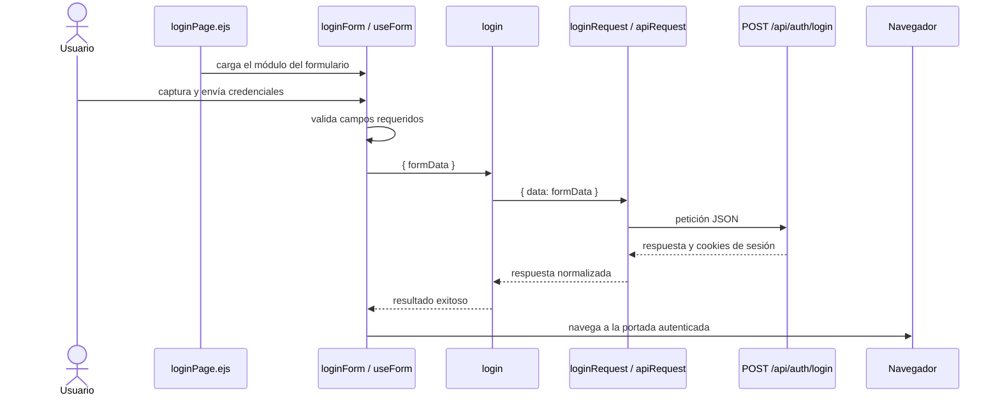

### Ajuste de existencias desde el navegador

Esta vista se conserva porque la ficha de materiales identifica una mutación adicional
que sí cambia el flujo CRUD común. Documenta exclusivamente `CU-CAT-05`; el ajuste de
merma, surtimientos, devoluciones y cambios de entradas no sustituyen nombres dentro de
esta secuencia y requieren una vista propia cuando su coordinación de frontend deba
explicarse.

**Identificador:** `DIA-FE-SEQ-001`. **Caso:** `CU-CAT-05`. **Tipo:** secuencia Mermaid
con semántica UML. **Actor:** `Administrador del sistema` es el actor canónico del caso;
los participantes técnicos se nombran por responsabilidad o módulo y nunca se declaran
como actores.

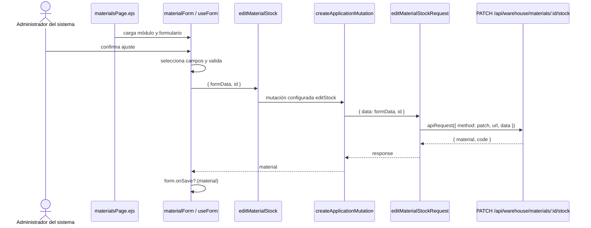

La autorización, validación definitiva, transacción, auditoría y movimiento pertenecen
al backend y se consultan en el [contrato de la ruta](../data/api-contract.md#ejemplo-aplicado-ajuste-de-existencias-de-material).
La correspondencia completa requisito–frontend–backend–prueba está en la
[matriz de trazabilidad técnica](traceability-matrix.md).

### Alta de merma desde una plantilla de material

**Identificador:** `DIA-FE-ACT-001`. **Caso:** `CU-CAT-14`. Esta actividad hace visible
la dependencia proveedor → material y la preparación de snapshots; no representa las
decisiones de persistencia del servicio.

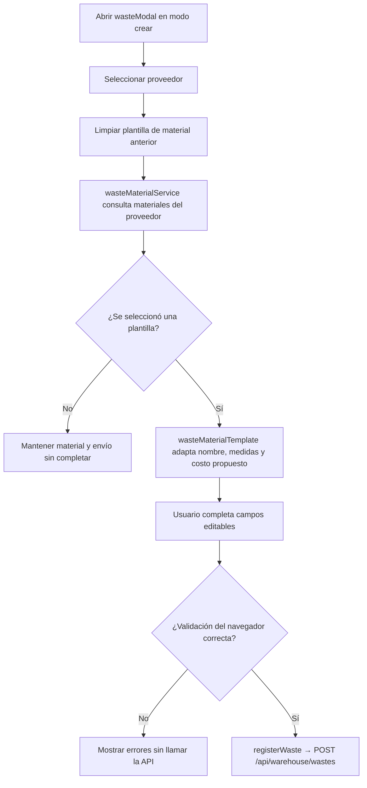

### Corrección de un detalle de entrada

**Identificador:** `DIA-FE-SEQ-003`. **Caso:** `CU-ENT-04`. La vista se concentra en el
modal secundario y en el evento que sincroniza el documento principal después de una
respuesta exitosa.

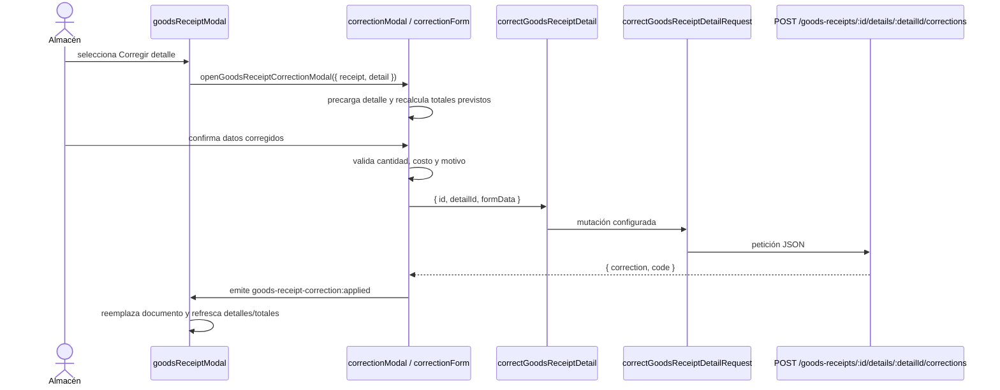

### Devolución de un detalle de material surtido

**Identificador:** `DIA-FE-SEQ-004`. **Caso:** `CU-SAL-06`. La secuencia concreta la
configuración del componente compartido para una salida de materiales; no usa nombres
alternativos que también pretendan representar la devolución de merma.

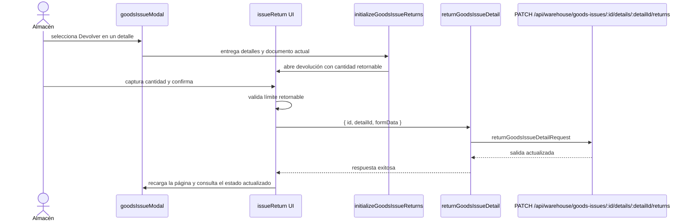

### Devolución de un detalle de merma surtida

**Identificador:** `DIA-FE-SEQ-006`. **Caso:** `CU-SAL-12`. Esta vista muestra la
configuración y el endpoint propios de `WasteIssue`, aunque la UI base sea reutilizada.

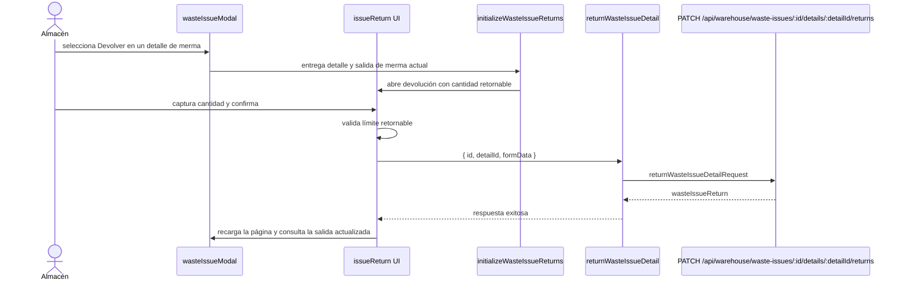

### Recorridos técnicos con contexto de código para todos los casos

Las vistas siguientes complementan los diagramas de casos aplicados al código y las
vistas dinámicas anteriores. Cada caso conserva una secuencia con los módulos concretos
del navegador y sólo referencia los patrones que aplica. Los `flowchart` se mantienen
únicamente en actividades con decisiones; los modos que cambian el recorrido incluyen
además una vista de estados. Los flujos con coordinación compleja conservan su secuencia
o actividad detallada en esta misma sección.

#### `CU-AUT-01`

**Identificador:** `DIA-FE-TEC-CU-AUT-01`. **Patrones:** `FE-P01`, `FE-P09`.

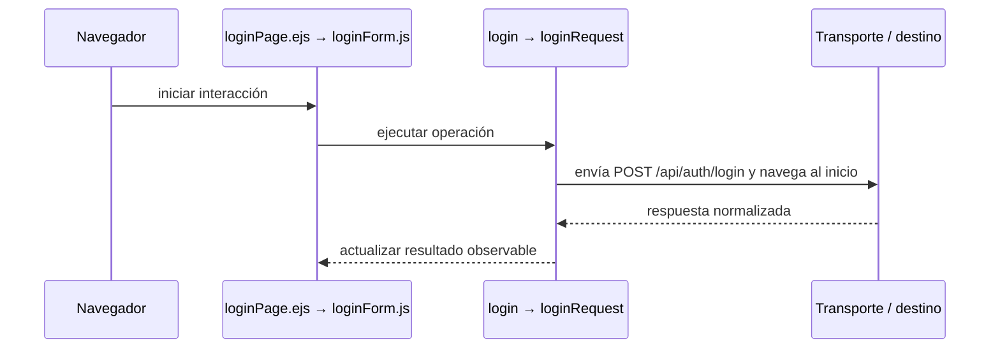

#### `CU-AUT-02`

**Identificador:** `DIA-FE-TEC-CU-AUT-02`. **Patrones:** `FE-P09`.

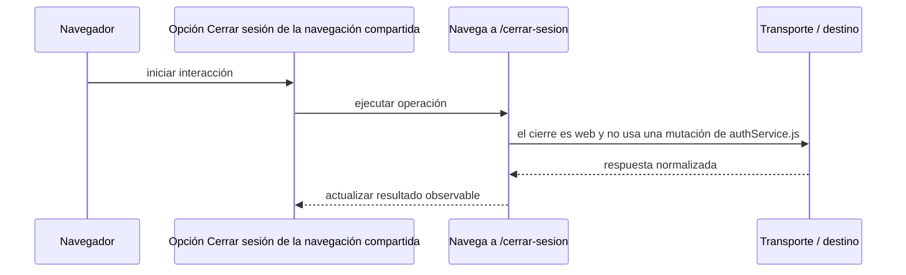

#### `CU-IDA-01`

**Identificador:** `DIA-FE-TEC-CU-IDA-01`. **Patrones:** `FE-P02`.

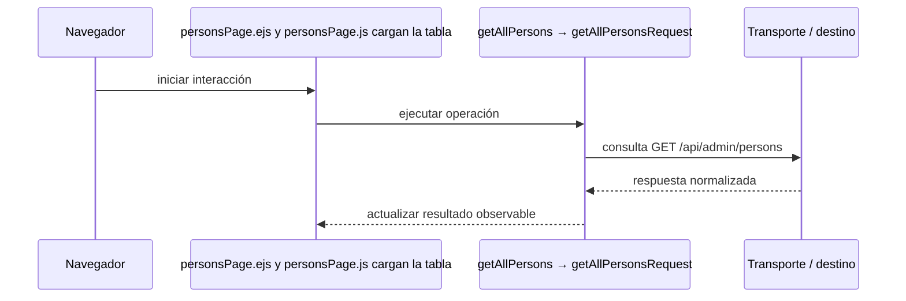

#### `CU-IDA-02`

**Identificador:** `DIA-FE-TEC-CU-IDA-02`. **Patrones:** `FE-P02`.

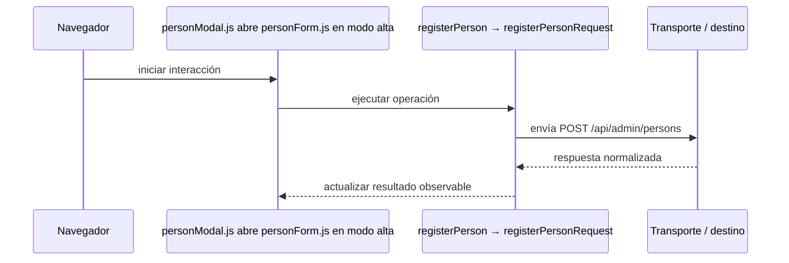

#### `CU-IDA-03`

**Identificador:** `DIA-FE-TEC-CU-IDA-03`. **Patrones:** `FE-P02`.

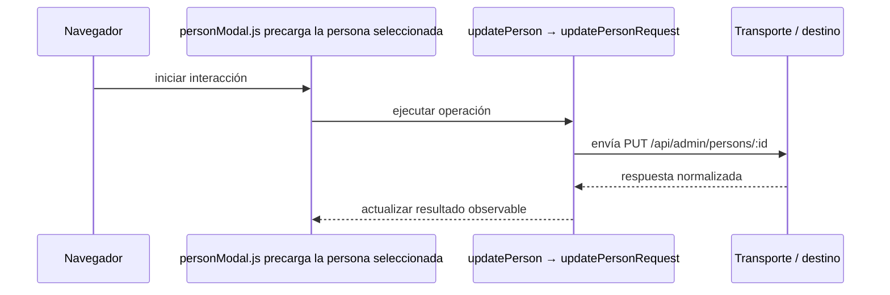

#### `CU-IDA-04`

**Identificador:** `DIA-FE-TEC-CU-IDA-04`. **Patrones:** `FE-P02`.

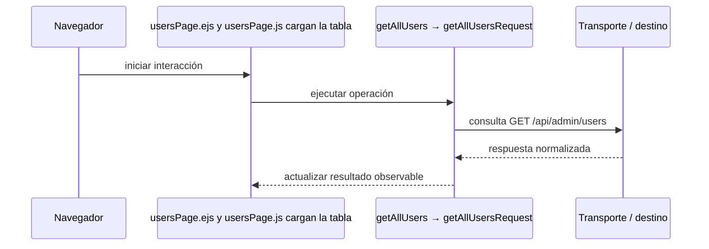

#### `CU-IDA-05`

**Identificador:** `DIA-FE-TEC-CU-IDA-05`. **Patrones:** `FE-P02`.

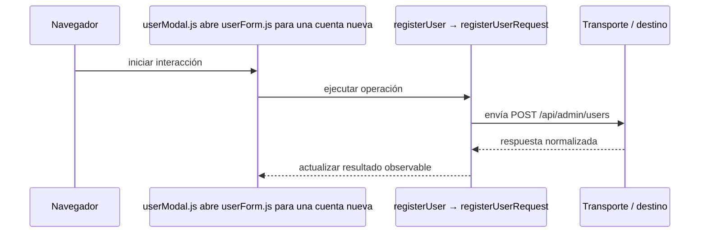

#### `CU-IDA-06`

**Identificador:** `DIA-FE-TEC-CU-IDA-06`. **Patrones:** `FE-P02`.

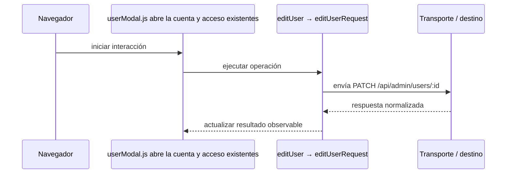

#### `CU-IDA-07`

**Identificador:** `DIA-FE-TEC-CU-IDA-07`. **Patrones:** `FE-P02`.

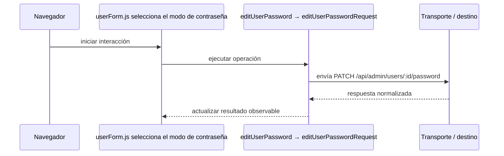

**Estado técnico complementario:** `DIA-FE-TEC-EST-CU-IDA-07`. Expone los modos
que gobiernan los campos y la mutación del formulario de usuario.

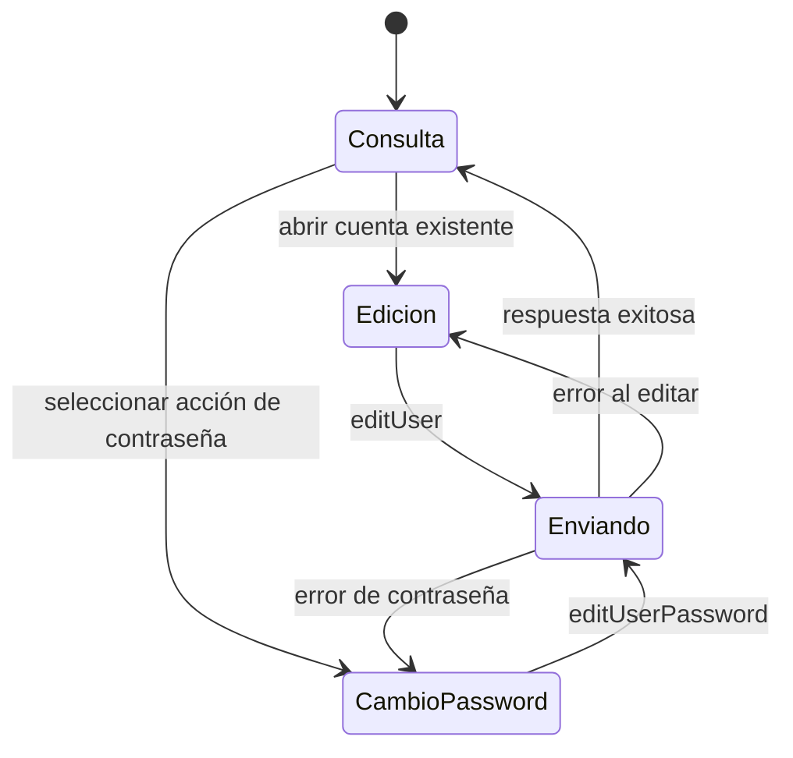

#### `CU-IDA-08`

**Identificador:** `DIA-FE-TEC-CU-IDA-08`. **Patrones:** `FE-P03`.

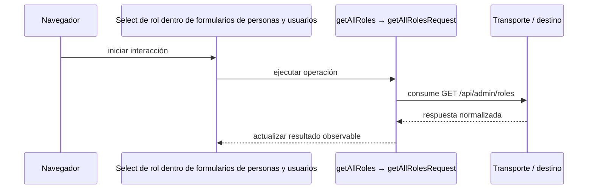

#### `CU-IDA-09`

**Identificador:** `DIA-FE-TEC-CU-IDA-09`. **Patrones:** `FE-P03`.

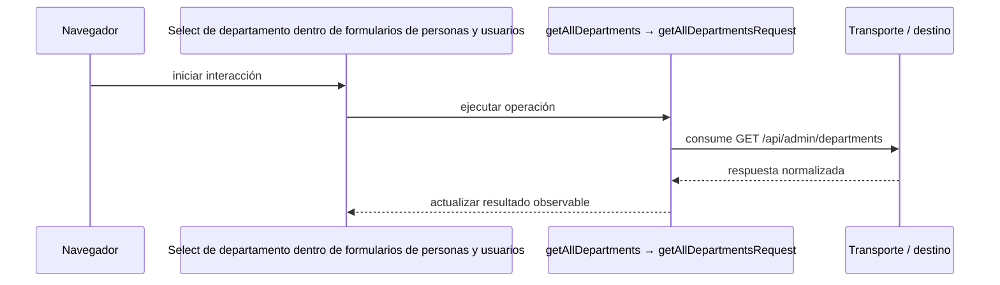

#### `CU-CAT-01`

**Identificador:** `DIA-FE-TEC-CU-CAT-01`. **Patrones:** `FE-P02`.

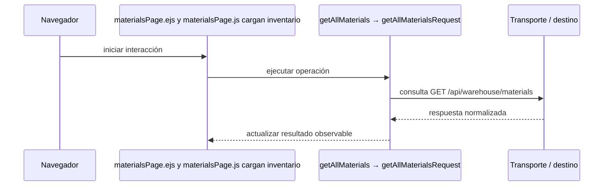

#### `CU-CAT-02`

**Identificador:** `DIA-FE-TEC-CU-CAT-02`. **Patrones:** `FE-P02`.

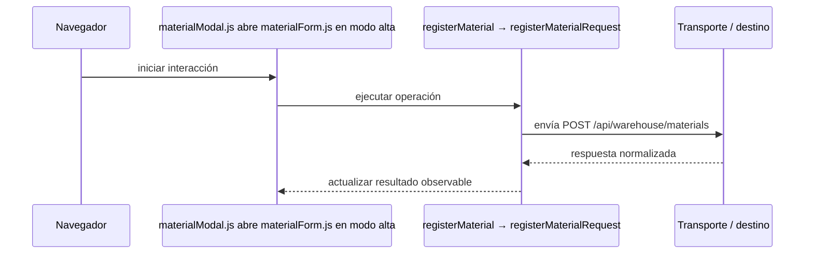

#### `CU-CAT-03`

**Identificador:** `DIA-FE-TEC-CU-CAT-03`. **Patrones:** `FE-P02`.

```mermaid
sequenceDiagram
    participant Browser as Navegador
    participant View as materialModal.js precarga material y relación con proveedor
    participant Application as editMaterial → editMaterialRequest
    participant Transport as Transporte / destino

    Browser->>View: iniciar interacción
    View->>Application: ejecutar operación
    Application->>Transport: envía PATCH /api/warehouse/materials/:id
    Transport-->>Application: respuesta normalizada
    Application-->>View: actualizar resultado observable
```

#### `CU-CAT-04`

**Identificador:** `DIA-FE-TEC-CU-CAT-04`. **Patrones:** `FE-P02`.

```mermaid
sequenceDiagram
    participant Browser as Navegador
    participant View as Acción de retiro en materialDatatable.js
    participant Application as deleteMaterial → deleteMaterialRequest
    participant Transport as Transporte / destino

    Browser->>View: iniciar interacción
    View->>Application: ejecutar operación
    Application->>Transport: envía DELETE /api/warehouse/materials/:id
    Transport-->>Application: respuesta normalizada
    Application-->>View: actualizar resultado observable
```

#### `CU-CAT-05`

**Identificador:** `DIA-FE-TEC-CU-CAT-05`. **Patrones:** `FE-P02`.

```mermaid
sequenceDiagram
    participant Browser as Navegador
    participant View as materialForm.js usa el modo de ajuste de existencia
    participant Application as editMaterialStock → editMaterialStockRequest
    participant Transport as Transporte / destino

    Browser->>View: iniciar interacción
    View->>Application: ejecutar operación
    Application->>Transport: envía PATCH /api/warehouse/materials/:id/stock
    Transport-->>Application: respuesta normalizada
    Application-->>View: actualizar resultado observable
```

**Estado técnico complementario:** `DIA-FE-TEC-EST-CU-CAT-05`. Representa el ciclo
del modo de ajuste sin atribuir al navegador la validación definitiva del stock.

```mermaid
stateDiagram-v2
    [*] --> Consulta
    Consulta --> Ajuste: abrir material en modo stock
    Ajuste --> Invalido: validación visual fallida
    Invalido --> Ajuste: corregir formulario
    Ajuste --> Enviando: confirmar ajuste
    Enviando --> Consulta: PATCH exitoso y onSave
    Enviando --> Ajuste: error normalizado
```

#### `CU-CAT-06`

**Identificador:** `DIA-FE-TEC-CU-CAT-06`. **Patrones:** `FE-P02`.

```mermaid
sequenceDiagram
    participant Browser as Navegador
    participant View as suppliersPage.ejs y suppliersPage.js cargan proveedores
    participant Application as getAllSuppliers → getAllSuppliersRequest
    participant Transport as Transporte / destino

    Browser->>View: iniciar interacción
    View->>Application: ejecutar operación
    Application->>Transport: consulta GET /api/warehouse/suppliers
    Transport-->>Application: respuesta normalizada
    Application-->>View: actualizar resultado observable
```

#### `CU-CAT-07`

**Identificador:** `DIA-FE-TEC-CU-CAT-07`. **Patrones:** `FE-P02`.

```mermaid
sequenceDiagram
    participant Browser as Navegador
    participant View as supplierModal.js abre supplierForm.js en alta
    participant Application as registerSupplier → registerSupplierRequest
    participant Transport as Transporte / destino

    Browser->>View: iniciar interacción
    View->>Application: ejecutar operación
    Application->>Transport: envía POST /api/warehouse/suppliers
    Transport-->>Application: respuesta normalizada
    Application-->>View: actualizar resultado observable
```

#### `CU-CAT-08`

**Identificador:** `DIA-FE-TEC-CU-CAT-08`. **Patrones:** `FE-P02`.

```mermaid
sequenceDiagram
    participant Browser as Navegador
    participant View as supplierModal.js precarga el proveedor
    participant Application as editSupplier → editSupplierRequest
    participant Transport as Transporte / destino

    Browser->>View: iniciar interacción
    View->>Application: ejecutar operación
    Application->>Transport: envía PUT /api/warehouse/suppliers/:id
    Transport-->>Application: respuesta normalizada
    Application-->>View: actualizar resultado observable
```

#### `CU-CAT-09`

**Identificador:** `DIA-FE-TEC-CU-CAT-09`. **Patrones:** `FE-P02`.

```mermaid
sequenceDiagram
    participant Browser as Navegador
    participant View as El estado se edita en supplierForm.js, no hay pantalla separada
    participant Application as editSupplier conserva el contexto y usa PUT /api/warehouse/suppliers/:id
    participant Transport as Transporte / destino

    Browser->>View: iniciar interacción
    View->>Application: ejecutar operación
    Application->>Transport: Resultado observable
    Transport-->>Application: respuesta normalizada
    Application-->>View: actualizar resultado observable
```

#### `CU-CAT-10`

**Identificador:** `DIA-FE-TEC-CU-CAT-10`. **Patrones:** `FE-P02`.

```mermaid
sequenceDiagram
    participant Browser as Navegador
    participant View as clientsPage.ejs y clientsPage.js cargan clientes
    participant Application as getAllClients → getAllClientsRequest
    participant Transport as Transporte / destino

    Browser->>View: iniciar interacción
    View->>Application: ejecutar operación
    Application->>Transport: consulta GET /api/sales/clients
    Transport-->>Application: respuesta normalizada
    Application-->>View: actualizar resultado observable
```

#### `CU-CAT-11`

**Identificador:** `DIA-FE-TEC-CU-CAT-11`. **Patrones:** `FE-P02`.

```mermaid
sequenceDiagram
    participant Browser as Navegador
    participant View as clientModal.js abre clientForm.js en alta
    participant Application as registerClient → createClientRequest
    participant Transport as Transporte / destino

    Browser->>View: iniciar interacción
    View->>Application: ejecutar operación
    Application->>Transport: envía POST /api/sales/clients
    Transport-->>Application: respuesta normalizada
    Application-->>View: actualizar resultado observable
```

#### `CU-CAT-12`

**Identificador:** `DIA-FE-TEC-CU-CAT-12`. **Patrones:** `FE-P02`.

```mermaid
sequenceDiagram
    participant Browser as Navegador
    participant View as clientModal.js precarga el cliente
    participant Application as editClient → editClientRequest
    participant Transport as Transporte / destino

    Browser->>View: iniciar interacción
    View->>Application: ejecutar operación
    Application->>Transport: envía PUT /api/sales/clients/:id
    Transport-->>Application: respuesta normalizada
    Application-->>View: actualizar resultado observable
```

#### `CU-CAT-13`

**Identificador:** `DIA-FE-TEC-CU-CAT-13`. **Patrones:** `FE-P02`.

```mermaid
sequenceDiagram
    participant Browser as Navegador
    participant View as wastesPage.ejs y wastesPage.js cargan mermas
    participant Application as getAllWastes → getAllWastesRequest
    participant Transport as Transporte / destino

    Browser->>View: iniciar interacción
    View->>Application: ejecutar operación
    Application->>Transport: consulta GET /api/warehouse/wastes
    Transport-->>Application: respuesta normalizada
    Application-->>View: actualizar resultado observable
```

#### `CU-CAT-14`

**Identificador:** `DIA-FE-TEC-CU-CAT-14`. **Patrones:** `FE-P02`.

```mermaid
sequenceDiagram
    participant Browser as Navegador
    participant View as wasteModal.js y wasteForm.js seleccionan una plantilla de material
    participant Application as getWasteMaterialTemplates prepara datos y registerWaste envía POST /api/warehouse/wastes
    participant Transport as Transporte / destino

    Browser->>View: iniciar interacción
    View->>Application: ejecutar operación
    Application->>Transport: Resultado observable
    Transport-->>Application: respuesta normalizada
    Application-->>View: actualizar resultado observable
```

#### `CU-CAT-15`

**Identificador:** `DIA-FE-TEC-CU-CAT-15`. **Patrones:** `FE-P02`.

```mermaid
sequenceDiagram
    participant Browser as Navegador
    participant View as wasteModal.js precarga la merma
    participant Application as editWaste → editWasteRequest
    participant Transport as Transporte / destino

    Browser->>View: iniciar interacción
    View->>Application: ejecutar operación
    Application->>Transport: envía PATCH /api/warehouse/wastes/:id
    Transport-->>Application: respuesta normalizada
    Application-->>View: actualizar resultado observable
```

#### `CU-CAT-16`

**Identificador:** `DIA-FE-TEC-CU-CAT-16`. **Patrones:** `FE-P02`.

```mermaid
sequenceDiagram
    participant Browser as Navegador
    participant View as wasteForm.js usa el modo de ajuste
    participant Application as editWasteStock → editWasteStockRequest
    participant Transport as Transporte / destino

    Browser->>View: iniciar interacción
    View->>Application: ejecutar operación
    Application->>Transport: envía PATCH /api/warehouse/wastes/:id/stock
    Transport-->>Application: respuesta normalizada
    Application-->>View: actualizar resultado observable
```

#### `CU-CAT-17`

**Identificador:** `DIA-FE-TEC-CU-CAT-17`. **Patrones:** `FE-P03`.

```mermaid
sequenceDiagram
    participant Browser as Navegador
    participant View as Select de presentación en materialFields.js y wasteFields.js
    participant Application as getAllPresentations → getAllPresentationsRequest
    participant Transport as Transporte / destino

    Browser->>View: iniciar interacción
    View->>Application: ejecutar operación
    Application->>Transport: consume GET /api/warehouse/presentations
    Transport-->>Application: respuesta normalizada
    Application-->>View: actualizar resultado observable
```

#### `CU-CAT-18`

**Identificador:** `DIA-FE-TEC-CU-CAT-18`. **Patrones:** `FE-P03`.

```mermaid
sequenceDiagram
    participant Browser as Navegador
    participant View as Select de unidad en formularios de material y merma
    participant Application as getAllUnitMeasures → getAllUnitMeasuresRequest
    participant Transport as Transporte / destino

    Browser->>View: iniciar interacción
    View->>Application: ejecutar operación
    Application->>Transport: consume GET /api/warehouse/unit-measures
    Transport-->>Application: respuesta normalizada
    Application-->>View: actualizar resultado observable
```

#### `CU-CAT-19`

**Identificador:** `DIA-FE-TEC-CU-CAT-19`. **Patrones:** `FE-P03`.

```mermaid
sequenceDiagram
    participant Browser as Navegador
    participant View as Select de motivo en los modos de ajuste
    participant Application as getAllReasons → getAllReasonsRequest
    participant Transport as Transporte / destino

    Browser->>View: iniciar interacción
    View->>Application: ejecutar operación
    Application->>Transport: consume GET /api/warehouse/reasons
    Transport-->>Application: respuesta normalizada
    Application-->>View: actualizar resultado observable
```

#### `CU-CAT-20`

**Identificador:** `DIA-FE-TEC-CU-CAT-20`. **Patrones:** `FE-P03`.

```mermaid
sequenceDiagram
    participant Browser as Navegador
    participant View as Estado visible en tablas y formularios de salidas
    participant Application as getAllFulfillmentStatuses → request homólogo
    participant Transport as Transporte / destino

    Browser->>View: iniciar interacción
    View->>Application: ejecutar operación
    Application->>Transport: consume GET /api/warehouse/fulfillment-statuses
    Transport-->>Application: respuesta normalizada
    Application-->>View: actualizar resultado observable
```

#### `CU-ENT-01`

**Identificador:** `DIA-FE-TEC-CU-ENT-01`. **Patrones:** `FE-P02`, `FE-P04`.

```mermaid
sequenceDiagram
    participant Browser as Navegador
    participant View as goodsReceiptsPage.ejs y su DataTable cargan compras
    participant Application as getAllGoodsReceipts → request homólogo
    participant Transport as Transporte / destino

    Browser->>View: iniciar interacción
    View->>Application: ejecutar operación
    Application->>Transport: consulta GET /api/warehouse/goods-receipts
    Transport-->>Application: respuesta normalizada
    Application-->>View: actualizar resultado observable
```

#### `CU-ENT-02`

**Identificador:** `DIA-FE-TEC-CU-ENT-02`. **Patrones:** `FE-P02`, `FE-P04`.

```mermaid
sequenceDiagram
    participant Browser as Navegador
    participant View as goodsReceiptModal.js captura encabezado y detalles
    participant Application as registerGoodsReceipt → registerGoodsReceiptRequest
    participant Transport as Transporte / destino

    Browser->>View: iniciar interacción
    View->>Application: ejecutar operación
    Application->>Transport: envía POST /api/warehouse/goods-receipts
    Transport-->>Application: respuesta normalizada
    Application-->>View: actualizar resultado observable
```

#### `CU-ENT-03`

**Identificador:** `DIA-FE-TEC-CU-ENT-03`. **Patrones:** `FE-P02`, `FE-P04`.

```mermaid
sequenceDiagram
    participant Browser as Navegador
    participant View as goodsReceiptModal.js abre una compra existente
    participant Application as editGoodsReceiptHeader → request homólogo
    participant Transport as Transporte / destino

    Browser->>View: iniciar interacción
    View->>Application: ejecutar operación
    Application->>Transport: envía PATCH /api/warehouse/goods-receipts/:id
    Transport-->>Application: respuesta normalizada
    Application-->>View: actualizar resultado observable
```

#### `CU-ENT-04`

**Identificador:** `DIA-FE-TEC-CU-ENT-04`. **Patrones:** `FE-P02`, `FE-P04`.

```mermaid
sequenceDiagram
    participant Browser as Navegador
    participant View as correctionModal.js y correctionForm.js aíslan la corrección
    participant Application as correctGoodsReceiptDetail → request homólogo
    participant Transport as Transporte / destino

    Browser->>View: iniciar interacción
    View->>Application: ejecutar operación
    Application->>Transport: envía PATCH /api/warehouse/goods-receipts/:id/details/:detailId/corrections
    Transport-->>Application: respuesta normalizada
    Application-->>View: actualizar resultado observable
```

#### `CU-ENT-05`

**Identificador:** `DIA-FE-TEC-CU-ENT-05`. **Patrones:** `FE-P02`, `FE-P04`.

```mermaid
sequenceDiagram
    participant Browser as Navegador
    participant View as Acción Cancelar del detalle en el modal de compra
    participant Application as cancelGoodsReceiptDetail → request homólogo
    participant Transport as Transporte / destino

    Browser->>View: iniciar interacción
    View->>Application: ejecutar operación
    Application->>Transport: envía PATCH /api/warehouse/goods-receipts/:id/details/:detailId/cancel
    Transport-->>Application: respuesta normalizada
    Application-->>View: actualizar resultado observable
```

#### `CU-SAL-01`

**Identificador:** `DIA-FE-TEC-CU-SAL-01`. **Patrones:** `FE-P05`.

```mermaid
sequenceDiagram
    participant Browser as Navegador
    participant View as goodsIssuesPage.ejs y su DataTable cargan salidas
    participant Application as getAllGoodsIssues → request homólogo
    participant Transport as Transporte / destino

    Browser->>View: iniciar interacción
    View->>Application: ejecutar operación
    Application->>Transport: consulta GET /api/warehouse/goods-issues
    Transport-->>Application: respuesta normalizada
    Application-->>View: actualizar resultado observable
```

#### `CU-SAL-02`

**Identificador:** `DIA-FE-TEC-CU-SAL-02`. **Patrones:** `FE-P05`.

```mermaid
sequenceDiagram
    participant Browser as Navegador
    participant View as goodsIssueModal.js captura documento y materiales
    participant Application as registerGoodsIssue → request homólogo
    participant Transport as Transporte / destino

    Browser->>View: iniciar interacción
    View->>Application: ejecutar operación
    Application->>Transport: envía POST /api/warehouse/goods-issues
    Transport-->>Application: respuesta normalizada
    Application-->>View: actualizar resultado observable
```

#### `CU-SAL-03`

**Identificador:** `DIA-FE-TEC-CU-SAL-03`. **Patrones:** `FE-P05`.

```mermaid
sequenceDiagram
    participant Browser as Navegador
    participant View as Modo encabezado de goodsIssueModal.js
    participant Application as editGoodsIssueHeader → request homólogo
    participant Transport as Transporte / destino

    Browser->>View: iniciar interacción
    View->>Application: ejecutar operación
    Application->>Transport: envía PATCH /api/warehouse/goods-issues/:id/header
    Transport-->>Application: respuesta normalizada
    Application-->>View: actualizar resultado observable
```

#### `CU-SAL-04`

**Identificador:** `DIA-FE-TEC-CU-SAL-04`. **Patrones:** `FE-P05`.

```mermaid
sequenceDiagram
    participant Browser as Navegador
    participant View as Modo detalles de goodsIssueModal.js
    participant Application as editGoodsIssueDetails → request homólogo
    participant Transport as Transporte / destino

    Browser->>View: iniciar interacción
    View->>Application: ejecutar operación
    Application->>Transport: envía PATCH /api/warehouse/goods-issues/:id/details
    Transport-->>Application: respuesta normalizada
    Application-->>View: actualizar resultado observable
```

#### `CU-SAL-05`

**Identificador:** `DIA-FE-TEC-CU-SAL-05`. **Patrones:** `FE-P05`.

```mermaid
sequenceDiagram
    participant Browser as Navegador
    participant View as Acción Surtir dentro de los detalles de salida
    participant Application as editGoodsIssueDetails envía cantidades a PATCH /api/warehouse/goods-issues/:id/details y refresca el documento
    participant Transport as Transporte / destino

    Browser->>View: iniciar interacción
    View->>Application: ejecutar operación
    Application->>Transport: Resultado observable
    Transport-->>Application: respuesta normalizada
    Application-->>View: actualizar resultado observable
```

#### `CU-SAL-06`

**Identificador:** `DIA-FE-TEC-CU-SAL-06`. **Patrones:** `FE-P05`, `FE-P06`.

```mermaid
sequenceDiagram
    participant Browser as Navegador
    participant View as returns/goodsIssueReturn.js configura issueReturnUI
    participant Application as returnGoodsIssueDetail → request homólogo
    participant Transport as Transporte / destino

    Browser->>View: iniciar interacción
    View->>Application: ejecutar operación
    Application->>Transport: envía PATCH /api/warehouse/goods-issues/:id/details/:detailId/returns
    Transport-->>Application: respuesta normalizada
    Application-->>View: actualizar resultado observable
```

#### `CU-SAL-07`

**Identificador:** `DIA-FE-TEC-CU-SAL-07`. **Patrones:** `FE-P05`.

```mermaid
sequenceDiagram
    participant Browser as Navegador
    participant View as wasteIssuesPage.ejs y su DataTable cargan salidas de merma
    participant Application as getAllWasteIssues → request homólogo
    participant Transport as Transporte / destino

    Browser->>View: iniciar interacción
    View->>Application: ejecutar operación
    Application->>Transport: consulta GET /api/warehouse/waste-issues
    Transport-->>Application: respuesta normalizada
    Application-->>View: actualizar resultado observable
```

#### `CU-SAL-08`

**Identificador:** `DIA-FE-TEC-CU-SAL-08`. **Patrones:** `FE-P05`.

```mermaid
sequenceDiagram
    participant Browser as Navegador
    participant View as wasteIssueModal.js captura documento y mermas
    participant Application as registerWasteIssue → request homólogo
    participant Transport as Transporte / destino

    Browser->>View: iniciar interacción
    View->>Application: ejecutar operación
    Application->>Transport: envía POST /api/warehouse/waste-issues
    Transport-->>Application: respuesta normalizada
    Application-->>View: actualizar resultado observable
```

#### `CU-SAL-09`

**Identificador:** `DIA-FE-TEC-CU-SAL-09`. **Patrones:** `FE-P05`.

```mermaid
sequenceDiagram
    participant Browser as Navegador
    participant View as Modo encabezado de wasteIssueModal.js
    participant Application as editWasteIssueHeader → request homólogo
    participant Transport as Transporte / destino

    Browser->>View: iniciar interacción
    View->>Application: ejecutar operación
    Application->>Transport: envía PATCH /api/warehouse/waste-issues/:id/header
    Transport-->>Application: respuesta normalizada
    Application-->>View: actualizar resultado observable
```

#### `CU-SAL-10`

**Identificador:** `DIA-FE-TEC-CU-SAL-10`. **Patrones:** `FE-P05`.

```mermaid
sequenceDiagram
    participant Browser as Navegador
    participant View as Modo detalles de wasteIssueModal.js
    participant Application as editWasteIssueDetails → request homólogo
    participant Transport as Transporte / destino

    Browser->>View: iniciar interacción
    View->>Application: ejecutar operación
    Application->>Transport: envía PATCH /api/warehouse/waste-issues/:id/details
    Transport-->>Application: respuesta normalizada
    Application-->>View: actualizar resultado observable
```

#### `CU-SAL-11`

**Identificador:** `DIA-FE-TEC-CU-SAL-11`. **Patrones:** `FE-P05`.

```mermaid
sequenceDiagram
    participant Browser as Navegador
    participant View as Acción Surtir dentro de los detalles de merma
    participant Application as editWasteIssueDetails envía cantidades a PATCH /api/warehouse/waste-issues/:id/details y refresca el documento
    participant Transport as Transporte / destino

    Browser->>View: iniciar interacción
    View->>Application: ejecutar operación
    Application->>Transport: Resultado observable
    Transport-->>Application: respuesta normalizada
    Application-->>View: actualizar resultado observable
```

#### `CU-SAL-12`

**Identificador:** `DIA-FE-TEC-CU-SAL-12`. **Patrones:** `FE-P05`, `FE-P06`.

```mermaid
sequenceDiagram
    participant Browser as Navegador
    participant View as returns/wasteIssueReturn.js configura issueReturnUI
    participant Application as returnWasteIssueDetail → request homólogo
    participant Transport as Transporte / destino

    Browser->>View: iniciar interacción
    View->>Application: ejecutar operación
    Application->>Transport: envía PATCH /api/warehouse/waste-issues/:id/details/:detailId/returns
    Transport-->>Application: respuesta normalizada
    Application-->>View: actualizar resultado observable
```

#### `CU-REP-01`

**Identificador:** `DIA-FE-TEC-CU-REP-01`. **Patrones:** `FE-P07`.

```mermaid
sequenceDiagram
    participant Browser as Navegador
    participant View as La consulta es el listado de materialsPage.js, no hay página de reporte
    participant Application as Reutiliza getAllMaterialsRequest y sus filtros, sin mutación
    participant Transport as Transporte / destino

    Browser->>View: iniciar interacción
    View->>Application: ejecutar operación
    Application->>Transport: Resultado observable
    Transport-->>Application: respuesta normalizada
    Application-->>View: actualizar resultado observable
```

#### `CU-REP-02`

**Identificador:** `DIA-FE-TEC-CU-REP-02`. **Patrones:** `FE-P07`.

```mermaid
sequenceDiagram
    participant Browser as Navegador
    participant View as movementsPage.js selecciona el contexto material
    participant Application as getAllMovements({ context: 'materials' }) consulta /api/admin/movements/materials
    participant Transport as Transporte / destino

    Browser->>View: iniciar interacción
    View->>Application: ejecutar operación
    Application->>Transport: Resultado observable
    Transport-->>Application: respuesta normalizada
    Application-->>View: actualizar resultado observable
```

#### `CU-REP-03`

**Identificador:** `DIA-FE-TEC-CU-REP-03`. **Patrones:** `FE-P08`.

```mermaid
sequenceDiagram
    participant Browser as Navegador
    participant View as Botón Excel de materialDatatable.js
    participant Application as exportWarehouseReport → exportWarehouseReportRequest
    participant Transport as Transporte / destino

    Browser->>View: iniciar interacción
    View->>Application: ejecutar operación
    Application->>Transport: descarga /api/warehouse/reports/inventory/excel
    Transport-->>Application: respuesta normalizada
    Application-->>View: actualizar resultado observable
```

#### `CU-REP-04`

**Identificador:** `DIA-FE-TEC-CU-REP-04`. **Patrones:** `FE-P08`.

```mermaid
sequenceDiagram
    participant Browser as Navegador
    participant View as Botón Excel del listado de salidas de material
    participant Application as exportGoodsIssueReport → request homólogo
    participant Transport as Transporte / destino

    Browser->>View: iniciar interacción
    View->>Application: ejecutar operación
    Application->>Transport: descarga /api/warehouse/reports/goods-issues/excel
    Transport-->>Application: respuesta normalizada
    Application-->>View: actualizar resultado observable
```

#### `CU-REP-05`

**Identificador:** `DIA-FE-TEC-CU-REP-05`. **Patrones:** `FE-P08`.

```mermaid
sequenceDiagram
    participant Browser as Navegador
    participant View as Botón Excel de movimientos en contexto material
    participant Application as exportMovementReport → request con materials
    participant Transport as Transporte / destino

    Browser->>View: iniciar interacción
    View->>Application: ejecutar operación
    Application->>Transport: descarga /api/admin/reports/movements/materials/excel
    Transport-->>Application: respuesta normalizada
    Application-->>View: actualizar resultado observable
```

#### `CU-REP-06`

**Identificador:** `DIA-FE-TEC-CU-REP-06`. **Patrones:** `FE-P07`.

```mermaid
sequenceDiagram
    participant Browser as Navegador
    participant View as La consulta es el listado de wastesPage.js, no hay página de reporte
    participant Application as Reutiliza getAllWastesRequest y sus filtros, sin mutación
    participant Transport as Transporte / destino

    Browser->>View: iniciar interacción
    View->>Application: ejecutar operación
    Application->>Transport: Resultado observable
    Transport-->>Application: respuesta normalizada
    Application-->>View: actualizar resultado observable
```

#### `CU-REP-07`

**Identificador:** `DIA-FE-TEC-CU-REP-07`. **Patrones:** `FE-P07`.

```mermaid
sequenceDiagram
    participant Browser as Navegador
    participant View as movementsPage.js selecciona el contexto merma
    participant Application as getAllMovements({ context: 'wastes' }) consulta /api/admin/movements/wastes
    participant Transport as Transporte / destino

    Browser->>View: iniciar interacción
    View->>Application: ejecutar operación
    Application->>Transport: Resultado observable
    Transport-->>Application: respuesta normalizada
    Application-->>View: actualizar resultado observable
```

#### `CU-REP-08`

**Identificador:** `DIA-FE-TEC-CU-REP-08`. **Patrones:** `FE-P08`.

```mermaid
sequenceDiagram
    participant Browser as Navegador
    participant View as Botón Excel del listado de salidas de merma
    participant Application as exportWasteIssueReport → request homólogo
    participant Transport as Transporte / destino

    Browser->>View: iniciar interacción
    View->>Application: ejecutar operación
    Application->>Transport: descarga /api/warehouse/reports/waste-issues/excel
    Transport-->>Application: respuesta normalizada
    Application-->>View: actualizar resultado observable
```

#### `CU-REP-09`

**Identificador:** `DIA-FE-TEC-CU-REP-09`. **Patrones:** `FE-P08`.

```mermaid
sequenceDiagram
    participant Browser as Navegador
    participant View as Botón Excel de wasteDatatable.js
    participant Application as exportWasteReport → request homólogo
    participant Transport as Transporte / destino

    Browser->>View: iniciar interacción
    View->>Application: ejecutar operación
    Application->>Transport: descarga /api/warehouse/reports/wastes/excel
    Transport-->>Application: respuesta normalizada
    Application-->>View: actualizar resultado observable
```

#### `CU-REP-10`

**Identificador:** `DIA-FE-TEC-CU-REP-10`. **Patrones:** `FE-P08`.

```mermaid
sequenceDiagram
    participant Browser as Navegador
    participant View as Botón Excel de movimientos en contexto merma
    participant Application as exportMovementReport → request con wastes
    participant Transport as Transporte / destino

    Browser->>View: iniciar interacción
    View->>Application: ejecutar operación
    Application->>Transport: descarga /api/admin/reports/movements/wastes/excel
    Transport-->>Application: respuesta normalizada
    Application-->>View: actualizar resultado observable
```

#### `CU-REP-11`

**Identificador:** `DIA-FE-TEC-CU-REP-11`. **Patrones:** `FE-P08`.

```mermaid
sequenceDiagram
    participant Browser as Navegador
    participant View as Botón Excel de goodsReceiptDatatable.js
    participant Application as exportGoodsReceiptReport → request homólogo
    participant Transport as Transporte / destino

    Browser->>View: iniciar interacción
    View->>Application: ejecutar operación
    Application->>Transport: descarga /api/warehouse/reports/goods-receipts/excel
    Transport-->>Application: respuesta normalizada
    Application-->>View: actualizar resultado observable
```

#### `CU-REP-12`

**Identificador:** `DIA-FE-TEC-CU-REP-12`. **Patrones:** `FE-P08`.

```mermaid
sequenceDiagram
    participant Browser as Navegador
    participant View as Botón Excel de supplierDatatable.js
    participant Application as exportSupplierReport → request homólogo
    participant Transport as Transporte / destino

    Browser->>View: iniciar interacción
    View->>Application: ejecutar operación
    Application->>Transport: descarga /api/warehouse/reports/suppliers/excel
    Transport-->>Application: respuesta normalizada
    Application-->>View: actualizar resultado observable
```

#### `CU-REP-13`

**Identificador:** `DIA-FE-TEC-CU-REP-13`. **Patrones:** `FE-P08`.

```mermaid
sequenceDiagram
    participant Browser as Navegador
    participant View as Botón Excel de clientDatatable.js
    participant Application as exportClientReport → request homólogo
    participant Transport as Transporte / destino

    Browser->>View: iniciar interacción
    View->>Application: ejecutar operación
    Application->>Transport: descarga /api/sales/reports/clients/excel
    Transport-->>Application: respuesta normalizada
    Application-->>View: actualizar resultado observable
```

#### `CU-REP-14`

**Identificador:** `DIA-FE-TEC-CU-REP-14`. **Patrones:** `FE-P08`.

```mermaid
sequenceDiagram
    participant Browser as Navegador
    participant View as Botón Excel de personDatatable.js
    participant Application as exportPersonReport → request homólogo
    participant Transport as Transporte / destino

    Browser->>View: iniciar interacción
    View->>Application: ejecutar operación
    Application->>Transport: descarga /api/admin/reports/persons/excel
    Transport-->>Application: respuesta normalizada
    Application-->>View: actualizar resultado observable
```

#### `CU-REP-15`

**Identificador:** `DIA-FE-TEC-CU-REP-15`. **Patrones:** `FE-P08`.

```mermaid
sequenceDiagram
    participant Browser as Navegador
    participant View as Botón Excel de userDatatable.js
    participant Application as exportUserReport → request homólogo
    participant Transport as Transporte / destino

    Browser->>View: iniciar interacción
    View->>Application: ejecutar operación
    Application->>Transport: descarga /api/admin/reports/users/excel
    Transport-->>Application: respuesta normalizada
    Application-->>View: actualizar resultado observable
```

## Lista de revisión frontend

1. Confirmar que toda carpeta nueva de `services`, `application` o `pages` queda incluida
   en una ficha funcional o transversal del catálogo.
2. Confirmar que la vista EJS carga los scripts propietarios y conserva su última línea
   y llamadas `contentFor`.
3. Revisar imports, exports, selectores, eventos y consumidores del símbolo documentado.
4. Comprobar que `pages` compone, `application` coordina, `services` transporta y `ui`
   permanece independiente del recurso.
5. Enlazar el contrato API y no presentar la validación del navegador como control de
   seguridad.
6. Aplicar la matriz de diagramas y actualizar sólo la vista cuya semántica cambió.
7. Localizar las pruebas bajo `tests/unit/public` o registrar la brecha existente sin
   afirmar cobertura.
8. Ejecutar `npm run docs:check` y validar el paquete de arquitectura.
