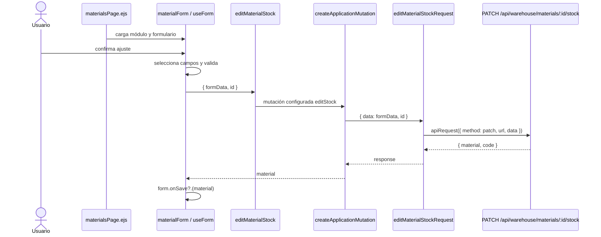

# Documentación técnica del frontend

## Propósito y alcance

Este documento aplica la [guía técnica común](technical-code-documentation.md) al código
que se ejecuta en el navegador y a su composición EJS: `src/public/js`,
`src/views/pages` y `src/views/shared`. El [documento de backend](backend-technical-documentation.md)
conserva rutas, controladores, servicios de dominio y persistencia. Una explicación de
frontend enlaza el [contrato API](../data/api-contract.md), pero no vuelve a declarar
permisos ni reglas de negocio que el servidor debe hacer cumplir.

## Capas documentales del navegador

La ubicación del módulo determina la responsabilidad que debe describirse. Antes de
crear una ficha se revisa una implementación equivalente en la misma fila.

| Ubicación | Responsabilidad documentada | Ejemplos existentes |
| --- | --- | --- |
| `public/js/services` | Método, URL, parámetros y cuerpo enviados mediante el cliente HTTP común. | `materialService.js`, `goodsIssueService.js`, `authService.js`. |
| `public/js/application` | Adaptación de respuestas y coordinación del caso de uso sin acceso directo al DOM. | `createCrudApplication.js`, `createIssueApplication.js`, `materials.js`. |
| `public/js/pages` | Composición e inicialización de una pantalla, formulario o modal propietario del recurso. | `materialsPage.js`, `materialForm.js`, `materialModal.js`. |
| `public/js/ui` | Comportamiento visual reutilizable que recibe el contexto por parámetros. | `formUI.js`, `modalUI.js`, `inventorySelectUI.js`. |
| `public/js/plugins` | Adaptadores y configuración común de DataTable, Select2, MDB, Flatpickr o SweetAlert. | `createDataTable.js`, `baseSelect.js`, `baseInstance.js`. |
| `public/js/utils` | Transformaciones sin propiedad visual o de dominio específico. | `formUtils.js`, `formatUtils.js`, `detailCollectionUtils.js`. |
| `views/pages` | Estructura EJS y scripts de entrada pertenecientes a una página. | `materialsPage.ejs`, `goodsIssuesPage.ejs`. |
| `views/shared` | Marcado reutilizado por más de un recurso y configurado por sus consumidores. | Formularios, tablas y modales compartidos. |

## Fichas por tipo de módulo

### Servicio HTTP del navegador

Se registra nombre exportado, constante de ruta, método HTTP, parámetros, cuerpo y forma
de respuesta entregada por `apiRequest`. La ficha enlaza la ruta propietaria del
contrato API. No describe transacciones ni errores internos del servidor.

### Aplicación

Se registra la fábrica o flujo reutilizado, configuración inyectada, claves extraídas de
la respuesta y nombres de dominio que exporta el módulo. Si existe una excepción —por
ejemplo omitir un campo en un contexto— se explica la condición y por qué no pertenece a
la fábrica común.

### Página, formulario y modal

Se documentan por separado:

- **página:** módulos que inicializa y contexto global que entrega;
- **formulario:** campos seleccionados, validación del navegador, normalización, modo y
  mutación que invoca;
- **modal:** preparación visual, carga de datos y contrato que entrega al formulario;
- **EJS:** parciales incluidos, elementos usados como puntos de montaje y scripts
  `type="module"`, conservando los cierres `contentFor`.

Sólo se enumeran selectores DOM cuando forman parte de la integración entre módulos. Una
lista de cada elemento o listener repetiría el código sin explicar el diseño.

### UI, plugin y utilidad compartida

La ficha declara consumidores, parámetros de configuración, eventos emitidos o
escuchados, estado interno y dependencia externa encapsulada. También indica qué
conocimiento **no** puede incorporar: un módulo compartido no importa la aplicación de
un recurso concreto ni decide permisos del servidor.

## Catálogo completo de fichas frontend

La unidad de documentación es el **flujo funcional**, no un archivo aislado. Cada fila
cubre todos sus módulos propietarios de servicio, aplicación, página y EJS; los símbolos
compartidos aparecen después en una ficha transversal. De este modo no se presenta
materiales como si fuera el único flujo documentado ni se repite una ficha idéntica por
cada operación CRUD. Las rutas concretas se verifican en el [contrato API](../data/api-contract.md)
y las páginas publicadas en el [mapa generado](../generated/code-map.md#rutas-web-16).

### Fichas de flujos funcionales

| Flujo | Vista y composición | Aplicación y transporte | Contrato y comportamiento propio | Diagrama aplicable |
| --- | --- | --- | --- | --- |
| Inicio de sesión | `loginPage.ejs` y `loginForm.js` recopilan credenciales; `indexPage.js` prepara la portada autenticada. | `application/auth/login.js` coordina `services/authService.js`; sus exports `registerRequest` y `resetPasswordRequest` no tienen consumidor ni ruta vigente y se registran como brecha, no como funcionalidad publicada. | `POST /api/auth/login`; normaliza la respuesta de éxito y deja cookies, tokens y permisos efectivos al servidor. | **Secuencia**, porque cruza formulario, API y establecimiento de sesión; reutilizar el recorrido HTTP de `code-diagrams.md` para las capas servidoras. |
| Personas | `personsPage.ejs`, `personsPage.js`, `personModal.js` y `personForm.js` componen listado, alta y edición. | `application/admin/persons/persons.js` usa `services/admin/personService.js`; consulta departamentos mediante su catálogo. | `GET`, `POST` y `PUT /api/admin/persons`; adapta la persona devuelta y refresca el listado. | **Ciclo CRUD compartido**; no requiere secuencia propia mientras no cambie la coordinación. |
| Usuarios | `usersPage.ejs`, `usersPage.js`, `userModal.js` y `userForm.js` separan alta, edición y cambio de contraseña. | `application/admin/users/users.js` usa `userService.js` y consume los catálogos de roles y departamentos. | `GET`, `POST`, `PATCH /api/admin/users/:id` y `PATCH .../:id/password`; el modo decide campos y mutación. | **Actividad o secuencia específica** sólo para cambio de contraseña si se agregan pasos asíncronos; el CRUD usa la vista común. |
| Clientes | `clientsPage.ejs`, `clientModal.ejs`, `clientsPage.js`, `clientModal.js` y `clientForm.js`. | `application/sales/clients/clients.js` usa `services/sales/clientService.js`; `application/sales/report.js` usa el servicio de reporte. | CRUD de `/api/sales/clients` y exportación `/api/sales/reports/clients/excel`. | **Ciclo CRUD** para mantenimiento y **secuencia corta de descarga** sólo si se necesita explicar la exportación. |
| Proveedores | `suppliersPage.ejs`, `supplierModal.ejs`, `suppliersPage.js`, `supplierModal.js` y `supplierForm.js`. | `application/warehouse/suppliers/suppliers.js` usa `supplierService.js`; el reporte usa la fábrica común. | CRUD de `/api/warehouse/suppliers` y reporte de proveedores. | **Ciclo CRUD compartido**; sin diagrama exclusivo. |
| Materiales | `materialsPage.ejs`, `materialModal.ejs`, `materialsPage.js`, `materialModal.js`, `materialForm.js` y `materialFields.js`. | `application/warehouse/materials/materials.js` configura `createCrudApplication` sobre `materialService.js`. | CRUD de `/api/warehouse/materials`; `goodsReceipt` omite `maxUnitCost` al crear y el ajuste usa `PATCH /:id/stock`. | **Secuencia** para ajuste de existencias por su mutación adicional y **ciclo CRUD** para el resto. |
| Mermas | `wastesPage.ejs`, `wastesPage.js`, `wasteModal.js`, `wasteForm.js` y `wasteFields.js`. | `application/warehouse/wastes/wastes.js` configura la fábrica CRUD sobre `wasteService.js`. | CRUD de `/api/warehouse/wastes`, plantillas de material y ajuste `PATCH /:id/stock`. | **Secuencia** sólo para creación desde plantilla o ajuste si se documenta esa bifurcación; CRUD común para las demás operaciones. |
| Entradas de almacén | `goodsReceiptsPage.ejs`, `goodsReceiptsPage.js`, formulario, modal y detalles componen el documento; `correctionForm.js` y `correctionModal.js` aíslan corrección/cancelación. | `application/warehouse/goodsReceipts/goodsReceipts.js` usa `goodsReceiptService.js` y catálogos; el reporte usa `createReportApplication`. | Lista, alta, edición de encabezado, corrección y cancelación bajo `/api/warehouse/goods-receipts`. | **Secuencia** para alta y **actividad/secuencia** para corrección y cancelación, pues tienen decisiones y efectos de inventario distintos. |
| Salidas de materiales | `goodsIssuesPage.ejs`, página, modal y formulario coordinan encabezado y detalles; `returns/goodsIssueReturn.js` gestiona devoluciones. | `application/warehouse/goodsIssues/goodsIssues.js` adapta `createIssueApplication` sobre `goodsIssueService.js`. | Lista, alta, edición, encabezado, surtimiento y devolución bajo `/api/warehouse/goods-issues`. | **Secuencia** para surtimiento y devolución; **máquina de estados** se referencia desde requisitos, no se redibuja en frontend. |
| Salidas de mermas | `wasteIssuesPage.ejs`, página, modal, formulario y `returns/wasteIssueReturn.js`. | `application/warehouse/wasteIssues/wasteIssues.js` reutiliza `createIssueApplication` sobre `wasteIssueService.js`. | Mismas clases de operación bajo `/api/warehouse/waste-issues`, con selección y cantidades propias de merma. | **Secuencia** para surtimiento y devolución; compartir la vista de estados normativa. |
| Movimientos | `movementsPage.ejs` y `movementsPage.js` eligen inventario de materiales o mermas según contexto de la vista. | `application/admin/movements/movements.js` usa `movementService.js`; `application/admin/report.js` coordina exportaciones. | Lecturas `/api/admin/movements/{materials,wastes}` y reportes correspondientes. | **Flujo de datos/listado**; no secuencia propia mientras sólo consulte y descargue. |
| Catálogos | No poseen página: alimentan Select2 y formularios consumidores. | `catalogs/{departments,roles,fulfillmentStatuses,presentations,reasons,unitMeasures}.js` adaptan sus servicios homólogos. | Operaciones `GET` de sólo lectura; entregan colecciones normalizadas a personas, usuarios, materiales y documentos. | **Sin diagrama propio**; se muestran como participantes sólo en el flujo consumidor. |
| Reportes | Los botones pertenecen a las páginas de clientes, proveedores, almacén y movimientos. | `createReportApplication.js` centraliza descarga; `application/{admin,sales,warehouse}/report.js` configura cada `reportService.js`. | Solicitudes `GET .../reports/.../excel` y descarga del archivo; no decide filtros ni permisos del servidor. | **Secuencia corta** únicamente si interesa el intercambio navegador–descarga; no se replica por cada reporte. |

### Fichas de infraestructura compartida

| Pieza | Contrato documentado | Consumidores y límite | Diagrama aplicable |
| --- | --- | --- | --- |
| `createCrudApplication.js` | Configura lecturas y mutaciones, extrae claves de respuesta y permite mutaciones adicionales. | Personas, usuarios, clientes, proveedores, materiales y mermas; no conoce DOM ni reglas de dominio. | Diagrama canónico de **fábrica CRUD** en `code-diagrams.md`. |
| `createIssueApplication.js` e `issueHeaderRules.js` | Especializan el ciclo de documentos con encabezado, detalles y reglas de edición visibles. | Salidas de materiales y mermas; las transiciones definitivas siguen en backend. | **Actividad** para bifurcaciones del encabezado y **secuencia** para coordinación asíncrona. |
| `createReportApplication.js` | Convierte una petición configurada en descarga y nombre de archivo. | Reportes de admin, ventas y almacén. | Normalmente ninguno; secuencia sólo al investigar descarga o error. |
| `axiosInstanceApi.js` / `apiRequest` | Cliente HTTP común, tratamiento de sesión y propagación normalizada de errores. | Todos los servicios del navegador. | Participante único en secuencias; nunca un diagrama por llamada. |
| `ui/forms`, `ui/inventory`, `ui/issues` | Reciben elementos y callbacks; controlan interacción visual y emiten resultados al propietario. | Formularios CRUD, selectores de inventario y documentos de salida. | **Componentes** si cambia la reutilización; **secuencia** si coordina eventos asíncronos. |
| `plugins/datatable`, `plugins/select2`, `plugins/mdb`, `plugins/flatpickr`, `plugins/swal` | Encapsulan bibliotecas externas y su configuración común. | Páginas, modales, fechas, confirmaciones y catálogos. | Sin vista por adaptador; aparecen en el diagrama de componentes compartidos. |
| `utils` y `constants` | Transformaciones, validaciones auxiliares, formatos y valores sin estado visual. | Todas las capas del navegador que los importan. | Sin diagrama salvo que una transformación tenga decisiones de negocio, caso en que debe moverse o documentarse en su flujo propietario. |
| `views/shared` | Parciales configurables para formularios, tablas, modales y estructura común. | Vistas EJS propietarias. | Diagrama de **componentes/composición**, no secuencia por inclusión. |

## Matriz de decisión de diagramas frontend

La columna de cada ficha anterior es una decisión explícita, no una invitación a crear
todos los diagramas posibles. Se aplica esta matriz al cambiar el flujo:

| Caso observable | Vista que aplica | Vista que no aporta | Fuente que debe enlazarse |
| --- | --- | --- | --- |
| Alta, consulta, edición o baja sin coordinación adicional | Ciclo CRUD compartido. | Una secuencia repetida por recurso. | Contrato API y patrón de fábrica. |
| Formulario/modal con llamadas encadenadas o evento posterior | Secuencia. | Entidad-relación. | Módulos de página, aplicación y servicio HTTP. |
| Validación visual con alternativas que cambian el recorrido | Actividad. | Máquina de estados si no existen estados persistentes. | Reglas de formulario y caso de uso. |
| Documento con estados persistentes | Referencia a máquina de estados de requisitos. | Copia frontend de las transiciones. | `requirements-diagrams.md`. |
| Reutilización de parciales, UI, plugins o fábricas | Componentes o dependencias. | Secuencia por cada consumidor. | `code-diagrams.md` y patrón aplicado. |
| Una petición HTTP directa o un catálogo de lectura | Ninguno propio. | Secuencia de una sola llamada. | Ficha funcional y contrato API. |

Cada diagrama declara el límite del navegador. Si atraviesa la API, termina en el método
y URL y enlaza backend; no dibuja Prisma ni atribuye seguridad a la validación visual.

## Secuencia aplicable: ajuste de existencias de material

Esta vista se conserva porque la ficha de materiales identifica una mutación adicional
que sí cambia el flujo CRUD común.

La autorización, validación definitiva, transacción, auditoría y movimiento pertenecen
al backend y se consultan en el [contrato de la ruta](../data/api-contract.md#ejemplo-aplicado-ajuste-de-existencias-de-material).

## Lista de revisión frontend

1. Confirmar que toda carpeta nueva de `services`, `application` o `pages` queda incluida
   en una ficha funcional o transversal del catálogo.
2. Confirmar que la vista EJS carga los scripts propietarios y conserva su última línea
   y llamadas `contentFor`.
3. Revisar imports, exports, selectores, eventos y consumidores del símbolo documentado.
4. Comprobar que `pages` compone, `application` coordina, `services` transporta y `ui`
   permanece independiente del recurso.
5. Enlazar el contrato API y no presentar la validación del navegador como control de
   seguridad.
6. Aplicar la matriz de diagramas y actualizar sólo la vista cuya semántica cambió.
7. Localizar las pruebas bajo `tests/unit/public` o registrar la brecha existente sin
   afirmar cobertura.
8. Ejecutar `npm run docs:check` y validar el paquete de arquitectura.
