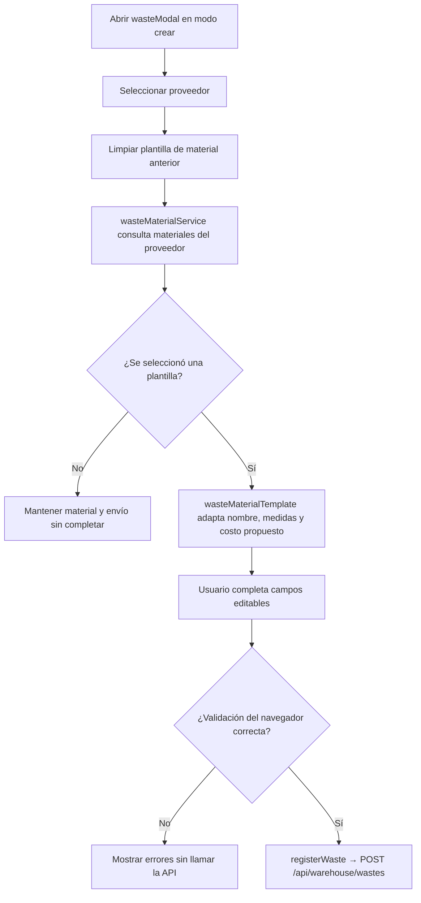
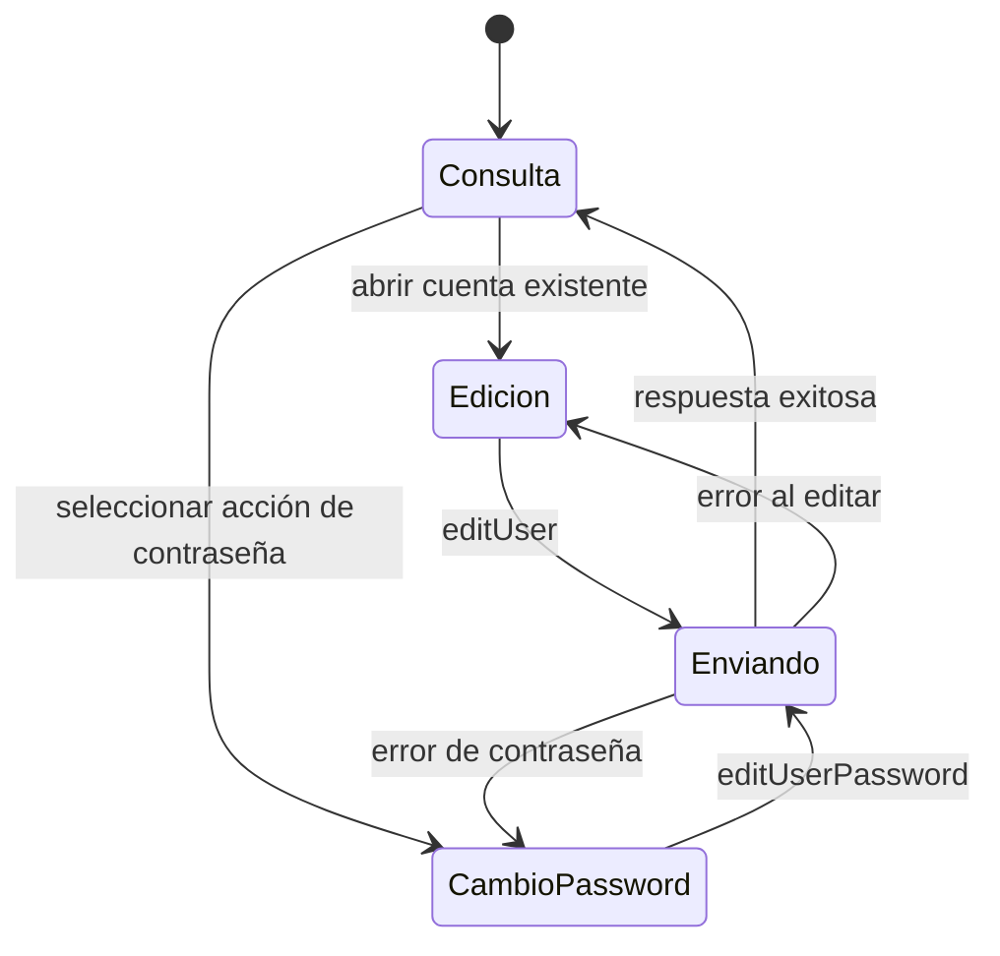
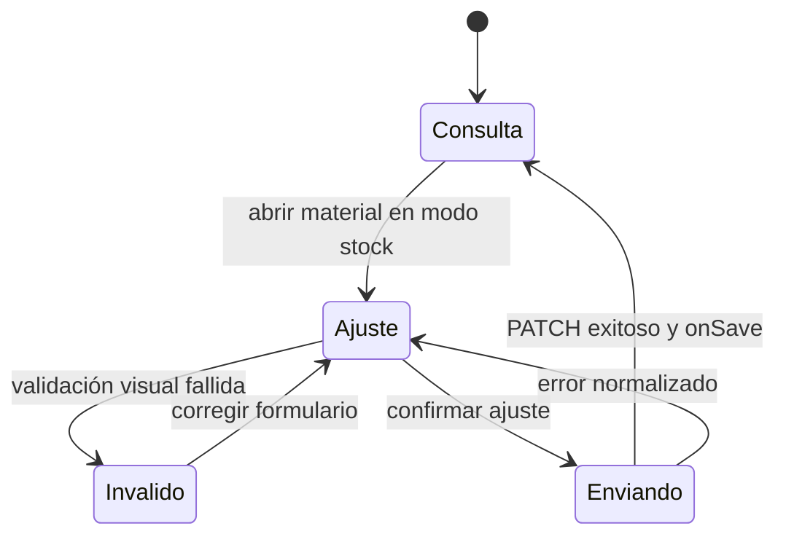

# 7. Vistas técnicas aplicadas por flujo frontend

### Relación entre la colección canónica y las vistas adicionales

La columna **Diagrama aplicado** de la matriz anterior enlaza los 81 recorridos
`DIA-FE-CU-*` de `frontend-code-sequences/index.md`. Esa colección es propietaria del
orden interacción → UI → aplicación → request → endpoint → resultado visible. Este
documento es propietario de las fichas por tipo de módulo, los límites del navegador y
las vistas que responden una pregunta adicional. Ninguna vista adicional extiende la
seguridad del frontend hacia el servidor ni sustituye la secuencia enlazada.

La revisión de las vistas existentes produjo esta decisión:

| Vista conservada aquí | Pregunta adicional y razón | Conexión e impacto |
| --- | --- | --- |
| `DIA-FE-ACT-001` · `CU-CAT-19` | ¿Cómo condicionan proveedor y plantilla la habilitación, el mapeo de *snapshots* y el envío? La actividad hace visibles decisiones de UI, no la persistencia. | Complementa `DIA-FE-CU-CAT-19` y termina en su mismo `POST`. Cambios en decisiones visuales actualizan la actividad; cambios en módulos, payload o endpoint actualizan la secuencia canónica; las reglas definitivas permanecen en backend. |
| `DIA-FE-TEC-EST-CU-IDA-08` | ¿Qué modos del formulario separan consulta, edición y cambio de contraseña, y a cuál vuelve tras éxito o error? | Complementa `DIA-FE-CU-IDA-08` y se conecta con los recorridos de consulta/edición relacionados. No crea otro caso ni otra API; si cambia el modo se revisan sus controles y la secuencia cuya mutación activa. |
| `DIA-FE-TEC-EST-CU-CAT-05` | ¿Cómo evoluciona el modo de ajuste entre consulta, validación visual, envío y error? | Complementa `DIA-FE-CU-CAT-05` y termina en el mismo `PATCH`. No representa estados persistidos ni validación definitiva; un cambio de endpoint afecta la secuencia, mientras un cambio de modo afecta esta vista. |

Las antiguas secuencias selectivas de login, ajuste, corrección y devoluciones no se
mantienen aquí: repetían la pregunta ya contestada por sus `DIA-FE-CU-*`. Su detalle se
consolidó en la colección canónica. La reutilización de factories o UI compartida se
conecta mediante el código de patrón y las vistas estructurales; no exige duplicar la
secuencia de cada consumidor.

### Alta de merma desde una plantilla de material

**Identificador:** `DIA-FE-ACT-001`. **Caso:** `CU-CAT-19`. Esta actividad hace visible
la dependencia proveedor → material y la preparación de snapshots; no representa las
decisiones de persistencia del servicio.

### Estados técnicos complementarios

Estas vistas permanecen aquí porque añaden ciclos técnicos que no repite la colección
de secuencias por caso.

**Estado técnico complementario:** `DIA-FE-TEC-EST-CU-IDA-08`. Expone los modos
que gobiernan los campos y la mutación del formulario de usuario.

**Estado técnico complementario:** `DIA-FE-TEC-EST-CU-CAT-05`. Representa el ciclo
del modo de ajuste sin atribuir al navegador la validación definitiva del stock.

