# Diagramas de casos aplicados al código frontend

Cada bloque representa un solo caso de uso con los elementos concretos documentados en
la [matriz técnica de frontend](frontend-technical-documentation.md#aplicación-de-todos-los-casos-al-código-frontend).
La flecha significa **Interacción o composición → Aplicación, request y resultado**; no
representa una regla compartida ni permite sustituir participantes de otro caso. Se
conserva una vista por caso incluso cuando la estructura se repite, porque cambian
módulos, símbolos, rutas o efectos.
El orden sigue los identificadores del catálogo para facilitar la revisión técnica; no
convierte `REP` en una sección independiente del manual ni altera el recorrido del
módulo desde el que se exporta.

## Vista canónica de reutilización frontend

**Identificador:** `DIA-FE-REU-001`. Las flechas discontinuas significan configuración o consumo; las continuas muestran la especialización que conserva módulos, requests y reglas por caso.

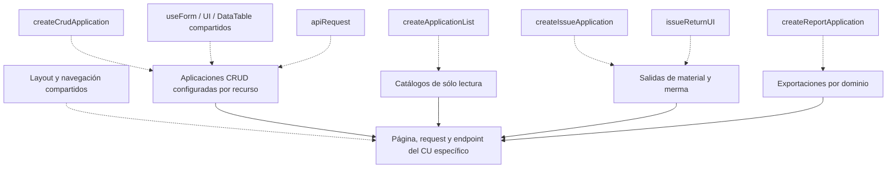

Los diagramas `DIA-FE-CU-*` referencian esta vista e indican cuál de estas piezas usa el caso. La referencia demuestra reutilización existente; el recorrido continuo conserva la especialización concreta y permite evaluar una refactorización sin afirmar que dos casos son idénticos.

## `CU-AUT-01`

**Identificador:** `DIA-FE-CU-AUT-01`. **Fuente:** fila `CU-AUT-01` de la matriz de aplicación al código frontend. **Reutilización:** `DIA-FE-REU-001` · `apiRequest y composición de navegación`.

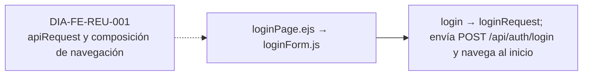

## `CU-AUT-02`

**Identificador:** `DIA-FE-CU-AUT-02`. **Fuente:** fila `CU-AUT-02` de la matriz de aplicación al código frontend. **Reutilización:** `DIA-FE-REU-001` · `composición de navegación compartida`.

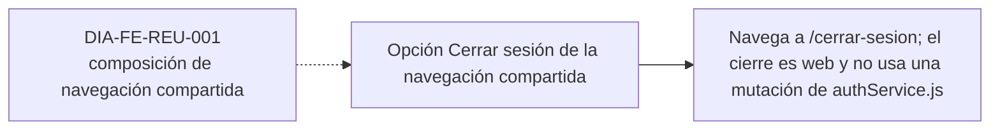

## `CU-IDA-01`

**Identificador:** `DIA-FE-CU-IDA-01`. **Fuente:** fila `CU-IDA-01` de la matriz de aplicación al código frontend. **Reutilización:** `DIA-FE-REU-001` · `createCrudApplication y UI/formularios compartidos`.

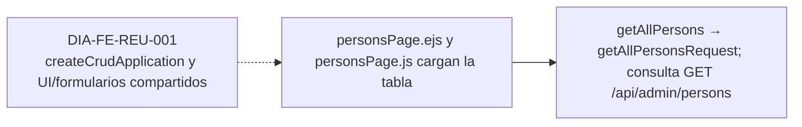

## `CU-IDA-02`

**Identificador:** `DIA-FE-CU-IDA-02`. **Fuente:** fila `CU-IDA-02` de la matriz de aplicación al código frontend. **Reutilización:** `DIA-FE-REU-001` · `createCrudApplication y UI/formularios compartidos`.

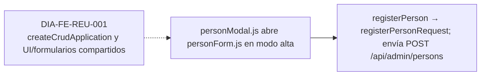

## `CU-IDA-03`

**Identificador:** `DIA-FE-CU-IDA-03`. **Fuente:** fila `CU-IDA-03` de la matriz de aplicación al código frontend. **Reutilización:** `DIA-FE-REU-001` · `createCrudApplication y UI/formularios compartidos`.

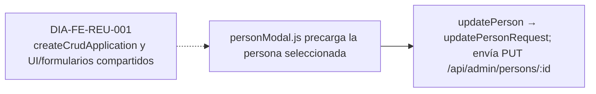

## `CU-IDA-04`

**Identificador:** `DIA-FE-CU-IDA-04`. **Fuente:** fila `CU-IDA-04` de la matriz de aplicación al código frontend. **Reutilización:** `DIA-FE-REU-001` · `createCrudApplication y UI/formularios compartidos`.

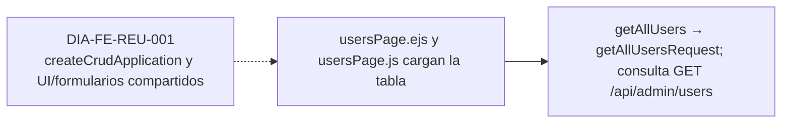

## `CU-IDA-05`

**Identificador:** `DIA-FE-CU-IDA-05`. **Fuente:** fila `CU-IDA-05` de la matriz de aplicación al código frontend. **Reutilización:** `DIA-FE-REU-001` · `createCrudApplication y UI/formularios compartidos`.

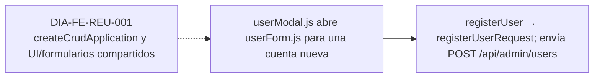

## `CU-IDA-06`

**Identificador:** `DIA-FE-CU-IDA-06`. **Fuente:** fila `CU-IDA-06` de la matriz de aplicación al código frontend. **Reutilización:** `DIA-FE-REU-001` · `createCrudApplication y UI/formularios compartidos`.

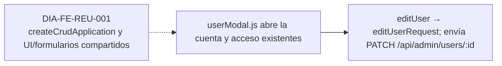

## `CU-IDA-07`

**Identificador:** `DIA-FE-CU-IDA-07`. **Fuente:** fila `CU-IDA-07` de la matriz de aplicación al código frontend. **Reutilización:** `DIA-FE-REU-001` · `createCrudApplication y UI/formularios compartidos`.

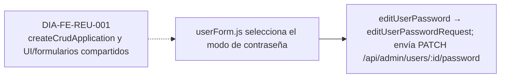

## `CU-IDA-08`

**Identificador:** `DIA-FE-CU-IDA-08`. **Fuente:** fila `CU-IDA-08` de la matriz de aplicación al código frontend. **Reutilización:** `DIA-FE-REU-001` · `createApplicationList y catálogos compartidos`.

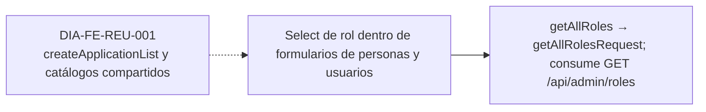

## `CU-IDA-09`

**Identificador:** `DIA-FE-CU-IDA-09`. **Fuente:** fila `CU-IDA-09` de la matriz de aplicación al código frontend. **Reutilización:** `DIA-FE-REU-001` · `createApplicationList y catálogos compartidos`.

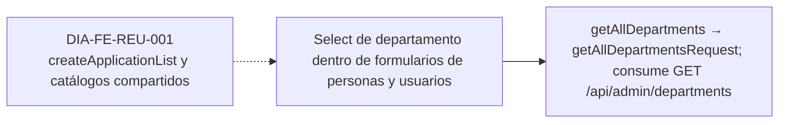

## `CU-CAT-01`

**Identificador:** `DIA-FE-CU-CAT-01`. **Fuente:** fila `CU-CAT-01` de la matriz de aplicación al código frontend. **Reutilización:** `DIA-FE-REU-001` · `createCrudApplication y UI/formularios compartidos`.

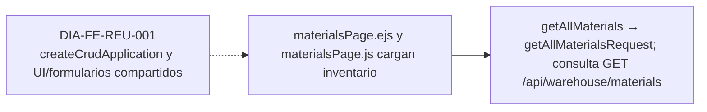

## `CU-CAT-02`

**Identificador:** `DIA-FE-CU-CAT-02`. **Fuente:** fila `CU-CAT-02` de la matriz de aplicación al código frontend. **Reutilización:** `DIA-FE-REU-001` · `createCrudApplication y UI/formularios compartidos`.

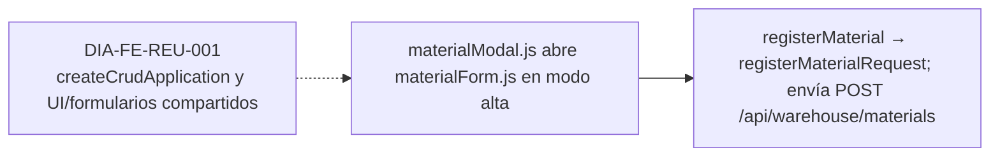

## `CU-CAT-03`

**Identificador:** `DIA-FE-CU-CAT-03`. **Fuente:** fila `CU-CAT-03` de la matriz de aplicación al código frontend. **Reutilización:** `DIA-FE-REU-001` · `createCrudApplication y UI/formularios compartidos`.

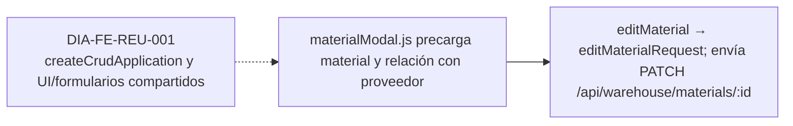

## `CU-CAT-04`

**Identificador:** `DIA-FE-CU-CAT-04`. **Fuente:** fila `CU-CAT-04` de la matriz de aplicación al código frontend. **Reutilización:** `DIA-FE-REU-001` · `createCrudApplication y UI/formularios compartidos`.

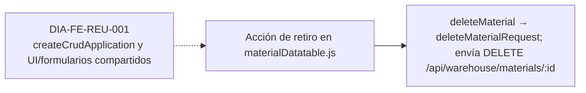

## `CU-CAT-05`

**Identificador:** `DIA-FE-CU-CAT-05`. **Fuente:** fila `CU-CAT-05` de la matriz de aplicación al código frontend. **Reutilización:** `DIA-FE-REU-001` · `createCrudApplication y UI/formularios compartidos`.

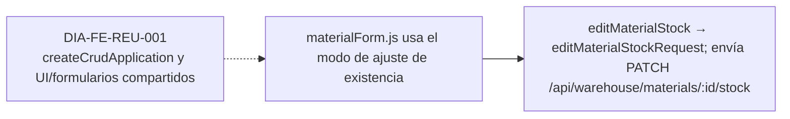

## `CU-CAT-06`

**Identificador:** `DIA-FE-CU-CAT-06`. **Fuente:** fila `CU-CAT-06` de la matriz de aplicación al código frontend. **Reutilización:** `DIA-FE-REU-001` · `createCrudApplication y UI/formularios compartidos`.

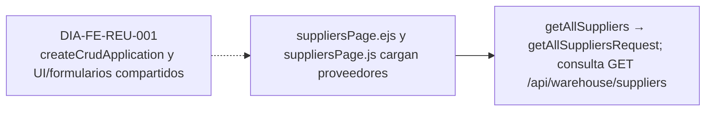

## `CU-CAT-07`

**Identificador:** `DIA-FE-CU-CAT-07`. **Fuente:** fila `CU-CAT-07` de la matriz de aplicación al código frontend. **Reutilización:** `DIA-FE-REU-001` · `createCrudApplication y UI/formularios compartidos`.

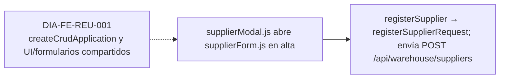

## `CU-CAT-08`

**Identificador:** `DIA-FE-CU-CAT-08`. **Fuente:** fila `CU-CAT-08` de la matriz de aplicación al código frontend. **Reutilización:** `DIA-FE-REU-001` · `createCrudApplication y UI/formularios compartidos`.

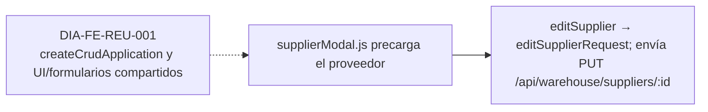

## `CU-CAT-09`

**Identificador:** `DIA-FE-CU-CAT-09`. **Fuente:** fila `CU-CAT-09` de la matriz de aplicación al código frontend. **Reutilización:** `DIA-FE-REU-001` · `createCrudApplication y UI/formularios compartidos`.

```mermaid
flowchart LR
    reuse["DIA-FE-REU-001<br/>createCrudApplication y UI/formularios compartidos"] -.-> source
    source["El estado se edita en supplierForm.js; no hay pantalla separada"] --> target["editSupplier conserva el contexto y usa PUT /api/warehouse/suppliers/:id"]
```

## `CU-CAT-10`

**Identificador:** `DIA-FE-CU-CAT-10`. **Fuente:** fila `CU-CAT-10` de la matriz de aplicación al código frontend. **Reutilización:** `DIA-FE-REU-001` · `createCrudApplication y UI/formularios compartidos`.

```mermaid
flowchart LR
    reuse["DIA-FE-REU-001<br/>createCrudApplication y UI/formularios compartidos"] -.-> source
    source["clientsPage.ejs y clientsPage.js cargan clientes"] --> target["getAllClients → getAllClientsRequest; consulta GET /api/sales/clients"]
```

## `CU-CAT-11`

**Identificador:** `DIA-FE-CU-CAT-11`. **Fuente:** fila `CU-CAT-11` de la matriz de aplicación al código frontend. **Reutilización:** `DIA-FE-REU-001` · `createCrudApplication y UI/formularios compartidos`.

```mermaid
flowchart LR
    reuse["DIA-FE-REU-001<br/>createCrudApplication y UI/formularios compartidos"] -.-> source
    source["clientModal.js abre clientForm.js en alta"] --> target["registerClient → createClientRequest; envía POST /api/sales/clients"]
```

## `CU-CAT-12`

**Identificador:** `DIA-FE-CU-CAT-12`. **Fuente:** fila `CU-CAT-12` de la matriz de aplicación al código frontend. **Reutilización:** `DIA-FE-REU-001` · `createCrudApplication y UI/formularios compartidos`.

```mermaid
flowchart LR
    reuse["DIA-FE-REU-001<br/>createCrudApplication y UI/formularios compartidos"] -.-> source
    source["clientModal.js precarga el cliente"] --> target["editClient → editClientRequest; envía PUT /api/sales/clients/:id"]
```

## `CU-CAT-13`

**Identificador:** `DIA-FE-CU-CAT-13`. **Fuente:** fila `CU-CAT-13` de la matriz de aplicación al código frontend. **Reutilización:** `DIA-FE-REU-001` · `createCrudApplication y UI/formularios compartidos`.

```mermaid
flowchart LR
    reuse["DIA-FE-REU-001<br/>createCrudApplication y UI/formularios compartidos"] -.-> source
    source["wastesPage.ejs y wastesPage.js cargan mermas"] --> target["getAllWastes → getAllWastesRequest; consulta GET /api/warehouse/wastes"]
```

## `CU-CAT-14`

**Identificador:** `DIA-FE-CU-CAT-14`. **Fuente:** fila `CU-CAT-14` de la matriz de aplicación al código frontend. **Reutilización:** `DIA-FE-REU-001` · `createCrudApplication y UI/formularios compartidos`.

```mermaid
flowchart LR
    reuse["DIA-FE-REU-001<br/>createCrudApplication y UI/formularios compartidos"] -.-> source
    source["wasteModal.js y wasteForm.js seleccionan una plantilla de material"] --> target["getWasteMaterialTemplates prepara datos y registerWaste envía POST /api/warehouse/wastes"]
```

## `CU-CAT-15`

**Identificador:** `DIA-FE-CU-CAT-15`. **Fuente:** fila `CU-CAT-15` de la matriz de aplicación al código frontend. **Reutilización:** `DIA-FE-REU-001` · `createCrudApplication y UI/formularios compartidos`.

```mermaid
flowchart LR
    reuse["DIA-FE-REU-001<br/>createCrudApplication y UI/formularios compartidos"] -.-> source
    source["wasteModal.js precarga la merma"] --> target["editWaste → editWasteRequest; envía PATCH /api/warehouse/wastes/:id"]
```

## `CU-CAT-16`

**Identificador:** `DIA-FE-CU-CAT-16`. **Fuente:** fila `CU-CAT-16` de la matriz de aplicación al código frontend. **Reutilización:** `DIA-FE-REU-001` · `createCrudApplication y UI/formularios compartidos`.

```mermaid
flowchart LR
    reuse["DIA-FE-REU-001<br/>createCrudApplication y UI/formularios compartidos"] -.-> source
    source["wasteForm.js usa el modo de ajuste"] --> target["editWasteStock → editWasteStockRequest; envía PATCH /api/warehouse/wastes/:id/stock"]
```

## `CU-CAT-17`

**Identificador:** `DIA-FE-CU-CAT-17`. **Fuente:** fila `CU-CAT-17` de la matriz de aplicación al código frontend. **Reutilización:** `DIA-FE-REU-001` · `createApplicationList y catálogos compartidos`.

```mermaid
flowchart LR
    reuse["DIA-FE-REU-001<br/>createApplicationList y catálogos compartidos"] -.-> source
    source["Select de presentación en materialFields.js y wasteFields.js"] --> target["getAllPresentations → getAllPresentationsRequest; consume GET /api/warehouse/presentations"]
```

## `CU-CAT-18`

**Identificador:** `DIA-FE-CU-CAT-18`. **Fuente:** fila `CU-CAT-18` de la matriz de aplicación al código frontend. **Reutilización:** `DIA-FE-REU-001` · `createApplicationList y catálogos compartidos`.

```mermaid
flowchart LR
    reuse["DIA-FE-REU-001<br/>createApplicationList y catálogos compartidos"] -.-> source
    source["Select de unidad en formularios de material y merma"] --> target["getAllUnitMeasures → getAllUnitMeasuresRequest; consume GET /api/warehouse/unit-measures"]
```

## `CU-CAT-19`

**Identificador:** `DIA-FE-CU-CAT-19`. **Fuente:** fila `CU-CAT-19` de la matriz de aplicación al código frontend. **Reutilización:** `DIA-FE-REU-001` · `createApplicationList y catálogos compartidos`.

```mermaid
flowchart LR
    reuse["DIA-FE-REU-001<br/>createApplicationList y catálogos compartidos"] -.-> source
    source["Select de motivo en los modos de ajuste"] --> target["getAllReasons → getAllReasonsRequest; consume GET /api/warehouse/reasons"]
```

## `CU-CAT-20`

**Identificador:** `DIA-FE-CU-CAT-20`. **Fuente:** fila `CU-CAT-20` de la matriz de aplicación al código frontend. **Reutilización:** `DIA-FE-REU-001` · `createApplicationList y catálogos compartidos`.

```mermaid
flowchart LR
    reuse["DIA-FE-REU-001<br/>createApplicationList y catálogos compartidos"] -.-> source
    source["Estado visible en tablas y formularios de salidas"] --> target["getAllFulfillmentStatuses → request homólogo; consume GET /api/warehouse/fulfillment-statuses"]
```

## `CU-ENT-01`

**Identificador:** `DIA-FE-CU-ENT-01`. **Fuente:** fila `CU-ENT-01` de la matriz de aplicación al código frontend. **Reutilización:** `DIA-FE-REU-001` · `createCrudApplication con mutaciones adicionales`.

```mermaid
flowchart LR
    reuse["DIA-FE-REU-001<br/>createCrudApplication con mutaciones adicionales"] -.-> source
    source["goodsReceiptsPage.ejs y su DataTable cargan compras"] --> target["getAllGoodsReceipts → request homólogo; consulta GET /api/warehouse/goods-receipts"]
```

## `CU-ENT-02`

**Identificador:** `DIA-FE-CU-ENT-02`. **Fuente:** fila `CU-ENT-02` de la matriz de aplicación al código frontend. **Reutilización:** `DIA-FE-REU-001` · `createCrudApplication con mutaciones adicionales`.

```mermaid
flowchart LR
    reuse["DIA-FE-REU-001<br/>createCrudApplication con mutaciones adicionales"] -.-> source
    source["goodsReceiptModal.js captura encabezado y detalles"] --> target["registerGoodsReceipt → registerGoodsReceiptRequest; envía POST /api/warehouse/goods-receipts"]
```

## `CU-ENT-03`

**Identificador:** `DIA-FE-CU-ENT-03`. **Fuente:** fila `CU-ENT-03` de la matriz de aplicación al código frontend. **Reutilización:** `DIA-FE-REU-001` · `createCrudApplication con mutaciones adicionales`.

```mermaid
flowchart LR
    reuse["DIA-FE-REU-001<br/>createCrudApplication con mutaciones adicionales"] -.-> source
    source["goodsReceiptModal.js abre una compra existente"] --> target["editGoodsReceiptHeader → request homólogo; envía PATCH /api/warehouse/goods-receipts/:id"]
```

## `CU-ENT-04`

**Identificador:** `DIA-FE-CU-ENT-04`. **Fuente:** fila `CU-ENT-04` de la matriz de aplicación al código frontend. **Reutilización:** `DIA-FE-REU-001` · `createCrudApplication con mutaciones adicionales`.

```mermaid
flowchart LR
    reuse["DIA-FE-REU-001<br/>createCrudApplication con mutaciones adicionales"] -.-> source
    source["correctionModal.js y correctionForm.js aíslan la corrección"] --> target["correctGoodsReceiptDetail → request homólogo; envía PATCH /api/warehouse/goods-receipts/:id/details/:detailId/corrections"]
```

## `CU-ENT-05`

**Identificador:** `DIA-FE-CU-ENT-05`. **Fuente:** fila `CU-ENT-05` de la matriz de aplicación al código frontend. **Reutilización:** `DIA-FE-REU-001` · `createCrudApplication con mutaciones adicionales`.

```mermaid
flowchart LR
    reuse["DIA-FE-REU-001<br/>createCrudApplication con mutaciones adicionales"] -.-> source
    source["Acción Cancelar del detalle en el modal de compra"] --> target["cancelGoodsReceiptDetail → request homólogo; envía PATCH /api/warehouse/goods-receipts/:id/details/:detailId/cancel"]
```

## `CU-SAL-01`

**Identificador:** `DIA-FE-CU-SAL-01`. **Fuente:** fila `CU-SAL-01` de la matriz de aplicación al código frontend. **Reutilización:** `DIA-FE-REU-001` · `createIssueApplication; issueReturnUI en devoluciones`.

```mermaid
flowchart LR
    reuse["DIA-FE-REU-001<br/>createIssueApplication; issueReturnUI en devoluciones"] -.-> source
    source["goodsIssuesPage.ejs y su DataTable cargan salidas"] --> target["getAllGoodsIssues → request homólogo; consulta GET /api/warehouse/goods-issues"]
```

## `CU-SAL-02`

**Identificador:** `DIA-FE-CU-SAL-02`. **Fuente:** fila `CU-SAL-02` de la matriz de aplicación al código frontend. **Reutilización:** `DIA-FE-REU-001` · `createIssueApplication; issueReturnUI en devoluciones`.

```mermaid
flowchart LR
    reuse["DIA-FE-REU-001<br/>createIssueApplication; issueReturnUI en devoluciones"] -.-> source
    source["goodsIssueModal.js captura documento y materiales"] --> target["registerGoodsIssue → request homólogo; envía POST /api/warehouse/goods-issues"]
```

## `CU-SAL-03`

**Identificador:** `DIA-FE-CU-SAL-03`. **Fuente:** fila `CU-SAL-03` de la matriz de aplicación al código frontend. **Reutilización:** `DIA-FE-REU-001` · `createIssueApplication; issueReturnUI en devoluciones`.

```mermaid
flowchart LR
    reuse["DIA-FE-REU-001<br/>createIssueApplication; issueReturnUI en devoluciones"] -.-> source
    source["Modo encabezado de goodsIssueModal.js"] --> target["editGoodsIssueHeader → request homólogo; envía PATCH /api/warehouse/goods-issues/:id/header"]
```

## `CU-SAL-04`

**Identificador:** `DIA-FE-CU-SAL-04`. **Fuente:** fila `CU-SAL-04` de la matriz de aplicación al código frontend. **Reutilización:** `DIA-FE-REU-001` · `createIssueApplication; issueReturnUI en devoluciones`.

```mermaid
flowchart LR
    reuse["DIA-FE-REU-001<br/>createIssueApplication; issueReturnUI en devoluciones"] -.-> source
    source["Modo detalles de goodsIssueModal.js"] --> target["editGoodsIssueDetails → request homólogo; envía PATCH /api/warehouse/goods-issues/:id/details"]
```

## `CU-SAL-05`

**Identificador:** `DIA-FE-CU-SAL-05`. **Fuente:** fila `CU-SAL-05` de la matriz de aplicación al código frontend. **Reutilización:** `DIA-FE-REU-001` · `createIssueApplication; issueReturnUI en devoluciones`.

```mermaid
flowchart LR
    reuse["DIA-FE-REU-001<br/>createIssueApplication; issueReturnUI en devoluciones"] -.-> source
    source["Acción Surtir dentro de los detalles de salida"] --> target["editGoodsIssueDetails envía cantidades a PATCH /api/warehouse/goods-issues/:id/details y refresca el documento"]
```

## `CU-SAL-06`

**Identificador:** `DIA-FE-CU-SAL-06`. **Fuente:** fila `CU-SAL-06` de la matriz de aplicación al código frontend. **Reutilización:** `DIA-FE-REU-001` · `createIssueApplication; issueReturnUI en devoluciones`.

```mermaid
flowchart LR
    reuse["DIA-FE-REU-001<br/>createIssueApplication; issueReturnUI en devoluciones"] -.-> source
    source["returns/goodsIssueReturn.js configura issueReturnUI"] --> target["returnGoodsIssueDetail → request homólogo; envía PATCH /api/warehouse/goods-issues/:id/details/:detailId/returns"]
```

## `CU-SAL-07`

**Identificador:** `DIA-FE-CU-SAL-07`. **Fuente:** fila `CU-SAL-07` de la matriz de aplicación al código frontend. **Reutilización:** `DIA-FE-REU-001` · `createIssueApplication; issueReturnUI en devoluciones`.

```mermaid
flowchart LR
    reuse["DIA-FE-REU-001<br/>createIssueApplication; issueReturnUI en devoluciones"] -.-> source
    source["wasteIssuesPage.ejs y su DataTable cargan salidas de merma"] --> target["getAllWasteIssues → request homólogo; consulta GET /api/warehouse/waste-issues"]
```

## `CU-SAL-08`

**Identificador:** `DIA-FE-CU-SAL-08`. **Fuente:** fila `CU-SAL-08` de la matriz de aplicación al código frontend. **Reutilización:** `DIA-FE-REU-001` · `createIssueApplication; issueReturnUI en devoluciones`.

```mermaid
flowchart LR
    reuse["DIA-FE-REU-001<br/>createIssueApplication; issueReturnUI en devoluciones"] -.-> source
    source["wasteIssueModal.js captura documento y mermas"] --> target["registerWasteIssue → request homólogo; envía POST /api/warehouse/waste-issues"]
```

## `CU-SAL-09`

**Identificador:** `DIA-FE-CU-SAL-09`. **Fuente:** fila `CU-SAL-09` de la matriz de aplicación al código frontend. **Reutilización:** `DIA-FE-REU-001` · `createIssueApplication; issueReturnUI en devoluciones`.

```mermaid
flowchart LR
    reuse["DIA-FE-REU-001<br/>createIssueApplication; issueReturnUI en devoluciones"] -.-> source
    source["Modo encabezado de wasteIssueModal.js"] --> target["editWasteIssueHeader → request homólogo; envía PATCH /api/warehouse/waste-issues/:id/header"]
```

## `CU-SAL-10`

**Identificador:** `DIA-FE-CU-SAL-10`. **Fuente:** fila `CU-SAL-10` de la matriz de aplicación al código frontend. **Reutilización:** `DIA-FE-REU-001` · `createIssueApplication; issueReturnUI en devoluciones`.

```mermaid
flowchart LR
    reuse["DIA-FE-REU-001<br/>createIssueApplication; issueReturnUI en devoluciones"] -.-> source
    source["Modo detalles de wasteIssueModal.js"] --> target["editWasteIssueDetails → request homólogo; envía PATCH /api/warehouse/waste-issues/:id/details"]
```

## `CU-SAL-11`

**Identificador:** `DIA-FE-CU-SAL-11`. **Fuente:** fila `CU-SAL-11` de la matriz de aplicación al código frontend. **Reutilización:** `DIA-FE-REU-001` · `createIssueApplication; issueReturnUI en devoluciones`.

```mermaid
flowchart LR
    reuse["DIA-FE-REU-001<br/>createIssueApplication; issueReturnUI en devoluciones"] -.-> source
    source["Acción Surtir dentro de los detalles de merma"] --> target["editWasteIssueDetails envía cantidades a PATCH /api/warehouse/waste-issues/:id/details y refresca el documento"]
```

## `CU-SAL-12`

**Identificador:** `DIA-FE-CU-SAL-12`. **Fuente:** fila `CU-SAL-12` de la matriz de aplicación al código frontend. **Reutilización:** `DIA-FE-REU-001` · `createIssueApplication; issueReturnUI en devoluciones`.

```mermaid
flowchart LR
    reuse["DIA-FE-REU-001<br/>createIssueApplication; issueReturnUI en devoluciones"] -.-> source
    source["returns/wasteIssueReturn.js configura issueReturnUI"] --> target["returnWasteIssueDetail → request homólogo; envía PATCH /api/warehouse/waste-issues/:id/details/:detailId/returns"]
```

## `CU-REP-01`

**Identificador:** `DIA-FE-CU-REP-01`. **Fuente:** fila `CU-REP-01` de la matriz de aplicación al código frontend. **Reutilización:** `DIA-FE-REU-001` · `DataTable, filtros y aplicación de consulta compartidos`.

```mermaid
flowchart LR
    reuse["DIA-FE-REU-001<br/>DataTable, filtros y aplicación de consulta compartidos"] -.-> source
    source["La consulta es el listado de materialsPage.js; no hay página de reporte"] --> target["Reutiliza getAllMaterialsRequest y sus filtros, sin mutación"]
```

## `CU-REP-02`

**Identificador:** `DIA-FE-CU-REP-02`. **Fuente:** fila `CU-REP-02` de la matriz de aplicación al código frontend. **Reutilización:** `DIA-FE-REU-001` · `DataTable, filtros y aplicación de consulta compartidos`.

```mermaid
flowchart LR
    reuse["DIA-FE-REU-001<br/>DataTable, filtros y aplicación de consulta compartidos"] -.-> source
    source["movementsPage.js selecciona el contexto material"] --> target["getAllMovements({ context: 'materials' }) consulta /api/admin/movements/materials"]
```

## `CU-REP-03`

**Identificador:** `DIA-FE-CU-REP-03`. **Fuente:** fila `CU-REP-03` de la matriz de aplicación al código frontend. **Reutilización:** `DIA-FE-REU-001` · `createReportApplication y buildExcelButton`.

```mermaid
flowchart LR
    reuse["DIA-FE-REU-001<br/>createReportApplication y buildExcelButton"] -.-> source
    source["Botón Excel de materialDatatable.js"] --> target["exportWarehouseReport → exportWarehouseReportRequest; descarga /api/warehouse/reports/inventory/excel"]
```

## `CU-REP-04`

**Identificador:** `DIA-FE-CU-REP-04`. **Fuente:** fila `CU-REP-04` de la matriz de aplicación al código frontend. **Reutilización:** `DIA-FE-REU-001` · `createReportApplication y buildExcelButton`.

```mermaid
flowchart LR
    reuse["DIA-FE-REU-001<br/>createReportApplication y buildExcelButton"] -.-> source
    source["Botón Excel del listado de salidas de material"] --> target["exportGoodsIssueReport → request homólogo; descarga /api/warehouse/reports/goods-issues/excel"]
```

## `CU-REP-05`

**Identificador:** `DIA-FE-CU-REP-05`. **Fuente:** fila `CU-REP-05` de la matriz de aplicación al código frontend. **Reutilización:** `DIA-FE-REU-001` · `createReportApplication y buildExcelButton`.

```mermaid
flowchart LR
    reuse["DIA-FE-REU-001<br/>createReportApplication y buildExcelButton"] -.-> source
    source["Botón Excel de movimientos en contexto material"] --> target["exportMovementReport → request con materials; descarga /api/admin/reports/movements/materials/excel"]
```

## `CU-REP-06`

**Identificador:** `DIA-FE-CU-REP-06`. **Fuente:** fila `CU-REP-06` de la matriz de aplicación al código frontend. **Reutilización:** `DIA-FE-REU-001` · `DataTable, filtros y aplicación de consulta compartidos`.

```mermaid
flowchart LR
    reuse["DIA-FE-REU-001<br/>DataTable, filtros y aplicación de consulta compartidos"] -.-> source
    source["La consulta es el listado de wastesPage.js; no hay página de reporte"] --> target["Reutiliza getAllWastesRequest y sus filtros, sin mutación"]
```

## `CU-REP-07`

**Identificador:** `DIA-FE-CU-REP-07`. **Fuente:** fila `CU-REP-07` de la matriz de aplicación al código frontend. **Reutilización:** `DIA-FE-REU-001` · `DataTable, filtros y aplicación de consulta compartidos`.

```mermaid
flowchart LR
    reuse["DIA-FE-REU-001<br/>DataTable, filtros y aplicación de consulta compartidos"] -.-> source
    source["movementsPage.js selecciona el contexto merma"] --> target["getAllMovements({ context: 'wastes' }) consulta /api/admin/movements/wastes"]
```

## `CU-REP-08`

**Identificador:** `DIA-FE-CU-REP-08`. **Fuente:** fila `CU-REP-08` de la matriz de aplicación al código frontend. **Reutilización:** `DIA-FE-REU-001` · `createReportApplication y buildExcelButton`.

```mermaid
flowchart LR
    reuse["DIA-FE-REU-001<br/>createReportApplication y buildExcelButton"] -.-> source
    source["Botón Excel del listado de salidas de merma"] --> target["exportWasteIssueReport → request homólogo; descarga /api/warehouse/reports/waste-issues/excel"]
```

## `CU-REP-09`

**Identificador:** `DIA-FE-CU-REP-09`. **Fuente:** fila `CU-REP-09` de la matriz de aplicación al código frontend. **Reutilización:** `DIA-FE-REU-001` · `createReportApplication y buildExcelButton`.

```mermaid
flowchart LR
    reuse["DIA-FE-REU-001<br/>createReportApplication y buildExcelButton"] -.-> source
    source["Botón Excel de wasteDatatable.js"] --> target["exportWasteReport → request homólogo; descarga /api/warehouse/reports/wastes/excel"]
```

## `CU-REP-10`

**Identificador:** `DIA-FE-CU-REP-10`. **Fuente:** fila `CU-REP-10` de la matriz de aplicación al código frontend. **Reutilización:** `DIA-FE-REU-001` · `createReportApplication y buildExcelButton`.

```mermaid
flowchart LR
    reuse["DIA-FE-REU-001<br/>createReportApplication y buildExcelButton"] -.-> source
    source["Botón Excel de movimientos en contexto merma"] --> target["exportMovementReport → request con wastes; descarga /api/admin/reports/movements/wastes/excel"]
```

## `CU-REP-11`

**Identificador:** `DIA-FE-CU-REP-11`. **Fuente:** fila `CU-REP-11` de la matriz de aplicación al código frontend. **Reutilización:** `DIA-FE-REU-001` · `createReportApplication y buildExcelButton`.

```mermaid
flowchart LR
    reuse["DIA-FE-REU-001<br/>createReportApplication y buildExcelButton"] -.-> source
    source["Botón Excel de goodsReceiptDatatable.js"] --> target["exportGoodsReceiptReport → request homólogo; descarga /api/warehouse/reports/goods-receipts/excel"]
```

## `CU-REP-12`

**Identificador:** `DIA-FE-CU-REP-12`. **Fuente:** fila `CU-REP-12` de la matriz de aplicación al código frontend. **Reutilización:** `DIA-FE-REU-001` · `createReportApplication y buildExcelButton`.

```mermaid
flowchart LR
    reuse["DIA-FE-REU-001<br/>createReportApplication y buildExcelButton"] -.-> source
    source["Botón Excel de supplierDatatable.js"] --> target["exportSupplierReport → request homólogo; descarga /api/warehouse/reports/suppliers/excel"]
```

## `CU-REP-13`

**Identificador:** `DIA-FE-CU-REP-13`. **Fuente:** fila `CU-REP-13` de la matriz de aplicación al código frontend. **Reutilización:** `DIA-FE-REU-001` · `createReportApplication y buildExcelButton`.

```mermaid
flowchart LR
    reuse["DIA-FE-REU-001<br/>createReportApplication y buildExcelButton"] -.-> source
    source["Botón Excel de clientDatatable.js"] --> target["exportClientReport → request homólogo; descarga /api/sales/reports/clients/excel"]
```

## `CU-REP-14`

**Identificador:** `DIA-FE-CU-REP-14`. **Fuente:** fila `CU-REP-14` de la matriz de aplicación al código frontend. **Reutilización:** `DIA-FE-REU-001` · `createReportApplication y buildExcelButton`.

```mermaid
flowchart LR
    reuse["DIA-FE-REU-001<br/>createReportApplication y buildExcelButton"] -.-> source
    source["Botón Excel de personDatatable.js"] --> target["exportPersonReport → request homólogo; descarga /api/admin/reports/persons/excel"]
```

## `CU-REP-15`

**Identificador:** `DIA-FE-CU-REP-15`. **Fuente:** fila `CU-REP-15` de la matriz de aplicación al código frontend. **Reutilización:** `DIA-FE-REU-001` · `createReportApplication y buildExcelButton`.

```mermaid
flowchart LR
    reuse["DIA-FE-REU-001<br/>createReportApplication y buildExcelButton"] -.-> source
    source["Botón Excel de userDatatable.js"] --> target["exportUserReport → request homólogo; descarga /api/admin/reports/users/excel"]
```
