# Diagramas de casos aplicados al código frontend

Cada bloque representa un solo caso de uso con los elementos concretos documentados en
la [matriz técnica de frontend](frontend-technical-documentation.md#aplicación-de-todos-los-casos-al-código-frontend).
Cada secuencia muestra la vista o UI, los métodos de aplicación y request, y el endpoint
que participan en el caso. Sus notas hacen visibles los métodos compartidos de los
patrones y las variables que cruzan la frontera (`id`, `detailId`, `formData`/payload,
parámetros y filtros); las variables locales puramente mecánicas permanecen en el código
para no convertir el diagrama en una transcripción ilegible. Se conserva una vista por
caso incluso cuando la estructura se repite, porque cambian módulos, símbolos, rutas,
variables o efectos.
El orden sigue los identificadores del catálogo para facilitar la revisión técnica; no
convierte `REP` en una sección independiente del manual ni altera el recorrido del
módulo desde el que se exporta.

## Índice rápido de patrones por caso

Cada caso conserva una línea **Patrones** con códigos de este índice y enlaza el
[catálogo canónico](design-and-construction-patterns.md#resumen-de-patrones-confirmados).
La referencia identifica las soluciones aplicadas y la nota del bloque Mermaid nombra
su implementación en el recorrido concreto, sin repetir la explicación completa del
catálogo.

| Código | Patrón aplicado | Elementos que permiten reconocerlo |
| --- | --- | --- |
| `FE-P01` | Capas del navegador | Página/UI → aplicación → servicio HTTP → endpoint. |
| `FE-P02` | Factory CRUD | `createCrudApplication` configurada con requests y claves del recurso. |
| `FE-P03` | Factory/adaptador de catálogo | `createApplicationList` + request y transformación de opciones. |
| `FE-P04` | Mutación por composición | Operación adicional incorporada al CRUD sin herencia. |
| `FE-P05` | Composición de salidas | `createIssueApplication` configurada para material o merma. |
| `FE-P06` | UI de devolución compartida | `issueReturnUI` parametrizada por el contexto de la salida. |
| `FE-P07` | Consulta tabular | DataTable + filtros + aplicación de lectura contextual. |
| `FE-P08` | Factory de reporte | `createReportApplication` + `buildExcelButton` y request de descarga. |
| `FE-P09` | Navegación compuesta | Formulario o layout común coordina navegación/sesión sin duplicar el endpoint. |

### Cobertura de casos frontend

La comparación con el catálogo y la matriz técnica confirma que cada identificador
aparece una vez, conserva su referencia de patrones y contiene un bloque Mermaid.

| Grupo | Rango cubierto | Diagramas | Estado |
| --- | --- | ---: | --- |
| Autenticación | `CU-AUT-01..02` | 2 | Completo |
| Identidad y acceso | `CU-IDA-01..09` | 9 | Completo |
| Catálogos | `CU-CAT-01..20` | 20 | Completo |
| Entradas | `CU-ENT-01..05` | 5 | Completo |
| Salidas | `CU-SAL-01..12` | 12 | Completo |
| Consultas y reportes | `CU-REP-01..15` | 15 | Completo |
| **Total** | `CU-AUT-01..CU-REP-15` | **63** | **63 de 63** |

## `CU-AUT-01`

**Identificador:** `DIA-FE-CU-AUT-01`. **Fuente:** fila `CU-AUT-01` de la matriz de aplicación al código frontend.

**Patrones:** `FE-P01`, `FE-P09`.

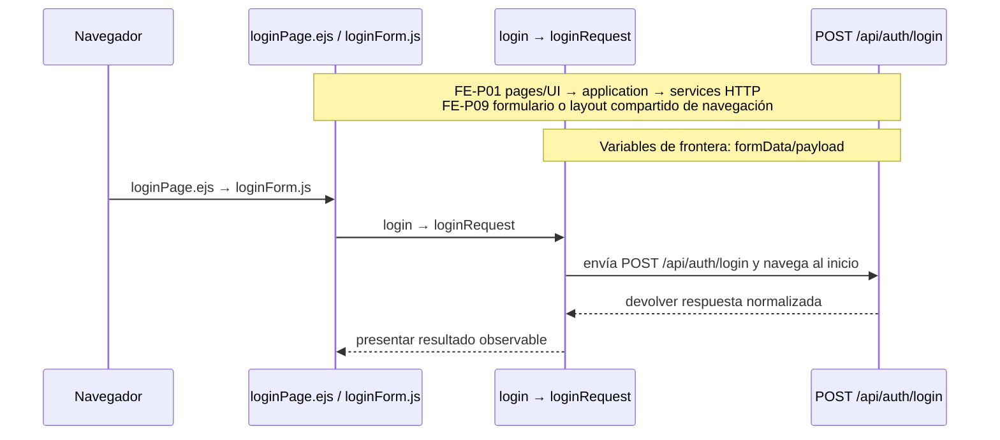

## `CU-AUT-02`

**Identificador:** `DIA-FE-CU-AUT-02`. **Fuente:** fila `CU-AUT-02` de la matriz de aplicación al código frontend.

**Patrones:** `FE-P09`.

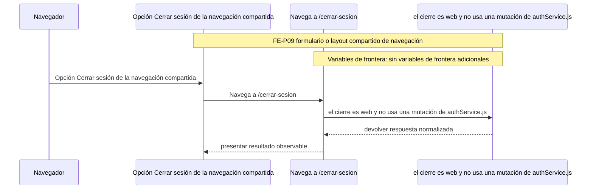

## `CU-IDA-01`

**Identificador:** `DIA-FE-CU-IDA-01`. **Fuente:** fila `CU-IDA-01` de la matriz de aplicación al código frontend.

**Patrones:** `FE-P02`.

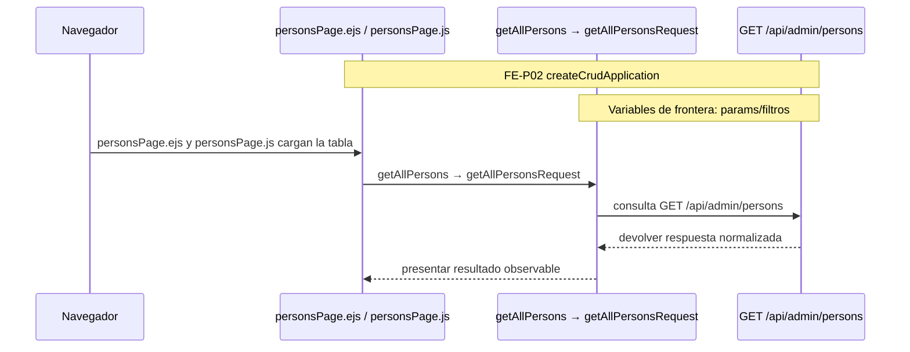

## `CU-IDA-02`

**Identificador:** `DIA-FE-CU-IDA-02`. **Fuente:** fila `CU-IDA-02` de la matriz de aplicación al código frontend.

**Patrones:** `FE-P02`.

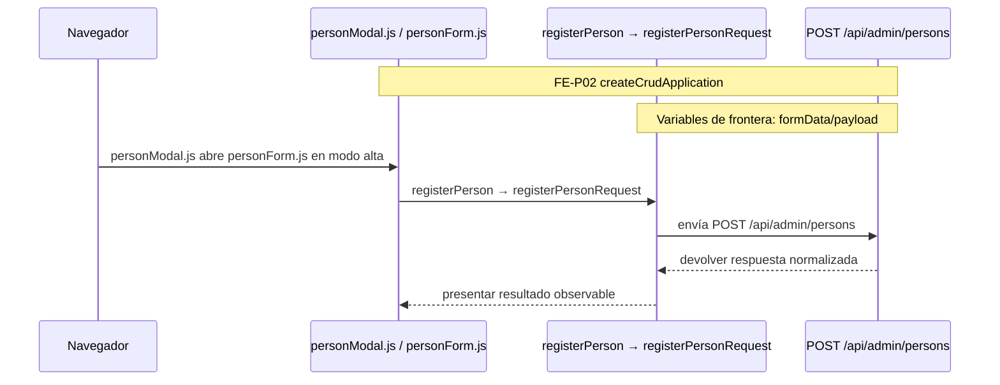

## `CU-IDA-03`

**Identificador:** `DIA-FE-CU-IDA-03`. **Fuente:** fila `CU-IDA-03` de la matriz de aplicación al código frontend.

**Patrones:** `FE-P02`.

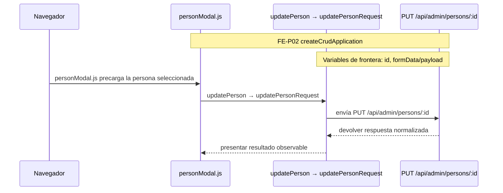

## `CU-IDA-04`

**Identificador:** `DIA-FE-CU-IDA-04`. **Fuente:** fila `CU-IDA-04` de la matriz de aplicación al código frontend.

**Patrones:** `FE-P02`.

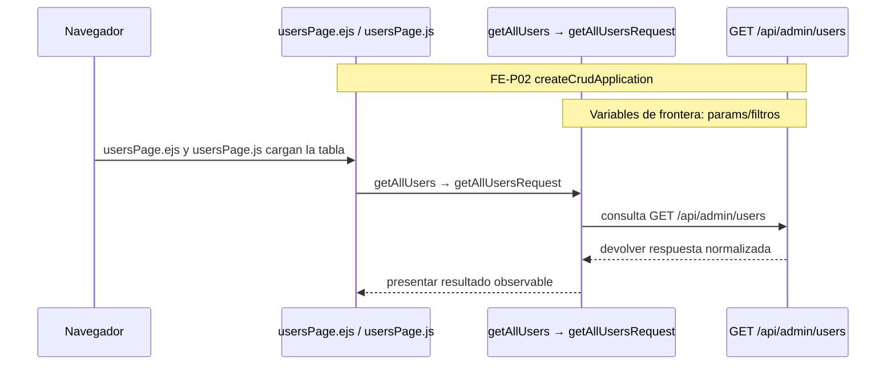

## `CU-IDA-05`

**Identificador:** `DIA-FE-CU-IDA-05`. **Fuente:** fila `CU-IDA-05` de la matriz de aplicación al código frontend.

**Patrones:** `FE-P02`.

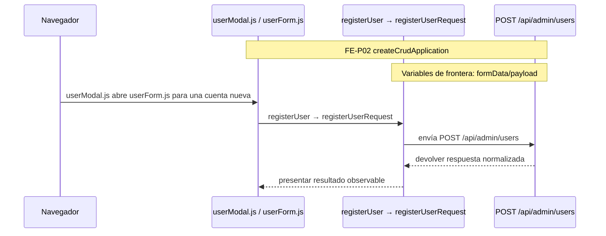

## `CU-IDA-06`

**Identificador:** `DIA-FE-CU-IDA-06`. **Fuente:** fila `CU-IDA-06` de la matriz de aplicación al código frontend.

**Patrones:** `FE-P02`.

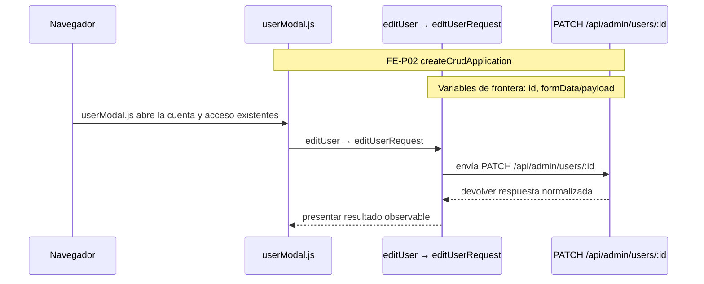

## `CU-IDA-07`

**Identificador:** `DIA-FE-CU-IDA-07`. **Fuente:** fila `CU-IDA-07` de la matriz de aplicación al código frontend.

**Patrones:** `FE-P02`.

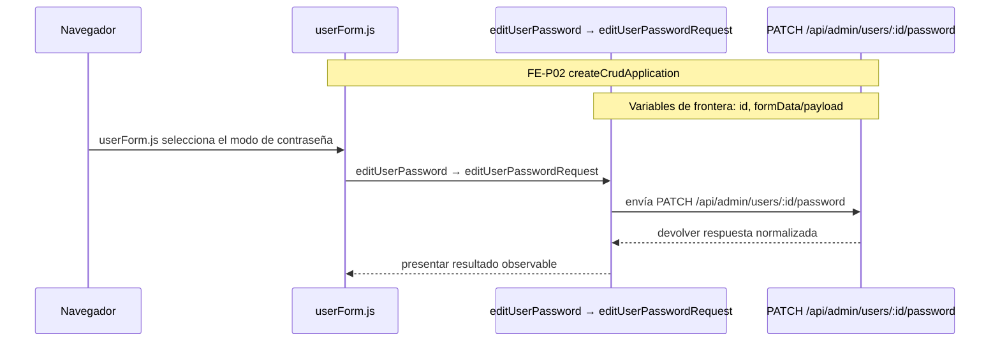

## `CU-IDA-08`

**Identificador:** `DIA-FE-CU-IDA-08`. **Fuente:** fila `CU-IDA-08` de la matriz de aplicación al código frontend.

**Patrones:** `FE-P03`.

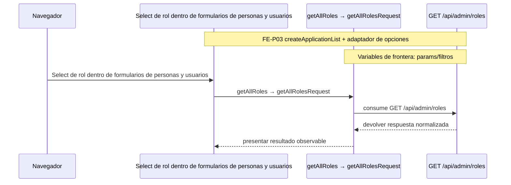

## `CU-IDA-09`

**Identificador:** `DIA-FE-CU-IDA-09`. **Fuente:** fila `CU-IDA-09` de la matriz de aplicación al código frontend.

**Patrones:** `FE-P03`.

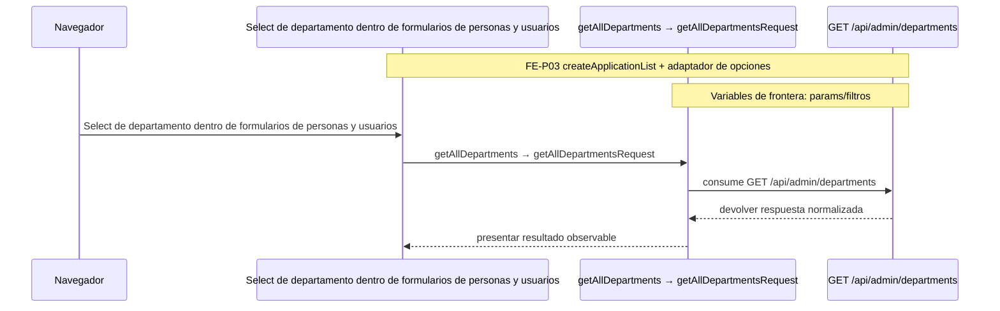

## `CU-CAT-01`

**Identificador:** `DIA-FE-CU-CAT-01`. **Fuente:** fila `CU-CAT-01` de la matriz de aplicación al código frontend.

**Patrones:** `FE-P02`.

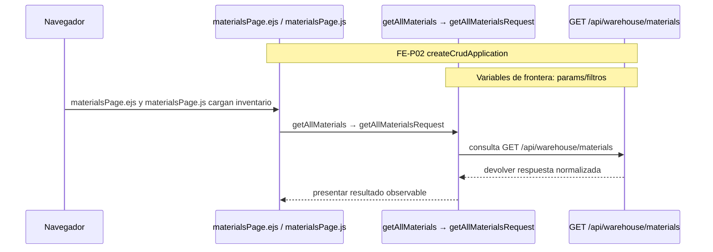

## `CU-CAT-02`

**Identificador:** `DIA-FE-CU-CAT-02`. **Fuente:** fila `CU-CAT-02` de la matriz de aplicación al código frontend.

**Patrones:** `FE-P02`.

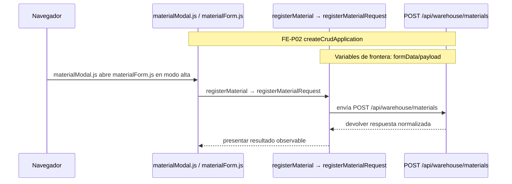

## `CU-CAT-03`

**Identificador:** `DIA-FE-CU-CAT-03`. **Fuente:** fila `CU-CAT-03` de la matriz de aplicación al código frontend.

**Patrones:** `FE-P02`.

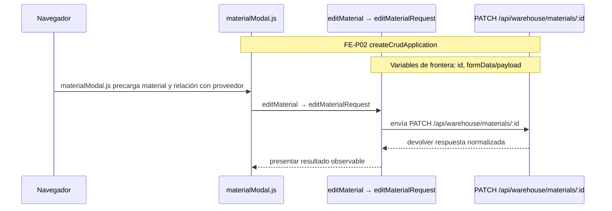

## `CU-CAT-04`

**Identificador:** `DIA-FE-CU-CAT-04`. **Fuente:** fila `CU-CAT-04` de la matriz de aplicación al código frontend.

**Patrones:** `FE-P02`.

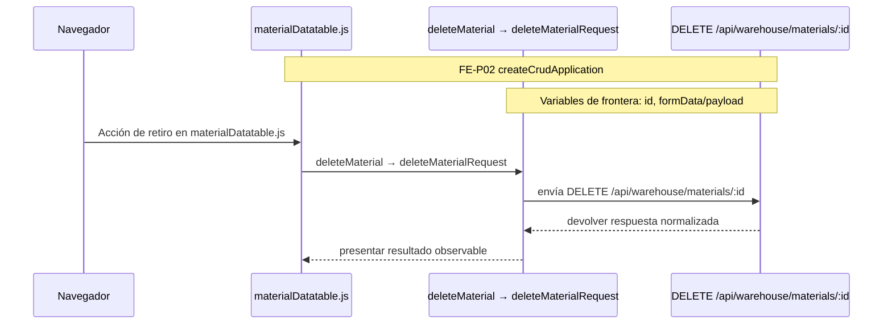

## `CU-CAT-05`

**Identificador:** `DIA-FE-CU-CAT-05`. **Fuente:** fila `CU-CAT-05` de la matriz de aplicación al código frontend.

**Patrones:** `FE-P02`.

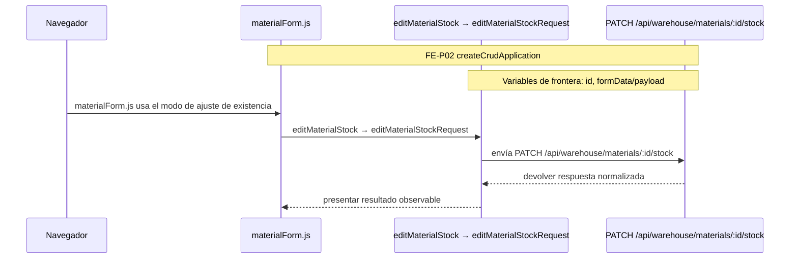

## `CU-CAT-06`

**Identificador:** `DIA-FE-CU-CAT-06`. **Fuente:** fila `CU-CAT-06` de la matriz de aplicación al código frontend.

**Patrones:** `FE-P02`.

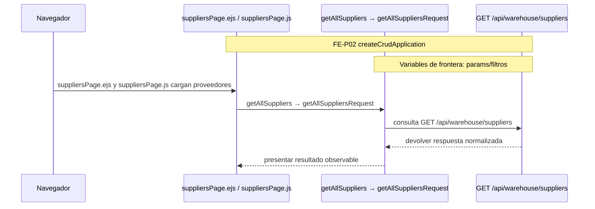

## `CU-CAT-07`

**Identificador:** `DIA-FE-CU-CAT-07`. **Fuente:** fila `CU-CAT-07` de la matriz de aplicación al código frontend.

**Patrones:** `FE-P02`.

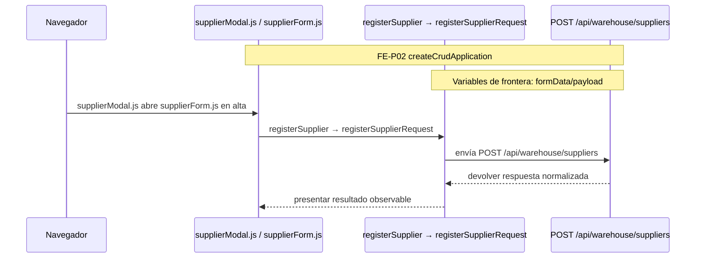

## `CU-CAT-08`

**Identificador:** `DIA-FE-CU-CAT-08`. **Fuente:** fila `CU-CAT-08` de la matriz de aplicación al código frontend.

**Patrones:** `FE-P02`.

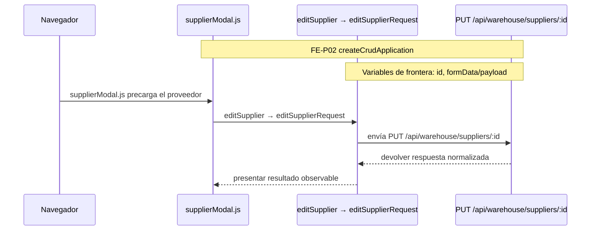

## `CU-CAT-09`

**Identificador:** `DIA-FE-CU-CAT-09`. **Fuente:** fila `CU-CAT-09` de la matriz de aplicación al código frontend.

**Patrones:** `FE-P02`.

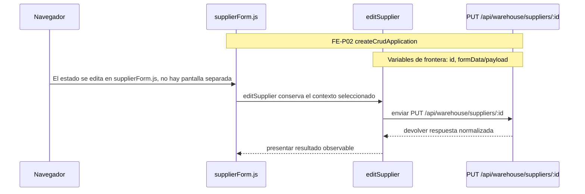

## `CU-CAT-10`

**Identificador:** `DIA-FE-CU-CAT-10`. **Fuente:** fila `CU-CAT-10` de la matriz de aplicación al código frontend.

**Patrones:** `FE-P02`.

```mermaid
sequenceDiagram
    participant Browser as Navegador
    participant View as clientsPage.ejs / clientsPage.js
    participant Application as getAllClients → getAllClientsRequest
    participant Transport as GET /api/sales/clients
    Note over View,Transport: FE-P02 createCrudApplication
    Note over Application,Transport: Variables de frontera: params/filtros

    Browser->>View: clientsPage.ejs y clientsPage.js cargan clientes
    View->>Application: getAllClients → getAllClientsRequest
    Application->>Transport: consulta GET /api/sales/clients
    Transport-->>Application: devolver respuesta normalizada
    Application-->>View: presentar resultado observable
```

## `CU-CAT-11`

**Identificador:** `DIA-FE-CU-CAT-11`. **Fuente:** fila `CU-CAT-11` de la matriz de aplicación al código frontend.

**Patrones:** `FE-P02`.

```mermaid
sequenceDiagram
    participant Browser as Navegador
    participant View as clientModal.js / clientForm.js
    participant Application as registerClient → createClientRequest
    participant Transport as POST /api/sales/clients
    Note over View,Transport: FE-P02 createCrudApplication
    Note over Application,Transport: Variables de frontera: formData/payload

    Browser->>View: clientModal.js abre clientForm.js en alta
    View->>Application: registerClient → createClientRequest
    Application->>Transport: envía POST /api/sales/clients
    Transport-->>Application: devolver respuesta normalizada
    Application-->>View: presentar resultado observable
```

## `CU-CAT-12`

**Identificador:** `DIA-FE-CU-CAT-12`. **Fuente:** fila `CU-CAT-12` de la matriz de aplicación al código frontend.

**Patrones:** `FE-P02`.

```mermaid
sequenceDiagram
    participant Browser as Navegador
    participant View as clientModal.js
    participant Application as editClient → editClientRequest
    participant Transport as PUT /api/sales/clients/:id
    Note over View,Transport: FE-P02 createCrudApplication
    Note over Application,Transport: Variables de frontera: id, formData/payload

    Browser->>View: clientModal.js precarga el cliente
    View->>Application: editClient → editClientRequest
    Application->>Transport: envía PUT /api/sales/clients/:id
    Transport-->>Application: devolver respuesta normalizada
    Application-->>View: presentar resultado observable
```

## `CU-CAT-13`

**Identificador:** `DIA-FE-CU-CAT-13`. **Fuente:** fila `CU-CAT-13` de la matriz de aplicación al código frontend.

**Patrones:** `FE-P02`.

```mermaid
sequenceDiagram
    participant Browser as Navegador
    participant View as wastesPage.ejs / wastesPage.js
    participant Application as getAllWastes → getAllWastesRequest
    participant Transport as GET /api/warehouse/wastes
    Note over View,Transport: FE-P02 createCrudApplication
    Note over Application,Transport: Variables de frontera: params/filtros

    Browser->>View: wastesPage.ejs y wastesPage.js cargan mermas
    View->>Application: getAllWastes → getAllWastesRequest
    Application->>Transport: consulta GET /api/warehouse/wastes
    Transport-->>Application: devolver respuesta normalizada
    Application-->>View: presentar resultado observable
```

## `CU-CAT-14`

**Identificador:** `DIA-FE-CU-CAT-14`. **Fuente:** fila `CU-CAT-14` de la matriz de aplicación al código frontend.

**Patrones:** `FE-P02`.

```mermaid
sequenceDiagram
    participant Browser as Navegador
    participant View as wasteModal.js / wasteForm.js
    participant Application as getWasteMaterialTemplates
    participant Transport as POST /api/warehouse/wastes
    Note over View,Transport: FE-P02 createCrudApplication
    Note over Application,Transport: Variables de frontera: formData/payload

    Browser->>View: wasteModal.js y wasteForm.js seleccionan una plantilla de material
    View->>Application: getWasteMaterialTemplates prepara datos y registerWaste registra
    Application->>Transport: enviar POST /api/warehouse/wastes
    Transport-->>Application: devolver respuesta normalizada
    Application-->>View: presentar resultado observable
```

## `CU-CAT-15`

**Identificador:** `DIA-FE-CU-CAT-15`. **Fuente:** fila `CU-CAT-15` de la matriz de aplicación al código frontend.

**Patrones:** `FE-P02`.

```mermaid
sequenceDiagram
    participant Browser as Navegador
    participant View as wasteModal.js
    participant Application as editWaste → editWasteRequest
    participant Transport as PATCH /api/warehouse/wastes/:id
    Note over View,Transport: FE-P02 createCrudApplication
    Note over Application,Transport: Variables de frontera: id, formData/payload

    Browser->>View: wasteModal.js precarga la merma
    View->>Application: editWaste → editWasteRequest
    Application->>Transport: envía PATCH /api/warehouse/wastes/:id
    Transport-->>Application: devolver respuesta normalizada
    Application-->>View: presentar resultado observable
```

## `CU-CAT-16`

**Identificador:** `DIA-FE-CU-CAT-16`. **Fuente:** fila `CU-CAT-16` de la matriz de aplicación al código frontend.

**Patrones:** `FE-P02`.

```mermaid
sequenceDiagram
    participant Browser as Navegador
    participant View as wasteForm.js
    participant Application as editWasteStock → editWasteStockRequest
    participant Transport as PATCH /api/warehouse/wastes/:id/stock
    Note over View,Transport: FE-P02 createCrudApplication
    Note over Application,Transport: Variables de frontera: id, formData/payload

    Browser->>View: wasteForm.js usa el modo de ajuste
    View->>Application: editWasteStock → editWasteStockRequest
    Application->>Transport: envía PATCH /api/warehouse/wastes/:id/stock
    Transport-->>Application: devolver respuesta normalizada
    Application-->>View: presentar resultado observable
```

## `CU-CAT-17`

**Identificador:** `DIA-FE-CU-CAT-17`. **Fuente:** fila `CU-CAT-17` de la matriz de aplicación al código frontend.

**Patrones:** `FE-P03`.

```mermaid
sequenceDiagram
    participant Browser as Navegador
    participant View as materialFields.js / wasteFields.js
    participant Application as getAllPresentations → getAllPresentationsRequest
    participant Transport as GET /api/warehouse/presentations
    Note over View,Transport: FE-P03 createApplicationList + adaptador de opciones
    Note over Application,Transport: Variables de frontera: params/filtros

    Browser->>View: Select de presentación en materialFields.js y wasteFields.js
    View->>Application: getAllPresentations → getAllPresentationsRequest
    Application->>Transport: consume GET /api/warehouse/presentations
    Transport-->>Application: devolver respuesta normalizada
    Application-->>View: presentar resultado observable
```

## `CU-CAT-18`

**Identificador:** `DIA-FE-CU-CAT-18`. **Fuente:** fila `CU-CAT-18` de la matriz de aplicación al código frontend.

**Patrones:** `FE-P03`.

```mermaid
sequenceDiagram
    participant Browser as Navegador
    participant View as Select de unidad en formularios de material y merma
    participant Application as getAllUnitMeasures → getAllUnitMeasuresRequest
    participant Transport as GET /api/warehouse/unit-measures
    Note over View,Transport: FE-P03 createApplicationList + adaptador de opciones
    Note over Application,Transport: Variables de frontera: params/filtros

    Browser->>View: Select de unidad en formularios de material y merma
    View->>Application: getAllUnitMeasures → getAllUnitMeasuresRequest
    Application->>Transport: consume GET /api/warehouse/unit-measures
    Transport-->>Application: devolver respuesta normalizada
    Application-->>View: presentar resultado observable
```

## `CU-CAT-19`

**Identificador:** `DIA-FE-CU-CAT-19`. **Fuente:** fila `CU-CAT-19` de la matriz de aplicación al código frontend.

**Patrones:** `FE-P03`.

```mermaid
sequenceDiagram
    participant Browser as Navegador
    participant View as Select de motivo en los modos de ajuste
    participant Application as getAllReasons → getAllReasonsRequest
    participant Transport as GET /api/warehouse/reasons
    Note over View,Transport: FE-P03 createApplicationList + adaptador de opciones
    Note over Application,Transport: Variables de frontera: params/filtros

    Browser->>View: Select de motivo en los modos de ajuste
    View->>Application: getAllReasons → getAllReasonsRequest
    Application->>Transport: consume GET /api/warehouse/reasons
    Transport-->>Application: devolver respuesta normalizada
    Application-->>View: presentar resultado observable
```

## `CU-CAT-20`

**Identificador:** `DIA-FE-CU-CAT-20`. **Fuente:** fila `CU-CAT-20` de la matriz de aplicación al código frontend.

**Patrones:** `FE-P03`.

```mermaid
sequenceDiagram
    participant Browser as Navegador
    participant View as Estado visible en tablas y formularios de salidas
    participant Application as getAllFulfillmentStatuses
    participant Transport as GET /api/warehouse/fulfillment-statuses
    Note over View,Transport: FE-P03 createApplicationList + adaptador de opciones
    Note over Application,Transport: Variables de frontera: params/filtros

    Browser->>View: Estado visible en tablas y formularios de salidas
    View->>Application: getAllFulfillmentStatuses → request homólogo
    Application->>Transport: consume GET /api/warehouse/fulfillment-statuses
    Transport-->>Application: devolver respuesta normalizada
    Application-->>View: presentar resultado observable
```

## `CU-ENT-01`

**Identificador:** `DIA-FE-CU-ENT-01`. **Fuente:** fila `CU-ENT-01` de la matriz de aplicación al código frontend.

**Patrones:** `FE-P02`, `FE-P04`.

```mermaid
sequenceDiagram
    participant Browser as Navegador
    participant View as goodsReceiptsPage.ejs
    participant Application as getAllGoodsReceipts
    participant Transport as GET /api/warehouse/goods-receipts
    Note over View,Transport: FE-P02 createCrudApplication<br/>FE-P04 additionalMutations de createCrudApplication
    Note over Application,Transport: Variables de frontera: params/filtros

    Browser->>View: goodsReceiptsPage.ejs y su DataTable cargan compras
    View->>Application: getAllGoodsReceipts → request homólogo
    Application->>Transport: consulta GET /api/warehouse/goods-receipts
    Transport-->>Application: devolver respuesta normalizada
    Application-->>View: presentar resultado observable
```

## `CU-ENT-02`

**Identificador:** `DIA-FE-CU-ENT-02`. **Fuente:** fila `CU-ENT-02` de la matriz de aplicación al código frontend.

**Patrones:** `FE-P02`, `FE-P04`.

```mermaid
sequenceDiagram
    participant Browser as Navegador
    participant View as goodsReceiptModal.js
    participant Application as registerGoodsReceipt → registerGoodsReceiptRequest
    participant Transport as POST /api/warehouse/goods-receipts
    Note over View,Transport: FE-P02 createCrudApplication<br/>FE-P04 additionalMutations de createCrudApplication
    Note over Application,Transport: Variables de frontera: formData/payload

    Browser->>View: goodsReceiptModal.js captura encabezado y detalles
    View->>Application: registerGoodsReceipt → registerGoodsReceiptRequest
    Application->>Transport: envía POST /api/warehouse/goods-receipts
    Transport-->>Application: devolver respuesta normalizada
    Application-->>View: presentar resultado observable
```

## `CU-ENT-03`

**Identificador:** `DIA-FE-CU-ENT-03`. **Fuente:** fila `CU-ENT-03` de la matriz de aplicación al código frontend.

**Patrones:** `FE-P02`, `FE-P04`.

```mermaid
sequenceDiagram
    participant Browser as Navegador
    participant View as goodsReceiptModal.js
    participant Application as editGoodsReceiptHeader
    participant Transport as PATCH /api/warehouse/goods-receipts/:id
    Note over View,Transport: FE-P02 createCrudApplication<br/>FE-P04 additionalMutations de createCrudApplication
    Note over Application,Transport: Variables de frontera: id, formData/payload

    Browser->>View: goodsReceiptModal.js abre una compra existente
    View->>Application: editGoodsReceiptHeader → request homólogo
    Application->>Transport: envía PATCH /api/warehouse/goods-receipts/:id
    Transport-->>Application: devolver respuesta normalizada
    Application-->>View: presentar resultado observable
```

## `CU-ENT-04`

**Identificador:** `DIA-FE-CU-ENT-04`. **Fuente:** fila `CU-ENT-04` de la matriz de aplicación al código frontend.

**Patrones:** `FE-P02`, `FE-P04`.

```mermaid
sequenceDiagram
    participant Browser as Navegador
    participant View as correctionModal.js / correctionForm.js
    participant Application as correctGoodsReceiptDetail
    participant Transport as PATCH /api/warehouse/goods-receipts/:id/details/:detailId/corrections
    Note over View,Transport: FE-P02 createCrudApplication<br/>FE-P04 additionalMutations de createCrudApplication
    Note over Application,Transport: Variables de frontera: id, detailId, formData/payload

    Browser->>View: correctionModal.js y correctionForm.js aíslan la corrección
    View->>Application: correctGoodsReceiptDetail → request homólogo
    Application->>Transport: envía PATCH /api/warehouse/goods-receipts/:id/details/:detailId/corrections
    Transport-->>Application: devolver respuesta normalizada
    Application-->>View: presentar resultado observable
```

## `CU-ENT-05`

**Identificador:** `DIA-FE-CU-ENT-05`. **Fuente:** fila `CU-ENT-05` de la matriz de aplicación al código frontend.

**Patrones:** `FE-P02`, `FE-P04`.

```mermaid
sequenceDiagram
    participant Browser as Navegador
    participant View as Acción Cancelar del detalle en el modal de compra
    participant Application as cancelGoodsReceiptDetail
    participant Transport as PATCH /api/warehouse/goods-receipts/:id/details/:detailId/cancel
    Note over View,Transport: FE-P02 createCrudApplication<br/>FE-P04 additionalMutations de createCrudApplication
    Note over Application,Transport: Variables de frontera: id, detailId, formData/payload

    Browser->>View: Acción Cancelar del detalle en el modal de compra
    View->>Application: cancelGoodsReceiptDetail → request homólogo
    Application->>Transport: envía PATCH /api/warehouse/goods-receipts/:id/details/:detailId/cancel
    Transport-->>Application: devolver respuesta normalizada
    Application-->>View: presentar resultado observable
```

## `CU-SAL-01`

**Identificador:** `DIA-FE-CU-SAL-01`. **Fuente:** fila `CU-SAL-01` de la matriz de aplicación al código frontend.

**Patrones:** `FE-P05`.

```mermaid
sequenceDiagram
    participant Browser as Navegador
    participant View as goodsIssuesPage.ejs
    participant Application as getAllGoodsIssues
    participant Transport as GET /api/warehouse/goods-issues
    Note over View,Transport: FE-P05 createIssueApplication
    Note over Application,Transport: Variables de frontera: params/filtros

    Browser->>View: goodsIssuesPage.ejs y su DataTable cargan salidas
    View->>Application: getAllGoodsIssues → request homólogo
    Application->>Transport: consulta GET /api/warehouse/goods-issues
    Transport-->>Application: devolver respuesta normalizada
    Application-->>View: presentar resultado observable
```

## `CU-SAL-02`

**Identificador:** `DIA-FE-CU-SAL-02`. **Fuente:** fila `CU-SAL-02` de la matriz de aplicación al código frontend.

**Patrones:** `FE-P05`.

```mermaid
sequenceDiagram
    participant Browser as Navegador
    participant View as goodsIssueModal.js
    participant Application as registerGoodsIssue
    participant Transport as POST /api/warehouse/goods-issues
    Note over View,Transport: FE-P05 createIssueApplication
    Note over Application,Transport: Variables de frontera: formData/payload

    Browser->>View: goodsIssueModal.js captura documento y materiales
    View->>Application: registerGoodsIssue → request homólogo
    Application->>Transport: envía POST /api/warehouse/goods-issues
    Transport-->>Application: devolver respuesta normalizada
    Application-->>View: presentar resultado observable
```

## `CU-SAL-03`

**Identificador:** `DIA-FE-CU-SAL-03`. **Fuente:** fila `CU-SAL-03` de la matriz de aplicación al código frontend.

**Patrones:** `FE-P05`.

```mermaid
sequenceDiagram
    participant Browser as Navegador
    participant View as goodsIssueModal.js
    participant Application as editGoodsIssueHeader
    participant Transport as PATCH /api/warehouse/goods-issues/:id/header
    Note over View,Transport: FE-P05 createIssueApplication
    Note over Application,Transport: Variables de frontera: id, formData/payload

    Browser->>View: Modo encabezado de goodsIssueModal.js
    View->>Application: editGoodsIssueHeader → request homólogo
    Application->>Transport: envía PATCH /api/warehouse/goods-issues/:id/header
    Transport-->>Application: devolver respuesta normalizada
    Application-->>View: presentar resultado observable
```

## `CU-SAL-04`

**Identificador:** `DIA-FE-CU-SAL-04`. **Fuente:** fila `CU-SAL-04` de la matriz de aplicación al código frontend.

**Patrones:** `FE-P05`.

```mermaid
sequenceDiagram
    participant Browser as Navegador
    participant View as goodsIssueModal.js
    participant Application as editGoodsIssueDetails
    participant Transport as PATCH /api/warehouse/goods-issues/:id/details
    Note over View,Transport: FE-P05 createIssueApplication
    Note over Application,Transport: Variables de frontera: id, formData/payload

    Browser->>View: Modo detalles de goodsIssueModal.js
    View->>Application: editGoodsIssueDetails → request homólogo
    Application->>Transport: envía PATCH /api/warehouse/goods-issues/:id/details
    Transport-->>Application: devolver respuesta normalizada
    Application-->>View: presentar resultado observable
```

## `CU-SAL-05`

**Identificador:** `DIA-FE-CU-SAL-05`. **Fuente:** fila `CU-SAL-05` de la matriz de aplicación al código frontend.

**Patrones:** `FE-P05`.

```mermaid
sequenceDiagram
    participant Browser as Navegador
    participant View as Acción Surtir dentro de los detalles de salida
    participant Application as editGoodsIssueDetails
    participant Transport as PATCH /api/warehouse/goods-issues/:id/details
    Note over View,Transport: FE-P05 createIssueApplication
    Note over Application,Transport: Variables de frontera: id, formData/payload

    Browser->>View: Acción Surtir dentro de los detalles de salida
    View->>Application: editGoodsIssueDetails entrega las cantidades capturadas
    Application->>Transport: enviar PATCH /api/warehouse/goods-issues/:id/details
    Transport-->>Application: devolver respuesta normalizada
    Application-->>View: presentar resultado observable
```

## `CU-SAL-06`

**Identificador:** `DIA-FE-CU-SAL-06`. **Fuente:** fila `CU-SAL-06` de la matriz de aplicación al código frontend.

**Patrones:** `FE-P05`, `FE-P06`.

```mermaid
sequenceDiagram
    participant Browser as Navegador
    participant View as returns/goodsIssueReturn.js
    participant Application as returnGoodsIssueDetail
    participant Transport as PATCH /api/warehouse/goods-issues/:id/details/:detailId/returns
    Note over View,Transport: FE-P05 createIssueApplication<br/>FE-P06 issueReturnUI
    Note over Application,Transport: Variables de frontera: id, detailId, formData/payload, cantidadRetornable

    Browser->>View: returns/goodsIssueReturn.js configura issueReturnUI
    View->>Application: returnGoodsIssueDetail → request homólogo
    Application->>Transport: envía PATCH /api/warehouse/goods-issues/:id/details/:detailId/returns
    Transport-->>Application: devolver respuesta normalizada
    Application-->>View: presentar resultado observable
```

## `CU-SAL-07`

**Identificador:** `DIA-FE-CU-SAL-07`. **Fuente:** fila `CU-SAL-07` de la matriz de aplicación al código frontend.

**Patrones:** `FE-P05`.

```mermaid
sequenceDiagram
    participant Browser as Navegador
    participant View as wasteIssuesPage.ejs
    participant Application as getAllWasteIssues
    participant Transport as GET /api/warehouse/waste-issues
    Note over View,Transport: FE-P05 createIssueApplication
    Note over Application,Transport: Variables de frontera: params/filtros

    Browser->>View: wasteIssuesPage.ejs y su DataTable cargan salidas de merma
    View->>Application: getAllWasteIssues → request homólogo
    Application->>Transport: consulta GET /api/warehouse/waste-issues
    Transport-->>Application: devolver respuesta normalizada
    Application-->>View: presentar resultado observable
```

## `CU-SAL-08`

**Identificador:** `DIA-FE-CU-SAL-08`. **Fuente:** fila `CU-SAL-08` de la matriz de aplicación al código frontend.

**Patrones:** `FE-P05`.

```mermaid
sequenceDiagram
    participant Browser as Navegador
    participant View as wasteIssueModal.js
    participant Application as registerWasteIssue
    participant Transport as POST /api/warehouse/waste-issues
    Note over View,Transport: FE-P05 createIssueApplication
    Note over Application,Transport: Variables de frontera: formData/payload

    Browser->>View: wasteIssueModal.js captura documento y mermas
    View->>Application: registerWasteIssue → request homólogo
    Application->>Transport: envía POST /api/warehouse/waste-issues
    Transport-->>Application: devolver respuesta normalizada
    Application-->>View: presentar resultado observable
```

## `CU-SAL-09`

**Identificador:** `DIA-FE-CU-SAL-09`. **Fuente:** fila `CU-SAL-09` de la matriz de aplicación al código frontend.

**Patrones:** `FE-P05`.

```mermaid
sequenceDiagram
    participant Browser as Navegador
    participant View as wasteIssueModal.js
    participant Application as editWasteIssueHeader
    participant Transport as PATCH /api/warehouse/waste-issues/:id/header
    Note over View,Transport: FE-P05 createIssueApplication
    Note over Application,Transport: Variables de frontera: id, formData/payload

    Browser->>View: Modo encabezado de wasteIssueModal.js
    View->>Application: editWasteIssueHeader → request homólogo
    Application->>Transport: envía PATCH /api/warehouse/waste-issues/:id/header
    Transport-->>Application: devolver respuesta normalizada
    Application-->>View: presentar resultado observable
```

## `CU-SAL-10`

**Identificador:** `DIA-FE-CU-SAL-10`. **Fuente:** fila `CU-SAL-10` de la matriz de aplicación al código frontend.

**Patrones:** `FE-P05`.

```mermaid
sequenceDiagram
    participant Browser as Navegador
    participant View as wasteIssueModal.js
    participant Application as editWasteIssueDetails
    participant Transport as PATCH /api/warehouse/waste-issues/:id/details
    Note over View,Transport: FE-P05 createIssueApplication
    Note over Application,Transport: Variables de frontera: id, formData/payload

    Browser->>View: Modo detalles de wasteIssueModal.js
    View->>Application: editWasteIssueDetails → request homólogo
    Application->>Transport: envía PATCH /api/warehouse/waste-issues/:id/details
    Transport-->>Application: devolver respuesta normalizada
    Application-->>View: presentar resultado observable
```

## `CU-SAL-11`

**Identificador:** `DIA-FE-CU-SAL-11`. **Fuente:** fila `CU-SAL-11` de la matriz de aplicación al código frontend.

**Patrones:** `FE-P05`.

```mermaid
sequenceDiagram
    participant Browser as Navegador
    participant View as Acción Surtir dentro de los detalles de merma
    participant Application as editWasteIssueDetails
    participant Transport as PATCH /api/warehouse/waste-issues/:id/details
    Note over View,Transport: FE-P05 createIssueApplication
    Note over Application,Transport: Variables de frontera: id, formData/payload

    Browser->>View: Acción Surtir dentro de los detalles de merma
    View->>Application: editWasteIssueDetails entrega las cantidades capturadas
    Application->>Transport: enviar PATCH /api/warehouse/waste-issues/:id/details
    Transport-->>Application: devolver respuesta normalizada
    Application-->>View: presentar resultado observable
```

## `CU-SAL-12`

**Identificador:** `DIA-FE-CU-SAL-12`. **Fuente:** fila `CU-SAL-12` de la matriz de aplicación al código frontend.

**Patrones:** `FE-P05`, `FE-P06`.

```mermaid
sequenceDiagram
    participant Browser as Navegador
    participant View as returns/wasteIssueReturn.js
    participant Application as returnWasteIssueDetail
    participant Transport as PATCH /api/warehouse/waste-issues/:id/details/:detailId/returns
    Note over View,Transport: FE-P05 createIssueApplication<br/>FE-P06 issueReturnUI
    Note over Application,Transport: Variables de frontera: id, detailId, formData/payload, cantidadRetornable

    Browser->>View: returns/wasteIssueReturn.js configura issueReturnUI
    View->>Application: returnWasteIssueDetail → request homólogo
    Application->>Transport: envía PATCH /api/warehouse/waste-issues/:id/details/:detailId/returns
    Transport-->>Application: devolver respuesta normalizada
    Application-->>View: presentar resultado observable
```

## `CU-REP-01`

**Identificador:** `DIA-FE-CU-REP-01`. **Fuente:** fila `CU-REP-01` de la matriz de aplicación al código frontend.

**Patrones:** `FE-P07`.

```mermaid
sequenceDiagram
    participant Browser as Navegador
    participant View as materialsPage.js
    participant Application as reutilizar getAllMaterialsRequest con los filtros
    participant Transport as GET /api/warehouse/materials
    Note over View,Transport: FE-P07 DataTable + filtros + aplicación de consulta
    Note over Application,Transport: Variables de frontera: params/filtros

    Browser->>View: La consulta es el listado de materialsPage.js, no hay página de reporte
    View->>Application: reutilizar getAllMaterialsRequest con los filtros
    Application->>Transport: consultar GET /api/warehouse/materials sin mutación
    Transport-->>Application: devolver respuesta normalizada
    Application-->>View: presentar resultado observable
```

## `CU-REP-02`

**Identificador:** `DIA-FE-CU-REP-02`. **Fuente:** fila `CU-REP-02` de la matriz de aplicación al código frontend.

**Patrones:** `FE-P07`.

```mermaid
sequenceDiagram
    participant Browser as Navegador
    participant View as movementsPage.js
    participant Application as getAllMovements con contexto materials
    participant Transport as GET /api/admin/movements/materials
    Note over View,Transport: FE-P07 DataTable + filtros + aplicación de consulta
    Note over Application,Transport: Variables de frontera: params/filtros

    Browser->>View: movementsPage.js selecciona el contexto material
    View->>Application: getAllMovements con contexto materials
    Application->>Transport: consultar GET /api/admin/movements/materials
    Transport-->>Application: devolver respuesta normalizada
    Application-->>View: presentar resultado observable
```

## `CU-REP-03`

**Identificador:** `DIA-FE-CU-REP-03`. **Fuente:** fila `CU-REP-03` de la matriz de aplicación al código frontend.

**Patrones:** `FE-P08`.

```mermaid
sequenceDiagram
    participant Browser as Navegador
    participant View as materialDatatable.js
    participant Application as exportWarehouseReport → exportWarehouseReportRequest
    participant Transport as descarga /api/warehouse/reports/inventory/excel
    Note over View,Transport: FE-P08 createReportApplication + buildExcelButton
    Note over Application,Transport: Variables de frontera: params/filtros

    Browser->>View: Botón Excel de materialDatatable.js
    View->>Application: exportWarehouseReport → exportWarehouseReportRequest
    Application->>Transport: descarga /api/warehouse/reports/inventory/excel
    Transport-->>Application: devolver respuesta normalizada
    Application-->>View: presentar resultado observable
```

## `CU-REP-04`

**Identificador:** `DIA-FE-CU-REP-04`. **Fuente:** fila `CU-REP-04` de la matriz de aplicación al código frontend.

**Patrones:** `FE-P08`.

```mermaid
sequenceDiagram
    participant Browser as Navegador
    participant View as Botón Excel del listado de salidas de material
    participant Application as exportGoodsIssueReport
    participant Transport as descarga /api/warehouse/reports/goods-issues/excel
    Note over View,Transport: FE-P08 createReportApplication + buildExcelButton
    Note over Application,Transport: Variables de frontera: params/filtros

    Browser->>View: Botón Excel del listado de salidas de material
    View->>Application: exportGoodsIssueReport → request homólogo
    Application->>Transport: descarga /api/warehouse/reports/goods-issues/excel
    Transport-->>Application: devolver respuesta normalizada
    Application-->>View: presentar resultado observable
```

## `CU-REP-05`

**Identificador:** `DIA-FE-CU-REP-05`. **Fuente:** fila `CU-REP-05` de la matriz de aplicación al código frontend.

**Patrones:** `FE-P08`.

```mermaid
sequenceDiagram
    participant Browser as Navegador
    participant View as Botón Excel de movimientos en contexto material
    participant Application as exportMovementReport → request con materials
    participant Transport as descarga /api/admin/reports/movements/materials/excel
    Note over View,Transport: FE-P08 createReportApplication + buildExcelButton
    Note over Application,Transport: Variables de frontera: params/filtros

    Browser->>View: Botón Excel de movimientos en contexto material
    View->>Application: exportMovementReport → request con materials
    Application->>Transport: descarga /api/admin/reports/movements/materials/excel
    Transport-->>Application: devolver respuesta normalizada
    Application-->>View: presentar resultado observable
```

## `CU-REP-06`

**Identificador:** `DIA-FE-CU-REP-06`. **Fuente:** fila `CU-REP-06` de la matriz de aplicación al código frontend.

**Patrones:** `FE-P07`.

```mermaid
sequenceDiagram
    participant Browser as Navegador
    participant View as wastesPage.js
    participant Application as reutilizar getAllWastesRequest con los filtros
    participant Transport as GET /api/warehouse/wastes
    Note over View,Transport: FE-P07 DataTable + filtros + aplicación de consulta
    Note over Application,Transport: Variables de frontera: params/filtros

    Browser->>View: La consulta es el listado de wastesPage.js, no hay página de reporte
    View->>Application: reutilizar getAllWastesRequest con los filtros
    Application->>Transport: consultar GET /api/warehouse/wastes sin mutación
    Transport-->>Application: devolver respuesta normalizada
    Application-->>View: presentar resultado observable
```

## `CU-REP-07`

**Identificador:** `DIA-FE-CU-REP-07`. **Fuente:** fila `CU-REP-07` de la matriz de aplicación al código frontend.

**Patrones:** `FE-P07`.

```mermaid
sequenceDiagram
    participant Browser as Navegador
    participant View as movementsPage.js
    participant Application as getAllMovements con contexto wastes
    participant Transport as GET /api/admin/movements/wastes
    Note over View,Transport: FE-P07 DataTable + filtros + aplicación de consulta
    Note over Application,Transport: Variables de frontera: params/filtros

    Browser->>View: movementsPage.js selecciona el contexto merma
    View->>Application: getAllMovements con contexto wastes
    Application->>Transport: consultar GET /api/admin/movements/wastes
    Transport-->>Application: devolver respuesta normalizada
    Application-->>View: presentar resultado observable
```

## `CU-REP-08`

**Identificador:** `DIA-FE-CU-REP-08`. **Fuente:** fila `CU-REP-08` de la matriz de aplicación al código frontend.

**Patrones:** `FE-P08`.

```mermaid
sequenceDiagram
    participant Browser as Navegador
    participant View as Botón Excel del listado de salidas de merma
    participant Application as exportWasteIssueReport
    participant Transport as descarga /api/warehouse/reports/waste-issues/excel
    Note over View,Transport: FE-P08 createReportApplication + buildExcelButton
    Note over Application,Transport: Variables de frontera: params/filtros

    Browser->>View: Botón Excel del listado de salidas de merma
    View->>Application: exportWasteIssueReport → request homólogo
    Application->>Transport: descarga /api/warehouse/reports/waste-issues/excel
    Transport-->>Application: devolver respuesta normalizada
    Application-->>View: presentar resultado observable
```

## `CU-REP-09`

**Identificador:** `DIA-FE-CU-REP-09`. **Fuente:** fila `CU-REP-09` de la matriz de aplicación al código frontend.

**Patrones:** `FE-P08`.

```mermaid
sequenceDiagram
    participant Browser as Navegador
    participant View as wasteDatatable.js
    participant Application as exportWasteReport
    participant Transport as descarga /api/warehouse/reports/wastes/excel
    Note over View,Transport: FE-P08 createReportApplication + buildExcelButton
    Note over Application,Transport: Variables de frontera: params/filtros

    Browser->>View: Botón Excel de wasteDatatable.js
    View->>Application: exportWasteReport → request homólogo
    Application->>Transport: descarga /api/warehouse/reports/wastes/excel
    Transport-->>Application: devolver respuesta normalizada
    Application-->>View: presentar resultado observable
```

## `CU-REP-10`

**Identificador:** `DIA-FE-CU-REP-10`. **Fuente:** fila `CU-REP-10` de la matriz de aplicación al código frontend.

**Patrones:** `FE-P08`.

```mermaid
sequenceDiagram
    participant Browser as Navegador
    participant View as Botón Excel de movimientos en contexto merma
    participant Application as exportMovementReport → request con wastes
    participant Transport as descarga /api/admin/reports/movements/wastes/excel
    Note over View,Transport: FE-P08 createReportApplication + buildExcelButton
    Note over Application,Transport: Variables de frontera: params/filtros

    Browser->>View: Botón Excel de movimientos en contexto merma
    View->>Application: exportMovementReport → request con wastes
    Application->>Transport: descarga /api/admin/reports/movements/wastes/excel
    Transport-->>Application: devolver respuesta normalizada
    Application-->>View: presentar resultado observable
```

## `CU-REP-11`

**Identificador:** `DIA-FE-CU-REP-11`. **Fuente:** fila `CU-REP-11` de la matriz de aplicación al código frontend.

**Patrones:** `FE-P08`.

```mermaid
sequenceDiagram
    participant Browser as Navegador
    participant View as goodsReceiptDatatable.js
    participant Application as exportGoodsReceiptReport
    participant Transport as descarga /api/warehouse/reports/goods-receipts/excel
    Note over View,Transport: FE-P08 createReportApplication + buildExcelButton
    Note over Application,Transport: Variables de frontera: params/filtros

    Browser->>View: Botón Excel de goodsReceiptDatatable.js
    View->>Application: exportGoodsReceiptReport → request homólogo
    Application->>Transport: descarga /api/warehouse/reports/goods-receipts/excel
    Transport-->>Application: devolver respuesta normalizada
    Application-->>View: presentar resultado observable
```

## `CU-REP-12`

**Identificador:** `DIA-FE-CU-REP-12`. **Fuente:** fila `CU-REP-12` de la matriz de aplicación al código frontend.

**Patrones:** `FE-P08`.

```mermaid
sequenceDiagram
    participant Browser as Navegador
    participant View as supplierDatatable.js
    participant Application as exportSupplierReport
    participant Transport as descarga /api/warehouse/reports/suppliers/excel
    Note over View,Transport: FE-P08 createReportApplication + buildExcelButton
    Note over Application,Transport: Variables de frontera: params/filtros

    Browser->>View: Botón Excel de supplierDatatable.js
    View->>Application: exportSupplierReport → request homólogo
    Application->>Transport: descarga /api/warehouse/reports/suppliers/excel
    Transport-->>Application: devolver respuesta normalizada
    Application-->>View: presentar resultado observable
```

## `CU-REP-13`

**Identificador:** `DIA-FE-CU-REP-13`. **Fuente:** fila `CU-REP-13` de la matriz de aplicación al código frontend.

**Patrones:** `FE-P08`.

```mermaid
sequenceDiagram
    participant Browser as Navegador
    participant View as clientDatatable.js
    participant Application as exportClientReport
    participant Transport as descarga /api/sales/reports/clients/excel
    Note over View,Transport: FE-P08 createReportApplication + buildExcelButton
    Note over Application,Transport: Variables de frontera: params/filtros

    Browser->>View: Botón Excel de clientDatatable.js
    View->>Application: exportClientReport → request homólogo
    Application->>Transport: descarga /api/sales/reports/clients/excel
    Transport-->>Application: devolver respuesta normalizada
    Application-->>View: presentar resultado observable
```

## `CU-REP-14`

**Identificador:** `DIA-FE-CU-REP-14`. **Fuente:** fila `CU-REP-14` de la matriz de aplicación al código frontend.

**Patrones:** `FE-P08`.

```mermaid
sequenceDiagram
    participant Browser as Navegador
    participant View as personDatatable.js
    participant Application as exportPersonReport
    participant Transport as descarga /api/admin/reports/persons/excel
    Note over View,Transport: FE-P08 createReportApplication + buildExcelButton
    Note over Application,Transport: Variables de frontera: params/filtros

    Browser->>View: Botón Excel de personDatatable.js
    View->>Application: exportPersonReport → request homólogo
    Application->>Transport: descarga /api/admin/reports/persons/excel
    Transport-->>Application: devolver respuesta normalizada
    Application-->>View: presentar resultado observable
```

## `CU-REP-15`

**Identificador:** `DIA-FE-CU-REP-15`. **Fuente:** fila `CU-REP-15` de la matriz de aplicación al código frontend.

**Patrones:** `FE-P08`.

```mermaid
sequenceDiagram
    participant Browser as Navegador
    participant View as userDatatable.js
    participant Application as exportUserReport
    participant Transport as descarga /api/admin/reports/users/excel
    Note over View,Transport: FE-P08 createReportApplication + buildExcelButton
    Note over Application,Transport: Variables de frontera: params/filtros

    Browser->>View: Botón Excel de userDatatable.js
    View->>Application: exportUserReport → request homólogo
    Application->>Transport: descarga /api/admin/reports/users/excel
    Transport-->>Application: devolver respuesta normalizada
    Application-->>View: presentar resultado observable
```
