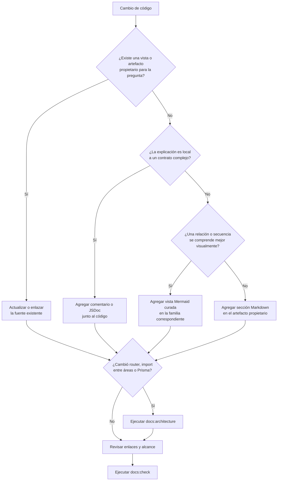

# Guía para documentar técnicamente el código

## Propósito y alcance

Esta guía define **dónde** registrar la explicación técnica de una implementación,
**cómo** identificar archivos y funciones y **cuándo** incluir un diagrama o enlazar
una vista existente. Está dirigida a quienes
mantienen rutas, controladores, DTO, servicios, componentes de interfaz, persistencia y
pruebas. No sustituye los comentarios puntuales del código ni crea un documento por cada
módulo: conecta cada cambio con la fuente de verdad que ya existe.

El detalle técnico se conserva junto al repositorio porque debe evolucionar en la misma
solicitud de cambio que la implementación. Markdown y Mermaid son las fuentes
versionadas; no se adjuntan diagramas editables o imágenes cuando la misma vista puede
mantenerse como texto revisable.

Además de las reglas de mantenimiento, esta entrada separa las referencias concretas de
backend y frontend. Cada una usa un flujo implementado como ejemplo y conserva enlaces
hacia el contrato compartido, sin convertirlo en una plantilla que deba copiarse a todos
los dominios.

## Referencia normativa aplicada

La referencia internacional más cercana a este artefacto es
[ISO/IEC/IEEE 1016:2009](https://www.iso.org/standard/45144.html), dedicada a las
descripciones de diseño de software. Nexus adopta selectivamente su separación de
elementos de diseño, relaciones, interfaces, vistas y justificación. La aplicación y
sus límites se registran en
[Aplicación de normas en Nexus](../governance/standards-application.md#aplicación-de-isoiecieee-1016-a-la-referencia-técnica).

La norma no define cómo nombrar funciones JavaScript, escribir JSDoc, insertar bloques
de código o documentar endpoints Express. Por eso esta guía mantiene una convención
local verificable para nombres, firmas, responsabilidades y evidencia. Las vistas
arquitectónicas se complementan con ISO/IEC/IEEE 42010 y el contrato de las rutas se
documenta manualmente con preparación para OpenAPI 3.1, que no es una norma ISO.

## Ubicación según la pregunta

Antes de escribir, se identifica qué necesita comprender la persona lectora. La
respuesta se agrega al artefacto propietario o se enlaza desde él; no se copia en varios
documentos.

| Pregunta técnica | Ubicación propietaria | Uso de diagramas |
| --- | --- | --- |
| ¿Qué responsabilidad tiene una capa, dominio o componente y cómo colabora? | [Arquitectura y catálogo de vistas web](architecture-and-web-views.md) para contexto y componentes; [diagramas vigentes del código](code-diagrams.md) para estructura, dinámica y reutilización. | Actualizar la vista Mermaid existente si cambia su semántica; crear otra sólo si responde una pregunta diferente. |
| ¿Qué patrón se reutiliza y dónde están sus puntos de extensión? | [Patrones de diseño y construcción](design-and-construction-patterns.md). | Enlazar su diagrama canónico o agregar una vista que evidencie el patrón sin enumerar cada consumidor. |
| ¿Qué rutas e importaciones existen realmente? | [Mapa generado del código](../generated/code-map.md). | Regenerar con `npm run docs:architecture`; no mantener a mano otro inventario. |
| ¿Qué modelos, campos y relaciones persisten? | [Esquema generado](../generated/database-schema.md), [diccionario técnico](../generated/data-dictionary.md) y `prisma/schema.prisma`. | Enlazar el diagrama entidad-relación generado; las decisiones de acceso permanecen en la [familia de datos](../data/index.md). |
| ¿Cuál es el contrato HTTP observable? | [Contrato de la API](../data/api-contract.md); el mapa generado localiza los endpoints registrados. | Un flujo de secuencia puede enlazar el contrato, pero no repetir todas sus respuestas y errores. |
| ¿Por qué existe el comportamiento y qué regla satisface? | [Requisitos](../requirements/index.md) y su [matriz de operaciones](../requirements/requirements-operations-matrix.md). | Enlazar los diagramas funcionales existentes; no inferir actores o reglas desde nombres de funciones. |
| ¿Cómo se comprueba el comportamiento? | [Estrategia](../testing/service-test-coverage.md), [plan de pruebas](../testing/test-plan.md) y pruebas bajo `tests`. | Los diagramas pueden localizar el límite probado, pero la prueba ejecutable conserva la evidencia. |
| ¿Qué decisión local no resulta evidente al leer una función? | Comentario próximo al código o JSDoc, de acuerdo con el [estándar de codificación](coding-standards.md#10-comentarios-y-documentación). | Enlazar una vista estable sólo si aporta contexto; no insertar Mermaid en archivos JavaScript. |

## Separación por entorno de ejecución

La documentación técnica se divide por responsabilidad para evitar mezclar contratos
HTTP y reglas de servidor con interacción del navegador:

- [Backend: controladores y servicios](backend-technical-documentation.md) documenta
  rutas internas, adaptación HTTP, DTO, reglas de dominio, errores, transacciones y
  persistencia.
- [Frontend: navegador e interfaz](frontend-technical-documentation.md) documenta
  servicios HTTP del cliente, aplicaciones, páginas, formularios, UI compartida,
  plugins y composición EJS.

Ambas referencias incluyen una matriz de aplicación al código con una fila para cada
`CU-*`. Esa matriz es la cobertura completa; los diagramas dinámicos se reservan para
los casos cuya coordinación necesita una secuencia o actividad y no sustituyen la
documentación de los casos directos.
Las colecciones completas están en los [diagramas frontend aplicados al
código](frontend-use-case-diagrams.md) y los [diagramas backend aplicados al
código](backend-use-case-diagrams.md); ambas conservan una vista independiente para
cada uno de los 63 casos, incluso cuando la forma de la colaboración se repite.
Antes de esos casos, `DIA-FE-REU-001` y `DIA-BE-REU-001` muestran los puntos comunes;
cada vista específica los referencia y mantiene separado el tramo especializado.

Un flujo completo enlaza ambos documentos mediante la ruta API; no repite en frontend
las reglas propietarias del servidor ni describe en backend detalles visuales del DOM.

## Recorrido para incorporar documentación

El siguiente diagrama decide el destino de una explicación nueva. No representa el
flujo de ejecución de Nexus; representa el mantenimiento documental de un cambio de
código.

Las reglas de notación, nivel de detalle y mantenimiento de una vista nueva permanecen
en las [convenciones de diagramas](diagram-conventions.md#patrón-mínimo-de-cada-diagrama).
En particular, primero se reutiliza la progresión existente de contexto, contenedores,
estructura, dinámica, reutilización y detalle generado.

## Contenido mínimo de una explicación técnica

Una sección técnica nueva debe ser breve y verificable. Incluye sólo los campos que
aportan información al cambio:

1. **propósito y alcance:** responsabilidad explicada y aquello que queda fuera;
2. **punto de entrada:** ruta, evento, vista o función pública desde donde comienza el
   comportamiento;
3. **colaboradores reutilizados:** middleware, DTO, servicio, helper, fábrica,
   componente o transacción ya existente;
4. **reglas y estados relevantes:** enlace al requisito propietario en vez de copiarlo;
5. **persistencia y efectos:** modelos afectados, límite transaccional y eventos, con
   enlace a la familia de datos cuando corresponda;
6. **errores y seguridad:** validaciones, permisos y errores observables que forman
   parte del contrato;
7. **evidencia:** ruta de la prueba o brecha registrada, sin declarar cobertura que no
   se haya ejecutado;
8. **mantenimiento:** cambio que obliga a revisar la explicación o el diagrama.

Los identificadores de código se escriben literalmente entre comillas invertidas y se
enlazan mediante rutas relativas estables. No se pegan cuerpos completos de funciones:
la documentación explica responsabilidades, decisiones y relaciones, mientras Git y el
código conservan el detalle de implementación.

## Cuándo diagramar y cuándo referenciar

Se agrega o modifica un diagrama cuando una relación entre participantes, una secuencia,
una transición de estado o un límite resulta difícil de verificar sólo con prosa. Se
prefiere una referencia cuando la vista existente ya responde la misma pregunta, aunque
el nuevo flujo sea otro consumidor del patrón.

Ejemplos vigentes que deben enlazarse antes de crear otra vista:

- contexto, contenedores, despliegue, componentes y recorrido general en
  [arquitectura y vistas web](architecture-and-web-views.md#1-arquitectura-del-sistema);
- superficie HTTP, colaboración de dominios, petición real y reutilización CRUD en
  [diagramas del código](code-diagrams.md#1-patrón-de-organización-de-las-vistas);
- dependencias reales entre áreas en el
  [mapa generado](../generated/code-map.md#dependencias-entre-áreas);
- entidades y cardinalidades en el
  [esquema generado de base de datos](../generated/database-schema.md);
- flujos funcionales y estados en los
  [diagramas de requisitos](../requirements/requirements-diagrams.md).

No se crea un diagrama por endpoint, tabla o función. Cuando un caso sí requiere una
vista dinámica, ésta se limita a ese `CU-*` y no se generaliza para representar otros
casos mediante nombres alternativos o participantes sustituibles. Tampoco se presenta
una propuesta como arquitectura vigente: una vista futura identifica explícitamente su
estado y no se mezcla con el recorrido implementado.

## Lista de revisión del cambio

1. Confirmar que se consultó la implementación y un flujo equivalente antes de describir
   un patrón nuevo.
2. Enlazar el artefacto propietario y eliminar explicaciones duplicadas.
3. Comprobar que cada nodo y flecha del diagrama tiene evidencia o está marcado como
   propuesta.
4. Revisar que rutas, símbolos, imports, exports, permisos y pruebas citados continúan
   existiendo.
5. Regenerar los inventarios si cambió una fuente derivada y ejecutar
   `npm run docs:check`.
6. Validar el paquete con `npm run docs:export -- arquitectura html --check` para detectar
   fuentes o imágenes ausentes.
