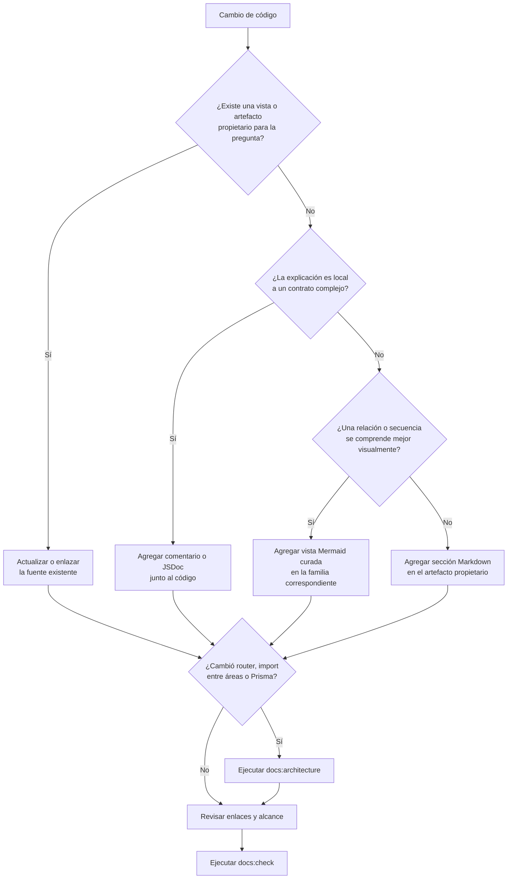

# 5. Recorrido para incorporar documentación

El siguiente diagrama decide el destino de una explicación nueva. No representa el
flujo de ejecución de Nexus; representa el mantenimiento documental de un cambio de
código.

Las reglas de notación, nivel de detalle y mantenimiento de una vista nueva permanecen
en las [convenciones de diagramas](../diagram-conventions/03-patron-minimo-de-cada-diagrama.md#3-patrón-mínimo-de-cada-diagrama).
En particular, primero se reutiliza la progresión existente de contexto, contenedores,
estructura, dinámica, reutilización y detalle generado.
