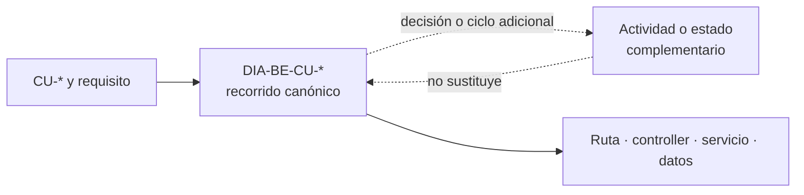
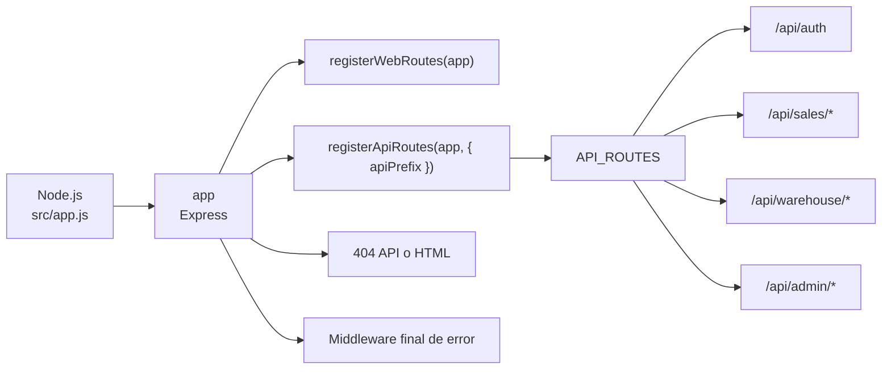
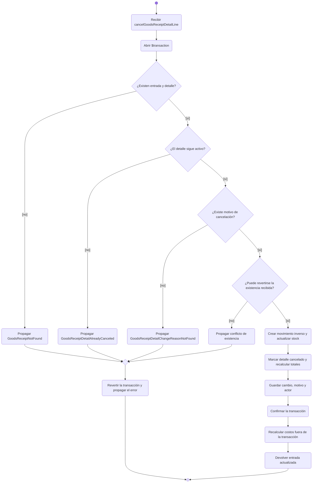
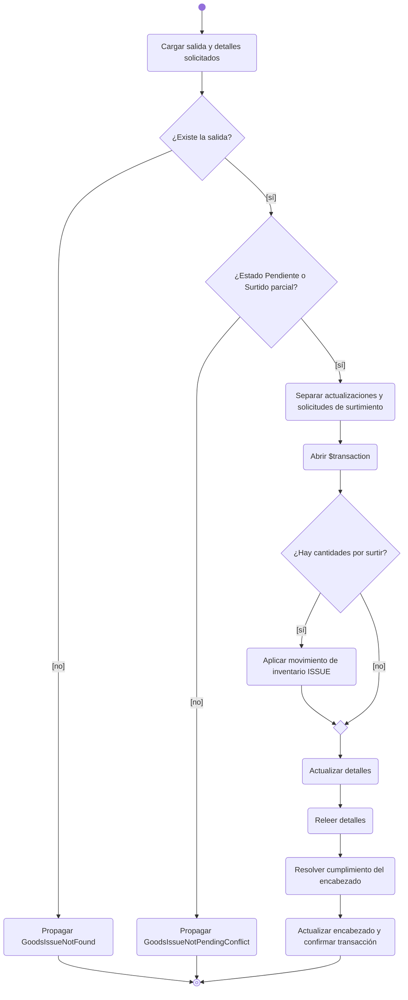
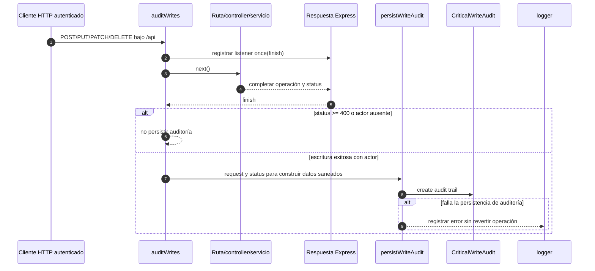
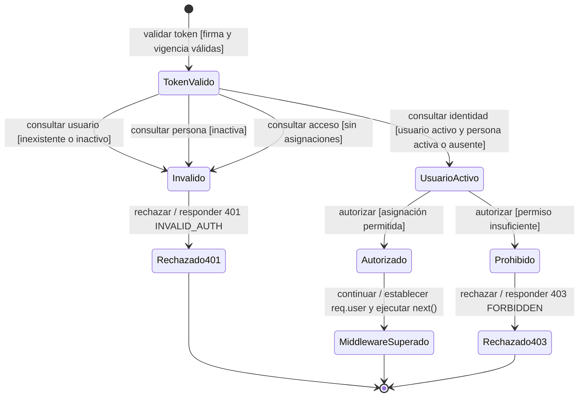
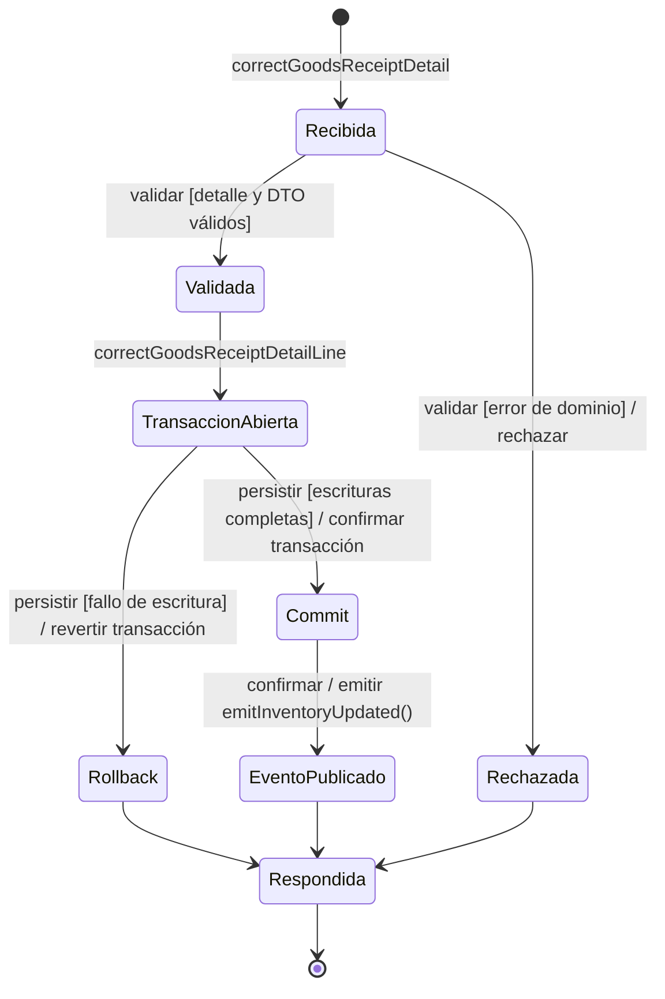

# 2. Diagramas técnicos complementarios

### Relación con la colección canónica

Los 85 recorridos `DIA-BE-CU-*` de `backend-code-sequences/index.md` forman la colección
canónica por caso y son propietarios del orden ruta → controller → servicio →
persistencia o efecto. Este documento conserva únicamente diagramas que contestan una
pregunta adicional. Un diagrama complementario no reemplaza la secuencia enlazada, no
amplía su cobertura y no obliga a copiarla.

| Diagrama conservado | Pregunta adicional | Complementa |
| --- | --- | --- |
| `DIA-BE-TEC-EST-RUT-01` · registro de rutas | ¿Cómo se monta la superficie Express completa? | `src/app.js`, `API_ROUTES` y el mapa generado; no representa un `CU-*`. |
| `DIA-BE-ACT-002` · `CU-ENT-05` | ¿Qué decisiones provocan rechazo, rollback o cancelación? | `DIA-BE-CU-ENT-05` y la máquina normativa si cambia un estado de negocio. |
| `DIA-BE-ACT-001` · `CU-SAL-05` | ¿Cómo se separan actualización, surtimiento y errores? | `DIA-BE-CU-SAL-05` y los estados normativos de salidas. |
| `DIA-BE-SEQ-006` · `RN-008` | ¿Cuándo ocurre la auditoría y puede revertir la operación? | Escrituras API observadas mediante `finish`; documenta la garantía *best effort*. |
| `DIA-BE-TEC-EST-AUT-01` | ¿Qué condiciones permiten superar autorización? | Secuencias autenticadas; distingue token, cuenta activa y permiso efectivo. |
| `DIA-BE-TEC-EST-CU-ENT-04` | ¿Cuál es el ciclo técnico de una corrección? | `DIA-BE-CU-ENT-04`, su transacción y la publicación posterior. |

Las antiguas secuencias selectivas de autenticación, ajustes, entrada, corrección,
surtimientos y devoluciones no se mantienen aquí: respondían la misma pregunta que sus
`DIA-BE-CU-*`. Su detalle quedó consolidado en la colección canónica. Así, una operación
compleja puede tener más de un **diagrama**, pero nunca dos fuentes para el mismo recorrido.

### Registro de rutas

**Identificador:** `DIA-BE-TEC-EST-RUT-01`. **Pregunta:** ¿cómo se registra la
superficie HTTP y dónde terminan las peticiones que no encuentran una ruta?

Se revisa si cambia el orden de montaje en `src/app.js`, el contrato de
`registerApiRoutes` o las áreas de `API_ROUTES`.

### Actividad de cancelación de un detalle de entrada

**Identificador:** `DIA-BE-ACT-002`. **Caso:** `CU-ENT-05`. Este diagrama enfatiza las
decisiones exclusivas de cancelación y la ausencia de una segunda identidad corregida.

La figura usa la [convención de actividades](../../processes/index.md#notación-de-actividades)
como aproximación a UML mediante Mermaid.

### Actividad de decisión y surtimiento de materiales

**Identificador:** `DIA-BE-ACT-001`. **Caso:** `CU-SAL-05`. Esta actividad complementa
`DIA-BE-CU-SAL-05` exclusivamente para `GoodsIssue`: hace visibles sus errores y sus
decisiones de estado sin presentarlas como equivalentes a las de `WasteIssue`.

La figura usa la [convención de actividades](../../processes/index.md#notación-de-actividades)
como aproximación a UML mediante Mermaid.

La actividad resume las decisiones de dominio, sin desplegar cada fallo técnico de
lectura o escritura. Un fallo dentro de la transacción provoca rollback y termina la
operación; su propagación se detalla en la secuencia canónica. El recálculo de costos de
la cancelación ocurre después del commit y no puede revertir esa transacción.

La actividad complementa la secuencia porque hace visibles errores y bifurcaciones. La
evidencia del adaptador está en
[`goodsIssueControllerTest.js`](../../../../../tests/unit/controllers/api/warehouse/goodsIssueControllerTest.js);
la cobertura y brechas de servicios permanecen en el [plan de pruebas](../../../../testing/test-plan.md).
La aplicación por caso y su evidencia se consulta en la
[vista de componentes](../../logical/01-components-and-reuse.md). El identificador,
propósito y fuente de verdad de cada gráfico se mantienen junto al diagrama, sin otro
inventario manual.

### Secuencia transversal de auditoría de escrituras

**Identificador:** `DIA-BE-SEQ-006`. **Requisito:** `RN-008`. La auditoría observa la
respuesta HTTP y no forma parte de la transacción funcional actual; este diagrama hace
explícita esa garantía *best effort*.

### Estados técnicos complementarios

Estos diagramas permanecen aquí porque añaden ciclos técnicos que no repite la colección
de secuencias por caso.

**Estado técnico complementario:** `DIA-BE-TEC-EST-AUT-01`. Una máquina de estados es
la representación adecuada porque la pregunta es si la cuenta conserva las condiciones para
atravesar el middleware entre peticiones; una secuencia explica el orden de una petición,
pero no expresa con igual claridad la pérdida de elegibilidad. `getLoggedUser(userId)`
vuelve a consultar estas condiciones en `authorizeUserApi` y `authorizeUserWeb`.

El estado **Usuario activo** exige `User.isActive`, una `Person.isActive` cuando la cuenta
es humana y al menos una asignación vigente. El JWT sólo conduce a **Token válido**; no
evita que una desactivación o la pérdida de asignaciones bloquee la siguiente petición.

**Estado técnico complementario:** `DIA-BE-TEC-EST-CU-ENT-04`. Muestra el ciclo de la
transacción de corrección; los estados funcionales permanecen en requisitos.

