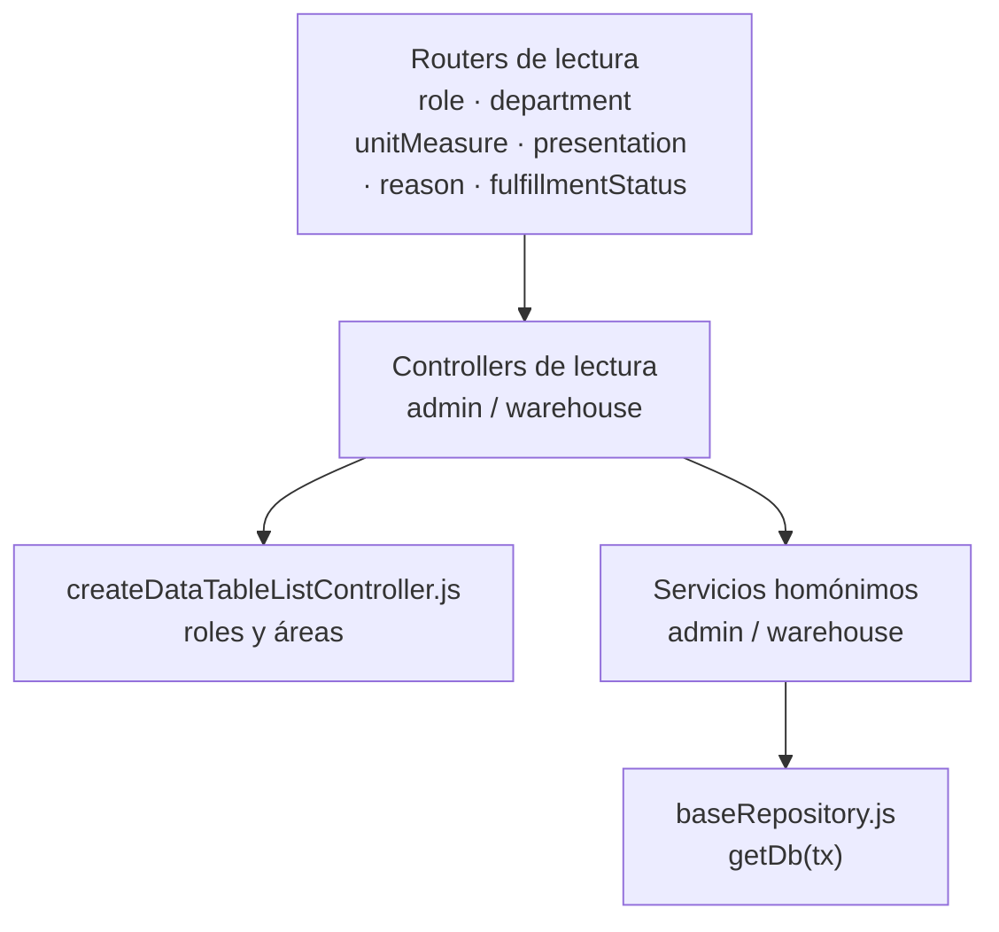
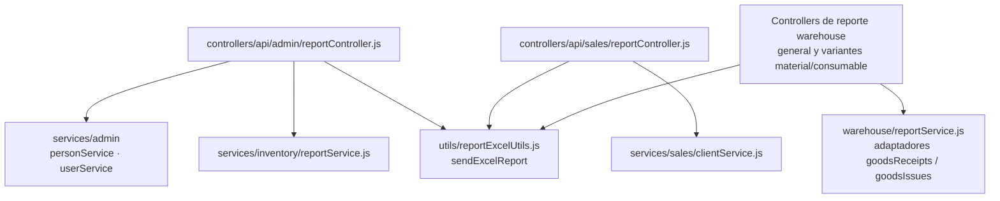
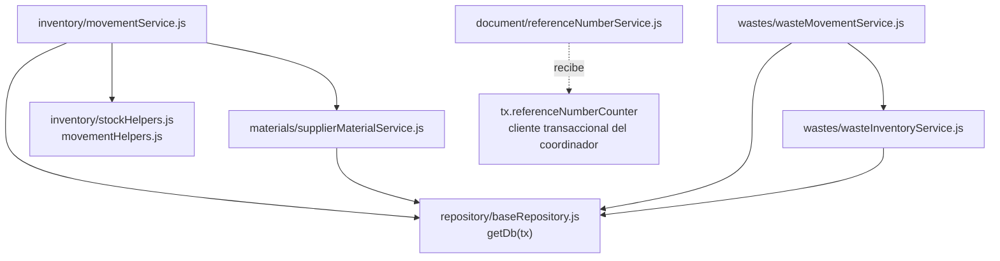

# 3. Código compartido y cobertura del transporte backend

Los 13 mapas de módulos cubren responsabilidades funcionales, con variantes tipadas
en compras y salidas. Este capítulo completa lecturas operativas, reportes, transporte
web y colaboradores transversales. La unidad de agrupación no crea otro servicio ni
otro caso de uso.

## Cobertura de routers API

Cada router importado por `src/routes/api/index.js` tiene un propietario de código.
Los reportes se conservan junto al recurso cuya consulta exportan; las lecturas
operativas no se confunden con la administración genérica de catálogos.

| Router registrado | Controller(s) importados | Mapa propietario |
| --- | --- | --- |
| `admin/catalogApiRoute.js` | `admin/catalogController.js` | [Módulo](16-catalogs-code.md) |
| `admin/departmentApiRoute.js` | `admin/departmentController.js` | [Código compartido](#lecturas-operativas-y-reportes) |
| `admin/movementApiRoute.js` | `admin/movementController.js` | [Módulo](15-movements-code.md) |
| `admin/personApiRoute.js` | `admin/personController.js` | [Módulo](05-persons-code.md) |
| `admin/reportApiRoute.js` | `admin/reportController.js` | [Código compartido](#lecturas-operativas-y-reportes) |
| `admin/roleApiRoute.js` | `admin/roleController.js` | [Código compartido](#lecturas-operativas-y-reportes) |
| `admin/userApiRoute.js` | `admin/userController.js` | [Módulo](06-users-code.md) |
| `authApiRoute.js` | `authController.js` | [Módulo](04-authentication-code.md) |
| `sales/clientApiRoute.js` | `sales/clientController.js` | [Módulo](07-clients-code.md) |
| `sales/reportApiRoute.js` | `sales/reportController.js` | [Código compartido](#lecturas-operativas-y-reportes) |
| `warehouse/consumableApiRoute.js` | `warehouse/consumableController.js` | [Módulo](10-consumables-code.md) |
| `warehouse/fulfillmentStatusApiRoute.js` | `warehouse/fulfillmentStatusController.js` | [Código compartido](#lecturas-operativas-y-reportes) |
| `warehouse/goodsIssues/consumables/` `consumableGoodsIssueApiRoute.js` | `warehouse/goodsIssues/consumables/` `consumableGoodsIssueController.js` | [Módulo](13-goods-issues-code.md) |
| `warehouse/goodsIssues/consumables/` `consumableGoodsIssueReportApiRoute.js` | `warehouse/goodsIssues/consumables/` `consumableGoodsIssueReportController.js` | [Módulo](13-goods-issues-code.md) |
| `warehouse/goodsIssues/materials/` `materialGoodsIssueApiRoute.js` | `warehouse/goodsIssues/materials/` `materialGoodsIssueController.js` | [Módulo](13-goods-issues-code.md) |
| `warehouse/goodsIssues/materials/` `materialGoodsIssueReportApiRoute.js` | `warehouse/goodsIssues/materials/` `materialGoodsIssueReportController.js` | [Módulo](13-goods-issues-code.md) |
| `warehouse/goodsReceipts/consumables/` `consumableGoodsReceiptApiRoute.js` | `warehouse/goodsReceipts/consumables/` `consumableGoodsReceiptController.js` | [Módulo](12-goods-receipts-code.md) |
| `warehouse/goodsReceipts/consumables/` `consumableGoodsReceiptReportApiRoute.js` | `warehouse/goodsReceipts/consumables/` `consumableGoodsReceiptReportController.js` | [Módulo](12-goods-receipts-code.md) |
| `warehouse/goodsReceipts/materials/` `materialGoodsReceiptApiRoute.js` | `warehouse/goodsReceipts/materials/` `materialGoodsReceiptController.js` | [Módulo](12-goods-receipts-code.md) |
| `warehouse/goodsReceipts/materials/` `materialGoodsReceiptReportApiRoute.js` | `warehouse/goodsReceipts/materials/` `materialGoodsReceiptReportController.js` | [Módulo](12-goods-receipts-code.md) |
| `warehouse/materialApiRoute.js` | `warehouse/materialController.js` | [Módulo](09-materials-code.md) |
| `warehouse/presentationApiRoute.js` | `warehouse/presentationController.js` | [Código compartido](#lecturas-operativas-y-reportes) |
| `warehouse/reasonApiRoute.js` | `warehouse/reasonController.js` | [Código compartido](#lecturas-operativas-y-reportes) |
| `warehouse/reportApiRoute.js` | `warehouse/reportController.js` | [Código compartido](#lecturas-operativas-y-reportes) |
| `warehouse/supplierApiRoute.js` | `warehouse/supplierController.js` | [Módulo](08-suppliers-code.md) |
| `warehouse/unitMeasureApiRoute.js` | `warehouse/unitMeasureController.js` | [Código compartido](#lecturas-operativas-y-reportes) |
| `warehouse/wasteApiRoute.js` | `warehouse/wasteController.js` | [Módulo](11-wastes-code.md) |
| `warehouse/wasteIssueApiRoute.js` | `warehouse/wasteIssueController.js` | [Módulo](14-waste-issues-code.md) |

## Lecturas operativas y reportes

Los routers `role`, `department`, `unitMeasure`, `presentation`, `reason` y
`fulfillmentStatus` llaman a controllers/servicios propios. Roles y áreas configuran
`createDataTableListController`; los demás mantienen su contrato de lectura. Las
escrituras administrativas están en `catalogService`, gobernadas por `MANAGED_CATALOGS`.
No se construyen seis implementaciones nuevas del CRUD administrativo.

**Identificador:** `DIA-BE-MOD-OPS-001`. **Fuente:** imports de los seis routers,
controllers y servicios de lectura. **Leyenda:** flechas = import entre grupos.

| Controllers operativos | Servicios importados |
| --- | --- |
| `controllers/api/admin/roleController.js` | `services/admin/roleService.js` |
| `controllers/api/admin/` `departmentController.js` | `services/admin/departmentService.js` |
| `controllers/api/warehouse/` `unitMeasureController.js` | `services/warehouse/unitMeasureService.js` |
| `controllers/api/warehouse/` `presentationController.js` | `services/warehouse/presentationService.js` |
| `controllers/api/warehouse/` `reasonController.js` | `services/warehouse/reasonService.js` |
| `controllers/api/warehouse/` `fulfillmentStatusController.js` | `services/warehouse/` `fulfillmentStatusService.js` |

**Identificador:** `DIA-BE-MOD-REP-001`. **Fuente:** imports de los controllers de reporte.
**Leyenda:** flechas = import; los nodos agrupan consultas por área.

Los reportes conservan permiso, consulta y columnas propios. `reportExcelUtils` sólo
construye/envía Excel a partir de la configuración recibida. El mapa cubre tanto
`reportController.js` de cada área como los controllers específicos de reportes de
compras y salidas, enumerados en el registro anterior.

## Transporte web y plantillas

`registerWebRoutes` monta páginas y redirecciones. Los controllers web preparan
`res.render`; los imports de servicios, si existen, conservan una responsabilidad
explícita de sesión. El router raíz resuelve redirección directamente, sin un
controller de portada independiente.

| Router web | Dependencia de controller o middleware propia |
| --- | --- |
| `admin/catalogWebRoute.js` | `src/controllers/web/admin/` `catalogController.js` `src/middleware/authMiddleware.js` |
| `admin/movementWebRoute.js` | `src/controllers/web/admin/` `movementController.js` `src/middleware/authMiddleware.js` |
| `admin/personWebRoute.js` | `src/controllers/web/admin/` `personController.js` `src/middleware/authMiddleware.js` |
| `admin/userWebRoute.js` | `src/controllers/web/admin/` `userController.js` `src/middleware/authMiddleware.js` |
| `auth/loginWebRoute.js` | `src/controllers/web/authController.js` |
| `auth/logoutWebRoute.js` | `src/controllers/web/authController.js` |
| `auth/refreshWebRoute.js` | `src/controllers/web/authController.js` |
| `homeWebRoute.js` | `src/middleware/authMiddleware.js` |
| `sales/clientWebRoute.js` | `src/controllers/web/sales/` `clientController.js` `src/middleware/authMiddleware.js` |
| `warehouse/consumableWebRoute.js` | `src/controllers/web/warehouse/` `consumableController.js` `src/middleware/authMiddleware.js` |
| `warehouse/goodsIssues/` `goodsIssueWebRoute.js` | `src/controllers/web/warehouse/goodsIssues/` `goodsIssueController.js` `src/middleware/authMiddleware.js` |
| `warehouse/goodsReceipts/` `goodsReceiptWebRoute.js` | `src/controllers/web/warehouse/` `goodsReceipts/goodsReceiptController.js` `src/middleware/authMiddleware.js` |
| `warehouse/materialWebRoute.js` | `src/controllers/web/warehouse/` `materialController.js` `src/middleware/authMiddleware.js` |
| `warehouse/supplierWebRoute.js` | `src/controllers/web/warehouse/` `supplierController.js` `src/middleware/authMiddleware.js` |
| `warehouse/wasteIssueWebRoute.js` | `src/controllers/web/warehouse/` `wasteIssueController.js` `src/middleware/authMiddleware.js` |
| `warehouse/wasteWebRoute.js` | `src/controllers/web/warehouse/` `wasteController.js` `src/middleware/authMiddleware.js` |

Las plantillas propietarias están en `src/views/pages/{admin,sales,warehouse,home}`;
los parciales y layout se componen desde `src/views/shared` y `src/views/layout`.
La [referencia frontend](../frontend-technical-documentation/index.md) identifica los
módulos del navegador servidos con cada familia de pantallas.

## Inventario y referencias documentales compartidos

**Identificador:** `DIA-BE-MOD-INV-001`. **Fuente:** imports de los archivos nombrados;
`referenceNumberService` recibe `tx` como argumento. **Leyenda:** flechas continuas =
import; la discontinua = contexto recibido y usado, no import de `baseRepository`.

Los servicios de compras, salidas y ajustes importan estos colaboradores y pasan el
contexto correspondiente. El módulo `inventory` contiene además consultas/reportes e
identidad de materiales; `wastes` mantiene movimiento e inventario de merma propios.
Los folios no importan `getDb`: usan directamente el `tx` obligatorio recibido.
El orden de escritura/rollback pertenece a las secuencias de procesos.

## Seguridad, auditoría y persistencia

| Mecanismo | Propietario de código y frontera |
| --- | --- |
| Acceso API/web | `middleware/authMiddleware.js`, `services/authService.js`, `services/admin/userService.js`, permisos y políticas. Los routers declaran qué controles utilizan. |
| JWT/cookies | `services/jwtService.js`, `utils/cookiesUtils.js` y controllers de autenticación. No son estados del módulo funcional. |
| Auditoría | `app.js` importa `auditMiddleware`; éste importa `auditService`, que usa `getDb` y `CriticalWriteAudit`. Su comportamiento asíncrono tiene una [secuencia única en procesos](../../processes/shared-runtime-behavior/01-write-audit.md). |
| Prisma | `repository/baseRepository.js` selecciona cliente/tx; `lib/prisma.js` construye la instancia compartida con el cliente generado y `PrismaPg`. [Integración de Prisma](../code-structure/06-prisma-and-persistence.md). |
| Errores/logging | `errors`, `messages`, `serviceErrorHandler` y `utils/logger.js`; se importan desde sus propietarios y el middleware final. |

Las tablas son evidencia de composición: no contienen un orden de llamadas ni estados
funcionales. Cambiar un import exige revisar los mapas afectados y su contrato; cambiar
el comportamiento exige revisar el recorrido propietario en procesos/requisitos.
