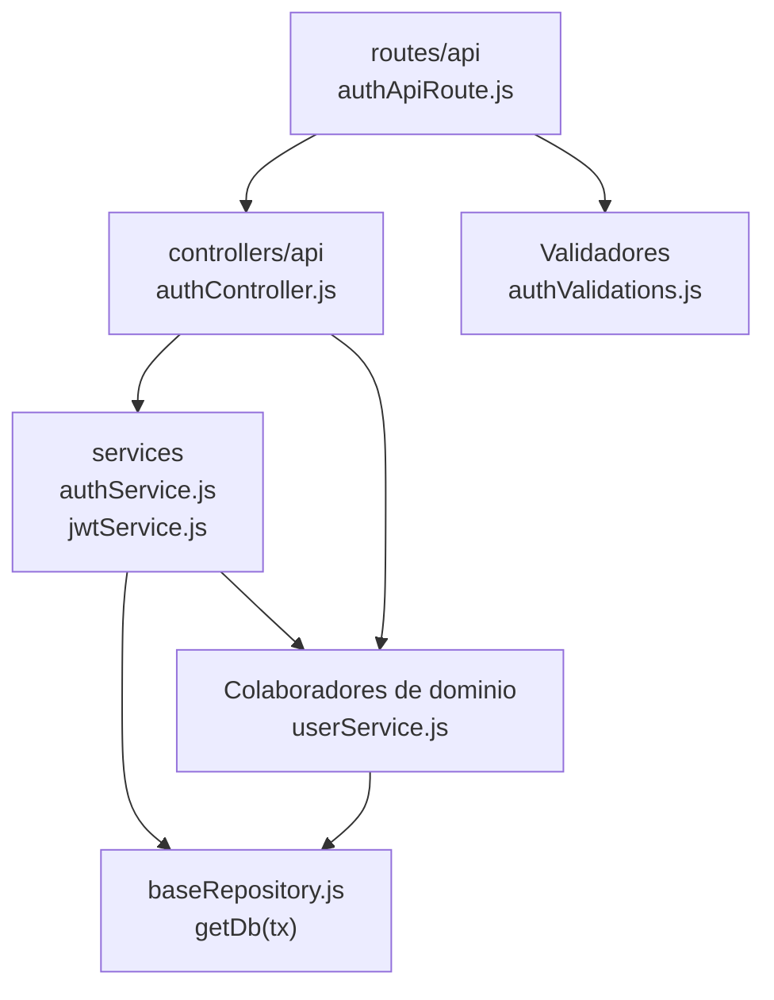

# 4. Autenticación: estructura de código

**Identificador:** `DIA-BE-MOD-AUT-001`.
**Alcance:** grupos de implementación del módulo y sus dependencias directas.
**Fuente:** imports de los archivos de la tabla.

| Grupo del mapa | Archivos que lo componen |
| --- | --- |
| routes/api · authApiRoute.js | `src/routes/api/authApiRoute.js` |
| controllers/api · authController.js | `src/controllers/api/authController.js` |
| services · authService.js · jwtService.js · y colaboradores | `src/services/authService.js` `src/services/jwtService.js` `src/services/roleService.js` |
| Colaboradores de dominio · userService.js | `src/services/admin/userService.js` |
| Validadores · authValidations.js | `src/validators/forms/authValidations.js` |
| baseRepository.js · getDb(tx) | `src/repository/baseRepository.js` |

## Contratos de implementación

### Datos, resultados y efectos del módulo

| Capacidad | Entrada y retorno | Reglas, errores y persistencia |
| --- | --- | --- |
| Autenticación y autorización | Las rutas protegidas pasan por token requerido y permiso; `authController.js` adapta login, usuario actual y renovación. | `authService.js`, `jwtService.js`, cookies y tokens; no persiste dominio salvo la lectura del usuario. |

Los controllers de este módulo exponen estas operaciones. Un export construido por
un handler conserva su configuración local; no se supone un DTO ni una transacción
para todas las operaciones. Los datos, resultados y efectos están definidos en la tabla anterior.

| Archivo bajo `src/` | Símbolos públicos y puntos de configuración |
| --- | --- |
| `controllers/api/authController.js` | `login` `refreshAuthToken` `getCurrentUser` |

## Variantes y límites de reutilización

El controller de autenticación usa authService; éste consulta userService y delega JWT. Cookies y errores permanecen en sus helpers. El login web usa un controller distinto al de la API.

Los grupos del mapa representan imports seleccionados. Los permisos y middleware
se comprueban en cada router; los servicios conservan validaciones, errores y
persistencia propios. Compartir `getDb(tx)` no implica que toda operación abra una
transacción. La integración de [Prisma](../code-structure/06-prisma-and-persistence.md)
y los [mecanismos backend reutilizables](../reuse-and-refactoring/01-backend-handlers-and-services.md)
tienen una fuente de detalle común.

Los reportes y la infraestructura transversal se localizan en el
[capítulo 3](03-shared-code-and-coverage.md); el orden de llamadas está en
[procesos](../../processes/backend-code-sequences/index.md).

