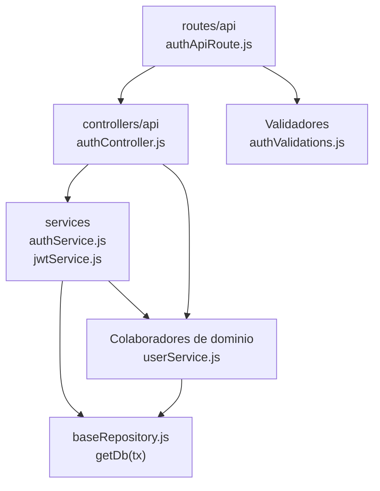

# 4. Autenticación: estructura de código

**Identificador:** `DIA-BE-MOD-AUT-001`.
**Alcance:** grupos de implementación del módulo y sus dependencias directas.
**Fuente:** imports de los archivos de la tabla.

El controller de autenticación usa authService; éste consulta userService y delega JWT. Cookies y errores permanecen en sus helpers. El login web usa un controller distinto al de la API.

| Grupo del mapa | Archivos que lo componen |
| --- | --- |
| routes/api · authApiRoute.js | `src/routes/api/authApiRoute.js` |
| controllers/api · authController.js | `src/controllers/api/authController.js` |
| services · authService.js · jwtService.js · y colaboradores | `src/services/authService.js` `src/services/jwtService.js` `src/services/roleService.js` |
| Colaboradores de dominio · userService.js | `src/services/admin/userService.js` |
| Validadores · authValidations.js | `src/validators/forms/authValidations.js` |
| baseRepository.js · getDb(tx) | `src/repository/baseRepository.js` |

Los reportes y la infraestructura transversal se localizan en el
[capítulo 3](03-shared-code-and-coverage.md); el orden de llamadas está en
[procesos](../../processes/backend-code-sequences/index.md).

