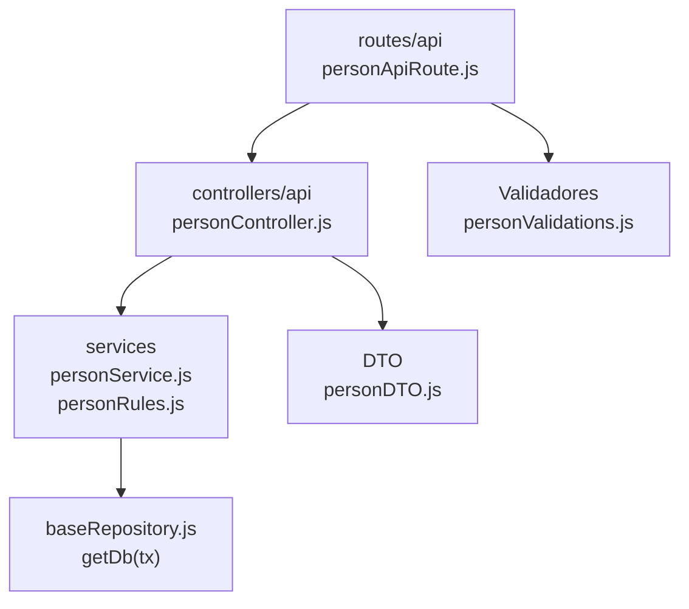

# 5. Personas: estructura de código

**Identificador:** `DIA-BE-MOD-PER-001`.
**Alcance:** grupos de implementación del módulo y sus dependencias directas.
**Fuente:** imports de los archivos de la tabla.

personController importa personDTO y personService; personRules es un colaborador de validación del dominio utilizado también desde salidas.

| Grupo del mapa | Archivos que lo componen |
| --- | --- |
| routes/api · personApiRoute.js | `src/routes/api/admin/personApiRoute.js` |
| controllers/api · personController.js | `src/controllers/api/admin/` `personController.js` |
| services · personRules.js · personService.js | `src/services/admin/person/personRules.js` `src/services/admin/person/personService.js` |
| DTO · personDTO.js | `src/dtos/personDTO.js` |
| Validadores · personValidations.js | `src/validators/forms/personValidations.js` |
| baseRepository.js · getDb(tx) | `src/repository/baseRepository.js` |

Los reportes y la infraestructura transversal se localizan en el
[capítulo 3](03-shared-code-and-coverage.md); el orden de llamadas está en
[procesos](../../processes/backend-code-sequences/index.md).

