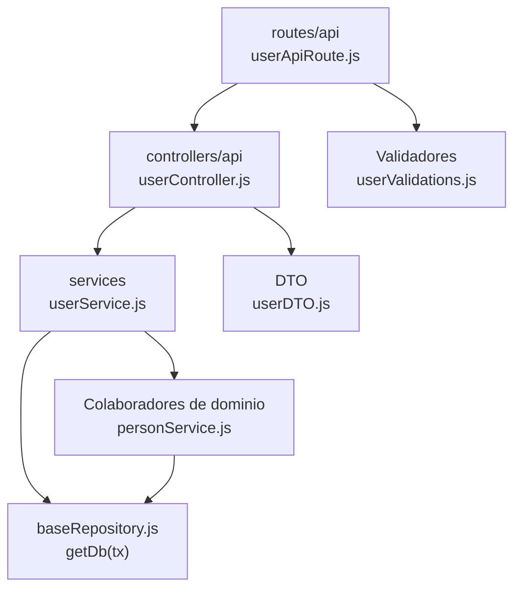

# 6. Usuarios: estructura de código

**Identificador:** `DIA-BE-MOD-USR-001`.
**Alcance:** grupos de implementación del módulo y sus dependencias directas.
**Fuente:** imports de los archivos de la tabla.

userController importa userDTO y userService. userService depende de personService y encryptionUtils; las credenciales se tratan en ese servicio, no en el router.

| Grupo del mapa | Archivos que lo componen |
| --- | --- |
| routes/api · userApiRoute.js | `src/routes/api/admin/userApiRoute.js` |
| controllers/api · userController.js | `src/controllers/api/admin/` `userController.js` |
| services · userService.js | `src/services/admin/userService.js` |
| DTO · userDTO.js | `src/dtos/userDTO.js` |
| Colaboradores de dominio · personService.js | `src/services/admin/person/personService.js` |
| Validadores · userValidations.js | `src/validators/forms/userValidations.js` |
| baseRepository.js · getDb(tx) | `src/repository/baseRepository.js` |

Los reportes y la infraestructura transversal se localizan en el
[capítulo 3](03-shared-code-and-coverage.md); el orden de llamadas está en
[procesos](../../processes/backend-code-sequences/index.md).

