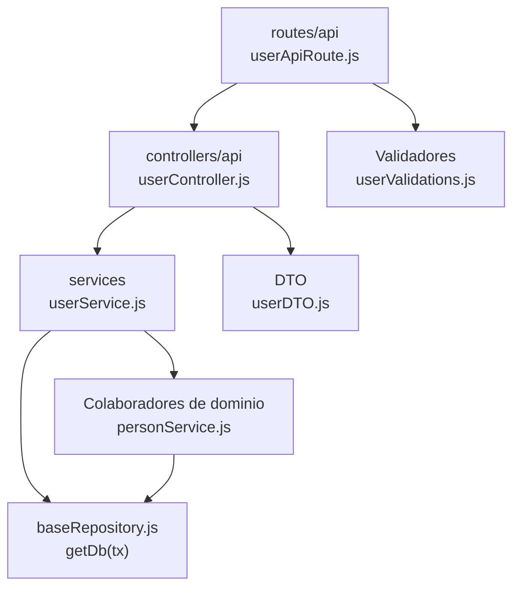

# 6. Usuarios: estructura de código

**Identificador:** `DIA-BE-MOD-USR-001`.
**Alcance:** grupos de implementación del módulo y sus dependencias directas.
**Fuente:** imports de los archivos de la tabla.

| Grupo del mapa | Archivos que lo componen |
| --- | --- |
| routes/api · userApiRoute.js | `src/routes/api/admin/userApiRoute.js` |
| controllers/api · userController.js | `src/controllers/api/admin/` `userController.js` |
| services · userService.js | `src/services/admin/userService.js` |
| DTO · userDTO.js | `src/dtos/userDTO.js` |
| Colaboradores de dominio · personService.js | `src/services/admin/person/personService.js` |
| Validadores · userValidations.js | `src/validators/forms/userValidations.js` |
| baseRepository.js · getDb(tx) | `src/repository/baseRepository.js` |

## Contratos de implementación

### Datos, resultados y efectos del módulo

| Capacidad | Entrada y retorno | Reglas, errores y persistencia |
| --- | --- | --- |
| Usuarios: `userController.js`, `userService.js`, `roleService.js` | Lista, alta, edición y cambio de contraseña toman parámetros/cuerpo y retornan usuario sin convertir el controlador en dueño de credenciales. | Resuelve persona, rol y contraseña; escribe `User` y propaga conflictos/no encontrados. |

Los controllers de este módulo exponen estas operaciones. Un export construido por
un handler conserva su configuración local; no se supone un DTO ni una transacción
para todas las operaciones. Los datos, resultados y efectos están definidos en la tabla anterior.

| Archivo bajo `src/` | Símbolos públicos y puntos de configuración |
| --- | --- |
| `controllers/api/admin/userController.js` | `getAllUsers` `registerUser` `editUser` `editUserPassword` |

### Normalización de datos

| Archivo bajo `src/` | Símbolos públicos y puntos de configuración |
| --- | --- |
| `dtos/userDTO.js` | `createUserDtoForRegister` `createUserDtoForEdit` `createUserPasswordDtoForEdit` `createUserDtoForToken` |

## Variantes y límites de reutilización

userController importa userDTO y userService. userService depende de personService y encryptionUtils; las credenciales se tratan en ese servicio, no en el router.

Los grupos del mapa representan imports seleccionados. Los permisos y middleware
se comprueban en cada router; los servicios conservan validaciones, errores y
persistencia propios. Compartir `getDb(tx)` no implica que toda operación abra una
transacción. La integración de [Prisma](../code-structure/06-prisma-and-persistence.md)
y los [mecanismos backend reutilizables](../reuse-and-refactoring/01-backend-handlers-and-services.md)
tienen una fuente de detalle común.

Los reportes y la infraestructura transversal se localizan en el
[capítulo 3](03-shared-code-and-coverage.md); el orden de llamadas está en
[procesos](../../processes/backend-code-sequences/index.md).

