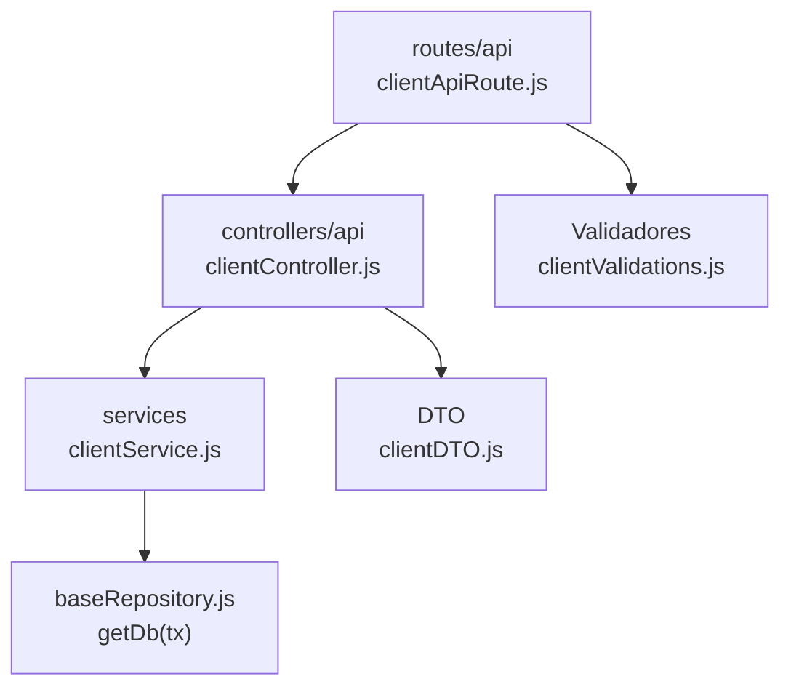

# 7. Clientes: estructura de código

**Identificador:** `DIA-BE-MOD-CLI-001`.
**Alcance:** grupos de implementación del módulo y sus dependencias directas.
**Fuente:** imports de los archivos de la tabla.

| Grupo del mapa | Archivos que lo componen |
| --- | --- |
| routes/api · clientApiRoute.js | `src/routes/api/sales/clientApiRoute.js` |
| controllers/api · clientController.js | `src/controllers/api/sales/` `clientController.js` |
| services · clientService.js | `src/services/sales/clientService.js` |
| DTO · clientDTO.js | `src/dtos/clientDTO.js` |
| Validadores · clientValidations.js | `src/validators/forms/clientValidations.js` |
| baseRepository.js · getDb(tx) | `src/repository/baseRepository.js` |

## Contratos de implementación

### Datos, resultados y efectos del módulo

| Capacidad | Entrada y retorno | Reglas, errores y persistencia |
| --- | --- | --- |
| Clientes: `sales/clientController.js`, `clientService.js` | Lista, alta y edición (`GET`, `POST`, `PUT`) adaptan DTO y retornan cliente. | Lee y escribe `Client` mediante `getDb(tx)` y traduce ausencia o fallos de persistencia a errores del dominio. |

Los controllers de este módulo exponen estas operaciones. Un export construido por
un handler conserva su configuración local; no se supone un DTO ni una transacción
para todas las operaciones. Los datos, resultados y efectos están definidos en la tabla anterior.

| Archivo bajo `src/` | Símbolos públicos y puntos de configuración |
| --- | --- |
| `controllers/api/sales/clientController.js` | `getAllClients` `registerClient` `editClient` |

### Normalización de datos

| Archivo bajo `src/` | Símbolos públicos y puntos de configuración |
| --- | --- |
| `dtos/clientDTO.js` | `createClientDtoForRegister` `createClientDtoForEdit` |

## Variantes y límites de reutilización

clientController depende de clientDTO y clientService. El servicio se reutiliza desde encabezados de salidas; el reporte del cliente conserva un controller separado.

Los grupos del mapa representan imports seleccionados. Los permisos y middleware
se comprueban en cada router; los servicios conservan validaciones, errores y
persistencia propios. Compartir `getDb(tx)` no implica que toda operación abra una
transacción. La integración de [Prisma](../code-structure/06-prisma-and-persistence.md)
y los [mecanismos backend reutilizables](../reuse-and-refactoring/01-backend-handlers-and-services.md)
tienen una fuente de detalle común.

Los reportes y la infraestructura transversal se localizan en el
[capítulo 3](03-shared-code-and-coverage.md); el orden de llamadas está en
[procesos](../../processes/backend-code-sequences/index.md).

