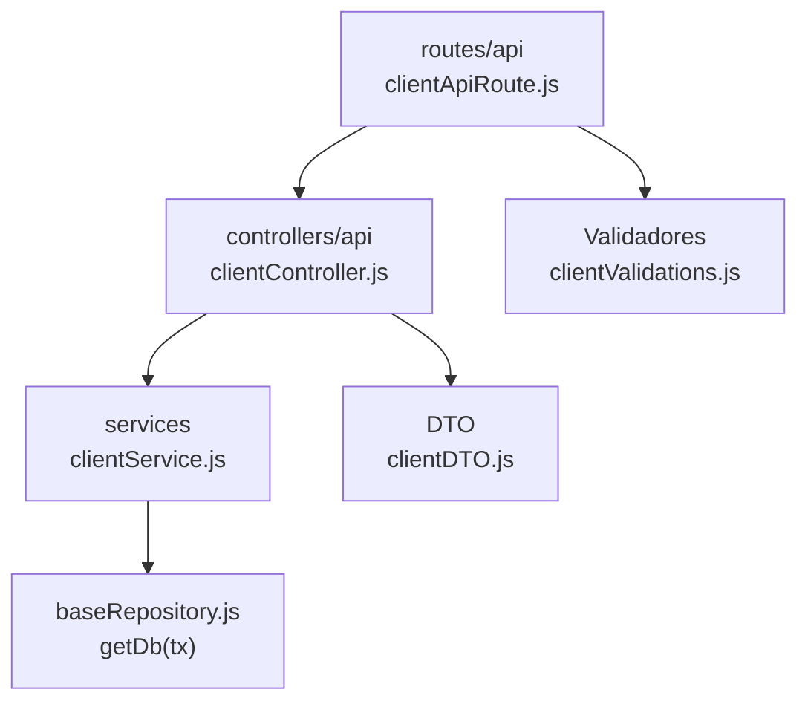

# 7. Clientes: estructura de código

**Identificador:** `DIA-BE-MOD-CLI-001`.
**Alcance:** grupos de implementación del módulo y sus dependencias directas.
**Fuente:** imports de los archivos de la tabla.

clientController depende de clientDTO y clientService. El servicio se reutiliza desde encabezados de salidas; el reporte del cliente conserva un controller separado.

| Grupo del mapa | Archivos que lo componen |
| --- | --- |
| routes/api · clientApiRoute.js | `src/routes/api/sales/clientApiRoute.js` |
| controllers/api · clientController.js | `src/controllers/api/sales/` `clientController.js` |
| services · clientService.js | `src/services/sales/clientService.js` |
| DTO · clientDTO.js | `src/dtos/clientDTO.js` |
| Validadores · clientValidations.js | `src/validators/forms/clientValidations.js` |
| baseRepository.js · getDb(tx) | `src/repository/baseRepository.js` |

Los reportes y la infraestructura transversal se localizan en el
[capítulo 3](03-shared-code-and-coverage.md); el orden de llamadas está en
[procesos](../../processes/backend-code-sequences/index.md).

