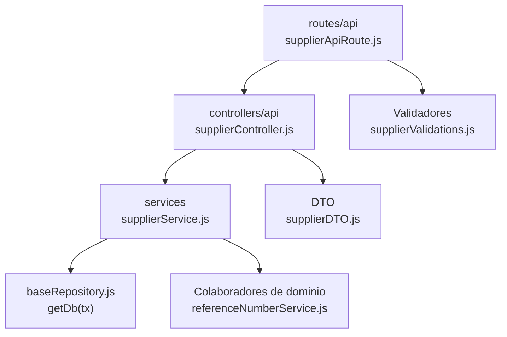

# 8. Proveedores: estructura de código

**Identificador:** `DIA-BE-MOD-SUP-001`.
**Alcance:** grupos de implementación del módulo y sus dependencias directas.
**Fuente:** imports de los archivos de la tabla.

| Grupo del mapa | Archivos que lo componen |
| --- | --- |
| routes/api · supplierApiRoute.js | `src/routes/api/warehouse/` `supplierApiRoute.js` |
| controllers/api · supplierController.js | `src/controllers/api/warehouse/` `supplierController.js` |
| services · supplierService.js | `src/services/warehouse/supplierService.js` |
| DTO · supplierDTO.js | `src/dtos/supplierDTO.js` |
| Colaboradores de dominio · referenceNumberService.js | `src/services/document/` `referenceNumberService.js` |
| Validadores · supplierValidations.js | `src/validators/forms/` `supplierValidations.js` |
| baseRepository.js · getDb(tx) | `src/repository/baseRepository.js` |

## Contratos de implementación

### Datos, resultados y efectos del módulo

| Capacidad | Entrada y retorno | Reglas, errores y persistencia |
| --- | --- | --- |
| Proveedores: `supplierController.js`, `supplierService.js` | Lista, alta y edición adaptan filtros/DTO y retornan proveedor. | Persiste proveedor y relaciones; sus materiales se sincronizan mediante servicios propietarios de materiales. |

Los controllers de este módulo exponen estas operaciones. Un export construido por
un handler conserva su configuración local; no se supone un DTO ni una transacción
para todas las operaciones. Los datos, resultados y efectos están definidos en la tabla anterior.

| Archivo bajo `src/` | Símbolos públicos y puntos de configuración |
| --- | --- |
| `controllers/api/warehouse/` `supplierController.js` | `getAllSuppliers` `registerSupplier` `editSupplier` |

### Normalización de datos

| Archivo bajo `src/` | Símbolos públicos y puntos de configuración |
| --- | --- |
| `dtos/supplierDTO.js` | `createSupplierDtoForRegister` `createSupplierDtoForEdit` |

## Variantes y límites de reutilización

supplierController y supplierDTO adaptan el transporte; supplierService mantiene referencias de proveedor. Materiales y entradas consumen sus consultas.

Los grupos del mapa representan imports seleccionados. Los permisos y middleware
se comprueban en cada router; los servicios conservan validaciones, errores y
persistencia propios. Compartir `getDb(tx)` no implica que toda operación abra una
transacción. La integración de [Prisma](../code-structure/06-prisma-and-persistence.md)
y los [mecanismos backend reutilizables](../reuse-and-refactoring/01-backend-handlers-and-services.md)
tienen una fuente de detalle común.

Los reportes y la infraestructura transversal se localizan en el
[capítulo 3](03-shared-code-and-coverage.md); el orden de llamadas está en
[procesos](../../processes/backend-code-sequences/index.md).

