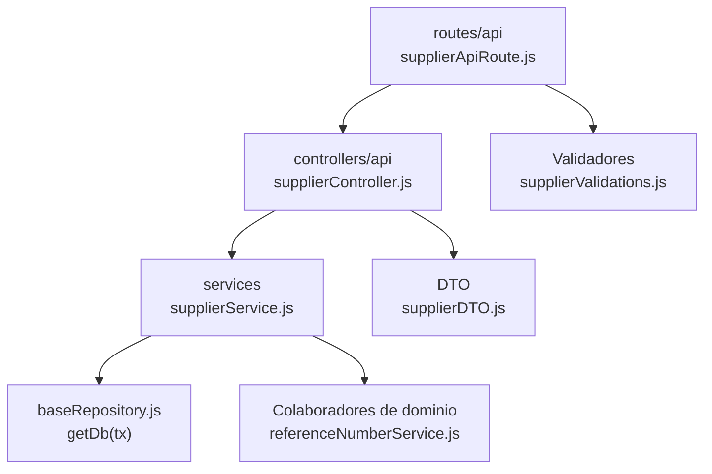

# 8. Proveedores: estructura de código

**Identificador:** `DIA-BE-MOD-SUP-001`.
**Alcance:** grupos de implementación del módulo y sus dependencias directas.
**Fuente:** imports de los archivos de la tabla.

supplierController y supplierDTO adaptan el transporte; supplierService mantiene referencias de proveedor. Materiales y entradas consumen sus consultas.

| Grupo del mapa | Archivos que lo componen |
| --- | --- |
| routes/api · supplierApiRoute.js | `src/routes/api/warehouse/` `supplierApiRoute.js` |
| controllers/api · supplierController.js | `src/controllers/api/warehouse/` `supplierController.js` |
| services · supplierService.js | `src/services/warehouse/supplierService.js` |
| DTO · supplierDTO.js | `src/dtos/supplierDTO.js` |
| Colaboradores de dominio · referenceNumberService.js | `src/services/document/` `referenceNumberService.js` |
| Validadores · supplierValidations.js | `src/validators/forms/` `supplierValidations.js` |
| baseRepository.js · getDb(tx) | `src/repository/baseRepository.js` |

Los reportes y la infraestructura transversal se localizan en el
[capítulo 3](03-shared-code-and-coverage.md); el orden de llamadas está en
[procesos](../../processes/backend-code-sequences/index.md).

