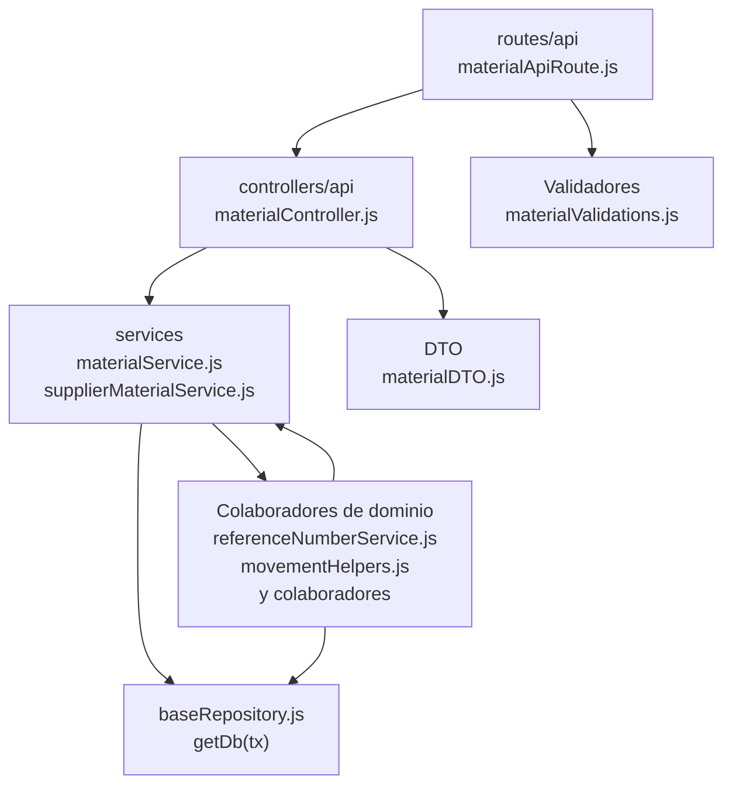

# 9. Materiales: estructura de código

**Identificador:** `DIA-BE-MOD-MAT-001`.
**Alcance:** grupos de implementación del módulo y sus dependencias directas.
**Fuente:** imports de los archivos de la tabla.

materialService colabora con materialHelpers, materialRelations, supplierMaterialService y adjustmentService. El selector base no encapsula esas reglas ni sus consultas.

| Grupo del mapa | Archivos que lo componen |
| --- | --- |
| routes/api · materialApiRoute.js | `src/routes/api/warehouse/` `materialApiRoute.js` |
| controllers/api · materialController.js | `src/controllers/api/warehouse/` `materialController.js` |
| services · adjustmentService.js · materialHelpers.js · y colaboradores | `src/services/warehouse/` `adjustmentService.js` `src/services/warehouse/materials/` `materialHelpers.js` `src/services/warehouse/materials/` `materialRelations.js` `src/services/warehouse/materials/` `materialService.js` `src/services/warehouse/materials/` `supplierMaterialService.js` |
| DTO · materialDTO.js | `src/dtos/materialDTO.js` |
| Colaboradores de dominio · referenceNumberService.js · movementHelpers.js · y colaboradores | `src/services/document/` `referenceNumberService.js` `src/services/inventory/movementHelpers.js` `src/services/inventory/movementService.js` `src/services/inventory/stockHelpers.js` `src/services/warehouse/` `presentationService.js` `src/services/warehouse/reasonService.js` `src/services/warehouse/supplierService.js` `src/services/warehouse/` `unitMeasureService.js` |
| Validadores · materialValidations.js | `src/validators/forms/` `materialValidations.js` |
| baseRepository.js · getDb(tx) | `src/repository/baseRepository.js` |

Los reportes y la infraestructura transversal se localizan en el
[capítulo 3](03-shared-code-and-coverage.md); el orden de llamadas está en
[procesos](../../processes/backend-code-sequences/index.md).

