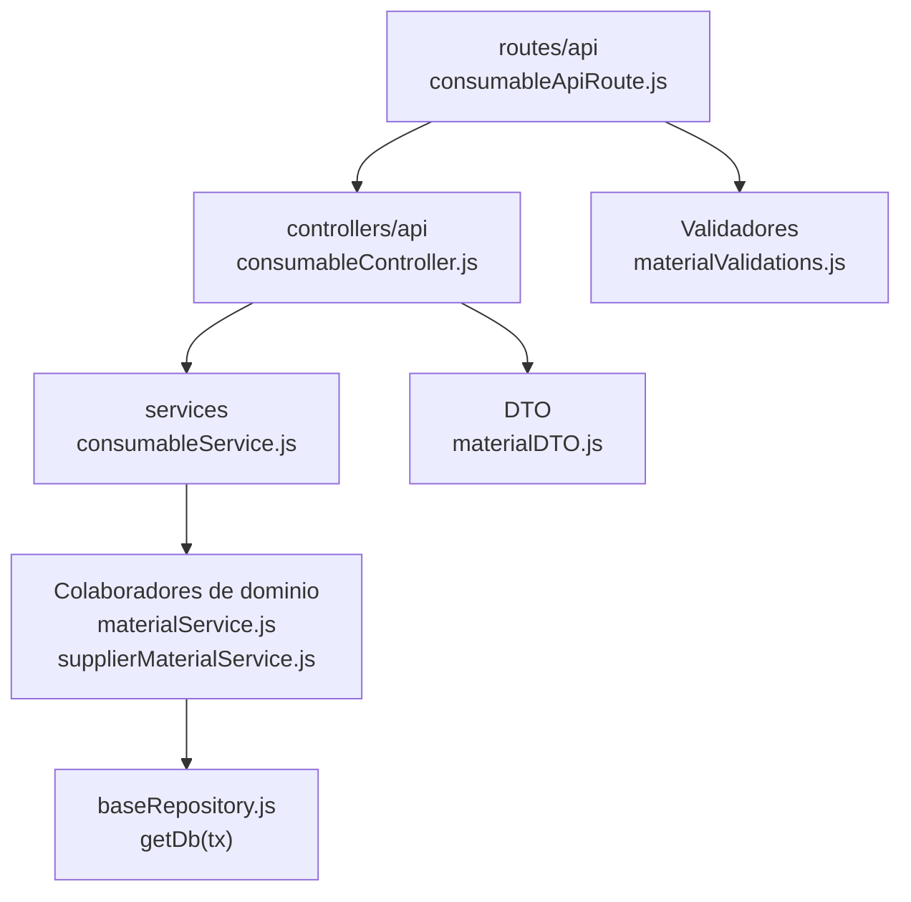

# 10. Consumibles: estructura de código

**Identificador:** `DIA-BE-MOD-CON-001`.
**Alcance:** grupos de implementación del módulo y sus dependencias directas.
**Fuente:** imports de los archivos de la tabla.

consumableService adapta DTO/tipo y reutiliza materialService/supplierMaterialService. La API y controller propios no significan otra implementación completa del stock.

| Grupo del mapa | Archivos que lo componen |
| --- | --- |
| routes/api · consumableApiRoute.js | `src/routes/api/warehouse/` `consumableApiRoute.js` |
| controllers/api · consumableController.js | `src/controllers/api/warehouse/` `consumableController.js` |
| services · consumableService.js | `src/services/warehouse/consumables/` `consumableService.js` |
| DTO · materialDTO.js | `src/dtos/materialDTO.js` |
| Colaboradores de dominio · materialService.js · supplierMaterialService.js | `src/services/warehouse/materials/` `materialService.js` `src/services/warehouse/materials/` `supplierMaterialService.js` |
| Validadores · materialValidations.js | `src/validators/forms/` `materialValidations.js` |
| baseRepository.js · getDb(tx) | `src/repository/baseRepository.js` |

Los reportes y la infraestructura transversal se localizan en el
[capítulo 3](03-shared-code-and-coverage.md); el orden de llamadas está en
[procesos](../../processes/backend-code-sequences/index.md).

