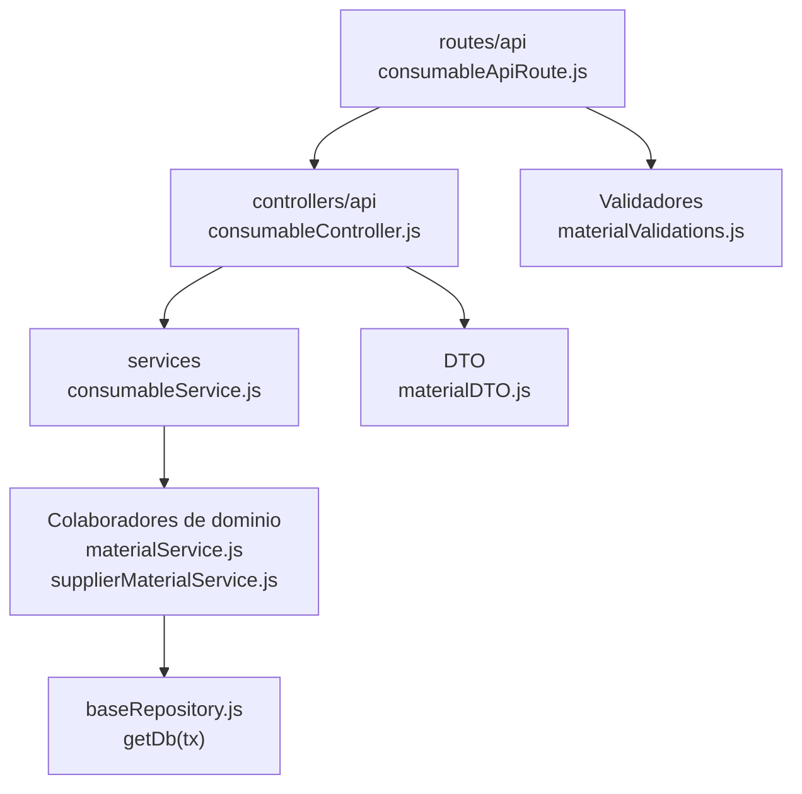

# 10. Consumibles: estructura de código

**Identificador:** `DIA-BE-MOD-CON-001`.
**Alcance:** grupos de implementación del módulo y sus dependencias directas.
**Fuente:** imports de los archivos de la tabla.

| Grupo del mapa | Archivos que lo componen |
| --- | --- |
| routes/api · consumableApiRoute.js | `src/routes/api/warehouse/` `consumableApiRoute.js` |
| controllers/api · consumableController.js | `src/controllers/api/warehouse/` `consumableController.js` |
| services · consumableService.js | `src/services/warehouse/consumables/` `consumableService.js` |
| DTO · materialDTO.js | `src/dtos/materialDTO.js` |
| Colaboradores de dominio · materialService.js · supplierMaterialService.js | `src/services/warehouse/materials/` `materialService.js` `src/services/warehouse/materials/` `supplierMaterialService.js` |
| Validadores · materialValidations.js | `src/validators/forms/` `materialValidations.js` |
| baseRepository.js · getDb(tx) | `src/repository/baseRepository.js` |

## Contratos de implementación

### Datos, resultados y efectos del módulo

| Capacidad | Entrada y retorno | Reglas, errores y persistencia |
| --- | --- | --- |
| Consumibles: `consumableController.js`, `consumables/consumableService.js` y `consumableApiRoute.js` | Expone listado, alta, edición, retiro y ajuste con contrato propio bajo `/api/warehouse/consumables`. | Fija `type = CONSUMABLE`, elimina dimensiones de entrada y delega identidad, oferta, existencia y movimiento a los servicios de materiales con el contexto tipado. |

Los controllers de este módulo exponen estas operaciones. Un export construido por
un handler conserva su configuración local; no se supone un DTO ni una transacción
para todas las operaciones. Los datos, resultados y efectos están definidos en la tabla anterior.

| Archivo bajo `src/` | Símbolos públicos y puntos de configuración |
| --- | --- |
| `controllers/api/warehouse/` `consumableController.js` | `getAllConsumables` `registerConsumable` `editConsumable` `editConsumableStock` `removeConsumable` |

### Normalización de datos

| Archivo bajo `src/` | Símbolos públicos y puntos de configuración |
| --- | --- |
| `dtos/materialDTO.js` | `createMaterialDtoForRegister` `createMaterialDtoForEdit` `createMaterialDtoForStockUpdate` |

## Variantes y límites de reutilización

consumableService adapta DTO/tipo y reutiliza materialService/supplierMaterialService. La API y controller propios no significan otra implementación completa del stock.

Los grupos del mapa representan imports seleccionados. Los permisos y middleware
se comprueban en cada router; los servicios conservan validaciones, errores y
persistencia propios. Compartir `getDb(tx)` no implica que toda operación abra una
transacción. La integración de [Prisma](../code-structure/06-prisma-and-persistence.md)
y los [mecanismos backend reutilizables](../reuse-and-refactoring/01-backend-handlers-and-services.md)
tienen una fuente de detalle común.

Los reportes y la infraestructura transversal se localizan en el
[capítulo 3](03-shared-code-and-coverage.md); el orden de llamadas está en
[procesos](../../processes/backend-code-sequences/index.md).

