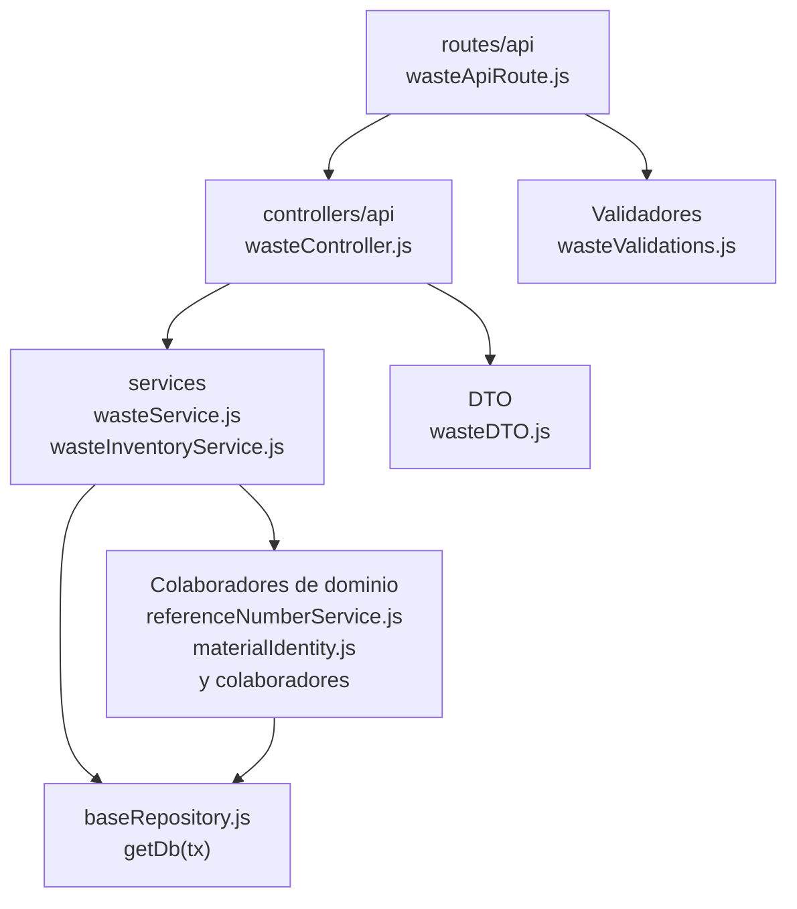

# 11. Mermas: estructura de código

**Identificador:** `DIA-BE-MOD-WAS-001`.
**Alcance:** grupos de implementación del módulo y sus dependencias directas.
**Fuente:** imports de los archivos de la tabla.

wasteService utiliza snapshot de material, conversión y servicios de ajuste/entrada de stock de merma. wasteInventoryService y wasteMovementService mantienen su persistencia propia.

| Grupo del mapa | Archivos que lo componen |
| --- | --- |
| routes/api · wasteApiRoute.js | `src/routes/api/warehouse/wasteApiRoute.js` |
| controllers/api · wasteController.js | `src/controllers/api/warehouse/` `wasteController.js` |
| services · wasteInventoryService.js · wasteMaterialService.js · y colaboradores | `src/services/warehouse/wastes/` `wasteInventoryService.js` `src/services/warehouse/wastes/` `wasteMaterialService.js` `src/services/warehouse/wastes/` `wasteMovementService.js` `src/services/warehouse/wastes/` `wasteService.js` `src/services/warehouse/wastes/` `wasteStockAdjustmentService.js` `src/services/warehouse/wastes/` `wasteStockEntryService.js` |
| DTO · wasteDTO.js | `src/dtos/wasteDTO.js` |
| Colaboradores de dominio · referenceNumberService.js · materialIdentity.js · y colaboradores | `src/services/document/` `referenceNumberService.js` `src/services/inventory/materialIdentity.js` `src/services/inventory/stockHelpers.js` `src/services/warehouse/reasonService.js` `src/services/warehouse/supplierService.js` |
| Validadores · wasteValidations.js | `src/validators/forms/wasteValidations.js` |
| baseRepository.js · getDb(tx) | `src/repository/baseRepository.js` |

Los reportes y la infraestructura transversal se localizan en el
[capítulo 3](03-shared-code-and-coverage.md); el orden de llamadas está en
[procesos](../../processes/backend-code-sequences/index.md).

