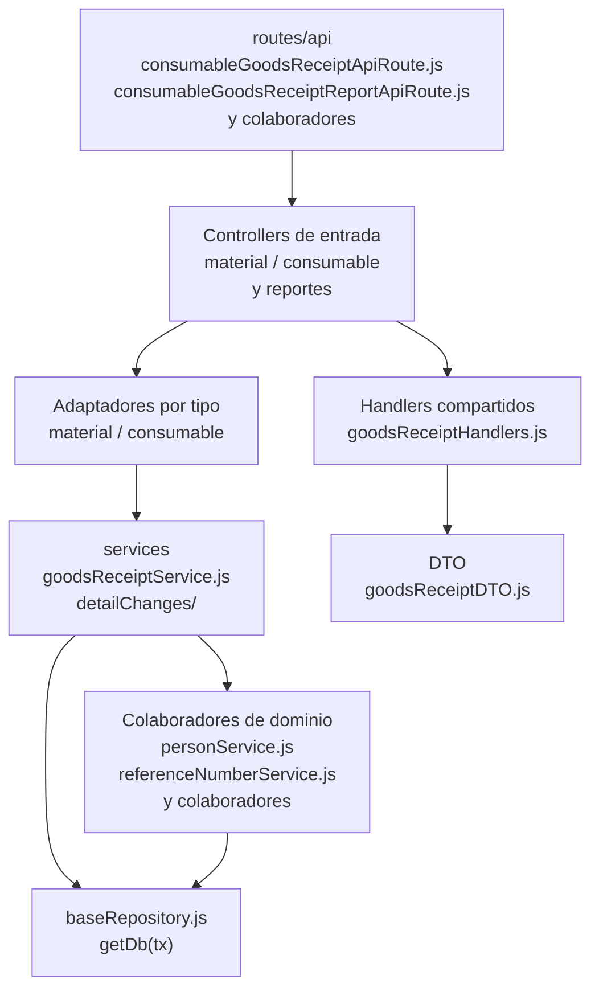

# 12. Entradas: materiales y consumibles: estructura de código

**Identificador:** `DIA-BE-MOD-REC-001`.
**Alcance:** grupos de implementación del módulo y sus dependencias directas.
**Fuente:** imports de los archivos de la tabla.

| Grupo del mapa | Archivos que lo componen |
| --- | --- |
| routes/api · consumableGoodsReceiptApiRoute.js · consumableGoodsReceiptReportApiRoute.js · y colaboradores | `src/routes/api/warehouse/goodsReceipts/` `consumables/` `consumableGoodsReceiptApiRoute.js` `src/routes/api/warehouse/goodsReceipts/` `consumables/` `consumableGoodsReceiptReportApiRoute.js` `src/routes/api/warehouse/goodsReceipts/` `materials/materialGoodsReceiptApiRoute.js` `src/routes/api/warehouse/goodsReceipts/` `materials/` `materialGoodsReceiptReportApiRoute.js` |
| controllers/api · consumableGoodsReceiptController.js · consumableGoodsReceiptReportController.js · y colaboradores | `src/controllers/api/warehouse/` `goodsReceipts/consumables/` `consumableGoodsReceiptController.js` `src/controllers/api/warehouse/` `goodsReceipts/consumables/` `consumableGoodsReceiptReportController.js` `src/controllers/api/warehouse/` `goodsReceipts/materials/` `materialGoodsReceiptController.js` `src/controllers/api/warehouse/` `goodsReceipts/materials/` `materialGoodsReceiptReportController.js` |
| Handlers compartidos · goodsReceiptHandlers.js | `src/controllers/api/warehouse/` `goodsReceipts/shared/` `goodsReceiptHandlers.js` |
| Adaptadores por tipo · material / consumable | `src/services/warehouse/goodsReceipts/` `consumables/` `consumableGoodsReceiptService.js` `src/services/warehouse/goodsReceipts/` `materials/materialGoodsReceiptService.js` |
| services · goodsReceiptCancellationService.js · goodsReceiptCorrectionService.js · y colaboradores | `src/services/warehouse/goodsReceipts/` `detailChanges/` `goodsReceiptCancellationService.js` `src/services/warehouse/goodsReceipts/` `detailChanges/` `goodsReceiptCorrectionService.js` `src/services/warehouse/goodsReceipts/` `detailChanges/` `goodsReceiptDetailChangeService.js` `src/services/warehouse/goodsReceipts/` `goodsReceiptHelpers.js` `src/services/warehouse/goodsReceipts/` `goodsReceiptInvoiceService.js` `src/services/warehouse/goodsReceipts/` `goodsReceiptService.js` |
| DTO · goodsReceiptDTO.js | `src/dtos/goodsReceiptDTO.js` |
| Colaboradores de dominio · personService.js · referenceNumberService.js · y colaboradores | `src/services/admin/person/personService.js` `src/services/document/` `referenceNumberService.js` `src/services/inventory/movementHelpers.js` `src/services/inventory/movementService.js` `src/services/inventory/stockHelpers.js` `src/services/warehouse/materials/` `materialService.js` `src/services/warehouse/materials/` `supplierMaterialService.js` `src/services/warehouse/reasonService.js` `src/services/warehouse/supplierService.js` |
| baseRepository.js · getDb(tx) | `src/repository/baseRepository.js` |

## Contratos de implementación

### Datos, resultados y efectos del módulo

| Capacidad | Entrada y retorno | Reglas, errores y persistencia |
| --- | --- | --- |
| Entradas: controllers específicos de `goodsReceipts/materials` y `goodsReceipts/consumables`, `goodsReceiptService.js`, `goodsReceiptHelpers.js`, `goodsReceiptInvoiceService.js` | Lista, alta y edición de encabezado adaptan DTO; retornan documento con detalles/totales. | Valida factura/referencia, construye detalles, actualiza existencias y totales dentro del límite transaccional. |
| Corrección/cancelación de entrada: controladores homónimos y `detailChanges/{goodsReceiptCorrectionService,goodsReceiptCancellationService,goodsReceiptDetailChangeService}.js` | `detailId` y cambio solicitado producen entrada actualizada. | Localiza detalle editable, registra cambio, revierte/aplica movimiento y recalcula existencias/totales en una transacción; los conflictos impiden escritura parcial. |

Los controllers de este módulo exponen estas operaciones. Un export construido por
un handler conserva su configuración local; no se supone un DTO ni una transacción
para todas las operaciones. Los datos, resultados y efectos están definidos en la tabla anterior.

| Archivo bajo `src/` | Símbolos públicos y puntos de configuración |
| --- | --- |
| `controllers/api/warehouse/goodsReceipts/` `consumables/` `consumableGoodsReceiptController.js` | `getAllConsumableGoodsReceipts` `registerConsumableGoodsReceipt` `editConsumableGoodsReceipt` `correctConsumableGoodsReceiptDetail` `cancelConsumableGoodsReceiptDetail` |
| `controllers/api/warehouse/goodsReceipts/` `consumables/` `consumableGoodsReceiptReportController.js` | `exportConsumableGoodsReceiptReportExcel` |
| `controllers/api/warehouse/goodsReceipts/` `materials/` `materialGoodsReceiptController.js` | `getAllMaterialGoodsReceipts` `registerMaterialGoodsReceipt` `editMaterialGoodsReceipt` `correctMaterialGoodsReceiptDetail` `cancelMaterialGoodsReceiptDetail` |
| `controllers/api/warehouse/goodsReceipts/` `materials/` `materialGoodsReceiptReportController.js` | `exportMaterialGoodsReceiptReportExcel` |
| `controllers/api/warehouse/goodsReceipts/` `shared/goodsReceiptHandlers.js` | `buildListHandler` `buildRegisterHandler` `buildEditHandler` `buildCorrectionHandler` `buildCancellationHandler` |

### Normalización de datos

| Archivo bajo `src/` | Símbolos públicos y puntos de configuración |
| --- | --- |
| `dtos/goodsReceiptDTO.js` | `createGoodsReceiptDtoForRegister` `createGoodsReceiptDtoForEdit` `createGoodsReceiptDtoForCorrection` |

## Variantes y límites de reutilización

Los controllers y adaptadores material/consumable configuran handlers/núcleo compartidos. goodsReceiptService, invoice, helpers y detailChanges mantienen responsabilidades distintas; las variantes fijan type.

Los grupos del mapa representan imports seleccionados. Los permisos y middleware
se comprueban en cada router; los servicios conservan validaciones, errores y
persistencia propios. Compartir `getDb(tx)` no implica que toda operación abra una
transacción. La integración de [Prisma](../code-structure/06-prisma-and-persistence.md)
y los [mecanismos backend reutilizables](../reuse-and-refactoring/01-backend-handlers-and-services.md)
tienen una fuente de detalle común.

Los reportes y la infraestructura transversal se localizan en el
[capítulo 3](03-shared-code-and-coverage.md); el orden de llamadas está en
[procesos](../../processes/backend-code-sequences/index.md).

