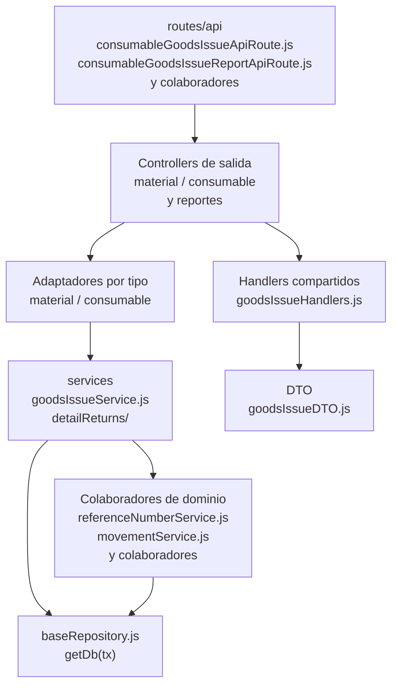

# 13. Salidas: materiales y consumibles: estructura de código

**Identificador:** `DIA-BE-MOD-ISS-001`.
**Alcance:** grupos de implementación del módulo y sus dependencias directas.
**Fuente:** imports de los archivos de la tabla.

Los controllers material/consumable configuran goodsIssueHandlers y servicios por tipo. El núcleo colabora con issues, movimientos y detailReturns; no se confunden devolución y edición de detalle.

| Grupo del mapa | Archivos que lo componen |
| --- | --- |
| routes/api · consumableGoodsIssueApiRoute.js · consumableGoodsIssueReportApiRoute.js · y colaboradores | `src/routes/api/warehouse/goodsIssues/` `consumables/` `consumableGoodsIssueApiRoute.js` `src/routes/api/warehouse/goodsIssues/` `consumables/` `consumableGoodsIssueReportApiRoute.js` `src/routes/api/warehouse/goodsIssues/` `materials/materialGoodsIssueApiRoute.js` `src/routes/api/warehouse/goodsIssues/` `materials/` `materialGoodsIssueReportApiRoute.js` |
| controllers/api · consumableGoodsIssueController.js · consumableGoodsIssueReportController.js · y colaboradores | `src/controllers/api/warehouse/goodsIssues/` `consumables/` `consumableGoodsIssueController.js` `src/controllers/api/warehouse/goodsIssues/` `consumables/` `consumableGoodsIssueReportController.js` `src/controllers/api/warehouse/goodsIssues/` `materials/materialGoodsIssueController.js` `src/controllers/api/warehouse/goodsIssues/` `materials/` `materialGoodsIssueReportController.js` |
| Handlers compartidos · goodsIssueHandlers.js | `src/controllers/api/warehouse/goodsIssues/` `shared/goodsIssueHandlers.js` |
| Adaptadores por tipo · material / consumable | `src/services/warehouse/goodsIssues/` `consumables/consumableGoodsIssueService.js` `src/services/warehouse/goodsIssues/` `materials/materialGoodsIssueService.js` |
| services · goodsIssueReturnService.js · goodsIssueDetailSelect.js · y colaboradores | `src/services/warehouse/goodsIssues/` `detailReturns/goodsIssueReturnService.js` `src/services/warehouse/goodsIssues/` `goodsIssueDetailSelect.js` `src/services/warehouse/goodsIssues/` `goodsIssueFulfillmentRules.js` `src/services/warehouse/goodsIssues/` `goodsIssueHelpers.js` `src/services/warehouse/goodsIssues/` `goodsIssueService.js` |
| DTO · goodsIssueDTO.js | `src/dtos/goodsIssueDTO.js` |
| Colaboradores de dominio · referenceNumberService.js · movementService.js · y colaboradores | `src/services/document/` `referenceNumberService.js` `src/services/inventory/movementService.js` `src/services/inventory/stockHelpers.js` `src/services/warehouse/` `fulfillmentStatusService.js` `src/services/warehouse/issues/` `issueFulfillmentRules.js` `src/services/warehouse/issues/` `issueHeaderService.js` `src/services/warehouse/materials/` `supplierMaterialService.js` |
| baseRepository.js · getDb(tx) | `src/repository/baseRepository.js` |

Los reportes y la infraestructura transversal se localizan en el
[capítulo 3](03-shared-code-and-coverage.md); el orden de llamadas está en
[procesos](../../processes/backend-code-sequences/index.md).

