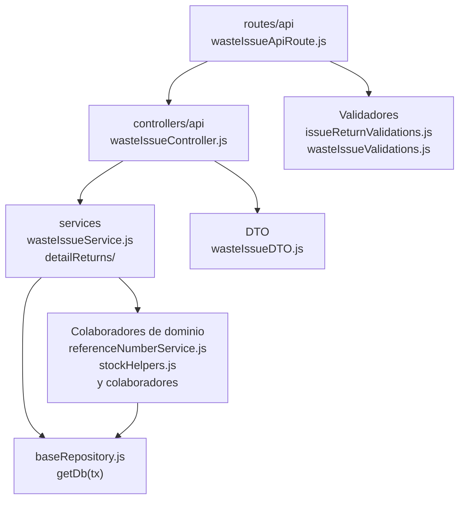

# 14. Salidas de mermas: estructura de código

**Identificador:** `DIA-BE-MOD-WIS-001`.
**Alcance:** grupos de implementación del módulo y sus dependencias directas.
**Fuente:** imports de los archivos de la tabla.

wasteIssueController usa wasteIssueDTO y servicios propios de salida/devolución. Comparte encabezado/cumplimiento con goodsIssues, pero conserva movimientos e inventario de merma.

| Grupo del mapa | Archivos que lo componen |
| --- | --- |
| routes/api · wasteIssueApiRoute.js | `src/routes/api/warehouse/` `wasteIssueApiRoute.js` |
| controllers/api · wasteIssueController.js | `src/controllers/api/warehouse/` `wasteIssueController.js` |
| services · wasteIssueReturnService.js · wasteIssueFulfillmentService.js · y colaboradores | `src/services/warehouse/wasteIssues/` `detailReturns/wasteIssueReturnService.js` `src/services/warehouse/wasteIssues/` `wasteIssueFulfillmentService.js` `src/services/warehouse/wasteIssues/` `wasteIssueService.js` |
| DTO · wasteIssueDTO.js | `src/dtos/wasteIssueDTO.js` |
| Colaboradores de dominio · referenceNumberService.js · stockHelpers.js · y colaboradores | `src/services/document/` `referenceNumberService.js` `src/services/inventory/stockHelpers.js` `src/services/warehouse/` `fulfillmentStatusService.js` `src/services/warehouse/issues/` `issueFulfillmentRules.js` `src/services/warehouse/issues/` `issueHeaderService.js` `src/services/warehouse/wastes/` `wasteMovementService.js` |
| Validadores · issueReturnValidations.js · wasteIssueValidations.js | `src/validators/forms/` `issueReturnValidations.js` `src/validators/forms/` `wasteIssueValidations.js` |
| baseRepository.js · getDb(tx) | `src/repository/baseRepository.js` |

Los reportes y la infraestructura transversal se localizan en el
[capítulo 3](03-shared-code-and-coverage.md); el orden de llamadas está en
[procesos](../../processes/backend-code-sequences/index.md).

