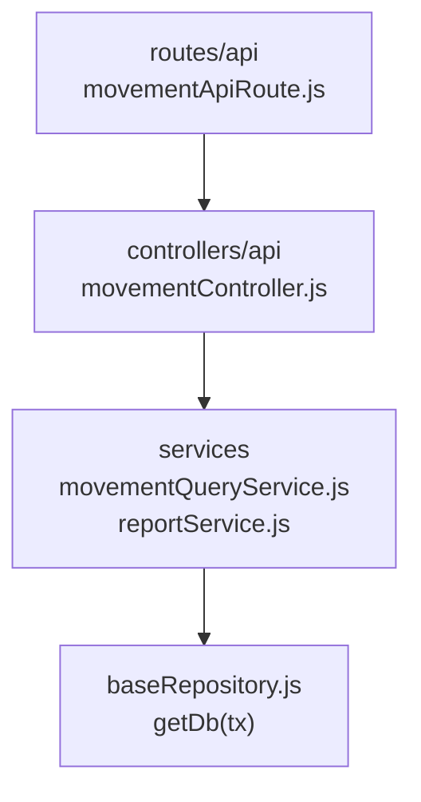

# 15. Consulta de movimientos: estructura de código

**Identificador:** `DIA-BE-MOD-MOV-001`.
**Alcance:** grupos de implementación del módulo y sus dependencias directas.
**Fuente:** imports de los archivos de la tabla.

| Grupo del mapa | Archivos que lo componen |
| --- | --- |
| routes/api · movementApiRoute.js | `src/routes/api/admin/movementApiRoute.js` |
| controllers/api · movementController.js | `src/controllers/api/admin/` `movementController.js` |
| services · movementHelpers.js · movementQueryService.js · y colaboradores | `src/services/inventory/movementHelpers.js` `src/services/inventory/` `movementQueryService.js` `src/services/inventory/reportService.js` |
| baseRepository.js · getDb(tx) | `src/repository/baseRepository.js` |

## Contratos de implementación

### Datos, resultados y efectos del módulo

| Capacidad | Entrada y retorno | Reglas, errores y persistencia |
| --- | --- | --- |
| Movimientos y exportaciones contextuales: `movementController.js`, `movementQueryService.js`, `inventory/reportService.js`, controladores/servicios `report` de admin, ventas y almacén | La consulta del módulo aporta filtros y produce filas paginadas; su acción de exportar devuelve el Excel correspondiente con cabeceras HTTP. | Sólo lectura; cada reporte reutiliza la consulta de su contexto y transforma resultados sin modificar inventario. No existe un dominio funcional independiente de “reportes”. |

Los controllers de este módulo exponen estas operaciones. Un export construido por
un handler conserva su configuración local; no se supone un DTO ni una transacción
para todas las operaciones. Los datos, resultados y efectos están definidos en la tabla anterior.

| Archivo bajo `src/` | Símbolos públicos y puntos de configuración |
| --- | --- |
| `controllers/api/admin/` `movementController.js` | `getAllMaterialMovements` `getAllWasteMovements` |

## Variantes y límites de reutilización

movementController importa movementQueryService; no abre otra escritura de inventario. La escritura compartida de movimientos está en movementService y se documenta como colaborador transversal.

Los grupos del mapa representan imports seleccionados. Los permisos y middleware
se comprueban en cada router; los servicios conservan validaciones, errores y
persistencia propios. Compartir `getDb(tx)` no implica que toda operación abra una
transacción. La integración de [Prisma](../code-structure/06-prisma-and-persistence.md)
y los [mecanismos backend reutilizables](../reuse-and-refactoring/01-backend-handlers-and-services.md)
tienen una fuente de detalle común.

Los reportes y la infraestructura transversal se localizan en el
[capítulo 3](03-shared-code-and-coverage.md); el orden de llamadas está en
[procesos](../../processes/backend-code-sequences/index.md).

