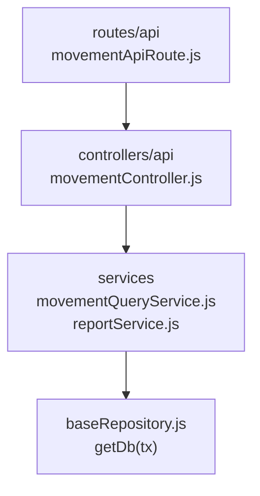

# 15. Consulta de movimientos: estructura de código

**Identificador:** `DIA-BE-MOD-MOV-001`.
**Alcance:** grupos de implementación del módulo y sus dependencias directas.
**Fuente:** imports de los archivos de la tabla.

movementController importa movementQueryService; no abre otra escritura de inventario. La escritura compartida de movimientos está en movementService y se documenta como colaborador transversal.

| Grupo del mapa | Archivos que lo componen |
| --- | --- |
| routes/api · movementApiRoute.js | `src/routes/api/admin/movementApiRoute.js` |
| controllers/api · movementController.js | `src/controllers/api/admin/` `movementController.js` |
| services · movementHelpers.js · movementQueryService.js · y colaboradores | `src/services/inventory/movementHelpers.js` `src/services/inventory/` `movementQueryService.js` `src/services/inventory/reportService.js` |
| baseRepository.js · getDb(tx) | `src/repository/baseRepository.js` |

Los reportes y la infraestructura transversal se localizan en el
[capítulo 3](03-shared-code-and-coverage.md); el orden de llamadas está en
[procesos](../../processes/backend-code-sequences/index.md).

