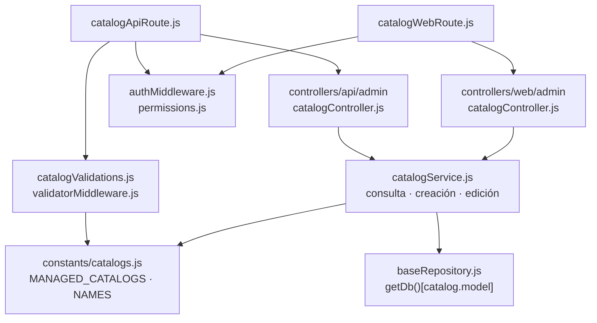

# 16. Catálogos auxiliares: administración y lecturas operativas

## Alcance y clasificación

Catálogo es una función de datos maestros, no el nombre de una sola capa. Nexus tiene
seis catálogos auxiliares administrados mediante un módulo común, consultas operativas
propias para alimentar selectores y recursos con reglas particulares (clientes,
proveedores, materiales, consumibles y mermas). Estos últimos conservan sus módulos y
permisos; no pertenecen a `MANAGED_CATALOGS`.

## Archivos del módulo administrativo

**Identificador:** `DIA-BE-MOD-CAT-001`. **Pregunta:** ¿qué archivos construyen la
administración y qué configuración limita su persistencia? **Fuente:** imports de
routers, controllers, servicio y validators. **Leyenda:** flechas = import entre grupos de archivos, no un orden HTTP.

| Responsabilidad | Archivos bajo `src/` |
| --- | --- |
| Registro permitido | `constants/catalogs.js` |
| Transporte API y web | `routes/api/admin/catalogApiRoute.js` `routes/web/admin/catalogWebRoute.js` |
| Contrato JSON y renderizado | `controllers/api/admin/` `catalogController.js` `controllers/web/admin/` `catalogController.js` |
| Resolución, normalización y persistencia | `services/admin/catalogService.js` `repository/baseRepository.js` |
| Validación y acceso | `validators/forms/catalogValidations.js` `middleware/validatorMiddleware.js` `middleware/authMiddleware.js` `constants/permissions.js` |

## Configuración de los seis catálogos

Fuente: `src/constants/catalogs.js`. `model` es el delegado del cliente Prisma;
la correspondencia con el modelo está definida en `prisma/schema.prisma`.
Todos admiten `isActive` booleano, además de los campos de texto indicados.

| Clave de página y API | Etiqueta | Delegado / modelo Prisma | Texto permitido y longitud máxima |
| --- | --- | --- | --- |
| `departments` | Áreas | `department` / `Department` | `name`: 50 |
| `roles` | Roles | `role` / `Role` | `name`: 50 |
| `presentations` | Presentaciones | `presentation` / `Presentation` | `name`: 50 |
| `unit-measures` | Unidades de medida | `unitMeasure` / `UnitMeasure` | `name`: 20; `symbol`: 10 |
| `reasons` | Motivos de ajuste | `stockAdjustmentReason` / `StockAdjustmentReason` | `name`: 100 |
| `fulfillment-statuses` | Estados de cumplimiento | `fulfillmentStatus` / `FulfillmentStatus` | `name`: 50 |

`MANAGED_CATALOG_NAMES` deriva las claves del registro. El validator usa esa lista y
los límites del catálogo; el servicio vuelve a resolver la clave, conserva únicamente
sus campos permitidos, recorta textos y comprueba tipos y longitudes. El cliente no
elige un modelo Prisma ni define campos persistibles mediante el body.

## Contratos y límites implementados

| Frontera | Contrato verificable |
| --- | --- |
| Administración | El registro API monta `/api/admin/catalogs`; el router ofrece GET `/:catalog`, POST `/:catalog` y PUT `/:catalog/:id`. Exige token y `catalogs:manage` a nivel de router. No declara DELETE. |
| Listado | El controller obtiene paginación/búsqueda; `findAllCatalogEntries` ordena por nombre y devuelve `data`, `recordsTotal` y `recordsFiltered`. Incluye activos e inactivos. |
| Escrituras | Devuelven `data` y código de éxito. Desactivar/reactivar es editar `isActive`; el servicio no implementa borrado físico ni una operación separada de desactivación. |
| Errores | `CatalogNotFound` rechaza claves ajenas al registro; `CatalogValidationError` rechaza datos inválidos. En edición, `P2025` y `P2023` se traducen a `CatalogEntryNotFound`; otros errores se propagan. |
| Página y metadata | `/catalogos/:catalog` exige cookie de sesión y `catalogs:manage`. `getManagedCatalog` entrega nombre, campos, longitudes y etiquetas al controller web; omite `model`. La configuración del navegador se detalla en la [referencia frontend](../frontend-technical-documentation/16-catalogs-code.md). |

Los nombres de roles y áreas participan en `constants/permissions.js`; crear o renombrar
un registro no modifica esas políticas. Los nombres de estados se usan mediante
`constants/warehouseStatuses.js` y consultas de cumplimiento: administrar filas tampoco
crea transiciones nuevas. El módulo común no aplica una regla específica que proteja
esos nombres de edición. Son dependencias de código que deben revisarse al mantener
estos catálogos, no capacidades de configuración dinámica de permisos o estados.

## Lecturas operativas de los mismos datos

La administración y los selectores consultan los mismos modelos mediante módulos
separados. Los routers de lectura tienen permisos propios, sus servicios filtran
`isActive: true` para opciones y el navegador conserva adaptadores Select2 por recurso.
Desactivar deja la fila persistida; ese filtro de opciones no elimina referencias
históricas ni implica que toda consulta interna filtre activos.

| Catálogo | Ruta de lectura bajo `/api` | Servicio bajo `src/services` |
| --- | --- | --- |
| Áreas | `/admin/departments` | `admin/departmentService.js` |
| Roles | `/admin/roles` | `admin/roleService.js` |
| Presentaciones | `/warehouse/presentations` | `warehouse/presentationService.js` |
| Unidades | `/warehouse/unit-measures` | `warehouse/unitMeasureService.js` |
| Motivos | `/warehouse/reasons` | `warehouse/reasonService.js` |
| Cumplimiento | `/warehouse/fulfillment-statuses` | `warehouse/fulfillmentStatusService.js` |

El [mapa de lecturas operativas](03-shared-code-and-coverage.md#lecturas-operativas-y-reportes)
posee sus imports. El [patrón del registro](../design-and-construction-patterns/08-catalog-registry-and-allowlist.md)
justifica la configuración compartida; las [secuencias de catálogos](../../processes/backend-code-sequences/catalogs/index.md)
son propietarias del orden de ejecución. La evidencia automatizada incluye
`tests/unit/services/admin/catalogServiceTest.js`, `tests/unit/validators/catalogValidationTest.js`
y `tests/integration/controllers/catalogControllersDbTest.js`.
