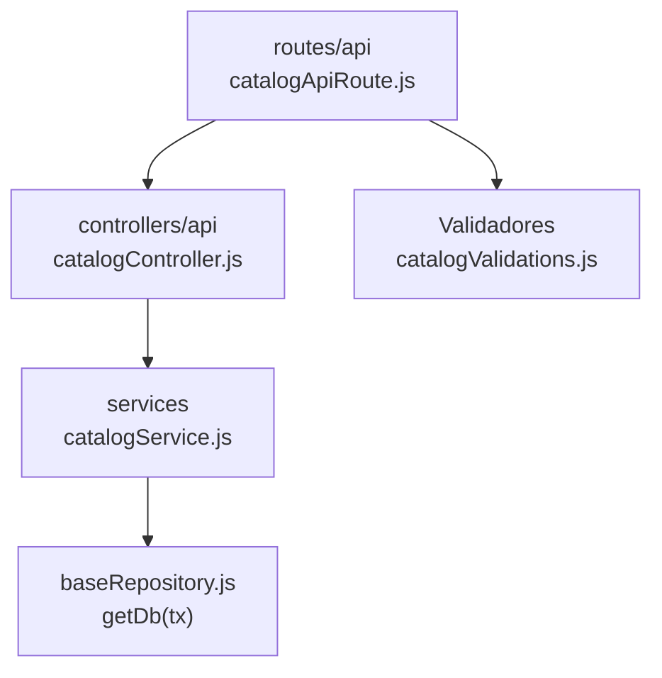

# 16. Catálogos administrables: estructura de código

**Identificador:** `DIA-BE-MOD-CAT-001`.
**Alcance:** grupos de implementación del módulo y sus dependencias directas.
**Fuente:** imports de los archivos de la tabla.

catalogService selecciona modelos/campos desde MANAGED_CATALOGS. Las lecturas operativas de roles, áreas y catálogos warehouse conservan routers/controllers propios y están en la referencia compartida.

| Grupo del mapa | Archivos que lo componen |
| --- | --- |
| routes/api · catalogApiRoute.js | `src/routes/api/admin/catalogApiRoute.js` |
| controllers/api · catalogController.js | `src/controllers/api/admin/` `catalogController.js` |
| services · catalogService.js | `src/services/admin/catalogService.js` |
| Validadores · catalogValidations.js | `src/validators/forms/catalogValidations.js` |
| baseRepository.js · getDb(tx) | `src/repository/baseRepository.js` |

Los reportes y la infraestructura transversal se localizan en el
[capítulo 3](03-shared-code-and-coverage.md); el orden de llamadas está en
[procesos](../../processes/backend-code-sequences/index.md).
