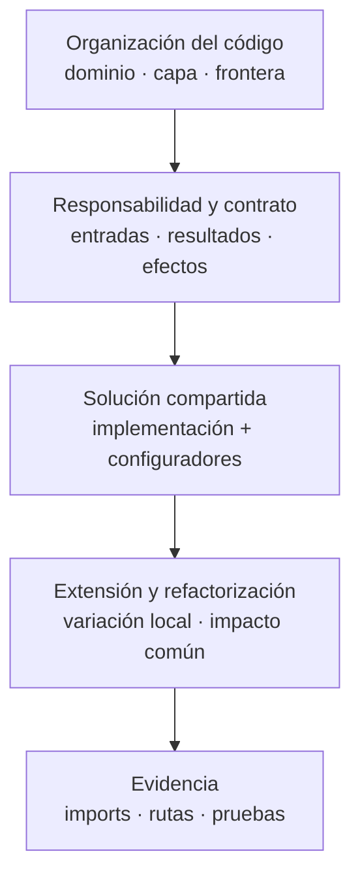

# 2. Organización de las representaciones de desarrollo

Los diagramas de esta colección responden preguntas sobre la construcción del código.
Los niveles de contexto y contenedores se consultan en la vista física; aquí se parte
de los módulos y sus fronteras. No se agregan niveles de despliegue ni otra adaptación
4+1 al [modelo de vistas](../../index.md).

**Identificador:** `DIA-COD-ORG-001`. **Pregunta:** ¿cómo pasar de una responsabilidad
a su implementación y a los puntos que cambiarían al extenderla?
**Alcance:** recorrido de lectura; las flechas son referencias documentales.

| Representación | Pregunta y alcance | Fuente |
| --- | --- | --- |
| Superficie HTTP | ¿Qué módulos se montan como API o páginas? No es un catálogo funcional. | [Capítulo 3](03-view-structural-surface-http-registered.md); registros de rutas. |
| Dominios y capas | ¿Dónde se ubica cada responsabilidad y qué colaboradores utiliza? | [Capítulo 4](04-view-structural-domains-and-collaborations.md); imports y módulos. |
| Fronteras de implementación | ¿Qué adapta cada capa y qué colaboraciones son condicionales? | [Capítulo 5](05-views-dynamic.md); contratos y secuencias propietarias. |
| Reutilización | ¿Qué núcleo comparten consumidores concretos y dónde difieren? | [Capítulo 6](06-view-of-reuse-crud-and-interface.md); factories, handlers y configuradores. |
| Aplicación de patrones | ¿Qué problema resuelve el mecanismo y cómo se materializa? | [Catálogo visual](../design-and-construction-patterns/04-catalog-visual-of-patterns-applied.md) y capítulos propietarios. |
| Refactorización | ¿Qué fronteras preserva una extracción y qué consumidores hay que revisar? | [Refactorización y extensión](../design-and-construction-patterns/16-refactoring-and-extension.md). |

Una secuencia adicional sólo se mantiene si explica una colaboración compartida o una
decisión ausente de los recorridos `CU-*`. Los pasos normativos del actor siguen en
requisitos. Los diagramas generados completan hechos del código y las figuras curadas
explican sus responsabilidades y límites.
