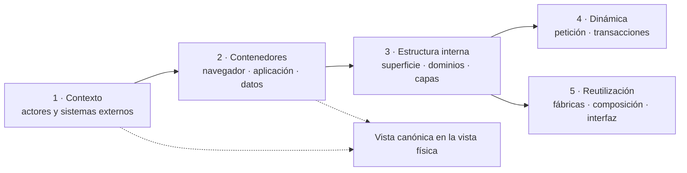

# 2. Patrón de organización de los diagramas

Dentro de la vista de desarrollo, los diagramas se organizan con **revelado progresivo**
y niveles de abstracción inspirados en C4, sin declarar conformidad C4. Cada nivel
responde una pregunta y remite al siguiente sólo cuando hace falta más detalle. Esta
organización interna no agrega vistas al modelo 4+1 definido en el
[índice de vistas](../../index.md):

| Nivel | Pregunta | Representación canónica | Patrón del código que hace visible |
| --- | --- | --- | --- |
| Contexto | ¿Quién usa Nexus y de qué sistemas externos depende? | `views/physical/01-system-runtime-and-deployment.md#diagrama-de-contexto-del-sistema` | Límite del sistema; no describe un patrón de implementación. |
| Contenedores | ¿Dónde se ejecutan interfaz, servidor y persistencia? | `views/physical/01-system-runtime-and-deployment.md#contenedores-y-capas` | Aplicación web monolítica desplegable y separación cliente/servidor. |
| Estructura | ¿Qué superficie y dominios internos existen? | Diagramas de los capítulos 3 y 4 de este documento. | **Monolito modular** y **arquitectura por capas**. |
| Dinámica | ¿Cómo atraviesa las capas una petición o transacción? | Diagrama general del capítulo 5 y secuencias de la vista de procesos. | **Pipeline de middleware**, **Transaction Script** y publicación de eventos. |
| Reutilización | ¿Qué se configura o compone y en qué módulos se aplica actualmente? | Diagramas del capítulo 6 de este documento. | **Factory functions**, composición de objetos y componentes compartidos. |

Contexto y contenedores no se dibujan otra vez aquí: se reutilizan las representaciones canónicas.
Esto aplica **Single Source of Truth** como criterio documental y evita que dos diagramas
que responden la misma pregunta diverjan. Los patrones de implementación se explican en
[Patrones de diseño y construcción](../design-and-construction-patterns/index.md); estos diagramas
sólo muestran dónde aparecen.
