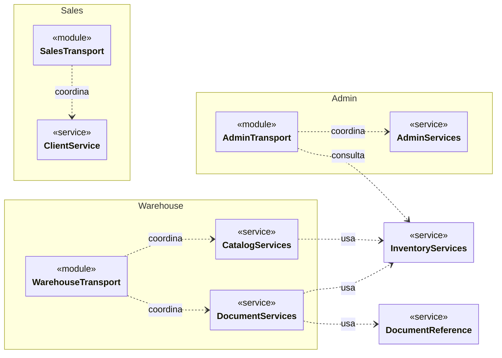

# 4. Diagrama estructural: dominios y colaboraciones

Este diagrama responde qué dominios de transporte coordinan servicios compartidos. No
muestra cada import; para ello se usa el grafo generado de dependencias entre áreas. Los
espacios de nombres hacen visible el patrón **Monolito modular** y las dependencias UML discontinuas respetan la
**arquitectura por capas** sin presentar cada carpeta como un servicio desplegable.

Los clasificadores representan módulos funcionales, no clases JavaScript.
`«module»` y `«service»` son estereotipos descriptivos locales; `..>` indica
dependencia y no orden temporal ni herencia.
