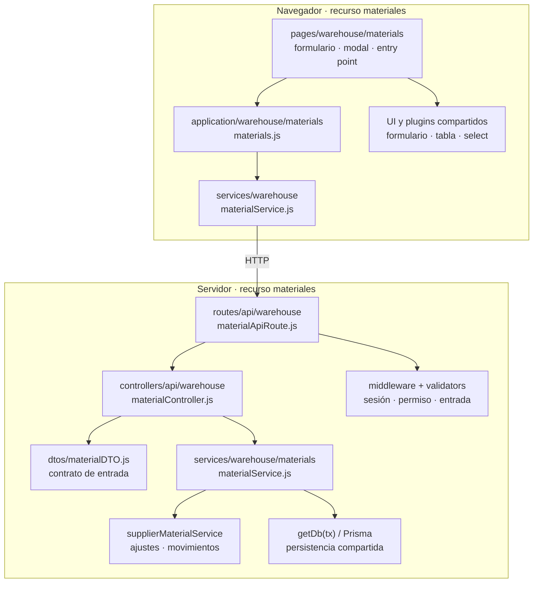

# 4. Diagrama estructural: dominios y colaboraciones

Nexus separa responsabilidades por capa y subdivide los recursos por dominio cuando
corresponde. El módulo de un recurso atraviesa varias carpetas: localizar sólo su
controller no permite comprender su contrato ni el impacto de cambiarlo.

**Identificador:** `DIA-COD-MOD-001`. **Pregunta:** ¿cómo se distribuye el módulo de
materiales entre transporte, reglas y presentación? **Alcance:** un corte concreto del
código actual. Cada flecha indica que el origen usa o configura al destino.

La referencia técnica completa las reglas y variantes por capacidad; este corte no
pretende enumerarlas. La correspondencia de nombres facilita seguir una modificación
entre capas, aunque no todas tengan exactamente los mismos archivos.

| Área | Responsabilidad propietaria | Colaboradores que justifican revisar impacto |
| --- | --- | --- |
| `admin` | Personas, usuarios, catálogos auxiliares y consultas de movimientos. | Permisos, autenticación y servicios de inventario consultados desde transporte. |
| `sales` | Clientes y su reporte. | Consumo desde formularios de salida, sin trasladar su mantenimiento al almacén. |
| `warehouse` | Proveedores, inventarios, entradas y salidas de materiales/consumibles/mermas. | Movimientos, ajustes, referencias documentales, reglas de cumplimiento y variantes por contexto. |
| Servicios transversales | Autenticación, JWT, auditoría, referencias y utilidades de infraestructura. | Se consumen desde módulos propietarios; no se presentan como microservicios. |

**Fuentes:** los archivos nombrados en la figura y los imports del
[mapa generado](../code-map.md#dependencias-entre-áreas). El grafo de áreas incluye
acoplamientos mecánicos reales; esta representación explica un corte de responsabilidad.
