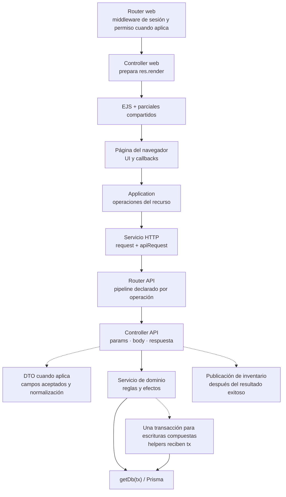

# 5. Fronteras y colaboraciones de implementación

### 5.1 Fronteras y contratos de implementación

**Identificador:** `DIA-COD-FRO-001`. **Pregunta:** ¿qué responsabilidad adapta cada
frontera de una petición? **Alcance:** composición general; las flechas continuas
muestran delegación y las discontinuas, colaboraciones condicionales. El orden exacto
del middleware y de cada operación se consulta en su router y secuencia `CU-*`.

Las páginas EJS y los endpoints de lectura no ejecutan necesariamente un DTO o una
transacción. `materialApiRoute.js` valida determinadas escrituras antes de autorizar;
`catalogApiRoute.js` instala autenticación y autorización a nivel de router antes de
validar. El login tiene su propio contrato de acceso. Ninguna cadena genérica sustituye
estos órdenes concretos.

`auditWrites` se monta en `src/app.js`: registra la observación de `finish` antes de
delegar y persiste posteriormente, fuera de la transacción funcional. Su colaboración
se mantiene en la [secuencia canónica de auditoría](../backend-technical-documentation/02-views-technical-applied.md#secuencia-transversal-de-auditoría-de-escrituras).
Las fuentes de esta figura son `src/routes`, `src/controllers`, `src/dtos`,
`src/services`, `src/public/js` y `src/repository/baseRepository.js`.

### 5.2 Colaboraciones que requieren detalle temporal

| Colaboración | Por qué necesita otra representación | Fuente propietaria |
| --- | --- | --- |
| Pipeline y normalización | Orden explícito de controles y adaptación de entrada. | [Aplicación concreta del pipeline](../design-and-construction-patterns/04-catalog-visual-of-patterns-applied.md#pipeline-dto-y-políticas-declarativas). |
| Escrituras coordinadas | Límite de `tx`, rollback y efectos posteriores al commit. | [Transacción, eventos y auditoría](../design-and-construction-patterns/04-catalog-visual-of-patterns-applied.md#transacción-eventos-y-auditoría), con servicios concretos en las secuencias backend. |
| Construcción de aplicaciones | Configuración al cargar el módulo y uso posterior de closures. | [Factory CRUD aplicada](../design-and-construction-patterns/04-catalog-visual-of-patterns-applied.md#factories-y-composición-sobre-herencia). |
| Actualización de tablas por eventos | Publicación, puente del navegador y nueva consulta. | [Publicador y consumidores](../design-and-construction-patterns/10-publication-of-events-of-inventory.md#aplicación-entre-publicador-y-consumidores). |
| Sesión en el transporte compartido | Varias solicitudes esperan la renovación pendiente; reintento acotado. | [Renovación coordinada](../frontend-technical-documentation/02-views-technical-applied-by-flow-frontend.md#renovación-coordinada-del-transporte-http). |

### 5.3 Relación con las otras vistas

La realización de cada operación se consulta en los índices de
[secuencias backend](../../processes/backend-code-sequences/index.md) y
[frontend](../../processes/frontend-code-sequences/index.md). Los estados de negocio y
los datos que cambia una acción permanecen en
[modos, precondiciones y efectos](../../../../requirements/requirements-specification/06-operation-modes-and-effects.md).
La matriz requisito–caso–código–prueba pertenece a
[componentes y reutilización](../../logical/01-components-and-reuse.md).

Esta colección conserva el mapa de fronteras y las colaboraciones compartidas; no
mantiene otra matriz de casos ni duplica secuencias. Para un cambio de implementación
se revisa la frontera afectada aquí y el recorrido exacto en procesos. El código y las
pruebas sustentan el dibujo; la figura no amplía su cobertura por sí misma.
