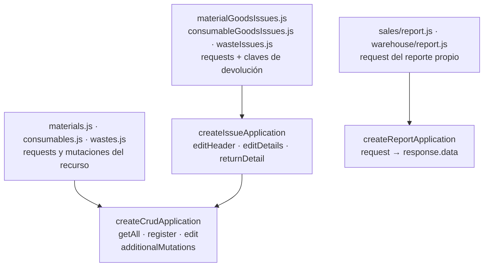
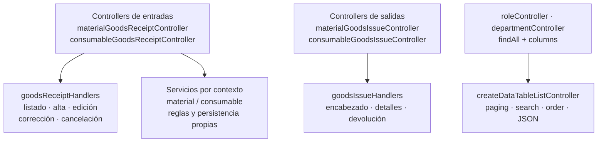
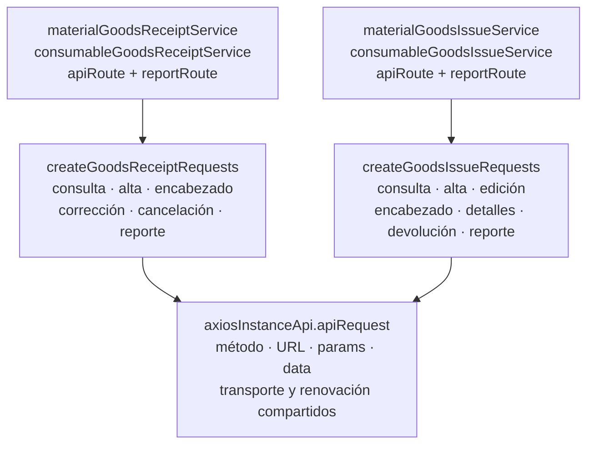
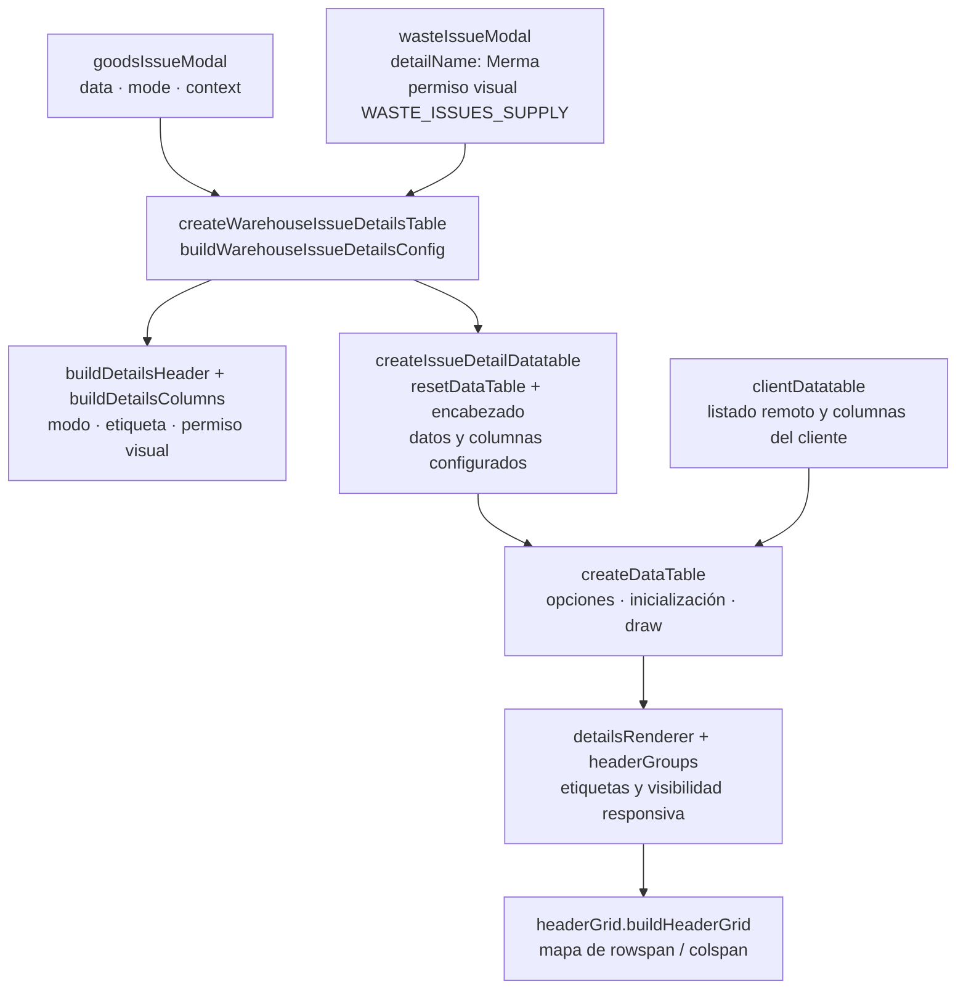
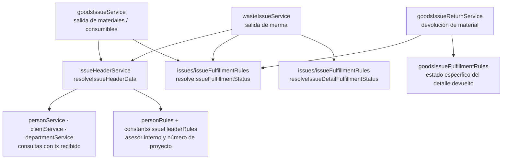

# 6. Diagramas de reutilización: CRUD e interfaz

La reutilización se demuestra desde una implementación compartida hasta consumidores
concretos que la configuran. El núcleo conserva el mecanismo; el módulo propietario
conserva requests, claves de respuesta, campos y reglas del recurso. Las flechas de
estas figuras apuntan **del consumidor a la dependencia** y no indican herencia.

### Aplicaciones y contratos configurables

**Identificador:** `DIA-COD-REU-001`. **Pregunta:** ¿qué configuradores reutilizan las
factories y qué variación permanece local? **Alcance:** módulos del navegador bajo
`src/public/js/application`; se muestran consumidores representativos verificables.

`createCrudApplication` crea closures y congela el objeto de operaciones. El configurador
exporta referencias con vocabulario del recurso. `createIssueApplication` añade nombres
de mutaciones y claves de respuesta mediante configuración del CRUD. La factory de
reportes devuelve `response.data`; la descarga y la interacción visual continúan en los
consumidores, no dentro de esa factory.

La [secuencia de construcción](../design-and-construction-patterns/04-catalog-visual-of-patterns-applied.md#factories-y-composición-sobre-herencia)
explica cuándo se crea la configuración y cuándo se usa. Las diferencias de cantidades,
autorización y transacción se conservan en cada contrato y servicio propietario.

### Reutilización del transporte backend

**Identificador:** `DIA-COD-REU-002`. **Pregunta:** ¿qué coordinación HTTP se comparte
sin mezclar los servicios de materiales y consumibles? **Fuente:**
`src/controllers/api/warehouse/goodsReceipts` y `goodsIssues`.

El controller configura funciones de servicio e `inventoryContext` cuando el handler lo
requiere. El handler compartido adapta HTTP, DTO, respuesta y publicación; el servicio
específico conserva la variación del dominio y participa en el núcleo transaccional
correspondiente. La factory tabular concentra parsing y respuesta, y recibe consulta y
columnas permitidas. Esto evita reconstruir la misma coordinación para cada variante.

### Composición de la interfaz

La reutilización visual no obliga a compartir toda la pantalla. Los parciales EJS, los
formularios y los plugins mantienen contratos distintos. El [diagrama de ownership](../design-and-construction-patterns/12-composition-and-ownership-of-components-visual.md#composición-de-la-interfaz)
localiza un ejemplo concreto y separa page, formulario, application, transporte y UI.
El flujo de [adaptación de detalles](../design-and-construction-patterns/07-dto-functional-and-policies-declarative.md#adaptadores-de-detalles-de-inventario)
explica las identidades que se conservan entre API, tabla y request.

### Factories de requests por contexto

**Identificador:** `DIA-COD-REU-003`. **Pregunta:** ¿qué transporte comparten compras
y salidas de materiales/consumibles y qué fija cada adaptador?
**Fuente:** `src/public/js/services/warehouse/goodsReceipts` y `goodsIssues`.
Las flechas apuntan del consumidor a la dependencia; el diagrama muestra construcción,
no el orden de una petición completa.

Los servicios del navegador con nombre de dominio fijan las rutas y exportan las
referencias producidas por la factory. `apiRequest` conserva el transporte común;
`createCrudApplication` y `createIssueApplication` consumen después esos requests para
adaptar operaciones y respuestas. Son dos fronteras reutilizadas distintas:
**construcción del request** y **construcción de la aplicación**.

La factory de compras mantiene corrección y cancelación; la de salidas mantiene
encabezado, detalles y devolución. No se fusionan por semejanza de nombres, porque sus
URLs, argumentos y efectos difieren. Los reportes configuran `responseType: 'blob'`.
La factory de salidas de esta figura tiene configuradores de materiales y consumibles;
no se atribuye a merma un consumo que sus imports no demuestran.

### Construcción y ciclo de vida de tablas de detalle

**Identificador:** `DIA-COD-REU-004`. **Pregunta:** ¿qué construcción comparten los
modales de salidas y quién conserva columnas, ciclo de vida y adaptación responsiva?
**Fuente:** `src/public/js/pages/warehouse/{goodsIssues,wasteIssues}` y
`src/public/js/plugins/datatable/{shared/issues,core}`.
Las flechas indican uso/configuración; los nodos agrupan responsabilidades.

Los modales preparan y adaptan sus detalles; la factory de almacén construye la misma
estructura con la variación de modo, etiqueta y permiso visual. La tabla de detalle
reinicia la instancia anterior antes de configurar el encabezado y crear la nueva.
`createDataTable` también sirve a listados remotos: activa `serverSide`/`processing`
cuando hay `ajax`, y conserva callbacks específicos del consumidor.

La infraestructura responsiva comparte el mapa del encabezado para etiquetas y grupos,
en lugar de inferirlos por índices distintos en cada pantalla. El permiso visual sólo
controla presentación; las escrituras siguen autorizadas por el servidor. Esta figura
explica la extracción común y su ownership, sin repetir la secuencia del CRUD.

### Servicios y reglas compartidos por salidas

**Identificador:** `DIA-COD-REU-005`. **Pregunta:** ¿qué colaboración reutilizan las
salidas de materiales y mermas y qué reglas de detalle permanecen específicas?
**Fuente:** `src/services/warehouse/{goodsIssues,wasteIssues,issues}`.
Las flechas son dependencias; no representan transiciones normativas de estado.

`resolveIssueHeaderData` recibe identidades, datos, `tx`, clases de error y un estado
opcional. Valida referencias y reglas comunes y devuelve datos de encabezado; el
servicio propietario conserva documento, cantidades y límite transaccional. El helper
usa el contexto que recibe y no abre una transacción por cada consulta.

El cumplimiento del encabezado comparte `resolveIssueFulfillmentStatus`. La resolución
del detalle no se presenta como un algoritmo único: la devolución de material usa
`resolveGoodsIssueDetailFulfillmentStatusName`, que considera cantidades devueltas;
merma usa el resolver común de detalle en su coordinación específica. Las reglas y
transiciones de negocio se consultan en requisitos y el orden temporal en procesos.

### Impacto de un cambio compartido

| Pieza que cambia | Consumidores a revisar | Contrato que debe conservarse |
| --- | --- | --- |
| Factory CRUD | Configuradores directos y factory de salidas. | Firma de las mutaciones, claves de respuesta y exports de dominio. |
| Handlers de compras/salidas | Controllers específicos de materiales y consumibles. | DTO, actor, respuesta y contexto de inventario. |
| Factory tabular | Controllers que inyectan `findAll` y `columns`. | Paginación, búsqueda, orden permitido y respuesta. |
| UI o parcial compartido | Formularios y páginas que lo incluyen o inicializan. | Selectores, callbacks, modo, ciclo de vida y ownership. |

La [refactorización y extensión](../design-and-construction-patterns/16-refactoring-and-extension.md)
explica cómo revisar una extracción preservando estas fronteras. El código actual prueba
la reutilización vigente; una afirmación sobre cuándo se extrajo necesita historial Git.
