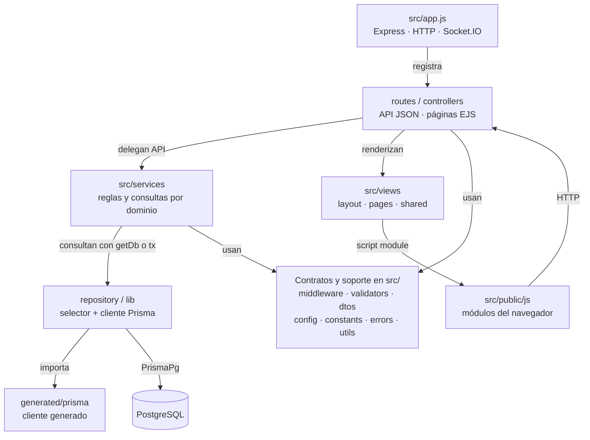

# 1. Repositorio y distribución de fuentes

Nexus tiene un proceso Node/Express que renderiza páginas EJS, sirve los módulos del
navegador y expone la API. El frontend usa módulos ES desde `src/public/js`; sus
servicios construyen requests HTTP. Los servicios bajo `src/services` ejecutan reglas
y consultas en el servidor. La coincidencia del nombre `services` no significa que
ambas carpetas tengan acceso a la base de datos.

## Mapa general de implementación

**Identificador:** `DIA-COD-ORG-001`. **Pregunta:** ¿cómo se distribuye la implementación
entre servidor, navegador y artefactos de persistencia? **Fuente:** `src/app.js`,
`src/routes/{api,web}/index.js`, `src/lib/prisma.js`, `prisma/schema.prisma` y `package.json`.
**Leyenda:** flechas rotuladas por su relación; los nodos agrupan carpetas reales.

El gráfico cubre las familias de código que construyen la aplicación. Agrupa las
dependencias transversales para conservar legibilidad; los imports específicos se
amplían en [backend](03-backend-domains-and-dependencies.md) y
[frontend](04-frontend-modules-and-composition.md). El navegador nunca importa
`src/lib/prisma.js`; sólo el servidor accede a PostgreSQL.

## Correspondencia con el repositorio

| Ubicación | Responsabilidad y modo de mantenimiento |
| --- | --- |
| `src/app.js`, `src/routes`, `src/controllers` | Arranque, montaje, entrada HTTP y salida JSON/EJS. |
| `src/services` | Servicios por dominio y colaboradores de inventario, documentos, auditoría y autenticación. |
| `src/repository`, `src/lib` | Selección del cliente/`tx`, construcción de Prisma y selección de URL. Existe un selector base; las consultas se escriben en servicios, no en un repository por entidad. |
| `src/views`, `src/public` | Plantillas y activos servidos. `pages` compone; `application` adapta operaciones; `services` transporta; `ui` y `plugins` gestionan presentación. |
| `prisma/schema.prisma`, `prisma/migrations`, `prisma.config.ts` | Modelo técnico, SQL de evolución y configuración de CLI. |
| `generated/prisma` | Salida de `prisma generate`; se regenera, no se modifica como código de dominio. |
| `tests`, `scripts`, `.github/workflows` | Verificación, generación/exportación documental y automatización. No son módulos funcionales de la API. |
| `docs` | Arquitectura y referencias curadas/generadas; mantiene enlaces a código, contratos y pruebas. |

Para modificar un recurso se localizan sus archivos en rutas, controllers, servicios
y presentación, y después sus piezas compartidas. Las correspondencias son por
responsabilidad: no todos los recursos tienen un DTO propio, un modal o un archivo en
cada capa.
